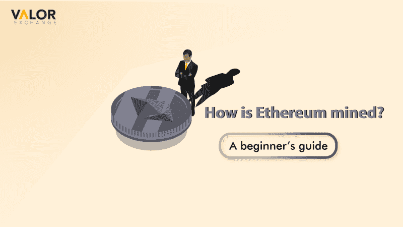

# 如何挖掘以太坊-初学者指南。

> 原文：<https://medium.com/coinmonks/how-is-ethereum-mined-a-beginners-guide-1b6588665813?source=collection_archive---------38----------------------->

以太坊是加密市场中最著名的加密货币之一。以太坊区块链允许全世界成千上万的开发者构建分散的应用程序。

把它想象成一个分散的应用商店。有游戏应用，金融应用，NFTS 等。然而，以太坊区块链远不止于此。以太坊和区块链可以做的事情太多了，所以我们不得不写下来。

今天的文章将集中在加密挖掘。我们将讨论它是什么以及它是如何工作的。

*photo credits: Louis16art*

什么是加密挖掘？

加密挖掘是在区块链上发现新的加密货币并验证交易的过程。当有人购买或出售密码时，密码挖掘者必须验证交易以获得批准或完成。交易通过验证后，将被添加到区块链的一个块中。

矿工是区块链网络的核心。他们在一个[工作证明](https://valorexchange.com/blog/post?slug=proof-of-stake-and-proof-of-work-a-beginner-s-guide)系统中促进与区块链的互动。

矿工们负责发现新的[醚](https://account.valorexchange.com/)，并将它们添加到流通中的硬币中。在传统的政府系统中，中央银行将提供、监控和管理在该国流通的货币。分散系统使用共识机制来指导如何找到硬币以及如何在网络上验证交易。

**以太坊采矿是如何进行的？**

目前，以太坊使用[工作证明](https://valorexchange.com/blog/post?slug=proof-of-stake-and-proof-of-work-a-beginner-s-guide)共识算法。共识使用矿工来记录区块链上的活动。像乙醚这样的加密货币是给这些矿工的，作为他们在区块链工作的奖励。挖掘的密码越多，过程就变得越复杂。

**挖掘以太坊需要的四样东西**

**免费挖矿软件:**有免费挖矿软件。这些软件还会指定你可以用它们来挖掘哪些加密货币。以太矿、Cudomine 等软件都可以用来开采以太。

在线加密交易所的会员资格:这一点至关重要，因为你需要一个可以将加密货币兑换成法定货币的平台，反之亦然。你可以在 [ValorExchange](https://valorexchange.com/) 开设账户，享受将比索、日元等兑换成以太、比特币和 USDT 等加密货币的乐趣。这个过程就像打响指一样简单。

**一个加密货币钱包:**你还会把你的加密货币放在哪里？

**矿池:**矿池是一组矿工，他们将自己的资源集中起来，开采加密货币。然后利润在联营成员之间分配。会员通常支付会员费来支付一些额外的费用。

# 开采乙醚的好处

以太坊采矿有一些显著的优势。

**没有假币:**比起假以太，你更有可能遇到假币法币。这是因为区块链拥有流通中的所有加密货币的记录

**人人皆可:**任何人都可以为 crypto 挖矿；他们需要时间和财力。这一过程既不便宜也不容易，需要一些技术知识。

**总之**

这是我们的初学者指南之一，我们迫不及待地想与你分享。有一个地方，你可以免费获得最新的加密信息，新闻，工具和更多。我们知道，因为我们在我们的 Telegram 社区上免费提供这些服务。如果您想了解更多关于如何让您的密码发挥更大价值的信息，请加入我们。