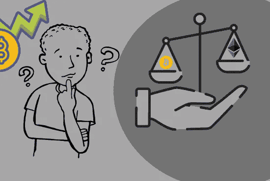

# 以太坊和比特币有什么相似之处？

> 原文：<https://medium.com/coinmonks/how-is-ethereum-similar-to-bitcoin-e90aef9c520a?source=collection_archive---------75----------------------->

# 以太坊有内置的加密货币

以太坊的令牌叫做以太，简称 ETH。这是一种加密货币，可以交易为其他加密货币或其他主权货币，就像 BTC 一样。ETH 所有权在以太坊区块链上被追踪，就像 BTC 所有权在比特币的区块链上被追踪一样。

# 以太坊有区块链

像比特币一样，以太坊也有区块链，其中包含数据块(纯以太网支付和智能合约)。这些块由一些参与者挖掘，并分发给验证它们的其他参与者。你可以在 etherscan.io 上探索这个区块链

以太坊块和比特币一样，通过参考前一个块的哈希形成一个链。

# 以太坊是公开的，没有权限

像比特币一样，主要的以太坊网络是一个公共的、无许可的网络。任何人都可以下载或编写一些软件，连接到网络，开始创建交易和智能合约，验证它们，并挖掘区块，而无需登录或注册任何其他组织。

当人们谈论以太坊时，他们通常指的是网络的主要公共无许可版本。然而，像比特币一样，你可以拿以太坊软件，稍微修改一下，创建不连接到主公共网络的专用网络。不过，私人令牌和智能合约不会与公共令牌兼容，就像私人比特币网络一样。

# 以太坊有工作证明(PoW)挖掘

与比特币一样，采矿参与者通过花费电力寻找数学挑战的解决方案来创建有效块，这种数学挑战被称为 Ethash，其工作原理与比特币略有不同，并允许使用更常见的硬件。它是故意设计来降低被称为 ASICs 的专用芯片的效率优势，这种芯片在比特币挖掘中很常见。商品硬件被允许有效竞争，这使得矿商的权力更加分散。然而在实践中，专门的硬件已经被创造出来，所以以太坊中的大多数积木都是由一小群矿工中的一个人创造出来的。