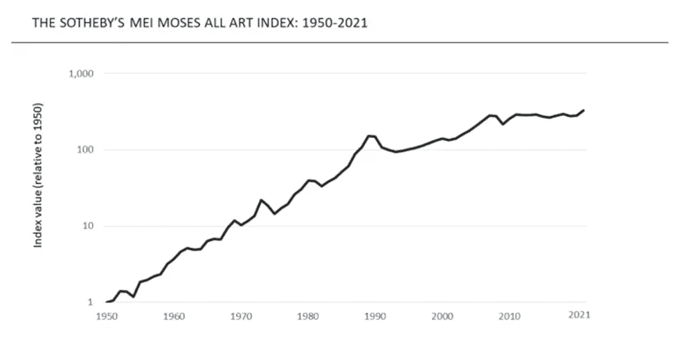

# 区块链是如何改变艺术世界的？

> 原文：<https://medium.com/coinmonks/how-is-the-art-world-being-transformed-by-blockchain-e2dbe46f620b?source=collection_archive---------21----------------------->

Image: Shutterstock

近年来，艺术品市场一直在稳步增长，买家和卖家每天都可以在一级市场(首次出售的艺术品)和二级市场(转售的艺术品)进行全球范围的艺术品交易。正如下面的苏富比梅·摩西指数*图所示，这导致过去 70 年间整个艺术品市场的复合年增长率为 8.5%。

**苏富比梅·摩西指数使用同一幅画在两个不同时间点的购买价格(即重复销售)来衡量独特艺术品的价值变化。*

Graph taken by [Sotheby](https://www.sothebys.com/en/the-sothebys-mei-moses-indices)

由于这种崛起，艺术品市场已成为一种对投资者有吸引力的新资产类别，从长远来看，这种资产类别可以提供多样化的机会，因为艺术品可以储存价值，并创造积极的实际回报。

尽管传统艺术市场近年来有所增长，但互联网艺术行业创造了更有利可图的投资前景。近年来，区块链技术和不可替代的硬币帮助数字艺术获得了牵引力。

**什么是区块链？**

区块链技术有可能通过提供几个可以应用于数字艺术世界的关键方面来改变艺术世界:

*   提供一种共识机制，在网络参与者之间验证和批准交易，从而形成一个高度安全的环境
*   提供透明性，因为区块链上的所有事件都可以被跟踪，允许用户跟踪或审核交易
*   提供了效率和速度，因为包括交易细节在内的所有文档都存储在区块链上，消除了对传统纸面系统的需要
*   使用智能合约提供自动化流程，其中预先指定的条件可以触发流程中的下一步，而无需人工干预

**区块链对于传统艺术市场有什么优势？**

传统艺术界有许多重大问题，包括透明度、认证、所有权、出处、版权和艺术品伪造。拍卖行和私人销售一直主导着艺术行业，限制了除了能够在艺术上花大价钱的最富有的个人之外的所有人。艺术家大多被排除在关于他们的创意作品如何定价、分销和销售以及他们可以从艺术品销售中赚多少钱的讨论之外。

传统艺术市场可以通过采用区块链技术和为艺术品拍卖提供所需的工具来克服这些障碍，从而将目前僵化和过时的市场转变为未来进步和高科技的市场。

**真实性**:在艺术界，真实性一直是一个很大的难题，因为真实性的证明很容易被篡改，使它们变得不可靠。当艺术家已经不在人世，而作品的年代又是几百年前的时候，确定一件艺术品的所有权和交易历史的合法性尤其困难。然而，由于区块链可以保留信息而无法更改，拍卖行可以利用它来记录和鉴定艺术品。这样，原创作品就可以很容易地得到确认和认证，而无需使用中介，从而确保作品的完整性。

**出处**:确定一件艺术品的出处，或者说所有权的历史，已经被证明是一件具有挑战性的事情，尤其是那些年代久远的作品。通过允许艺术品拍卖行建立基于区块链的出处记录，以确保艺术品所有权的细节，区块链可以缓解这个问题。因为数据将被保存在区块链上，并且不会被更改或改变，所以这将是不可变出处的一个令人信服的例子。

**透明度**:在艺术品市场，透明度一直是一个巨大的问题，因为它包含了广泛的话题，包括定价、购买条款、出处、作品历史、真品证书、艺术品状况等等。洗钱、赝品的传播以及关于价格、条件和历史的虚假信息都可能是艺术市场缺乏开放性的结果。然而，由于区块链的主要特点之一是透明，上述所有问题都可以避免。通过维护一个永久的艺术品信息数据库，记录与一件艺术品相关的所有数据，拍卖行可以提供一个新的透明度水平。这些记录可以公开，让买家可以监控艺术品的历史，查看以前的购买记录，并检查所有必要的事实，以确定真正的价值。

下面的视频演示了一个基于区块链的应用程序如何管理所有相关方之间的交互，并采用了所有上述概念..由德勤卢森堡公司创建。

区块链会如何改变艺术世界？

区块链技术不仅有可能增强艺术市场的现有状态，还可能通过为艺术的创作、获取、购买和销售开辟新的可能性来扩大艺术视野。

首先，数字艺术已经存在很长时间了，包括绘画、photoshopping、GIF 动画和其他形式的数字艺术，它们可以在艺术家不知情的情况下被轻易地伪造、重用或复制。这应该不再是区块链的问题。由于这项技术，艺术家现在可以将他们的数字艺术注册为独一无二的，并且他们的作品可以被监控。NFT，或不可替代的令牌，是艺术收藏家拥有其数字艺术的一种新方式。NFT 是一种加密令牌，允许艺术家为每件作品添加真实性证书。

因此，NFT 是独一无二的数字令牌，代表着一种资产，并确保其价值和稀缺性。艺术家现在可以指定他们的作品应该有多少份，并创建必要数量的令牌，这些令牌将在销售过程中作为凭证传递。有人仍然可以复制作品，但如果没有真迹，它将一文不值。因为区块链确保只有有限数量的授权艺术品存在，其价值可以交易。

> 区块链技术在艺术品上创建数字签名，将其标识为独一无二、不可逆转和不可替代的。

其次，区块链科技扩大了艺术家作品的销售市场。在传统的艺术市场上，业余艺术家几乎很难出售他们的作品并赚钱，因为画廊准入有限，费用高，而工作报酬低。现在，一种新型的互联网市场为所有艺术家直接向收藏家推广和销售他们的作品提供了新的机会。由于艺术家可以设定自己的价格，对其进行监管，并让其根据供求关系进行波动，因此中介马上被排除在等式之外。此外，互联网将艺术家/卖家暴露给更多的观众，允许他们在不影响物品价格的情况下快速出售艺术品，因为市场上有更多的流动性。另一个显著的优势是艺术家可能有资格获得他们作品的版税。艺术家现在可以保留他们作品销售的有效记录，允许他们根据每笔销售的一部分收取版税。

传统艺术市场主要面向有钱有势的上层人士。然而，现在艺术品已经数字化，并通过在线艺术市场在区块链进行交易，全球任何地方的任何人都可以随时获得艺术品。人们现在可以进入没有区块链就无法进入的艺术世界，但他们也受到保护，并相信艺术品是真实的，卖家有合法权利以合理的价格出售。

> 与传统的实物艺术品市场相反，使用区块链的数字市场将能够把买家和卖家聚集到一个单一的购买系统中，允许在一个地方有比任何物理位置都多的消费者和卖家。

尽管美术馆将继续成为受欢迎的景点，但区块链已经为一个名为道(分散自治组织)的新艺术市场的创建打开了大门。在传统市场中，一家公司有一位创始人、一位首席执行官、一个董事会或其他一些小团体来指引公司的道路。道不存在这种等级制度，因为每一个拥有献给道的艺术品的人都被认为是“组织”的一员，拥有平等的发言权和投票权。控制 DAO 如何工作的智能契约代码可以用来连接 NFT 和 DAO。

例如，对智能合约进行编程，使其在每次出售 NFT 时贡献一定比例的交易是可行的。这些资金将集中在道(类似于有一个银行账户)，可由项目或艺术家使用，以实现项目的目标或开始一个新的项目。通过这种方式，新的“美术馆”将是自主的、透明的，最重要的是去中心化的，消除艺术行业中中间商的权力，让艺术家和收藏家独立。因此，涉及艺术品的交易可以使所有相关方受益，因为交易成本将会降低，包括更低的运输成本、拍卖费用和佣金。

鉴于上述情况，区块链不仅有潜力帮助现有的传统市场，而且有潜力发展和革新艺术行业，使其更加现代化和民主化。艺术家、开发商、投资者和企业家有独特的潜力来改变艺术行业，并允许传统和现代市场共存。

参考资料:

邓肯·麦克唐纳-科尔特，维利·莱赫东维尔塔，埃里克·t·迈耶(2016)。[艺术市场 2.0 区块链与视觉艺术的金融化](https://www.dacs.org.uk/DACSO/media/DACSDocs/Press%20releases/The-Art-Market-2-0-Blockchain-and-Financialisation-in-Visual-Arts-2018.pdf)

[为什么艺术品应该被视为一种资产类别？](https://www2.deloitte.com/lu/en/pages/art-finance/articles/art-as-investment.html)

Ryo Takahashi (2017)，[创意产业如何从区块链获益？](https://www.mckinsey.com/~/media/McKinsey/Industries/Technology%20Media%20and%20Telecommunications/Media%20and%20Entertainment/Our%20Insights/How%20can%20creative%20industries%20benefit%20from%20blockchain/How-can-creative-industries-benefit-from-blockchain.pdf)

> 加入 Coinmonks [电报频道](https://t.me/coincodecap)和 [Youtube 频道](https://www.youtube.com/c/coinmonks/videos)了解加密交易和投资

# 另外，阅读

*   [Bookmap 点评](https://coincodecap.com/bookmap-review-2021-best-trading-software) | [美国 5 大最佳加密交易所](https://coincodecap.com/crypto-exchange-usa)
*   最佳加密[硬件钱包](/coinmonks/hardware-wallets-dfa1211730c6) | [Bitbns 评论](/coinmonks/bitbns-review-38256a07e161)
*   [新加坡十大最佳加密交易所](https://coincodecap.com/crypto-exchange-in-singapore) | [购买 AXS](https://coincodecap.com/buy-axs-token)
*   [红狗赌场评论](https://coincodecap.com/red-dog-casino-review) | [Swyftx 评论](https://coincodecap.com/swyftx-review) | [CoinGate 评论](https://coincodecap.com/coingate-review)
*   [投资印度的最佳密码](https://coincodecap.com/best-crypto-to-invest-in-india-in-2021)|[WazirX P2P](https://coincodecap.com/wazirx-p2p)|[Hi Dollar Review](https://coincodecap.com/hi-dollar-review)
*   [加拿大最佳加密交易机器人](https://coincodecap.com/5-best-crypto-trading-bots-in-canada) | [库币评论](https://coincodecap.com/kucoin-review)
*   [用于 Huobi 的加密交易信号](https://coincodecap.com/huobi-crypto-trading-signals) | [HitBTC 审查](/coinmonks/hitbtc-review-c5143c5d53c2)