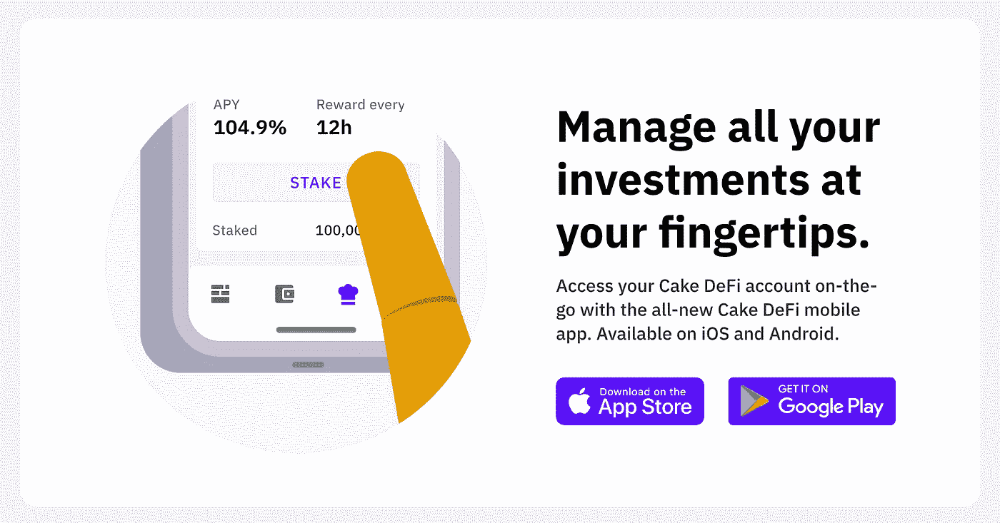
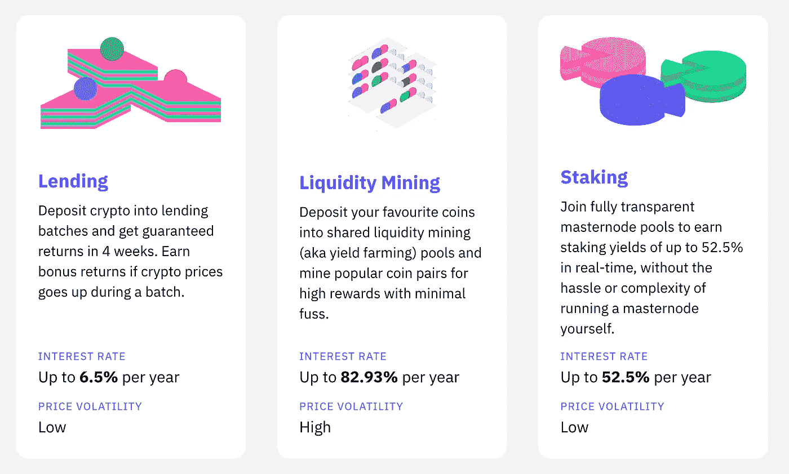
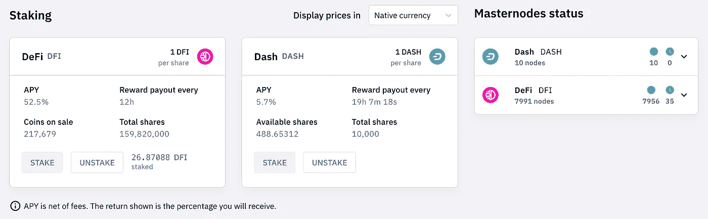
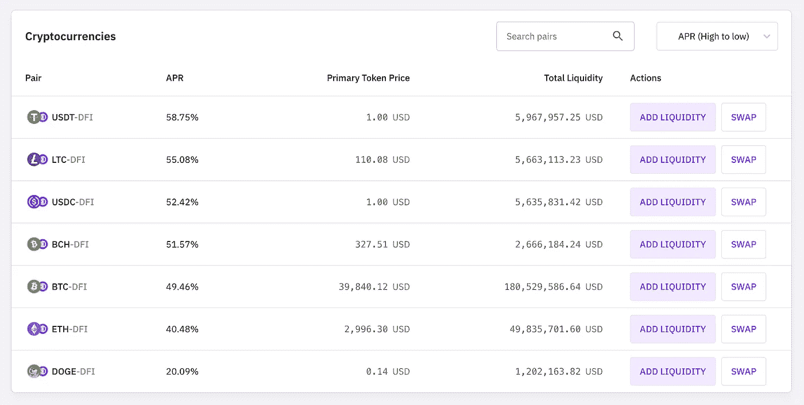
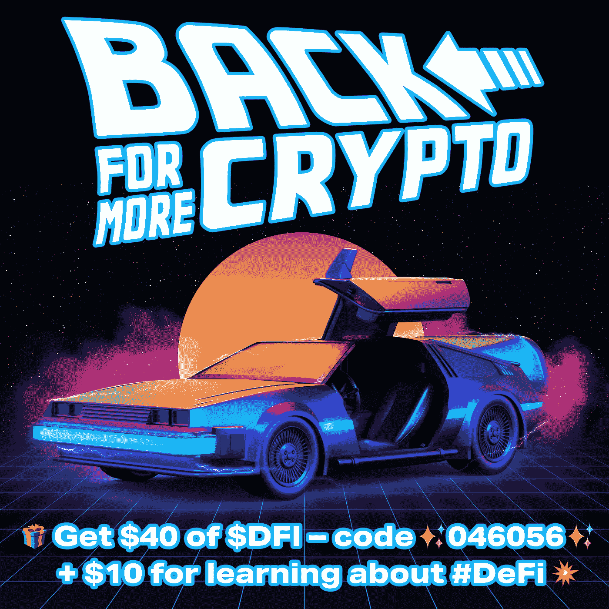

# 我是如何利用 Crypto 和 DeFi 赚取 50-120%回报率的被动收入的——低风险策略和初学者友好指南

> 原文：<https://medium.com/coinmonks/how-ive-been-earning-passive-income-with-50-120-returns-using-crypto-and-defi-low-risk-194014d158e?source=collection_archive---------17----------------------->

Disclaimer: Please don’t take this as financial advise. I’m simply a spare-time crypto enthusiast, not an investment professional or financial advisor. I put this article together to explain what and how I’m doing it for friends and family.

## 加密简介

这不是对比特币和区块链的介绍——去别处看看。相反，这是我个人的低风险，被动收入策略，使用分散融资(DeFi)。

俗话说，低买高卖……截至 2022 年 4 月，crypto 的市值略高于 2.1 万亿美元，低于 2021 年 11 月 3.1 万亿美元的高点。然而，考虑一下这个——就在一年前，2020 年 11 月，市值首次超过 4000 亿美元。

## DeFi — *努力去做，否则就会被遗忘*

加密空间充满了误解，骗局和地毯拉。由于这些原因，业余爱好者很容易犯菜鸟错误，丢失他们的数字代币(硬币)，或者心甘情愿地将它们交给没有实际恢复手段的骗子——*从我第一次学习导航空间时的个人经验来说*。

在糟糕的交易和费用上，在快速增加的购买、交易和销售上，也很容易不断地损失资金。与此同时，在你的数字钱包里随意放一些硬币，每天查看，并希望获得 100 倍的回报，这并不是什么策略。

## 蛋糕定义的来源

Cake 是一家总部位于新加坡的运营公司，专注于提供各种加密资产的现金流。Cake 运营着一个去中心化的金融平台，提供工具来产生数字资产的回报。目前，该平台提供三种不同的产品——加密贷款、加密赌注和流动性挖掘(*除贷款以外的所有产品在下面*解释)。

在 Cake 出现之前，打桩和采矿被认为是复杂的技术过程，如果没有大量的资金，广大民众是无法接触到的。有了 Cake，资源有限、没有技术专长的投资者可以参与进来，并从他们的密码中获利——每 12 小时就有一次分红。

考虑到银行提供 0.5-1.5%的储蓄和退休账户利率为 4-6%，而目前的实际通胀率为 7-10%，30-120%的回报率非常有吸引力，值得认真研究。

*披露:我个人一直在使用 Cake 通过赌博和采矿来被动地赚取密码，并一直建议我的朋友和家人也这样做，而不是让他们的现金和数字资产在钱包中积累灰尘。我的资产分为两部分，平均每年超过 50%。*

你可以像我一样用 100 美元尝试蛋糕——存入 50 美元，通过使用代码✨[*046056*](https://app.cakedefi.com/?ref=046056)*✨获得 40 美元的 DFI，并通过学习#DeFi 获得另外 10 美元。*

— — — — — —下面是一步一步的指南

[https://app.cakedefi.com/?ref=046056](https://app.cakedefi.com/?ref=046056)

Cake 由 Julian Hosp 博士和 U-Zyn Chua 于 2019 年初创立，旨在解决几个金融痛点，并允许用户以透明、易用的方式从他们的加密货币中获得现金流。

Hosp 是一个在加密行业有影响力的专家，在世界各地拥有大量的追随者。蔡美儿是软件工程师，也是新加坡政府的区块链顾问。

下面是朱利安对蛋糕的两分钟解释:

## 从基础开始

DFI 是 DeFi 区块链(DeFiChain)的原生令牌。DeFi 区块链是由 DeFiChain 基金会推出的区块链，用于在比特币区块链上实现去中心化金融，而不需要图灵完全指令。

换句话说，DFI 运行在比特币生态系统内的区块链平台上，由分布式计算机网络支持，旨在促进快速透明的交易，尽可能减少最终用户的麻烦。

[https://app.cakedefi.com/?ref=046056](https://app.cakedefi.com/?ref=046056)

## 蛋糕 DeFi 的被动收入

Cake 提供了两种实用的方法来让您的加密货币为您工作并产生被动收入。让我们从**赌注开始——低风险**。

## **什么是赌注？**

赌注使加密货币持有者能够通过提供流动性并将其存放在支持利益证明(PoS)共识机制的协议中，从其资产中获得被动收入，其中交易由验证者而不是矿工进行验证，如工作证明(PoW)中的情况。

*换句话说，赌注类似于从银行储蓄中赚取的利息——Cake 提供一种服务，将您的硬币存入，以换取在 crypto 中赚取的奖励。这些奖励可以自动复合、移动或提取。*

这是 Julian 的一段稍微有点技术性的视频解释:

你押的越多，你的回报就越高，押的时间越长，回报就越大。目前，蛋糕提供 DFI 和破折号代币赌注，并有计划在未来增加额外的硬币。

[https://app.cakedefi.com/?ref=046056](https://app.cakedefi.com/?ref=046056)

## 什么是流动性挖掘？

流动性挖掘是一个过程，其中密码持有者将资产借给分散的交易所以换取回报。这些奖励通常来自交易者交换代币产生的交易费。

朱利安再一次带来了另一个两分钟的视频:

流动性挖掘比赌注风险更大，因为用户可以获得更高的回报率——在某些情况下超过 100%。当你在挖掘流动性时，你是在为交易所提供流动性，以实现分散交易。作为回报，您将获得一部分交易费用和基于您的流动性池份额的大宗分配份额。

[https://app.cakedefi.com/?ref=046056](https://app.cakedefi.com/?ref=046056)

## 4 月对 APY

关于流动性挖掘的最后一点，回报是在 4 月，而不是 APY。虽然 APR 和 APY 听起来可能一样，但它们有很大的不同。APY 是一种年百分比收益率，并考虑了复利，但 APR 代表年百分比率，不考虑复利。

以 USDT-DFI 为例， **APR 为 58.75%** 。换算成 APY 和每周复合结果的 **APY 为 79.36%** 。

## 蛋糕冰柜是什么？

蛋糕提供了一种额外的产品，可以提高赌注和采矿的收益。通过冻结(锁定)你的分配资金，你可以根据时间长度获得高达 200%的回报——从 1 个月到 10 年——以获得最大回报。奖励(和其他产品一样)可以复利、转移或收回。

问题是，一旦资产被冻结，在冻结期结束之前不能取出。被冻结的资产在任何情况下都不能移动、出售、提取或转移。

*换句话说，冻结是永久的，直到选定的时期结束。*

## 初学者循序渐进指南

**1。**访问[**www.cakedefi.com**](https://app.cakedefi.com/?ref=046056)，点击主菜单**报名**。遵循说明并记住使用推荐代码 [**046056**](https://app.cakedefi.com/?ref=046056) 。

**2。**点击右上角的**面包师帽**，选择**个人资料和设置**，然后选择**身份验证**。您需要上传您的护照、驾照或身份证的照片以及地址证明(取决于国家)来完成 KYC(了解您的客户)。

***注意事项*** *:处理过程可能需要几分钟，但也可能需要更长时间，而且大多数国家(包括美国)都要求这样做，以帮助打击洗钱和恐怖主义融资活动。*

**3。**向借贷(在美国不可用)、赌博或流动性挖掘(通过主菜单从**所有产品**中选择)中存入 50+美元(任何硬币)。

***注意事项*** *:流动性挖掘完成是成对的(即。比特币+ DFI)这意味着，为了存入流动性矿，你需要在钱包里同时持有这两种数字资产。因为采矿风险更大，需要额外的步骤和额外的数字资产，我建议将你的第一笔 50 多美元存入赌注。*

***重要提示*** *:要获得您的 40 美元奖金，存款* ***必须达到 50 美元或以上*** *。多次较小的交易(例如 2 次交易中的 30 美元+20 美元)不会触发奖金。由于潜在的价格波动和少量的存款费用，我强烈建议存入 55-60 美元。*

**4。**通过主菜单点击**冰柜**。选择您的资产(DFI 赌注股份)，选择 **Max** (金额)，并将**期限**设置为 1 个月(或更长)并确认您的选择。

5.您的 40 美元奖金(2022 年 4 月 25 日后为 30 美元)将立即存入您的钱包，存入 DFI，并冻结 180 天，以防止系统被滥用。

**6。**通过主菜单点击**学习**并完成“DeFiChain”和“比特币”课程，即可在 DFI 赚取额外的 10 美元，这些钱也会立即存入您的钱包中，并被冻结 30 天。

## 蛋糕——要么去吃，要么被落下

在推特和电报上找到我

[https://twitter.com/AirdropOffer365](https://twitter.com/AirdropOffer365)

[https://t.me/AirdropOffer365](https://t.me/AirdropOffer365)

*你可以像我一样用 100 美元尝试蛋糕——存入 50 美元，通过使用代码✨*[*046056*](https://app.cakedefi.com/?ref=046056)*✨获得 40 美元的 DFI，并通过学习#DeFi 获得另外 10 美元。*

Disclaimer: Please don’t take this as financial advise. I’m simply a spare-time crypto enthusiast, not an investment professional or financial advisor. I put this article together to explain what and how I’m doing it for friends and family. I am not responsible for any action taken or any financial losses as a result of your actions.

#比特币# defi #借贷#奖金# Easter egg hunt # cakedefi # passiveincome #促销#现金流#数字货币#加密#比特币#优惠#比特币钱包#加密钱包#安全月#加密交易#加密 101 #空投#免费加密#加密开采#流动性开采#加密交易

> 加入 Coinmonks [电报频道](https://t.me/coincodecap)和 [Youtube 频道](https://www.youtube.com/c/coinmonks/videos)了解加密交易和投资

# 另外，阅读

*   [美国最佳加密交易机器人](https://coincodecap.com/crypto-trading-bots-in-the-us) | [不断回顾](https://coincodecap.com/changelly-review)
*   [在印度利用加密套利赚取被动收入](https://coincodecap.com/crypto-arbitrage-in-india)
*   [Godex.io 审核](/coinmonks/godex-io-review-7366086519fb) | [邀请审核](/coinmonks/invity-review-70f3030c0502) | [BitForex 审核](https://coincodecap.com/bitforex-review)
*   [最佳比特币保证金交易](/coinmonks/bitcoin-margin-trading-exchange-bcbfcbf7b8e3) | [萝莉点评](/coinmonks/lolli-review-e6ddc7895ad8) | [比特币保证金交易](https://coincodecap.com/bityard-margin-trading)
*   创造并出售你的第一个 NFT | [密码交易机器人](https://coincodecap.com/best-crypto-trading-bots)