# 这个熊市能持续多久，BTC 能跌到多低？

> 原文：<https://medium.com/coinmonks/how-long-can-this-bear-market-last-and-how-low-btc-can-go-be16099fb085?source=collection_archive---------9----------------------->

首先，我想说，没有人能准确预测熊市或牛市会持续多久，或者价格会有多低或多高，但我们可以尝试利用过去的事件做出预测，并对未来做出一些预测，这就是我写这篇文章/帖子的目的。

熊市能持续多久？

有些人会说，我们刚刚进入熊市，不，我们现在可能正在进入衰退模式的市场，但通常情况下，熊市是从之前的 ATH 或第一个更低的低点开始衡量的，所以我会说，我们现在处于熊市大约 200 天。

**1.1——一个具有良好宏观经济的适当牛市能持续多久，一个新 ATH 的可能性有多大？**

我认为这一次可能需要更长时间才能发生，因为它与宏观情景高度相关，大投资者应该处于冒险模式，这通常是由央行的货币政策和激励措施引发的。

首先，让我们了解什么可以导致央行改变政策，美联储作为国家的货币政策权威，影响货币和信贷的可用性和成本，以“促进健康的经济”(他们认为)。美国国会给了美联储两个相同的货币政策目标:**第一，最大就业**；第二，稳定的价格，意味着低而稳定的通货膨胀。这种“双重使命”意味着第三个不太为人所知的目标，即适度的长期利率。

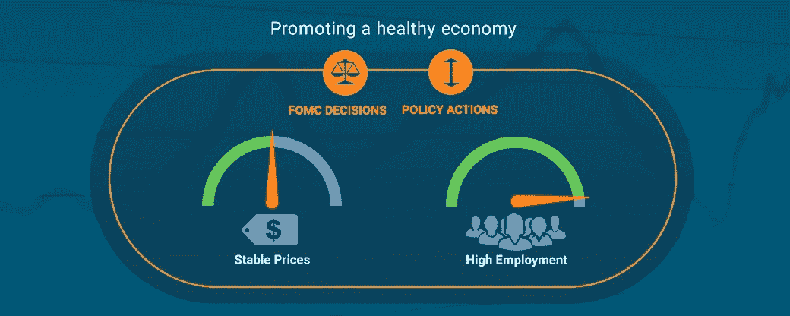

这种温和的长期利率是他们所认为的中性利率——一个既不刺激也不限制经济增长的水平。美联储政策制定者估计，中性利率大致在 2%至 3%之间。但这不是一门精确的科学，宏观形势的变化可能会使美联储采取行动提高就业水平或降低通胀，这可能会使规模失衡。

现在让我们来看看以前这些相关性的一些例子，2020 年，当 COVID 实施封锁政策时，失业率开始上升，正如我们之前看到的，美联储的主要目标之一是保持高就业率。

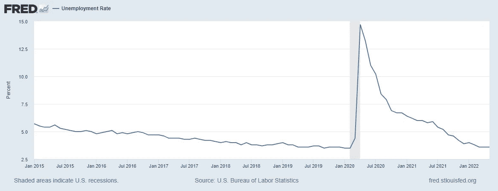

随着失业率逐月增长，以及封锁造成的衰退风险，市场也开始融化，在 2 月 18 日至 3 月 20 日期间，S&P500 下跌近 35%，纳斯达克 100 指数下跌近 30%，BTC 接近 60%。试图降低失业率和拯救美国经济美联储推出了一项计划，将利率降至 0%，并推出了 7000 亿美元的量化宽松计划，在这些激励措施后，所有市场见顶，BTC 在一年多一点的时间里从 3.500 美元上涨到 65.000 美元(1)。

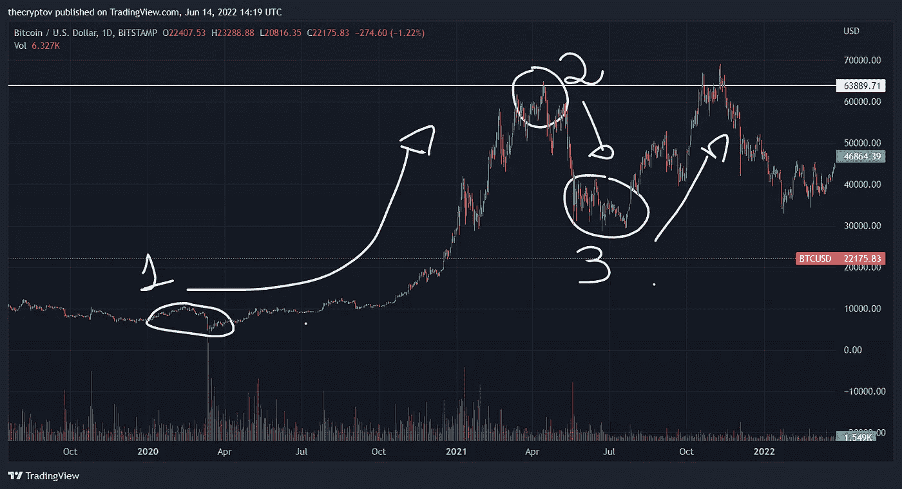

在 BTC 达到约 65.000 美元(2)的峰值后，市场开始注意到通胀正在加剧，因此对美联储会议(2021 年 4 月 27 日至 28 日)有一些预期，在会议上，一切都保持不变，但有一些谈话表明美联储政策制定者提高利率并开始放缓 QE，这足以让大投资者激活避险模式。

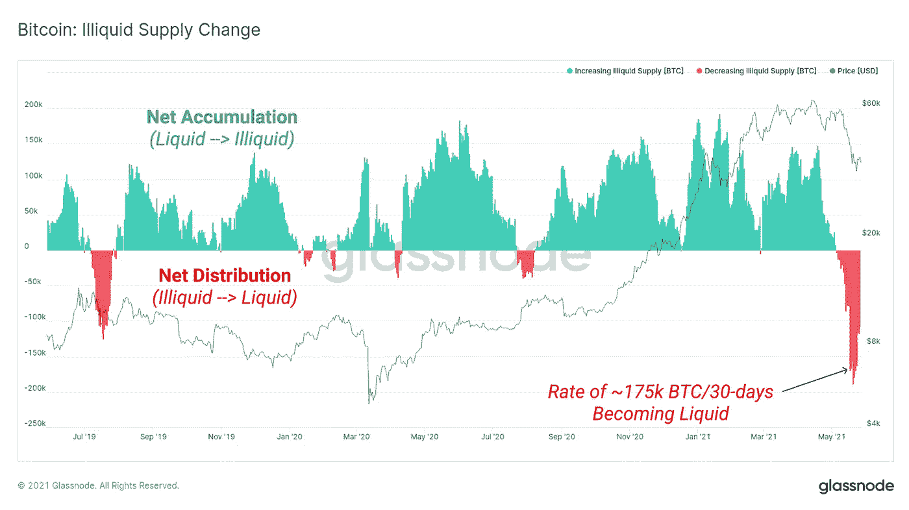

在 2021 年 6 月至 7 月的“熊市侧化-整合”(3)中，美联储宣布，相对于利率，可能至少在 2022 年底之前保持不变(哈哈)，投资者一直在寻找每月债券购买何时可能开始撤回的线索，在会议纪要公布后，显示计划撤回每月债券购买的步伐可能只在年底之前，投资者再次将心态转变为风险模式，进行最后一次尝试。

现在，我们来分析一下下跌的走势图。

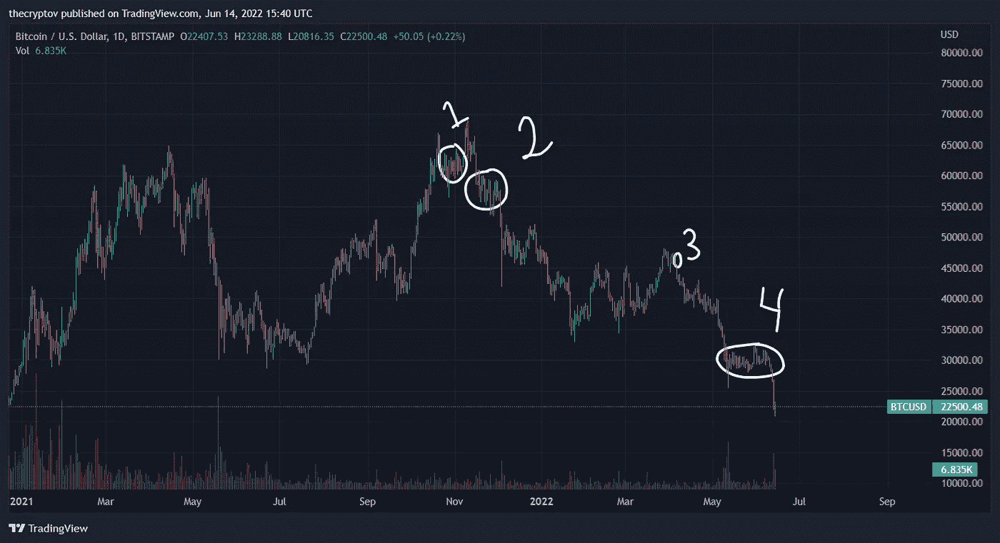

2021 年 11 月 3 日(1)，在美联储会后新闻发布会后，美联储主席 Jerome Powell 表示，FOMC“将开始减少资产购买的步伐”，这一过程称为缩减(还记得市场再次运行是因为美联储推迟了这一决定吗？).当时，美联储每月购买 800 亿美元的美国国债和 400 亿美元的美国机构证券。鲍威尔表示，从 2021 年 12 月开始，每月资产购买量最初将减少 100 亿美元的国债和 50 亿美元的机构证券，还有其他消息推动市场下跌，如恒大和中国禁止集中交易，但这些事实只是引发大投资者更快地降低头寸风险。

11 月 25 日(2)开始有传言称，“高盛策略师周四在每日简报中表示，美国美联储可能会将缩减每月债券购买量的速度从 1 月份增加一倍，至 300 亿美元，并在 3 月中旬前逐步结束疫情时代的债券购买计划。”市场明白:难以规避风险。

请注意，2022 年上半年是一个横向移动，直到 3 月，在 3 月底我们开始反弹，但在美联储会议纪要(3 月 15 日至 16 日会议)发布后(3)，BTC 再次下跌，官方宣布“最多 600 亿美元的美国国债和 350 亿美元的抵押贷款支持证券将被允许滚存，分三个月逐步进行，可能从 5 月开始。这一总数将是 2017 年至 2019 年最后一次努力的两倍左右，代表着从超宽松货币政策的历史性转变的一部分。”。此外，在 3 月 15 日至 16 日的会议上，美联储批准了三年多来的首次加息。此次加息 25 个基点——0.25 个百分点——将基准短期借款利率从 2020 年 3 月以来的近零水平推高。不过，会议纪要指出，在即将举行的会议上，可能会加息 50 个基点，投资者认为这是在规避风险。

如前所述，美联储的主要目标之一是保持高就业率和低通胀率，如果你重新审视失业图表，你会注意到它仍然很低，否则通胀尚未见顶，最近的 CPI 数据显示 y/y 为 8.6%(4)——高于之前 4 月份的 8.3%和 3 月份的 8.5%——这对投资者来说是一个坏信号。 许多人更愿意规避风险，因为随着通胀高企和失业率低企，美联储有足够的空间加息，甚至加息，这将从动荡的市场中取出流动性，根据他们推进这条线的力度，可能会使市场陷入严重衰退。

如果你绘制 BTC 或任何其他波动性资产的历史，你会注意到央行创造/撤销经济激励的这种模式将使这些市场出现疯狂的牛市或熊市。另一个及时的例子是下面的 BTC 牛市结束图。

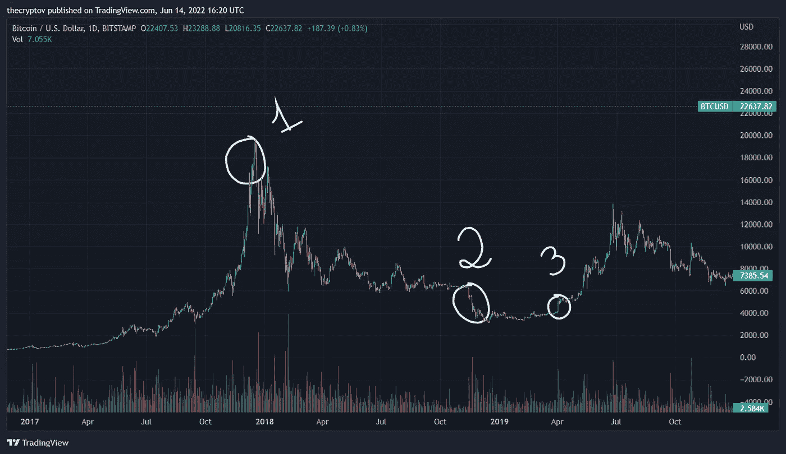

美联储上一次开始量化紧缩是在 2017 年 12 月，无论巧合与否，2017 年 12 月是形成牛市周期的 BTC ATH 的时间(1)。无论巧合与否，2018 年 12 月，BTC 找到了底部，当时美联储降低了加息预期，并警告他们可能停止量化紧缩(2)。美联储在 2019 年 1 月和 3 月放弃加息(3)，当时美联储宣布他们将立即停止量化紧缩，此后，BTC 开始反弹。

**结论:**市场什么时候会出现适当的挤兑真的很难预测，但不需要确切知道，可以按照货币刺激/收缩的路径来。与没有刺激的情况相比，货币刺激可以导致不稳定的资产在短时间内触底，而货币紧缩可以导致资产以同样的速度触底。当货币紧缩结束时，你可以预期市场会复苏，甚至预期会出现挤兑，但如果没有刺激措施，打破之前的颓势将需要更长的时间。

**Ps。:我知道，在市场刺激/收缩的情况下，牛市/熊市的波动可以持续多长/多短时间还有更多数据，这里的要点是这些情况如何改变投资者对风险的看法。**

**1.2——通胀峰值和股票表现之间的相关性。**

Leuthold Group 的一项分析研究了自 1945 年以来的市场表现，发现当通货膨胀率高时，股票往往在通货膨胀率见顶后表现良好。此外，Game of Trades 分享了一张图表，该图表显示，自 20 世纪 50 年代以来，在近 20 次不同的高通胀时期中，标准普尔 500 指数就在通胀见顶之前触底。

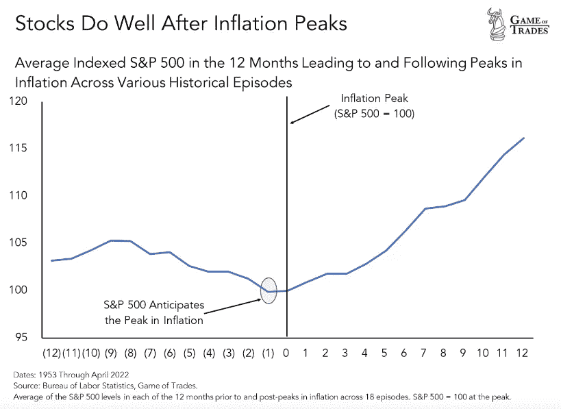

根据保尔森对数据的分析，当通胀处于较低水平(2%至 4%之间)时，通胀率的变化不会对股票产生太大影响，但一旦年通胀率跃升至 4%以上，市场就会对通胀变得更加敏感，“即使通胀在一段时间内保持高位，如果它只是停止加速，这通常对股票来说是一件真正的好事，”保尔森说。

当通胀率达到 8%或更高时，保尔森用来评估标准普尔 500 表现的指标显示，明年通胀开始减速时，股票表现良好。但是它显示了当通货膨胀继续攀升时,**糟糕的股票表现。**

为什么？正如之前看到的那样，当通胀高企时，美联储倾向于采取紧缩性货币政策，因为短期利率上调，因为利率上升使企业和消费者更难借贷和消费，这有助于减缓需求和应对物价上涨。但它也可能抑制股票和加密货币等金融资产的价格，这可能会让投资者感到恐惧。随着美联储加息，我们已经看到了投资者的大量担忧。

当通胀真的很低时，投资者往往会担心经济疲软，以及这对公司收益和股价意味着什么。保尔森说，随着通货膨胀率的加速，股票会表现得更好，**，但不久之后，不断上升的通货膨胀就会对股票市场产生负面影响。**

他补充说，这是通胀率峰值对投资者如此重要的部分原因。当通货膨胀上升时，投资者更加悲观，希望将资金留在场外。由于这些担忧，股票价格下跌，当通货膨胀缓和时，你就有了买入的机会。现金的流入使股票价格回升。

美国银行基金经理最近的一项调查证实了这一观点，该调查显示，随着全球增长前景跌至历史最低点，对滞胀的担忧加剧，投资者正在涌入现金。该报告显示，投资者的现金水平达到了 2001 年 9 月以来的最高水平，美国银行称这一结果“极其悲观”

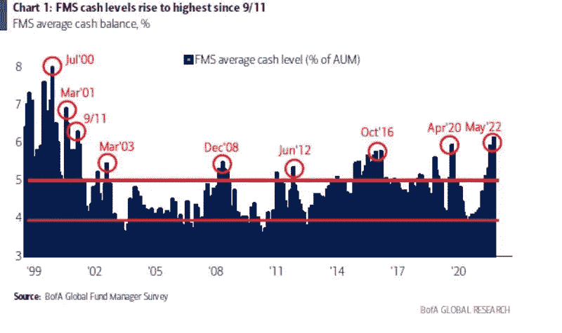

剩下的问题是，通胀是否已经见顶，或者是否会很快见顶？也很难预测这个问题的答案，因为答案将基于每月的经济数据，在一个月内通胀可能会下降，在下一个月再次达到峰值，所以关注 CPI 数据和 PPI 数据很重要，如果你住在美国，请关注价格，因为如 Game of Trades 分享的一张图表所示，**通胀往往下降得比上升快。**

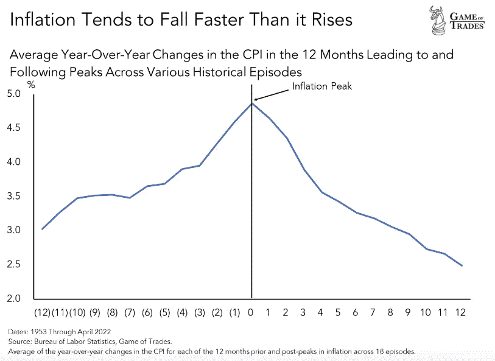

2——BTC 在熊市中能跌到多低——2000 WMA 是比特币总能找到支撑的地方。

在之前的熊市中，200 周移动平均线一直是 BTC 的强有力支撑，只有两次被短暂下调，在 2015 年和 2020 年的 COVID 崩盘中，每个人现在都在质疑它是否会再次保持，或者它是否会是 BTC 第一次在较长时间内打破趋势。此外，值得注意的是，自 2013 年以来，BTC 价格从未越过之前的 ATH，之前的 BTC ATH 接近 20.000 美元区域。

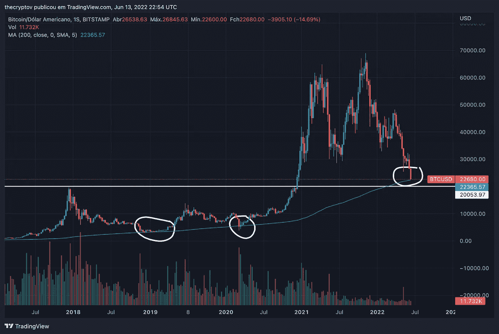

S&P500 图遵循相同的模式，总是受到 200wMA 的支持，只是在过去十年中在 COVID 崩溃时向下交叉，但有一个时刻，S&P500 的交易价格低于趋势线约 861 天，在 2008 年的衰退中，BTC 图从未面临衰退，现在随着美国衰退风险的增长，加上 BTC 和 TradiFi 之间的强相关性，以及宏观形势的几个不确定性， 需要考虑的一个**场景**是，如果标准普尔& P500 面临衰退图表“交易低于 200wMA”，BTC 可能会遵循同样的模式。

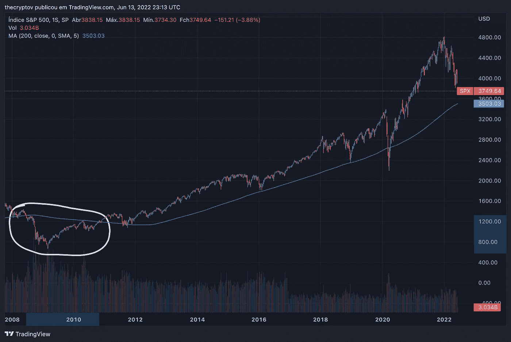

S&P500 在衰退图表中能陷多深？这也是一个没有准确/完美答案的问题(除非你能穿越时空)，因为没有人能预测美国政府会在没有干预的情况下允许股票上涨多少，S&P500 图表的 200wMA 现在交易在 3.500 点左右，这代表从当前水平下跌 6.5%(考虑到 BTC 的当前价格为 22.500 美元，6.5%的下跌将代表收盘时下跌 21.037 美元)。 我要考虑的另一个关键水平是 3.000 点，从目前的水平需要下降近 20%(BTC 的相同情景将使 BTC 交易在 18.000 美元)，在我看来，最后一个目标也是最混乱的一个目标是 2.200 点范围 COVID 崩溃底部——这将意味着下降 40%(BTC 的相同情景将使 BTC 交易在 13.500 美元)。 在我个人看来，我不认为美国会允许股票低至 2.200 点而不进行干预，我们将进一步讨论一些可能引发美国政府干预的情况。

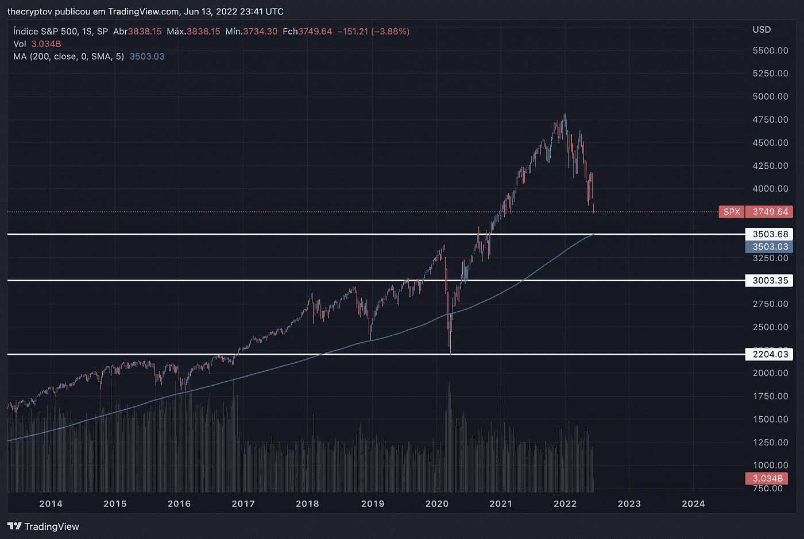

你可以争辩说，BTC 应该与科技股相比，所以 NASDAQ100 会更准确，好吧，我知道了。即使在 COVID 崩盘时，200wMA 也支持纳斯达克图表，但也有两次下跌，第一次是在互联网泡沫时期(上世纪 90 年代末对互联网公司的投资推动了美国科技股股票估值的快速上升，试想我们可能正生活在加密货币泡沫中——很少有项目有真正的用例，一些项目崩溃并损失了投资者的钱，投资者随机向每个出现的项目投入资金，推动了极高的估值)，第二次是 2008 年的衰退。与 S&P500 和 BTC 进行相同的比较将导致以下价格:下跌 4%到达 MA，将代表 BTC 的价格为 21.600 美元，下跌 13%直到 9.800 点区域，将代表 BTC 的价格为 19.575 美元，下跌 40%，将使纳斯达克处于与 covid 崩溃相同的水平 6.700 点，相同的结构将代表 BTC 的价格为 13.500 美元。

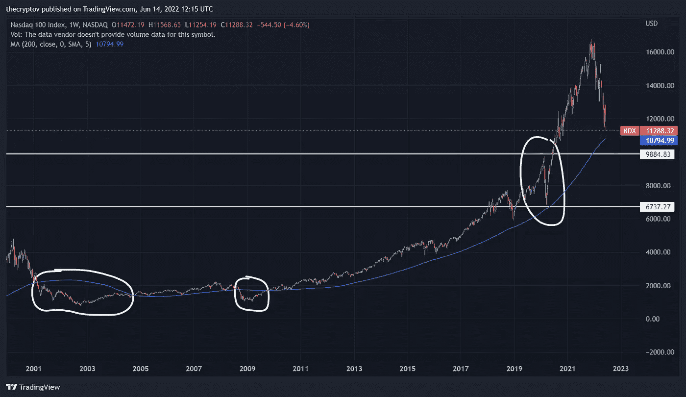

试想一下，如果这种情况发生，BTC 可能会达到比每个级别中提到的价格更低的价格，因为与 TradiFi trought 历史相比，BTC 总是下降更多。

**3 —结论**

从历史上看，财富偏爱那些在思考的时刻，在不确定的时刻，当价格交易接近 200wMA 时买入的人，我不是说 BTC 不会向下穿越或低于 13.500 美元(我画的最大痛苦)，但如果你开始在接近 200wMA 时 DCA，并在 BTC 保持接近或低于时保持 DCA，可能你会有一个最好的位置。

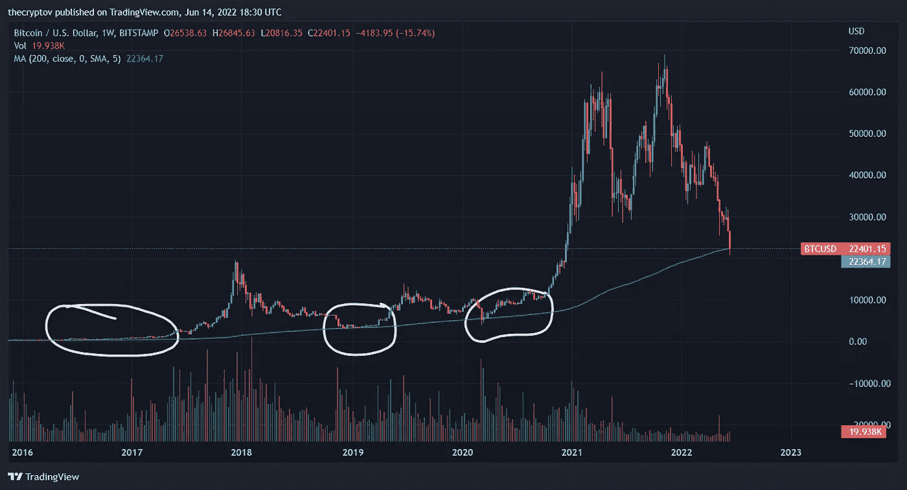

总是$DYOR。这不是财务建议，而只是对以前事件的研究，以及出于教育目的对未来的预测。

> 加入 Coinmonks [电报频道](https://t.me/coincodecap)和 [Youtube 频道](https://www.youtube.com/c/coinmonks/videos)了解加密交易和投资

# 另外，阅读

*   [TraderWagon 回顾](https://coincodecap.com/traderwagon-review) | [北海巨妖 vs 双子星 vs BitYard](https://coincodecap.com/kraken-vs-gemini-vs-bityard)
*   [如何在 FTX 交易所交易期货](https://coincodecap.com/ftx-futures-trading) | [OKEx vs 币安](https://coincodecap.com/okex-vs-binance)
*   [OKEx vs KuCoin](https://coincodecap.com/okex-kucoin) | [摄氏替代度](https://coincodecap.com/celsius-alternatives) | [如何购买 VeChain](https://coincodecap.com/buy-vechain)
*   [ProfitFarmers 回顾](https://coincodecap.com/profitfarmers-review) | [如何使用 Cornix 交易机器人](https://coincodecap.com/cornix-trading-bot)
*   [如何匿名购买比特币](https://coincodecap.com/buy-bitcoin-anonymously) | [比特币现金钱包](https://coincodecap.com/bitcoin-cash-wallets)
*   [瓦济里克斯 NFT 评论](https://coincodecap.com/wazirx-nft-review)|[Bitsgap vs Pionex](https://coincodecap.com/bitsgap-vs-pionex)|[Tangem 评论](https://coincodecap.com/tangem-wallet-review)