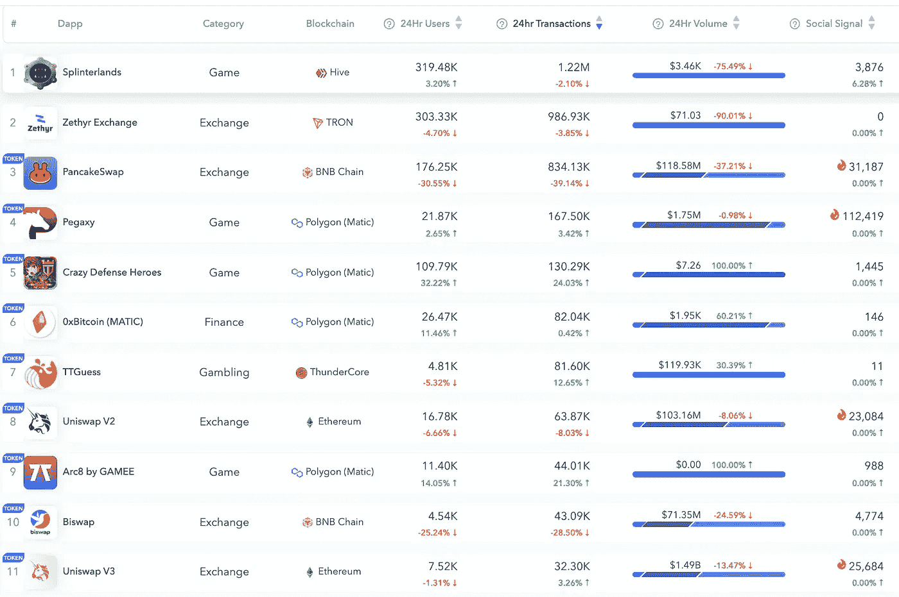

# 有多少人真的用 DeFi？

> 原文：<https://medium.com/coinmonks/how-many-people-really-use-defi-3f27190c29e6?source=collection_archive---------22----------------------->

## 炒作还是 HODL？斯威夫特不是你想的那样。另外！题外话:赶上潮流

你好，我是 Pinotio.com 的皮诺曹！

本周，我花了一些时间挖掘到底有多少用户在使用 DeFi——我将在这篇文章中分享一些很酷的图表。我还挖掘了交易中最常用的密码——但我把它留到了下周。

**今天的议程:**

*   🤪炒作还是 HODL——有多少人真的使用 DeFi？
*   🦅斯威夫特不是你想的那样
*   🌊附注:题外话:赶上潮流

## 炒作或 HODL:有多少人真的使用 DeFi？

在你继续读下去之前，拿起笔或者记下你认为每天有多少人使用[uni swap](app.uniswap.org)——以太坊和其他一些网络上的自动交易。

我最初的猜测… > 50 万日活用户…错了…一个数量级！

根据用户数量，以下是 Dapp.com 排名前 11 位的 dApps:

Top eleven dApps from Dapp.com, by user count

用户的 DeFi 市场很小。我敢打赌，如果你看看比特币基地和币安的每日用户，这个数字会高得多。简而言之，用户体验很重要，DeFi 是一个非常技术性的东西。其他一些有趣的趣闻:

*   游戏占据了相当多的顶级用例——这是有道理的。
*   有趣的 Uniswap v2(一种更老的算法)比 v3(从技术上讲，应该更有效)占更多的量——我想，在实践中，它不是——可能是因为它太复杂了，流动性提供者无法理解。

## 那么，是迪菲炒作还是 HODL？

支持 HODL 论点的是:

1.  DeFi 提供了(某种程度上)对代币和游戏的抗审查访问。没有 KYC 像比特币基地和其他中央集权的服务。
2.  DeFi 为令牌/信息提供了一个可互操作的层，从而促进了竞争。如果人们不再信任一个集中的服务，他们可以选择将他们的资产转移给另一个人(原则上)。
3.  DeFi 可以在应用程序的后台使用，但消费者不需要了解细节。这是 DeFi Mullet(例如前面是比特币基地，后面是 DeFi)类型的方法。我认为“DeFi Mullet”听起来不错，但是现在看公司是否会坚持在后端使用 DeFi 还是倾向于向更封闭的后端发展还为时过早。

在宣传方面:

1.  DeFi 缺乏许多 CEXes 的流动性规模(尽管在特定和更模糊的代币上可以有更多的流动性)。这使得 DeFi 对交易所来说效率更低(此外，由于交易只发生在他们的内部账本上，cex 可以避免天然气费用)。
2.  DeFi 缺乏像 Venmo 或 Revolut 或 OpenSea 那样的高质量用户体验。

总的来说，我倾向于 HODL(我也倾向于 HODL Eth ),因为我看到了一个有意义的机会，DeFi 至少会提供一些有用的工具——主要是因为它是开源的和抗审查的。

## 斯威夫特不是你想的那样

过去一周，某些俄罗斯银行被切断了 SWIFT 国际支付业务。乍一看，SWIFT 似乎是某种支付网络，可能类似于万事达卡。不完全是。

Patrick McKenzie 在这篇文章中很好地解释了 swift，但让我在这里给你一个简短的总结:

1.  Swift 不动钱。相反，它是银行之间的安全信息系统，允许它们达成协议，借记某些账户，贷记其他账户。
2.  国际支付通常不涉及资金的国际流动。取而代之的是，一家日本银行可能在摩根大通(JP Morgan)的美国账户中持有美元。这家日本银行通过要求摩根大通(JP Morgan)借记或贷记他们的美国银行账户来“转移”资金。这种“询问”是通过 SWIFT 等报文传送系统完成的。
3.  简而言之，阻止俄罗斯银行使用 SWIFT 并不能阻止它们与外国银行交流，但可以阻止它们使用 SWIFT 报文传送系统。

[国际转移资金](https://bam.kalzumeus.com/archive/moving-money-internationally/)

[SWIFT 运行一个报文传送协议，将银行与代理银行联系在一起。这种合作使大多数国际电线。](https://bam.kalzumeus.com/archive/moving-money-internationally/)

[钱帕特里克·麦肯齐(patio11)](https://bam.kalzumeus.com/archive/moving-money-internationally/)

这就是本周的全部内容！比诺蒂奥

## 附注:题外话:赶上潮流

非常酷的[insta gram 上的冲浪视频](https://www.instagram.com/reel/CZwY_0qpXjU/?utm_source=ig_web_copy_link)。