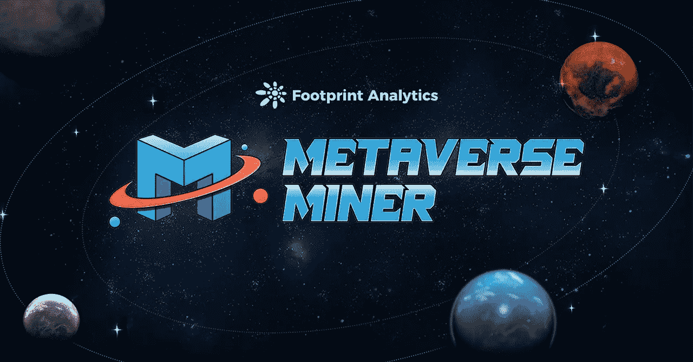
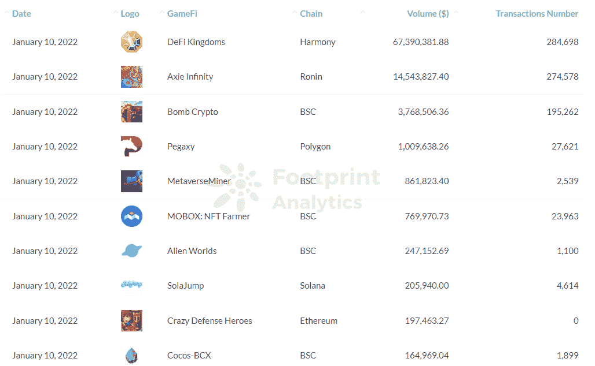
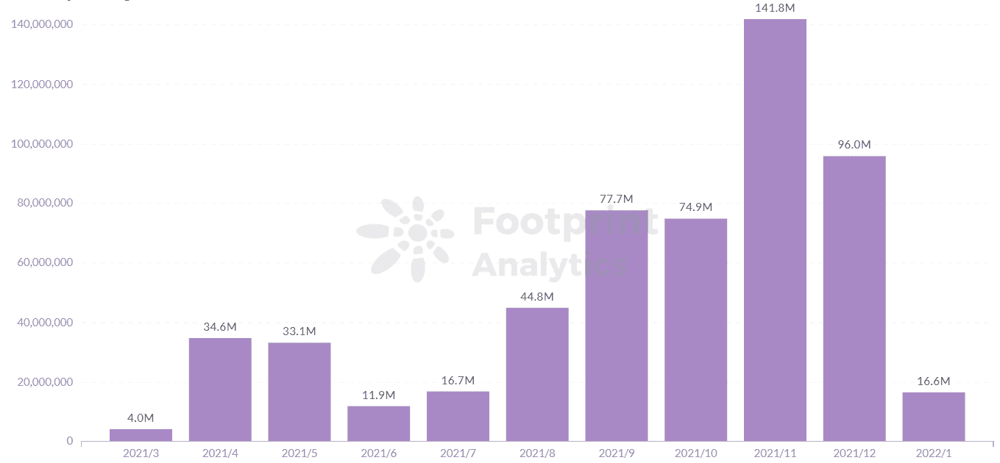
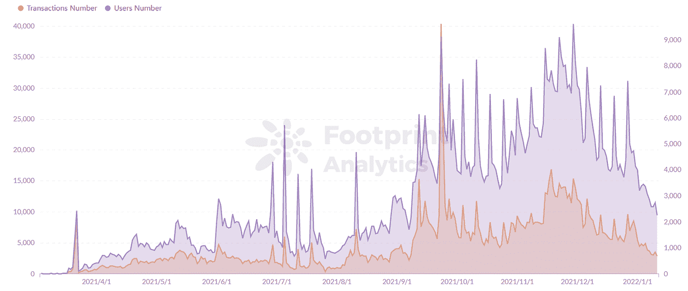
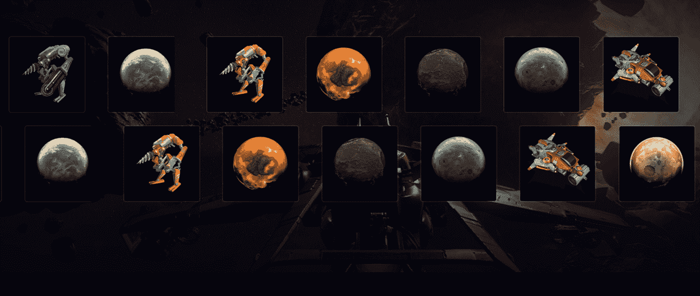
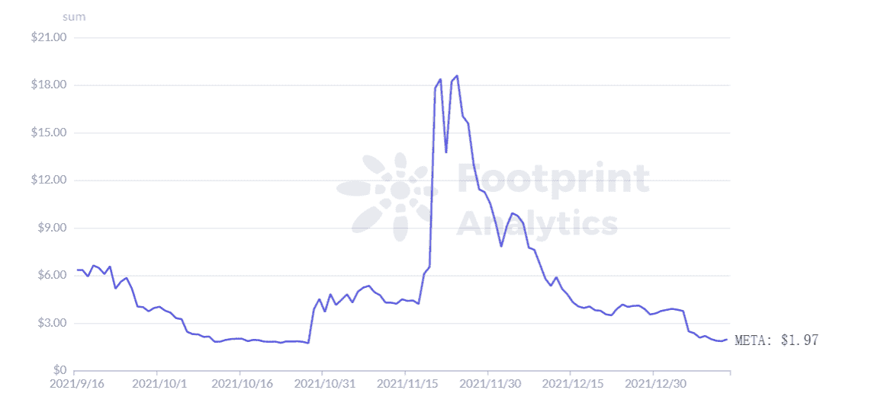

# 元宇宙矿工，第一个星际主题游戏，如何玩赚|足迹分析

> 原文：<https://medium.com/coinmonks/how-metaverse-miner-the-first-interstellar-theme-game-play-to-earn-footprint-analytics-641069a167cf?source=collection_archive---------13----------------------->

元宇宙矿工以一种简单易懂的方式呈现了它在元宇宙的游戏世界，给你虚拟世界中的星球“地主”和“二手地主”的称号。

数据来源:足迹分析— [元宇宙矿工仪表盘](https://www.footprint.network/guest/dashboard/metaverse-miner-dashboard-fp-2464fea6-442e-43ef-b3d6-08006a3acebe?channel=u-QytebM#secret=3387EE3A7D85A20CE22E516C081B78E6)

自 3 月份以来，破解了十大 [GameFi](https://www.footprint.network/guest/dashboard/game-fi-overview-fp-c358ff97-6bf6-491c-b9fd-645fb8262e3f?channel=u-QytebM#secret=1CEF1D4E76499E7E20AD7BE2D827FCD2) 项目数量列表**，**游戏赚钱平台元宇宙矿工现在是区块链上第一个主要的太空主题元宇宙项目，这要归功于游戏性和令牌学**。**

然而，尽管其创新的游戏和新颖的概念，元宇宙矿工看到交易量和其令牌 META 的价格自 11 月份的峰值以来大幅下降。

在这篇文章中，我们将解释元宇宙矿工的独特功能和竞争优势，加上一些缺点，所以你可以评估它在不久的将来的潜力(和在遥远的星系)。

# 元宇宙矿工的数据概述

根据来自 [Footprint Analytics](https://www.footprint.network/guest/dashboard/metaverse-miner-dashboard-fp-2464fea6-442e-43ef-b3d6-08006a3acebe?channel=u-QytebM#secret=3387EE3A7D85A20CE22E516C081B78E6) 的最新数据，就交易量而言，元宇宙矿工目前在 GameFi 项目中排名第五，与 DeFi 王国和 Axie Infinity 存在实质性差距。

*Footprint Analytics — Top 10 Games by Trading Volume*

与 2021 年 3 月首次推出相比，元宇宙矿工的交易量从 2021 年 9 月开始上升，约为 7000 万美元，并在 11 月达到 1.4 亿美元的峰值。这是由于游戏的创新玩法，多种游戏模式的整合来吸引玩家，以及当时的元宇宙热潮。

*Footprint Analytics — Metaverse Miner Monthly Trading Volume*

*Footprint Analytics — Metaverse Miner Transactions Number vs Users Number*

玩元宇宙矿工的 6 种方法

元宇宙矿工生态系统建立在三个资产上:元代币、行星 NFT 和矿工 NFT。有 6 种主要的玩法。

*   成为明星高手

玩家可以通过参与星球的 NFT 拍卖成为星际大师(基本上是星际地主)，并获得整个星球的所有权。一个星主可以享受土地的大部分收益。为了保持这些收益，玩家需要邀请更多的用户参与。

*   成为明星领主

玩家可以不做星际领主，而是参与游戏或者拥有一个矿工 NFT(“矿工”)，用 USDT 从 NFT 星球购买，成为星际领主。一个星主可以开采这个星球并获得可观的收益。

*   采矿时需要“能量值”

能源价值就像采矿所需的电力成本，可以通过 USDT 来收取。

*   通过打桩采集能量的矿工 NFT

玩家可以入股矿工 NFT，以 META 的形式获得“能量”，其中星主拥有 5%，矿工 NFT 拥有 95%。

*   租赁星主的矿以获取收入

玩家可以通过支付租金和拥有使用星主矿山的权利来获得行星 NFT 持有者的一部分收入。

*   成为收藏家

Miner NFTs 有多种形式，并融入了 3D 和 AR 等效果，以满足不同玩家的收藏需求。

*Screenshot Source — Metaverse Miner*

元宇宙矿工的记号组学

元宇宙·迈纳的代币是 META，是游戏中唯一流通的代币。玩家必须使用 META 来竞标和购买星球 NFTs。其他代币，如 stablecoin 和其他游戏代币**、**将用于社区治理。

META 拥有 2100 万代币的供应量(与 [BTC](https://www.footprint.network/guest/dashboard/2021-annual-report-btc-dashboard-fp-18024cee-3939-4a58-a031-251794a6d18a?channel=u-QytebM#secret=C9B6B72CE1DA10660A6CA131B0FFE19F) 的供应量相同)，通过采用多维度燃烧销毁机制，具有很强的通缩属性。

根据 Footprint Analytics 的数据，自游戏推出以来，META 的价格逐渐上涨，直到 11 月 24 日达到 18 美元的峰值。

由于尚未成熟的生态系统，开发成本很高，许多玩家开始出售，导致 META 的价格急剧下降。

*Footprint Analytics — Token Price Trend of META*

摘要

元宇宙矿工是第一个太空主题的 GameFi 项目，近 3 个月来一直是 10 大 GameFi 之一，为玩家构建了一个完整的、相对可玩的元宇宙世界。

与其他游戏(如 Axie Infinity 和[分散地](https://decentraland.org/))相比，《元宇宙矿工》有几个独特的属性:

*   它的令牌 META 设计有一个紧缩机制，不像其他项目需要发行额外的令牌。
*   元宇宙矿商的 NFTs 可以持续获得收益。

**什么是足迹分析**

足迹分析是一个一体化的分析平台，用于可视化区块链数据和发现见解。它清理和整合链上数据，因此任何经验水平的用户都可以快速开始研究令牌，项目和协议。凭借一千多个仪表板模板和一个拖放界面，任何人都可以在几分钟内构建自己的定制图表。发掘区块链数据，利用足迹进行更明智的投资。

*足迹网站:* [*https://www.footprint.network*](https://www.footprint.network/)

*Discord:* [*https://discord.gg/3HYaR6USM7*](https://discord.gg/3HYaR6USM7)

*推特:* [*https://twitter.com/Footprint_DeFi*](https://twitter.com/Footprint_DeFi)

*电报:*[*https://t.me/joinchat/4-ocuURAr2thODFh*](https://t.me/joinchat/4-ocuURAr2thODFh)

*Youtube:* [*https://www.youtube.com/channel/UCKwZbKyuhWveetGhZcNtSTg*](https://www.youtube.com/channel/UCKwZbKyuhWveetGhZcNtSTg)