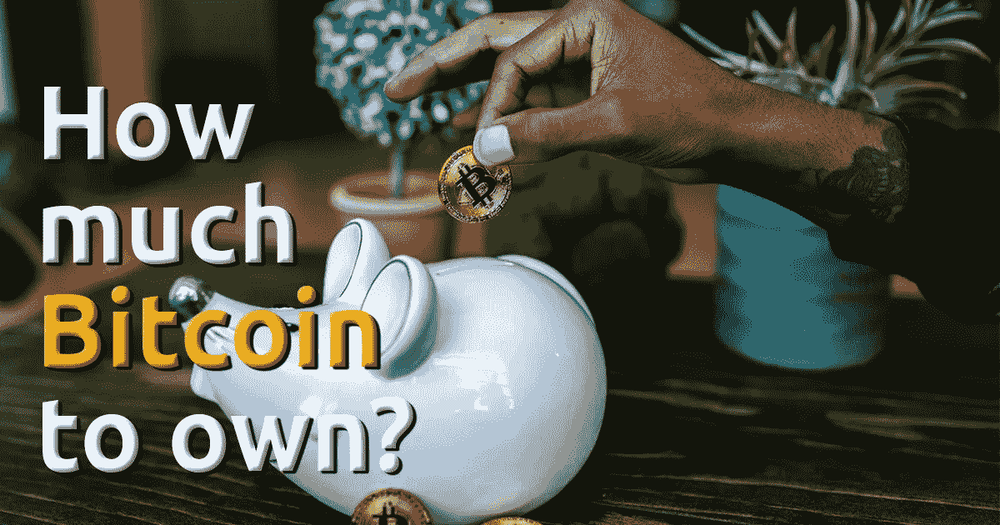
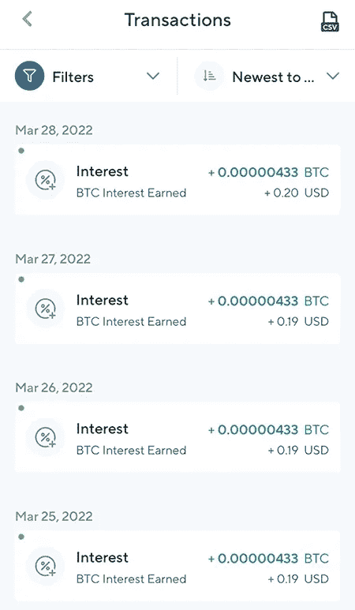
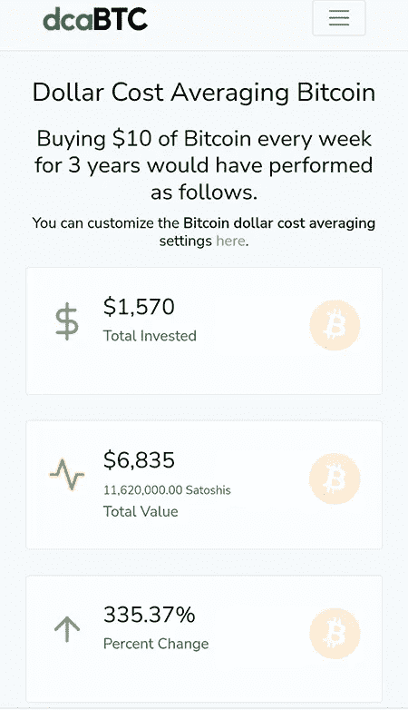

# 应该拥有多少比特币？

> 原文：<https://medium.com/coinmonks/how-much-bitcoin-should-you-own-f40d60beb63f?source=collection_archive---------0----------------------->

当考虑拥有比特币时，许多人似乎认为，为了拥有大量的 sat，他们绝对需要拥有一个或多个比特币。

然后，他们看着比特币的价格，目前是每枚 47，900 美元，感到气馁和沮丧，似乎放弃了所有希望。

这就像，如果他们不能拥有至少一个完整的比特币，游戏就结束了，甚至还没有开始。

但是，我认为，当你进入比特币时，这是一种错误的心态。

让我解释一下为什么我认为是这样。

请考虑以下情况:

永远只会有 2100 万个比特币

1 个比特币有 100，000，000 个 sat，就像 1 美元有 100 美分一样

这意味着只有 2100，000，000，000，000(210 万亿次)的 sat

目前，世界上大约有 79 亿人

让我们假设比特币的最大供应量 2100 万枚硬币(2100 万亿次饱和)已经被开采，并在全球人口中平均分配，这种情况永远不会发生。

2，100，000，000，000，000 sats ÷ 7，900，000，000 人=每人 265，822 sats 或 0.00265822 比特币

正如你所看到的，从上面的简单计算中，这将意味着每个人都将拥有远少于 1 个整比特币，这并不奇怪。

我们已经可以看到，那些认为他们需要一个完整的比特币，否则就不值得为之烦恼的人，严重高估了这个目标的现实程度。

事实上，对于那些已经很富有或者有高薪工作，花的比挣的少得多，并且准备在一整年或更长时间内积极参加 sat 考试的人来说，这还是可以做到的。

事实上，世界上 98%的人不拥有任何数量的比特币，甚至不知道它，这也有助于那些至少知道它并已经开始积累的人。

**堆叠目标**

那么，你应该努力拥有多少比特币呢？

简单的回答是，尽你所能。

我们正处于积累时代，因为大多数人仍然对法定货币体系是多么的破碎和不可修复而不知所措；当前的货币和金融体系是如何濒临崩溃的；以及比特币如何成为我们修复货币的救生艇和最佳解决方案，从而帮助我们修复世界。

但是，拥有尽可能多的东西并不是一个很明确的数字，不是吗？

所以，根据我们之前做的快速计算，我认为你应该努力拥有至少 265，822 个 sat，在我写这篇文章的时候，花费大约 127 美元，比许多人每月花在外出夜游、外卖和他们甚至没有意识到的浪费性支出上的钱要少。

基于这一点，如果所有的比特币都被平均分配，那么今天你需要花费大约 127 美元来确保每个人拥有的比特币数量，而这又是永远不会发生的。

它永远不会发生的原因之一是因为有很多比特币永远“丢失”，这意味着曾经拥有它的人无法获得这些“丢失”的比特币的私钥。根据一些最可靠的估计，2100 万枚比特币中有 400 万枚将永远消失。

这意味着我们之前所做的计算更有可能是这样的:

1，700，000，000，000，000 sats ÷ 7，900，000，000 人=每人 215，189 sats 或 0.00215189 比特币

今天，你可以花 103 美元买到 215，189 个 sat，考虑到在我们的法定货币世界里人们挥霍浪费的天性，这也不是很多。

因此，基于这个新的计算，我们可以更新并稍微降低你应该努力拥有的最低金额。

但是我有一个方法可以帮助你达到最初的目标，不需要做任何额外的事情。

你可以花大约 103 美元购买 215，189 个 sat，并免费获得价值 25 美元的比特币，这将为你带来我们之前谈到的 265，822 个 sat 最低堆叠目标。

为此，您只需使用下面我的推荐链接与 Nexo 签约，在平台上存入 100 美元，完成验证过程，并将这 100 美元在平台上保留 30 天。

 [## 推荐计划-在 BTC * Nexo 注册并赚取 25 美元

### 一位朋友邀请您试用 Nexo。今天就进入加密世界，获得价值 25 美元的比特币！

nexo.io](https://nexo.io/ref/7refumlkxq?src=android-link) 

很明显，您可以存入 103 美元，这样您就可以获得 215，189 的最低累积目标的第一部分，然后，等待 30 天以获得剩余的大约 52，000 sat，这将使您获得大约 267，000 sat。

更好的是，在你等待 30 天获得回报的同时，你的资金将为你赚取利息，每年 4%，每天存入你的账户。

Interest earned on the Bitcoin I hold on Nexo.

因此，在 30 天结束时，你不仅会收到你的注册奖励，而且你会为自己积累更多的 sat。

我不建议你在交易所持有大量比特币，只是为了赚取利息，因为交易所的比特币不是你的，因为你不是控制它的私钥的人，而是交易所。

但是，对于像这样的一小笔钱(100 美元)，考虑到 30 天后，你将基本上获得 25%的投资回报，这不是什么大事。

DISCLAIMER: I get $25 worth of Bitcoin, for every person that signs up with Nexo using my link

我会在一周中的任何一天接受这笔交易，因为这是绝对不需要动脑筋的，但显然你没有义务这么做。

如果你选择接受它，这将是支持我工作的一个很好的方式，而且不会给你带来额外的费用，对此我将非常感激。

**我应该买更多的比特币吗？**

那么，一旦你达到了最低堆叠目标，接下来是什么？

依我拙见，下一个目标是成为 sat 的百万富翁，我认为这是你应该努力成为的唯一一种百万富翁。

为什么？很简单，因为所有的法定货币都趋向于零，所以，在任何法定货币中成为百万富翁有什么意义，如果它们都注定要失败的话？

不要为了成为菲亚特的百万富翁而拼命工作，因为很快，随着未来十年货币贬值的速度，我们都将成为千万富翁和亿万富翁。

然而，问题是，一条面包将花费我们几百万，在这一点上，但我离题了，让我们回到正轨。

今天，要成为 sat 的百万富翁，你只需要 480 美元，考虑到很多人甚至没有 500 美元来应对紧急情况，这可能看起来很多。

但你不必从第一天起就成为一名 sat 百万富翁。

随着时间的推移，你可以通过简单的 DCA(平均美元成本)比特币储蓄计划来实现下一个堆叠目标，这意味着你可以定期购买等量的比特币。

例如，你可以选择购买每周 25 美元/每 2 周 50 美元/每月 100 美元的比特币。

下面是一个明显的例子，说明在过去 3 年里，每周只购买价值 10 美元的比特币会产生什么结果。

你可以去[dcabtc.com](http://dcabtc.com)玩玩这个，看看在过去几年里，根据你可能存的不同数额，你会积累多少比特币。

在你的比特币 DCA 储蓄计划中，如果你有额外的钱，你甚至可以选择 BTFD(购买他妈的 dip)。

这是我积累比特币的首选方法，让堆积 sat 成为一种愉快而简单的体验。

一旦你成为一名 sat 百万富翁，你可以为自己创造新的堆叠目标，如 10M sats、20M sats 等。

然而，你需要做的就是有一个现实的目标。

如果你每个月只能存几百美元，即使你已经削减了浪费性的支出，你也不能指望每个月或每个季度积累几千万的 sat。

在一天结束时，缓慢而稳定的人会赢得比赛，如果你拥有 1000 万个 sat(0.1 比特币)，你会很好，根据我们之前的计算，你应该努力拥有的 sat 的绝对最低数量是 215，189 个 sat(0.00215189 比特币)。

仅供参考，10M sats 比绝对最小叠加目标多 46.47 倍。

所以，谦虚一点，开始积累 sat，以你觉得舒服的速度前进。

**有些严厉的爱**

另一方面，如果你的比特币头寸为零，鉴于法定货币将继续加速贬值的事实，你正在承担巨大的风险，这将使所有人最终意识到法定货币完全一文不值的那一天越来越近。

比特币是对不可避免的法定货币体系崩溃的保险，这种崩溃将会发生。

这是一个时间的问题，而不是如果的问题，而且这个时间每天都在危险地逼近。如果我是你，我不会等到我的房子着火了，才给它买火险。天啊，已经有一吨的烟雾从这个崩溃的货币体系中冒出来了。你可以免费获得很多充满高质量信息的资源，来了解这个话题——正如人们通常所说的，进入比特币兔子洞——你可以按照自己的节奏来做。

不幸的是，大多数人不会购买比特币，所以他们将被迫赚取比特币，因为没有人会再接受法定货币——这是一种无限供应的稀缺资源(即产品、服务、资产)。

我们已经可以瞥见这个世界，俄罗斯要求“不友好的国家”用碎石或黄金支付天然气和石油。

普京在全球舞台上呼吁建立法定货币体系，人们对此表示关注。许多人会对比特币不屑一顾，因为他们读了一些美国消费者新闻与商业频道的头条新闻，看了几个来自 shitcoiners 推广 cRaPtOs 的 YouTube 视频，并听到一些经济学家说比特币是一个骗局。这些人将享受保持贫穷的乐趣，因为无知和傲慢是非常非常昂贵的。

听起来很糟糕，但事实就是如此。

在货币崩溃事件中，我们之前的人口已经失去了他们所有的购买力，这并不美好。

在我看来，如果你不想让这种情况发生在你身上，你需要开始以一种无状态的、不信任的、没有权限的、不受限制的、绝对稀缺的金钱形式储蓄。

对我来说，这种形式的货币就是比特币。

我将以一个事实来结束这一点，即没有足够的比特币，让世界上所有的 5610 万富翁同时拥有一整枚比特币，所以，开始堆积 sat，永远不要把你的比特币卖给他们。

感谢你阅读🧡

> 加入 Coinmonks [电报频道](https://t.me/coincodecap)和 [Youtube 频道](https://www.youtube.com/c/coinmonks/videos)了解加密交易和投资

# 另外，阅读

*   [CoinFLEX 评论](https://coincodecap.com/coinflex-review) | [AEX 交易所评论](https://coincodecap.com/aex-exchange-review) | [UPbit 评论](https://coincodecap.com/upbit-review)
*   [AscendEx 保证金交易](https://coincodecap.com/ascendex-margin-trading) | [Bitfinex 赌注](https://coincodecap.com/bitfinex-staking) | [bitFlyer 评论](https://coincodecap.com/bitflyer-review)
*   [麻雀交换评论](https://coincodecap.com/sparrow-exchange-review) | [纳什交换评论](https://coincodecap.com/nash-exchange-review)
*   [支持卡审核](https://coincodecap.com/uphold-card-review) | [信任钱包 vs 元掩码](https://coincodecap.com/trust-wallet-vs-metamask)
*   [Exness 点评](https://coincodecap.com/exness-review)|[moon xbt Vs bit get Vs Bingbon](https://coincodecap.com/bingbon-vs-bitget-vs-moonxbt)