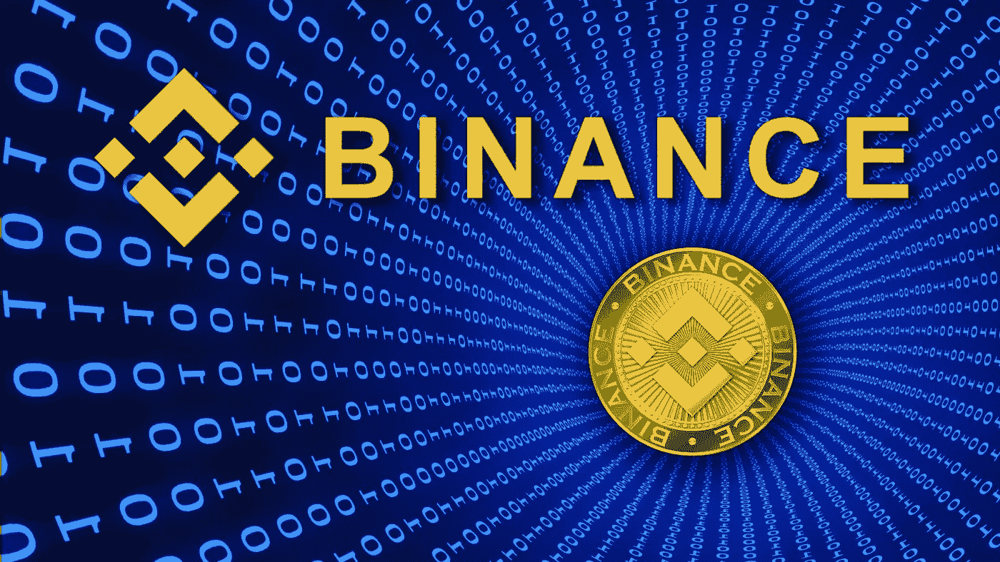

# 币安币(BNB)到 2030 年能做到多少？

> 原文：<https://medium.com/coinmonks/how-much-can-binance-coin-bnb-achieve-by-2030-b221137c59f2?source=collection_archive---------22----------------------->

Source photo [bnb crypto — Bing images](https://www.bing.com/images/search?view=detailV2&ccid=dOEnwdI3&id=B26C4D1400B092D76DC211213472022D31FA6CE4&thid=OIP.dOEnwdI3QXGz6OR24qkzIQHaEK&mediaurl=https%3a%2f%2fopportunites-technos.com%2fwp-content%2fuploads%2f2019%2f05%2fshutterstock_1142927183.jpg&cdnurl=https%3a%2f%2fth.bing.com%2fth%2fid%2fR.74e127c1d2374171b3e8e476e2a93321%3frik%3d5Gz6MS0CcjQhEQ%26pid%3dImgRaw%26r%3d0&exph=1080&expw=1920&q=bnb+crypto&simid=608019012585734136&FORM=IRPRST&ck=20E195F5A8BCE1FBF3FD6BD6726C6C42&selectedIndex=19&ajaxhist=0&ajaxserp=0)

币安币(BNB)价格近日来稳步上涨；在撰写本文时，BNB 的交易价格为 395.00 美元，市场规模约为 665 亿美元。然而，根据最新的 Finder.com 研究，这还远远没有结束。

在年初，Finder.com 询问了 33 位专家对未来几年 BNB 价格演变的分析…