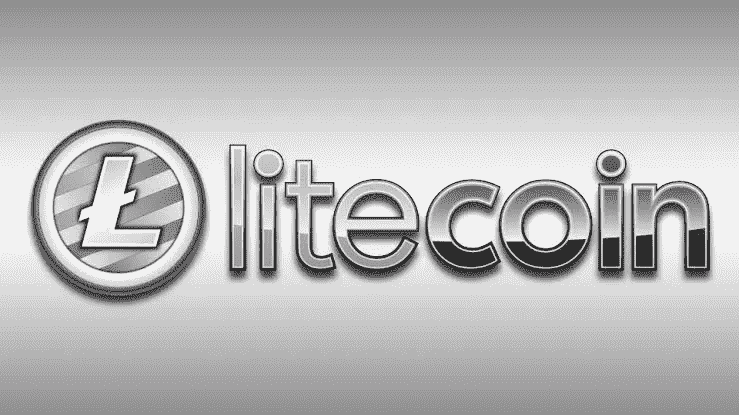
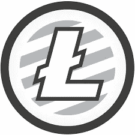

# 1 莱特币在奈拉是多少钱

> 原文：<https://medium.com/coinmonks/how-much-is-1-litecoin-in-naira-9e2d434f67a9?source=collection_archive---------45----------------------->

莱特币(LTC)是由前谷歌工程师查理·李开发的加密货币。查理于 2011 年在比特币区块链的一个分叉上开发了莱特币。莱特币的算法和比特币的算法有很多相似之处，它的目标是作为日常交易的媒介。莱特币的交易处理时间优于比特币。

Litecoin 最初的设计计划是解决开发者对比特币变得过于集中控制的担忧，并通过使用不同的加密过程，使大规模矿工在控制采矿过程中不会占上风。这种设计失败了，因为大型矿商最终获得了莱特币采矿的最大份额——他们调整了自己的硬件和软件，以适应莱特币区块链。Litecoin 最终将其系统重新校准为可开采的硬币和点对点支付系统。

**莱特币最大供应量**

Litecoin 发行了 150 枚预开采的硬币，总供应量为 8400 万枚硬币，截至 2022 年 5 月，其中 70，379，268.78 枚已经在流通。挖掘过程每 2.5 分钟生成一个新块。像大多数加密货币一样，莱特币的供应量被设计成随着时间的推移而减少，使硬币成为稀缺商品，从而保持其价值。

**莱特币减半**

减半指的是当一个块的散列和该块内的交易信息被验证、链接到区块链并且产生一个新的块时，大幅度降低所给予的奖励。减半会减少 50%的莱特币奖励数量，这有助于减缓新硬币的创造。

LTC 的减半日期:

*   八月。25，2015 年:50 至 25 个长期合同
*   八月。5，2019 年:25 至 12.5 LTCs
*   八月。23，2023 年(预期):12.5 至 6.25 长期居住权
*   莱特币哈希算法

**莱特币(LTC)价格历史**

—2011 年至 2013 年间，莱特币的价格从百分之一美元(1/100)涨到了 3 美元。

—2013 年，Litecoin 经历了市场上的第一次重大涨价。价格翻了 15 倍多，达到 50 美元左右。

—2014 年的熊市加上 Mt. Gox 交易所的安全漏洞，莱特币的价格遭受了重大挫折，并在 2015 年的第一个月跌至 1 美元左右。

—莱特币在 2015 年经历了小幅上涨，进入了两年的盘整期，价格稳定在 3 美元左右

— Litecoin 的第二次价格泵始于 2017 年 3 月。从 2017 年 3 月底的 3 美元涨到 2017 年 7 月的 50 美元，2017 年 9 月达到 80 美元。

—莱特币在 2017 年充分利用了加密货币泡沫。当年 11 月至 12 月间，莱特币经历了 2 个月 500%的价格上涨。

—2018 年，整个加密货币市场经历了一次重大崩盘，莱特币也不排除在外，其价格在 2018 年 12 月回落至 25 美元以下。

—2019 年又是一轮牛市，我们看到莱特币的价格在 6 月份攀升至 145 美元，然后在下半年回落至 50 美元。

—从 2019 年到现在，莱特币经历了各种价格波动，其价格在 2021 年 5 月创下历史新高，在最新的加密牛市中，其价格在 2021 年 5 月 9 日达到 386.45 美元。莱特币价格和大多数替代币一样，倾向于模仿比特币价格的变化方向。

莱特币目前的价格是 62.16 美元。

# **奈拉莱特币价格**

Litcoin 的 naira 值取决于您使用的加密交换平台。代表非洲灾难援助反应队；尼日利亚和加纳排名第一的加密交易平台，他们的[硬币计算器](https://dartafrica.io/coincalculator)显示，1 莱特币目前兑换 NGN 35419.80，这是一个实时值，价格往往会随着莱特币的价值变化而变化。使用 [Dart Africa 的硬币计算器](https://dartafrica.io/coincalculator)功能检查当前值。

以下是你应该在 Dart Africa 交易所出售莱特币的一些理由。Dart Africa 不同于你可能遇到的其他交流平台。

*   以最优惠的价格出售。
*   随时即时支付。
*   全天候响应客户服务。
*   用户友好且直观的平台

你可以在谷歌 Play 商店[下载他们的手机应用。](https://play.google.com/store/apps/details?id=com.dartafrica)

你可以在 Dart Africa 上出售你的莱特币。

> 加入 Coinmonks [电报频道](https://t.me/coincodecap)和 [Youtube 频道](https://www.youtube.com/c/coinmonks/videos)了解加密交易和投资

# 另外，阅读

*   [德国最佳加密交易所](https://coincodecap.com/crypto-exchanges-in-germany) | [Arbitrum:第二层解决方案](https://coincodecap.com/arbitrum)
*   [币安交易机器人](/coinmonks/binance-trading-bots-d0d57bb62c4c) | [OKEx 评论](/coinmonks/okex-review-6b369304110f) | [阿塔尼评论](https://coincodecap.com/atani-review)
*   [最佳加密交易信号电报](/coinmonks/best-crypto-signals-telegram-5785cdbc4b2b) | [MoonXBT 评论](/coinmonks/moonxbt-review-6e4ab26d037)
*   [如何在 Bitbns 上购买柴犬(SHIB)币？](https://coincodecap.com/buy-shiba-bitbns) | [买弗洛基](https://coincodecap.com/buy-floki-inu-token)
*   [CoinFLEX 评论](https://coincodecap.com/coinflex-review) | [AEX 交易所评论](https://coincodecap.com/aex-exchange-review) | [UPbit 评论](https://coincodecap.com/upbit-review)
*   [十大最佳加密货币博客](https://coincodecap.com/best-cryptocurrency-blogs) | [YouHodler 评论](https://coincodecap.com/youhodler-review)