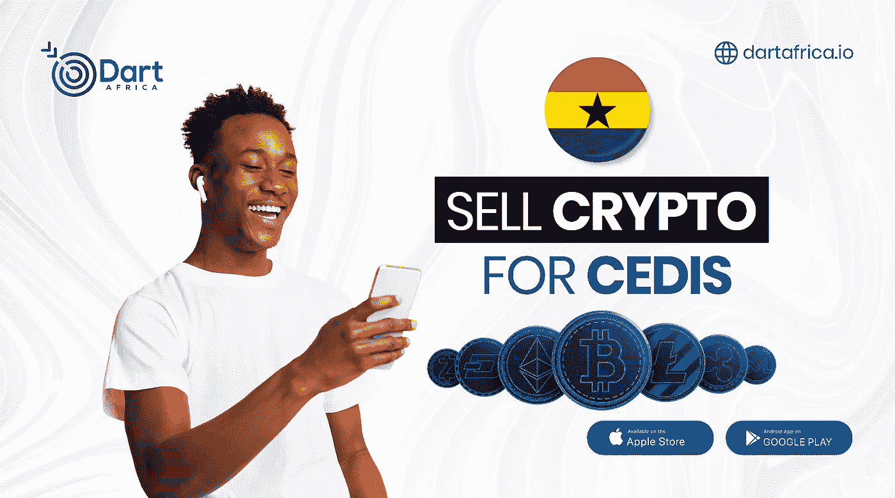

# 500 BTC 兑换多少加纳塞地

> 原文：<https://medium.com/coinmonks/how-much-is-500-btc-in-ghana-cedis-b1675e2dc12c?source=collection_archive---------56----------------------->

如果你熟悉加密货币市场，你会知道加密货币的价格是高度波动的，在加密货币市场中，一天内两个方向的 10%的波动是常见的。使用 Dart Africa(当地加密货币兑换平台)的[汇率计算器](https://dartafrica.io/coincalculator)，加纳塞迪斯 500 美元比特币的现值为**1，440.00 GHS，**汇率为**14.4 GHS/$**。

## **让你大吃一惊的比特币真相**

**购买披萨是第一次用比特币进行的商业交易:【2010 年 5 月 22 日，拉兹洛·汉耶茨花了 1 万 BTC 买了两包棒约翰披萨。当时比特币价值 41 美元，这是第一次有记录的比特币商业购买，现在每年的 5 月 22 日都是通过比特币披萨日来纪念。**

以今天的价格计算，1 万 BTC 价值超过 3 亿美元，这是他们当初走红的真正原因。

**比特币是萨尔瓦多的法定货币**

萨尔瓦多成为了

2021 年 9 月 7 日，第一个接受比特币作为法定货币的国家。萨尔瓦多总统 Nayib Bukele 是做出这一大胆决定的主要力量，尽管公民并不完全支持他的比特币政策。他说，比特币只会加入美元，不会取代美元成为中国的支付媒介。

然而，萨尔瓦多的旅程并不顺利，因为出于环境和透明度方面的考虑，世界银行拒绝帮助该国实施。市民们被承诺，如果他们打开一个国家数字钱包，将获得 30 美元的奖励，但更大比例的市民抗议整个计划。

**约 20%的比特币已经永远丢失**

Chainalysis 的一份报告称，大约 20%的比特币已经丢失或卡在无法访问的钱包中。按照今天的比特币市值，这相当于 1192 亿美元。

除了忘记加密货币私钥或硬件钱包密码的人之外，比特币丢失的比例也很高，因为比特币的创造者中本聪持有 2100 万 BTC 中的 110 万。大家一致认为 Satoshi 不会碰那些硬币。

英国的一个男人。相信他的硬盘包含 7500 BTC(约 2.2 亿美元)在他当地的垃圾场，并试图获得许可在那里搜索多年。

**2140 年将开采出最后一个比特币**

比特币的总供应量只有 2100 万单位。它是嵌入其 DNA(代码)的硬币核心基础的一部分。现在，大约有 1890 万枚地雷已经被开采。

比特币挖掘过程的设计使得每四年可以挖掘的比特币数量减半。这意味着即使 90%的比特币已经在流通，还需要 119 年才能生产出剩余的 210 万枚比特币。

## **Dart Africa:用比特币交易 Cedis 的最佳平台**

Dart Africa 被认为是非洲领先的加密货币交易平台。Dart Africa 研究了加密货币兑换市场的不足之处，如信任问题、低汇率、镇静支付系统等，并建立了一个平台，为这些问题提供了有利的解决方案。

Trade Bitcoin for Cedis

有了 Dart Africa，您可以以加密货币兑换市场上最优惠的汇率兑换您的加密货币。网站上有一个自动的[比率计算器](https://dartafrica.io/coincalculator)，它给出了你想要出售的任何数量的密码的 Naira 和 Cedis 等价物，所有这些都是为了帮助客户的销售体验。

在[达特非洲](https://dartafrica.io/)上卖加密货币相对容易，你需要做的就是；

*   用他们创建一个帐户
*   首次登录时，创建您的 PIN。PIN 可作为您将来授权取款时的签名。
*   保存您账户上的银行信息，以备提款之用。
*   在您的帐户面板上选择您想要出售的加密货币，并输入详细信息。Dart Africa 上的可交易加密货币；比特币、以太坊、莱特币、Dogecoin、USDT、USDC 和 BUSD。
*   将加密硬币发送到系统提供的钱包中。
*   等待付款。应该在发送加密货币后几分钟内。

> 加入 Coinmonks [Telegram group](https://t.me/joinchat/Trz8jaxd6xEsBI4p) 学习加密交易和投资