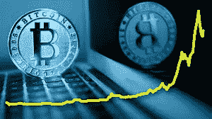
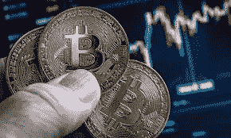

# 5000 美元比特币在尼日利亚是多少钱

> 原文：<https://medium.com/coinmonks/how-much-is-5000-bitcoin-in-nigeria-281dafa326a4?source=collection_archive---------44----------------------->

比特币是一种加密货币，是一种虚拟货币，旨在充当不受任何个人、团体或实体控制的货币和支付形式，因此无需第三方参与金融交易。

**比特币的目的是什么？**

比特币旨在让人们通过互联网进行货币交易。这种数字货币旨在提供一种替代支付系统，这种系统可以在没有任何中央机构控制的情况下运行，但在其他方面可以像传统货币一样使用。

**比特币可以兑换成现金吗？**

是啊！！！就像任何其他资产一样，比特币可以转换成现金。有各种加密货币交换平台，人们可以这样做，但交易也可以通过任何通信平台在两个人之间进行，甚至允许小企业建立一个加密交换平台。比特币没有内置转换成另一种货币的官方机制。

**比特币价格**

如果你熟悉加密货币市场，你会知道价格的波动性是一个流行的常数因素。一天之内 10%的价格变动(向上或向下)在加密市场并不新鲜。这是比特币的众多缺点之一，因为你可以在几天内赚钱或赔钱。然而，有一些价格稳定的加密硬币被称为 Stablecoins，这方面的一个例子是 USDT。

## **比特币有哪些问题？**

对比特币有一些批评，包括采矿系统极其耗能。剑桥大学有一个在线计算器，可以计算挖掘比特币时消耗的能源，在 2021 年初，据计算使用了超过 100 太瓦/小时。从长远来看，2016 年整个英国总共使用了 304 太瓦/小时。

比特币和加密货币整体上也被视为犯罪的门户，批评者暗示这是滋养黑市交易的完美方式。然而，几个世纪以来，现金已经提供了这种功能，比特币的公共账本(区块链)可能是执法的工具。

## **奈拉价值 5000 美元的比特币**

****

**比特币的奈拉值取决于你用于转换的交换平台。根据您使用的加密货币兑换服务，汇率会略有不同。自 2021 年加密货币禁令以来，尼日利亚人一直在使用本地交换服务或 P2P 交换服务来出售他们的比特币。**

**用当地最赚钱的兑换平台 [Dart Africa](http://dartafrica.io) 的汇率来算，5000 美元比特币的现值是**NGN 292.5 万。**该值来自嵌入 Dart Africa 平台的硬币计算器功能。**

****关于** [**镖非洲**](https://dartafrica.io/)**

**Dart Africa 是一个自动化的加密货币交换平台，其服务可通过其网站和移动应用程序访问，他们为您的加密货币提供交换市场上最优惠的汇率之一，并且在将加密货币发送到他们的钱包地址后的几分钟内支付您的加密货币。他们也有一个很好的客户支持系统来帮助你，以防你在尝试访问服务时遇到任何问题。**

****在 Dart Africa 交易的加密货币****

*   **比特币**
*   **以太坊**
*   **道奇硬币**
*   **莱特币**
*   **美元硬币**
*   **USDT 系绳**

**要在 Dart Africa 上出售你的比特币，很简单；**

*   **创建一个帐户，如果您已经有帐户，请登录。请确保通过验证邮件验证您的帐户。**
*   **如果您是新用户，请创建您的帐户 PIN。取款时需要您的密码。**
*   **在“*卖币*界面选择比特币作为您首选的加密货币，并输入您要出售的比特币数量。**
*   **在下一页，系统将为您提供一个钱包地址来发送比特币，您可以通过扫描条形码或手动输入地址来完成此操作。**
*   **发送后，您将在负时间内收到比特币付款。**

****比特币减半****

**比特币奖励每 21 万块减半。例如，2009 年的奖励是 50 个新的比特币。2020 年 5 月 11 日，第三次减半发生，将每个区块发现的奖励降至 6.25 个比特币。即将到来的 2024 年减半将把每块的奖励从 6.25 BTC 减少到 3.125 BTC。**

**从历史上看，减半周期包括事件发生前为期两年的复苏反弹，随后是长达一年的快速上涨和为期 12 个月的熊市**

> **加入 Coinmonks [电报频道](https://t.me/coincodecap)和 [Youtube 频道](https://www.youtube.com/c/coinmonks/videos)了解加密交易和投资**

# **另外，阅读**

*   **[OKEx vs KuCoin](https://coincodecap.com/okex-kucoin) | [摄氏替代品](https://coincodecap.com/celsius-alternatives) | [如何购买 VeChain](https://coincodecap.com/buy-vechain)**
*   **[币安期货交易](https://coincodecap.com/binance-futures-trading)|[3 commas vs Mudrex vs eToro](https://coincodecap.com/mudrex-3commas-etoro)**
*   **[如何购买 Monero](https://coincodecap.com/buy-monero) | [IDEX 评论](https://coincodecap.com/idex-review) | [BitKan 交易机器人](https://coincodecap.com/bitkan-trading-bot)**
*   **[CoinDCX 评论](/coinmonks/coindcx-review-8444db3621a2) | [加密保证金交易交易所](https://coincodecap.com/crypto-margin-trading-exchanges)**
*   **[红狗赌场评论](https://coincodecap.com/red-dog-casino-review) | [Swyftx 评论](https://coincodecap.com/swyftx-review) | [CoinGate 评论](https://coincodecap.com/coingate-review)**
*   **[Bookmap 点评](https://coincodecap.com/bookmap-review-2021-best-trading-software) | [美国 5 大最佳加密交易所](https://coincodecap.com/crypto-exchange-usa)**