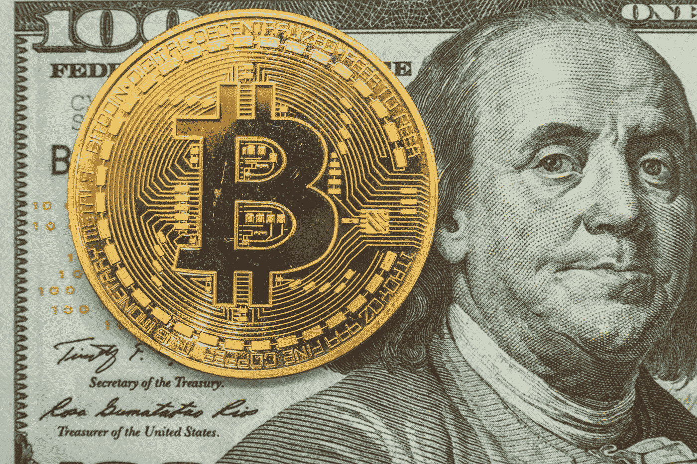

# 一个比特币值多少钱？— $88,095

> 原文：<https://medium.com/coinmonks/how-much-is-a-bitcoin-worth-88-095-8d73d0d3fa4?source=collection_archive---------2----------------------->

## 我对比特币的数学分析显示，它目前被低估了近 3 倍。

Photo by [Bermix Studio](https://unsplash.com/@bermixstudio?utm_source=medium&utm_medium=referral) on [Unsplash](https://unsplash.com?utm_source=medium&utm_medium=referral)

每个认识我的人都知道我多年来一直是区块链怀疑论者。我对胡言乱语过敏。和技术术语。所以我有点讨厌区块链。

对我来说，承认比特币有任何价值都会让我的朋友们趋之若鹜…