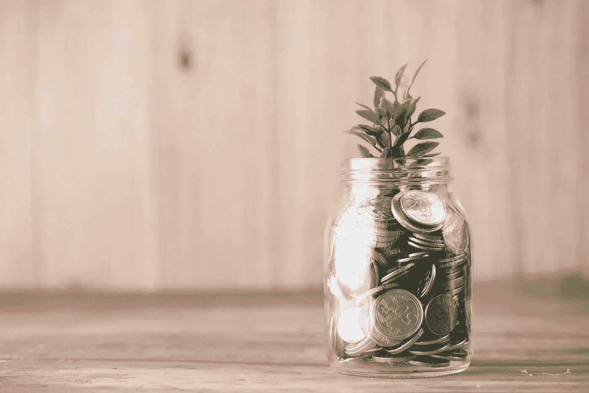
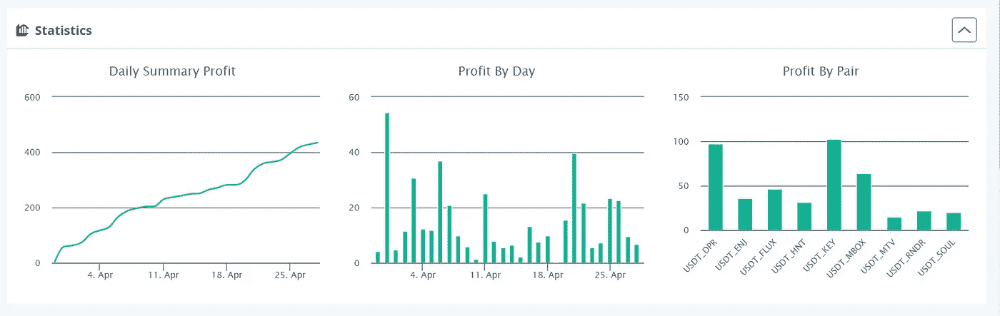
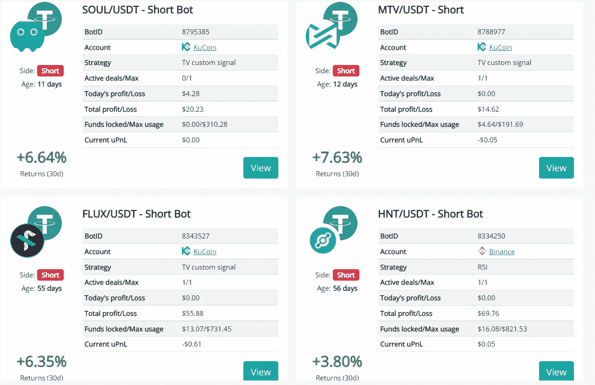
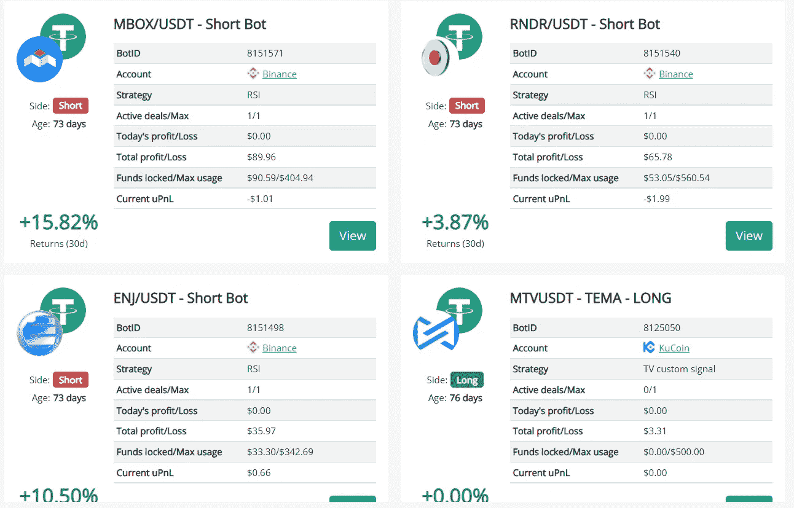
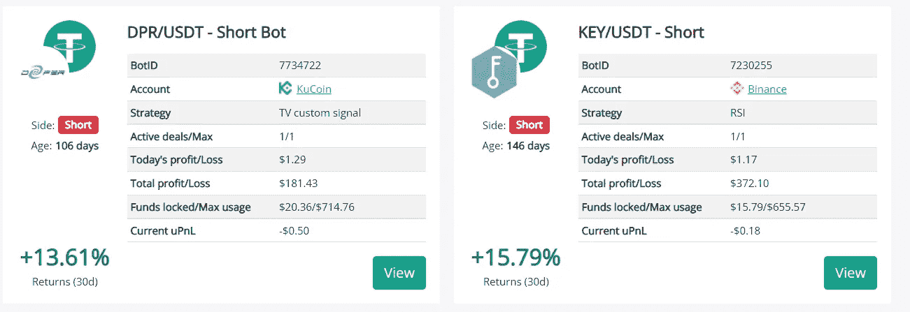
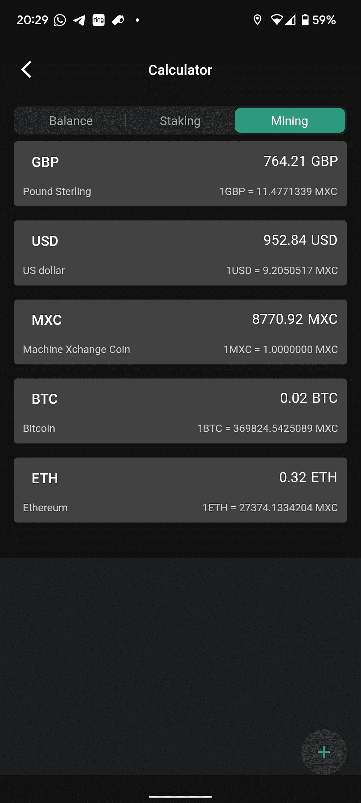
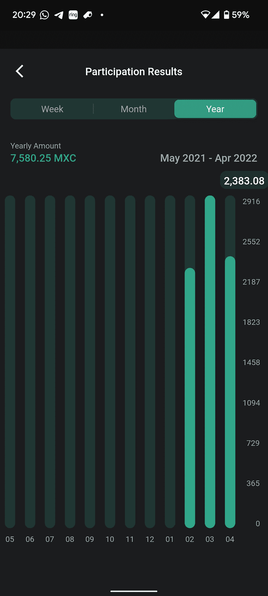
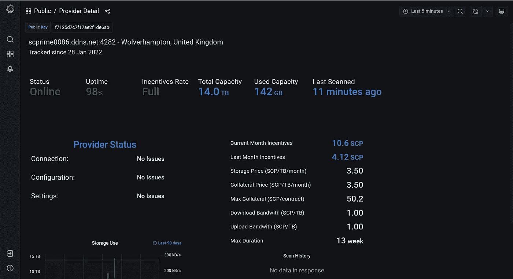
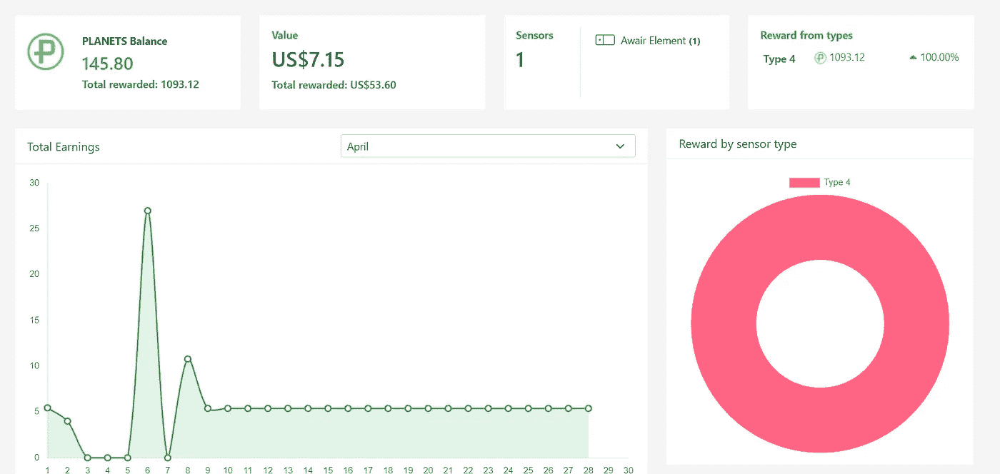

# 在过去的 30 天里，我通过我的加密矿工和 DCA 机器人获得了多少被动收入？

> 原文：<https://medium.com/coinmonks/how-much-passive-income-have-i-made-with-my-crypto-miners-dca-bots-in-the-last-30-days-bcfb4c46a25a?source=collection_archive---------5----------------------->

Photo by [Towfiqu barbhuiya](https://unsplash.com/@towfiqu999999?utm_source=unsplash&utm_medium=referral&utm_content=creditCopyText) on [Unsplash](https://unsplash.com/s/photos/profit?utm_source=unsplash&utm_medium=referral&utm_content=creditCopyText)

对于那些不想阅读细节的人，这里有一些数字…..

TLDR:

**DCA 机器人**

[3 条消息](https://bit.ly/3QIgQ5f):从一个 6100 美元的账户中取出 434 美元

**矿工**

M2 职业矿工(此处为文章):2600 美元的矿工要价 259 美元

**长期投资矿工**

planet watch——550 美元投资中的 7 美元……

sc prime(article[here](https://realisticcrypto.medium.com/scprime-long-term-investment-providing-your-own-storage-c2ab374c754a?source=user_profile---------7----------------------------))—从 700 美元的投资中获得 5.80 美元……

**总计:705.80 美元**

不错，但是让我们深入一些细节…..

**DCA 机器人**

在 2022 年 2 月写的前一篇文章中(你可以在这里找到这个)，我给出了我对 DCA 交易机器人是否真的有效的想法。几个月来，这些仍然继续为我赚取一些不错的回报。

DCA 机器人是平均成本机器人。如果你使用这些做多，他们将从 USDT/BTC 购买特定的加密货币(取决于你的交易),如果价格下降到你的平均购买价格，它将继续购买。你可以选择在 USDT 或你渴望的硬币中获利。

从短期来看，这将出售一些你拥有的加密货币，并随着硬币价格的上涨继续出售更多，目的是平均你的出售价格，并以更低的价格回购加密。你可以选择在 USDT 或做空的硬币中获利。

那么，我赚了多少？在过去的 30 天里，我的 DCA 机器人让我从大约 6，100 美元变成了 434 美元。自从我把它们摆好以后，我就不需要碰它们了。我所做的唯一改变是，我是在 USDT 获利，还是在特定的硬币上获利。有时我想制造一个更大的硬币袋，有时我想在 USDT 获利，用一双新鞋建立一个新机器人。我在这里赚的所有利润都被再投资到其他的机器人上。

我在下面附上了一些来自[3 条消息](https://bit.ly/3QIgQ5f)的截图作为证明！

如果你没有 [3Commas](https://bit.ly/3QIgQ5f) 订阅，你可以使用这个[链接](https://bit.ly/3QIgQ5f)获得 10%的折扣，这些机器人可以在每月 25 美元的高级订阅上设置。

我计划在接下来的几周写一些关于我的机器人配置的文章，所以如果你想看的话，一定要在 Medium 上关注我！

或者，如果你不想等那些文章，你可以通过**在** [**Twitter**](https://twitter.com/MarkRealisticC1) **上关注我，转发&喜欢这篇文章的帖子，然后 DM 我，我会马上与你分享所有这些设置！**

**M2 职业矿工**

如果你没有读过我之前的文章，我强烈建议你读一读。这个东西非常有利可图，但也有一些缺点。你可以在这里找到文章。

我在下面附上了一些截图，以显示我在 4 月份开采了多少 MXC，以及迄今为止这个设备为我赢得了多少。按照目前的价格，这款设备在 4 月份已经获得了 2383 MXC。按每枚硬币 0.109 美元计算，这相当于 259 美元左右。

自 1 月底以来，这个设备已经让我赚了近 1000 美元。这在 3 个月内增长了近 40%……

**SCPrime** (此处[条](https://realisticcrypto.medium.com/scprime-long-term-investment-providing-your-own-storage-c2ab374c754a?source=user_profile---------7----------------------------))**planet watch**

我先用 SCPrime 把这些总结一下。这个月，我的 DIY SCPrime 存储提供商的存储空间需要支付 10.6SCP。这相当于当前价格的 5.80 美元。

这个项目正处于非常早期的阶段，我相信它有巨大的潜力。我打算让这款设备长期赚取 SCP。这是一枚我不会卖掉的硬币。这里有很多令人兴奋的新闻和最新更新！

对于 PlanetWatch 来说，如果你一直在关注这个项目或者你是一架飞机的拥有者，那么过去的几个月是很有趣的。

PlanetWatch 的回报率为 7.15 美元。围绕这个项目的社区最近有很多不确定性，但我仍然认为这个项目从长远来看会做得很好！

这就是这篇文章的全部内容，但下个月的总结将会看到增加 2 个 SenseCap 氦矿工，一些新的 DCA 机器人对&也许是另一个 M2 专业矿工！

**附属链接**

更多优惠还可以在这里找到:[https://linktr.ee/RealisticCrypto](https://linktr.ee/RealisticCrypto)

还有，如果你想请我喝杯咖啡或者啤酒:) :

BTC—BC 1 qaxaq 2 q 9 js 89 gyzhr 0202 sxt 6 hgchprqjga 5 px

基于 ETH、BNB、AVAX、SOL 和 FTM 的令牌—0 x3b 7b 843d 8125 Fe 7 EBA 541 e 1d 751 a4 a 73 f 0 cfad 4c

**免责声明**

这不是财务建议，我不是财务顾问或会计或税务专家。这是我对帮助过我的软件工具的体验，以及我使用它们的经历。

我在本指南中使用了推荐链接。使用这些工具有助于以后的文章，所以如果你觉得这篇文章有用，并且想看看我介绍的工具，请使用它们。我还会叫出你在哪里打折——双赢对吧？

> 加入 Coinmonks [电报频道](https://t.me/coincodecap)和 [Youtube 频道](https://www.youtube.com/c/coinmonks/videos)了解加密交易和投资

# 另外，阅读

*   [10 本关于加密的最佳书籍](https://coincodecap.com/best-crypto-books) | [英国 5 个最佳加密机器人](https://coincodecap.com/uk-trading-bots)
*   [ko only Review](https://coincodecap.com/koinly-review)|[Binaryx Review](https://coincodecap.com/binaryx-review)|[Hodlnaut vs CakeDefi](https://coincodecap.com/hodlnaut-vs-cakedefi-vs-celsius)
*   [MoonXBT vs Bybit vs 币安](https://coincodecap.com/bybit-binance-moonxbt) | [硬件钱包](/coinmonks/hardware-wallets-dfa1211730c6)
*   [火币交易 Bot](https://coincodecap.com/huobi-trading-bot) | [如何购买 ADA](https://coincodecap.com/buy-ada-cardano) | [Geco？一次审查](https://coincodecap.com/geco-one-review)
*   [币安 vs 比特邮票](https://coincodecap.com/binance-vs-bitstamp) | [比特熊猫 vs 比特币基地 vs Coinsbit](https://coincodecap.com/bitpanda-coinbase-coinsbit)
*   [如何购买 Ripple (XRP)](https://coincodecap.com/buy-ripple-india) | [非洲最好的加密交易所](https://coincodecap.com/crypto-exchange-africa)