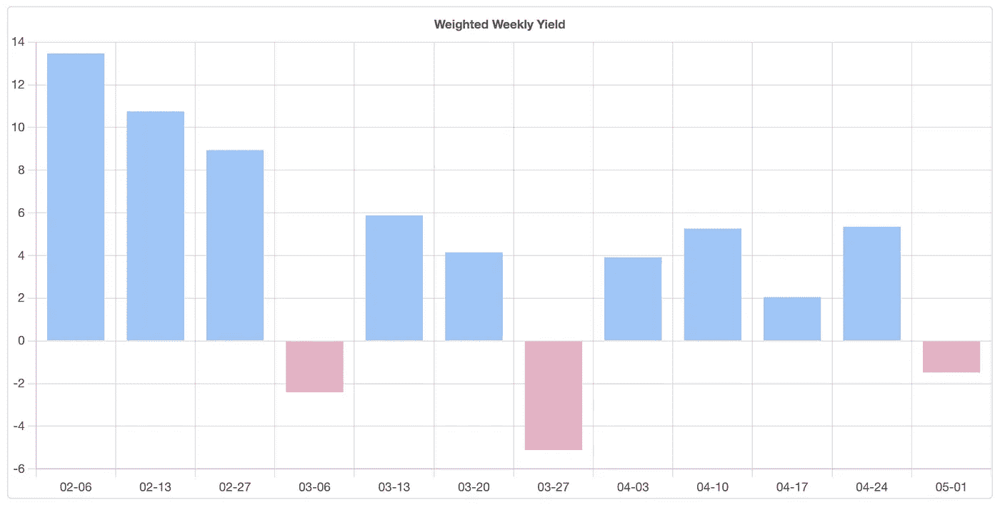

# 我的算法是如何让 228%的 APY 交易波尔卡多特

> 原文：<https://medium.com/coinmonks/how-my-algorithm-is-making-228-apy-trading-polkadot-34e539d31a1f?source=collection_archive---------1----------------------->

在这篇简短的文章中，我将描述我的交易算法是如何通过预测一周内波尔卡多(点/USDT)的价格来杀死它的。继续阅读，你会知道如何获得所有的数据。

正如我在以前的[文章](/coinmonks/i-developed-a-profitable-trading-algorithm-with-proofs-24d08b1c0298)中解释的那样，我开发了一个神经网络来预测加密货币、外汇和股票的价格，目前为止它工作得很好。

这是一个卷积神经网络，考虑了价格行为和 Twitter 情绪(这是由另一个神经网络完成的，我将在后面的文章中解释它是如何开发的)。

我将在这里展示过去 3 个月的结果(你可以从我的[网站](https://slothtrading.com)获得这些数据，在那里可以公布和访问这些数据):

Polkadot weekly yield

结果是平均每周利润为 4.75%。如果这个结果乘以 4(每月 4 周)，然后乘以 12(一年中的所有月份)，那么 APY 回报率为 228.04%，已经考虑了币安期货费用，这还不错。

根据我的神经网络提供的数据进行自动交易非常简单，程序如下:用限价单开仓，用市价平仓。

风险管理策略在[网站](https://slothtrading.com)上有深入的解释，但基本上由一个简单的二元策略组成。如果算法预测 Polkadot 价格上涨，那么我会用 1/168 的资金开一个多头头寸，正好在一周(168 小时)内平仓。如果系统预测价格下跌，就会建立一个空头头寸。

记得查看[slot trading](https://slothtrading.com)的其他价格预测。

在推特上关注我。

考虑给我们一笔[捐款](https://ko-fi.com/slothtrading)来继续这个项目！

> 加入 Coinmonks [电报频道](https://t.me/coincodecap)和 [Youtube 频道](https://www.youtube.com/c/coinmonks/videos)了解加密交易和投资

# 另外，阅读

*   [OKEx vs KuCoin](https://coincodecap.com/okex-kucoin) | [摄氏替代度](https://coincodecap.com/celsius-alternatives) | [如何购买 VeChain](https://coincodecap.com/buy-vechain)
*   [币安期货交易](https://coincodecap.com/binance-futures-trading)|[3 commas vs Mudrex vs eToro](https://coincodecap.com/mudrex-3commas-etoro)
*   [如何购买 Monero](https://coincodecap.com/buy-monero) | [IDEX 评论](https://coincodecap.com/idex-review) | [BitKan 交易机器人](https://coincodecap.com/bitkan-trading-bot)
*   [CoinDCX 评论](/coinmonks/coindcx-review-8444db3621a2) | [加密保证金交易交易所](https://coincodecap.com/crypto-margin-trading-exchanges)
*   [红狗赌场评论](https://coincodecap.com/red-dog-casino-review) | [Swyftx 评论](https://coincodecap.com/swyftx-review) | [CoinGate 评论](https://coincodecap.com/coingate-review)