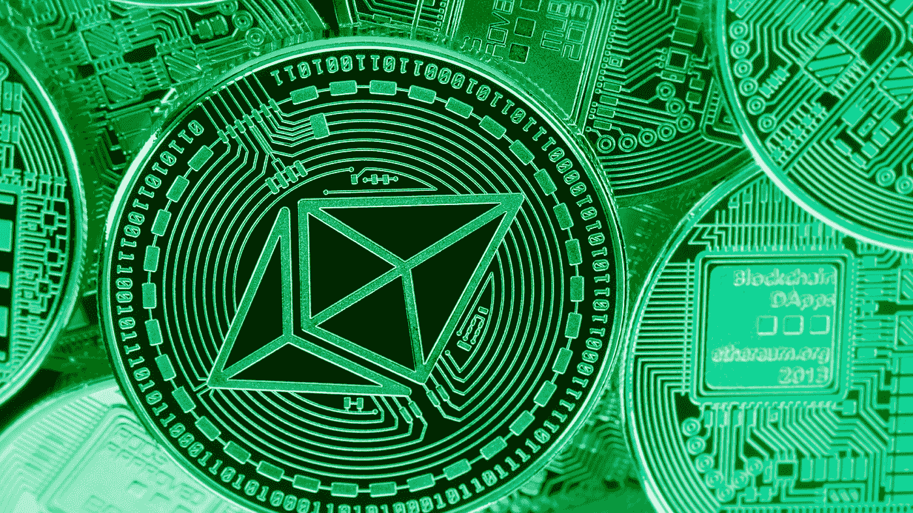
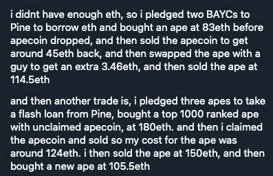

# NFT·德根斯是如何用松木产生大量阿尔法粒子的

> 原文：<https://medium.com/coinmonks/how-nft-degens-are-generating-massive-alpha-using-pine-36ca3c1a542b?source=collection_archive---------13----------------------->

An NFT degen revealed how they made 105.96 $ETH by borrowing against their pledged BAYCs on Pine.

转基因德根斯。在 Pine，我们喜欢将用户的成功故事带到我们的社区。今天，我们将带你经历两个不同的用户旅程，一个叫 degen 的家伙利用他们在 NFT 的地位，用 Pine 赢得了巨大的 alpha。

**首次用户之旅:产生海量 Alpha**

1.  德根人没有足够的$ETH 来启动这项交易，所以他们抵押了他们在 Pine 的两个 Bored Ape Yacht Club(BAYC)NFT，并借了一些$ETH。
2.  然后，他们用借来的$ETH 买了一台 83 $ETH 的 BAYC。(这发生在 Apecoin 空投之前，这意味着德根人可以要求分享空投的 Apecoin)
3.  德根夫妇随后以 45 美元的价格出售了他们声称的硬币。
4.  作为奖励，他们用 BAYC 换了另一个 BAYC + 3.46 $ETH。
5.  最后，他们用 114.5 美元的 ETH 交易了 BAYC，让自己成为了一个巨大的阿尔法。
6.  德根在这次旅程中共创造了 79.96 美元的阿尔法。

**第二次用户之旅:NFT 产品组合扩展**

1.  在同一个德根进行的第二次交易中，他们承诺三个 BAYC 从 Pine Protocol 贷款，以 180 美元 ETH 购买一个 BAYC NFT。这次购买的是排名前 1000 名的 BAYC NFT，附带无人认领的硬币。
2.  接下来，他们索要硬币，并以 56 美元的价格出售。(这将购买 BAYC 的实际成本降低到 124 美元)
3.  后来，德根夫妇以 150 美元的价格卖掉了他们的猿。
4.  最后，他们以 105.5 美元的价格买了一辆新的 BAYC。

在这笔交易中，德根在阿尔法赚了 26 美元，并在他们的 NFT 投资组合中增加了一个新的拜仁慕尼黑。

NFT Trades as shared by a Pine user

**德根 _ 随从 _ 德根**

NFT 市场充满了创造阿尔法的窗口。你所需要的是正确的策略和流动性来执行一个有利可图的交易。我们知道你的大部分流动资金被锁定在你的 JPEGs 中。但是这能阻止你抓住阿尔法吗？

当然不是！

**在** [**松**](https://pine.loans/) **上为您的所有交易解锁即时流动性。以最好的利率和最高的贷款价值比借款。**

**关于松树**

Pine Protocol 是一个未经许可的 NFT 支持的借贷平台。它由 Pine DeFi 协议提供支持，带有专门为 Pine 上的借贷而设计的智能合同。

我们的目标是促进 NFT 所有者的流动性，而不必出售他们的非金融资产。您可以通过在 Pine 平台上承诺您的 NFTs 来获取 crypto。

网址: [https://pine.loans](https://pine.loans)

> 加入 Coinmonks [电报频道](https://t.me/coincodecap)和 [Youtube 频道](https://www.youtube.com/c/coinmonks/videos)了解加密交易和投资

# 另外，阅读

*   [如何匿名购买比特币](https://coincodecap.com/buy-bitcoin-anonymously) | [比特币现金钱包](https://coincodecap.com/bitcoin-cash-wallets)
*   [币安 vs FTX](https://coincodecap.com/binance-vs-ftx) | [最佳(SOL)索拉纳钱包](https://coincodecap.com/solana-wallets)
*   [比诺莫评论](https://coincodecap.com/binomo-review) | [斯多葛派 vs 3Commas vs TradeSanta](https://coincodecap.com/stoic-vs-3commas-vs-tradesanta)
*   [Capital.com 评论](https://coincodecap.com/capital-com-review) | [香港的加密借贷平台](https://coincodecap.com/crypto-lending-hong-kong)
*   如何在 Uniswap 上交换加密？ | [A-Ads 评论](https://coincodecap.com/a-ads-review)