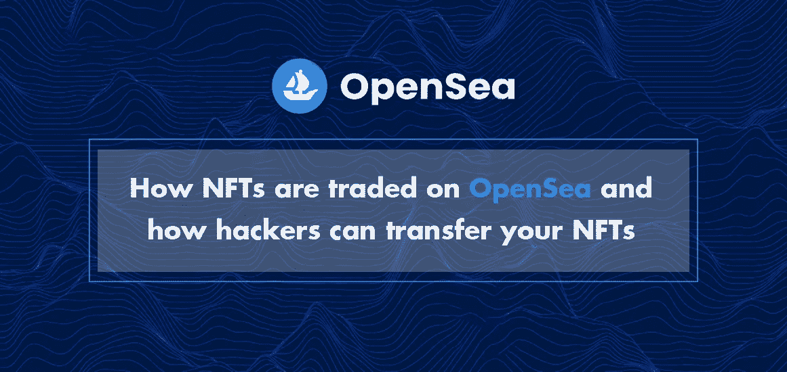
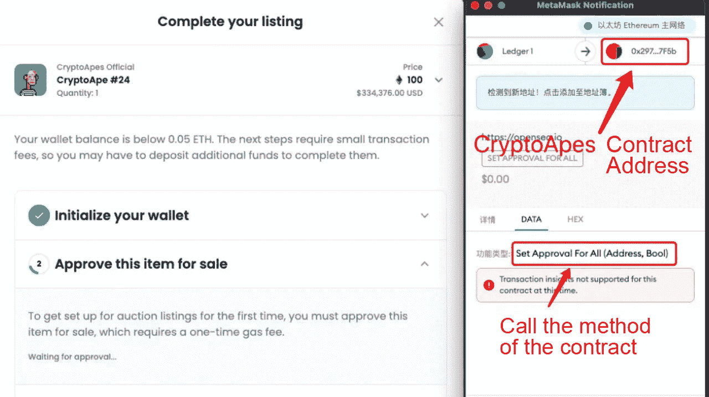
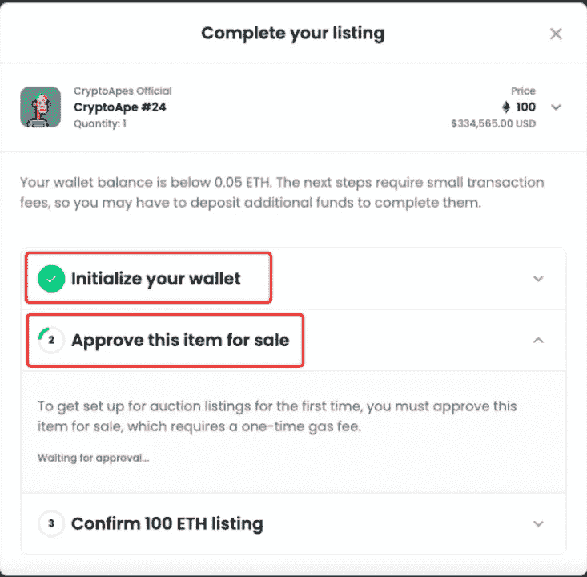
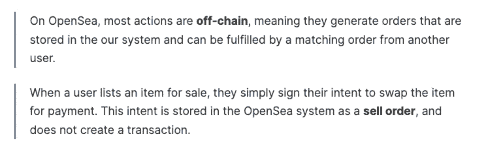
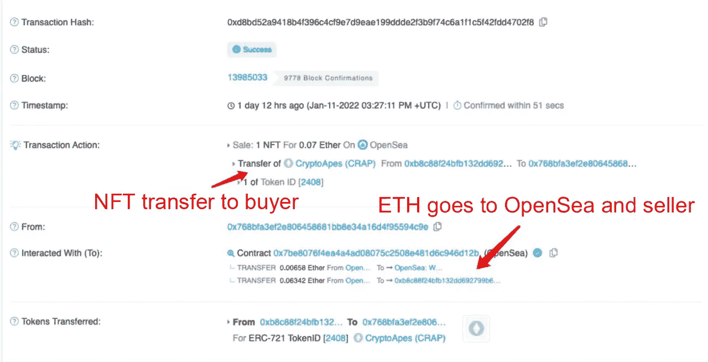
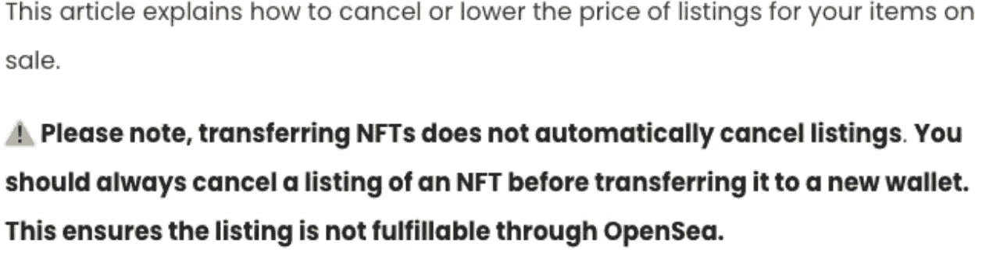
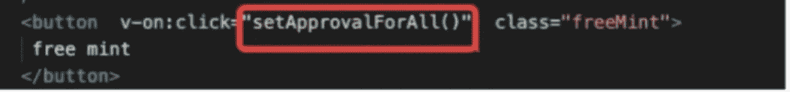

# NFT 如何在 OpenSea 上交易，黑客如何转移你的 NFT

> 原文：<https://medium.com/coinmonks/how-nfts-are-traded-on-opensea-and-how-hackers-can-transfer-your-nfts-c491455087?source=collection_archive---------3----------------------->

**NFT 的合同(ERC721)和 NFT 如何在 OpenSea 上实现交易**

## 0x01 NFT 和 ERC721

对于 **NFT** ，其实是以太坊协会定义的规格，也就是 **ERC721** 。其功能与可替换令牌的 **ERC20** 规范相同。通过该规范，接口被统一，从而可以导出各种类型的令牌或 NFT。DAPP 生态，如各种互换、借贷等**DAPP**。

NFT 的 ERC721 规格源自 ERC20。类似的方法还有很多。以下规范方法如下:

**(业主)的余额— —查询 NFT 某业主拥有的数量**

****ownerOf** (tokenId) — —查询某个 NFT 号码属于哪个人，比如查询某个 ape 号码属于哪个主人**

****名称** () — —返回 NFT 的名称**

****符号** () — —返回 NFT 的符号**

****总供给**()——NFT 总发行**

****token uri**(token id)———返回某个 NFT 的 URI，这个 URI 就是这个 NFT 的所有描述信息**

****token by index**(index)———根据索引号返回 NFT 的数量**

****批准** (to，tokenId)———允许 ***到*** 该地址可以转移他的 token id 号的 NFT(你的 NFT 证券)**

****get approved**(tokenId)———查询 token id 号的 NFT 授权给谁(查询谁可以转让你的 NFT！)**

****setApprovalForAll** (操作员，已批准)— —授权或取消授权操作员的地址，以转移您收藏的所有非功能性文件**

****is approved for all**(owner，operator)———查询某个地址是否可以传输您收藏的所有非功能性文件**

****transferFrom** (from，to，tokenId) — —将*的 *tokenID* 号的 NFT 从*地址转移到*到*地址(需要授权)**

**NFT 的所有密钥信息都存储在链接 **tokenURI** 中。这个环节的数据包括你的 NFT 的**号**、**属性**、**图片**或者**视频，所以 tokenURI 的外链数据能否正常访问，是否会被篡改非常重要。。 **IPFS** 协议可以保证它不会被篡改。但如果是 HTTP 协议，就有可能被篡改。虽然可以用 HTTP 协议通过**校验和**来验证数据，但这并不优雅，也不是 ERC721 的协议规范。****

**其实 OpenSea 支持所有 ERC721 NFTs 的信息展示，就是通过上面的方法抓取链条上的数据，在 OpenSea 自己的系统中建立所有的资源信息，最后以 Web 的形式展示给大家，方便大家浏览。**

## **0x02 提高警惕的一些方法**

**ERC721 规范中有两种方法需要警惕。如果你不小心，你可能会失去你的 NFT。**

*   **“approve(to，tokenId)”，此方法是授权“ *to* ”地址有权转让您的“token id”NFT。如果在**元掩码**中授权**钓鱼网站**调用此方法，最多会损失一个 NFT。**
*   **“setApprovalForAll(operator，approved)”，这个方法是授权“ *operator* 地址来转移您在这个*集合*下的所有 NFTs。如果您授权钓鱼网站在**元掩码**中调用此方法，您可能会丢失此集合下的所有 NFT。(在 OpenSea 中，如果我们“出售”一个 NFT，**元掩码**会弹出该方法的授权，见下图截图。)**

****

**当你授权**元掩码**的时候，一定要注意安全。当你看到 **approve** 或 **setApprovalForAll** 方法时，一定要注意是不是正规网站，合同地址是不是正确的地址。如果您不小心授权错了，您的 NFT 可能会被转移。**

## **0x 03 OpenSea 买卖流程背后的逻辑和底层逻辑**

**下图是你卖 NFT 时弹出窗口的截图:**

****

**在 OpenSea 上执行卖出操作时，会弹出一个窗口让你先初始化钱包(这是一次性操作)，你付完油费后，OpenSea 的 [Registry](https://etherscan.io/address/0xa5409ec958c83c3f309868babaca7c86dcb077c1) 契约会为你创建一个钱包契约(其实是代理契约)。为什么需要创建此合同？主要目的是安全。因为在第二步“**批准此物品出售**”中，您需要授权一个合同地址来转让您的 NFT( **setApprovalForAll****

****也就是说，OpenSea 不能直接转让你的 NFT。只有您首次在 OpenSea 上创建的钱包地址可以转移。****

**创建钱包并授权 NFT 后，如果您要在同一系列下出售 NFT，则无需支付额外的手续费。OpenSea 只能验证您的签名才能下单。标榜**“无气上市”**。**

> **问题:为什么后续挂单只需要签名，不需要成交？OpenSea 的卖单信息只存储在自己的集中式服务器上，不在链上？**
> 
> **回答:可以，卖单信息只存储在 OpenSea 的集中服务器上，不在链上。具体可以参考这里 OpenSea 的解释。**

****

## **购买 NFTs 背后的 0x04**

**当你在 OpenSea 买入时，买卖的匹配实际上发生在 OpenSea 的集中系统中。匹配订单后，让用户调用 OpenSea 交易合约地址的 **AtomicMatch** 方法完成交易。您的交易信息将被存储在链上，这涉及到令牌和 NFT 的转移。**

**你只需要知道，在这个买入交易成功的背后，会完成这两个步骤:**

****

## **0x05 如何在 OpenSea 官网取消订单**

****取消列表****

**若要取消刊登，请按一下物品页面右上方的取消刊登。将出现一个确认屏幕，要求您确认取消。请注意，取消刊登需要支付汽油费，才能让其他使用者看不到物品。**

****

**用户 A 以 10ETH 的价格出售他的 NFT，但是当时该价格还没有被交易。此时，用户 A 直接将 NFT 转移到另一个钱包地址(为了安全起见，可能转移到一个冷钱包)，而不取消卖出订单。**

**过了几个月，发现市场价不错，就把 NFT 转回之前的钱包地址，准备卖单，但是当转账成功后，发现 NFT 是按照之前的卖单价格(第 10 次)卖出的。目前市场价可能是 80ETH，亏损严重。**

**之所以能以 10ETH 的卖单价格卖出，是因为之前的卖单信息受到了某人的诱惑，所以在转回 NFT 的时候，立刻以 10ETH 的低价购入。**

## **0x06 黑客如何攻击 Opensea**

1.  **黑客首先了解到，OpenSea 需要用户迁移自己的卖单，OpenSea 官方提前发来了邮件，上面有迁移日期和操作步骤。**
2.  **黑客事先准备了一个**钓鱼网站**，通过假邮件通知用户进行迁移操作，引导受害用户在钓鱼网站上进行卖单迁移操作。这个迁移操作是让用户在自己卖出的卖单上签字，但是签字的卖单价格是 0。**
3.  **黑客获取用户签名的卖单信息，通过调用 OpenSea 的交易合约，可以以 0 的价格完成交易，成功获取受害者的 NFT。**
4.  **黑客可以通过钓鱼的方式窃取 NFT，获取用户报价为 0 的卖单信息(“ **sell** ”)和签名(“ **sellSig** ”)。**

## **0x07 钓鱼网站如何转移您的 NFT**

**4 月 1 日愚人节，NFT 圈最大的新闻是著名歌手周杰伦所持有的 BAYC#3738 被盗，NFT 按现价价值 320 万。被盗的方式是通过走钓鱼网站诱导用户造币。BAYC 的不和谐被黑，导致钓鱼网站泛滥，除了 Doodles 的不和谐在 BAYC 当天也被黑。**

**在以太扫描中，你可以看到周杰伦在混乱中对所有操作进行了一堆 set 审批，然后被一个安全的转移从 operation 转移到了另一个地址。**

**任何人都可以模拟类似 BAYC 的钓鱼网站。用户钱包登录后，页面上有一个按钮叫做**免费造币**。实际上，用户点击该按钮后，所有的**设置审批被执行。转移您的任何非功能性测试。****

****

**然后定义函数，调用 BAYC 契约中的 **setApprovalForAll** 接口，传入两个参数，你的**自己的地址**和**真**，也就是说如果周杰伦点击按钮同意执行，授权给你的地址就可以把他的 NFT 转走。**

**然后点击网站上的**自由造币**按钮，可以看到小 **MetaMask** 弹出一个交易请求，交易方式为全部设置审批。这时，如果我点击确定，就意味着我的 NFT 可以被别人转让了。**

## **0x08 安全警告**

**所有邮件中的发件人都是可以伪造的，而且伪造起来非常方便，所以你无法通过邮件的发件人来判断是否是官方邮件。另外，点击邮件中的链接后，一定要注意:**

*   **浏览器显示的地址是否是你要访问的网站地址(注意不要有拼写错误)**
*   **浏览器显示的链接不是 HTTPS 链接。如果不是 HTTPS 链接，浏览器地址栏会显示“不安全链接”。此时不要访问。**
*   **在 MetaMask 上授权 **Approve** 和 **SetApprovalForAll** 等交易时，需要特别注意查看当前网站和授权对象是否有问题。因为一旦授权，这个地址就有权利转让你的 NFT。**
*   **当你在 OpenSea 上签卖单时，注意 MetaMask 上弹出的要求你签字的内容，看看价格是不是你想要的卖价。**

**参考:**

** [## 我如何取消或降低 NFT 刊登物品的价格？

### 这篇文章解释了如何取消或降低物品的价格。⚠️转让 NFTs 确实…

support.opensea.io](https://support.opensea.io/hc/en-us/articles/4410153816723-How-can-I-cancel-or-lower-the-price-of-NFT-listings-)  [## 术语

### 在 OpenSea 上，大多数操作是离线的，这意味着它们生成的订单存储在我们的系统中，并且可以…

docs.opensea.io](https://docs.opensea.io/reference/terminology) 

> 加入 Coinmonks [电报频道](https://t.me/coincodecap)和 [Youtube 频道](https://www.youtube.com/c/coinmonks/videos)了解加密交易和投资

# 另外，阅读

*   [分散交易所](https://coincodecap.com/what-are-decentralized-exchanges) | [比特 FIP](https://coincodecap.com/bitbns-fip) | [宾邦评论](https://coincodecap.com/bingbon-review)
*   [用信用卡购买密码的 10 个最佳地点](https://coincodecap.com/buy-crypto-with-credit-card)
*   [加拿大最佳加密交易机器人](https://coincodecap.com/5-best-crypto-trading-bots-in-canada) | [Bybit vs 币安](https://coincodecap.com/bybit-binance-moonxbt)
*   [阿联酋五大最佳加密交易所](https://coincodecap.com/best-crypto-exchanges-in-uae) | [SimpleSwap 评论](https://coincodecap.com/simpleswap-review)
*   购买 Dogecoin 的 7 种最佳方式 | [ZebPay 评论](https://coincodecap.com/zebpay-review)
*   [最佳期货交易信号](https://coincodecap.com/futures-trading-signals) | [流动性交易回顾](https://coincodecap.com/liquid-exchange-review)**