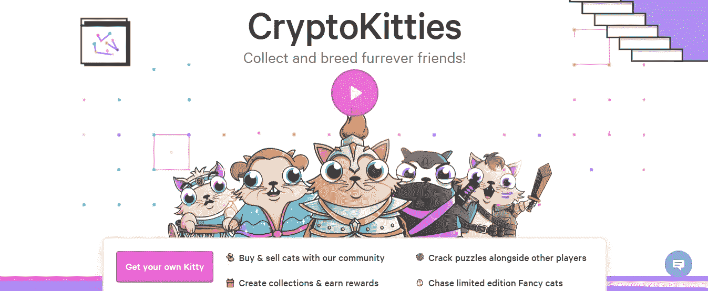
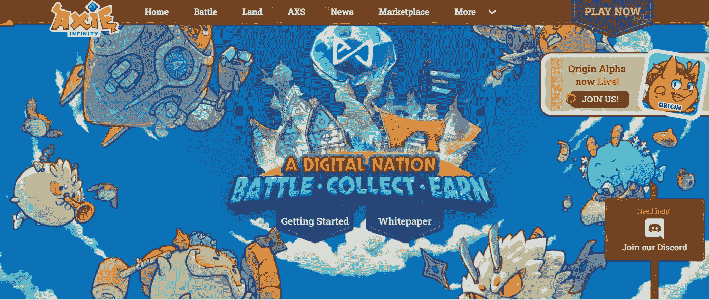

# NFT 如何引领一个新的娱乐时代

> 原文：<https://medium.com/coinmonks/how-nfts-are-ushering-in-a-new-era-of-entertainment-1edd45f03649?source=collection_archive---------23----------------------->

Source: [Unsplash](https://images.unsplash.com/photo-1646950887163-25b5bff58eed?ixlib=rb-1.2.1&ixid=MnwxMjA3fDB8MHxzZWFyY2h8M3x8bmZ0JTIwZ2FtZXxlbnwwfHwwfHw%3D&auto=format&fit=crop&w=500&q=60)

众所周知，娱乐产业正处于不断变化之中。随着新技术的出现，观众比以往任何时候都更加投入。

最令人兴奋的领域之一是 NFT 如何被用来创造新的娱乐形式。

从音乐到游戏，NFT 正在改变我们与媒体互动和体验媒体的方式。在这篇文章中，我将探索 NFT 被用来改变娱乐业的一些方式。

别走开——这将是一次激动人心的旅程！

# 什么是 NFT，它们是如何工作的？

NFT，即[不可替代令牌](https://www.theverge.com/22310188/nft-explainer-what-is-blockchain-crypto-art-faq)，是独一无二的数字资产，不可复制。NFT 存储在一个区块链上——一个记录交易的分散分类账——代表从艺术品到游戏中物品的任何东西。

关于 NFT 最令人兴奋的事情之一是它们为娱乐开辟了新的可能性。

NFTs 可用于创建数字收藏品或集成到游戏和其他形式的媒体中。这使得 NFTs 成为吸引粉丝和创造新体验的强大工具。

Screenshot from cryptokitties’ website.

这方面的一个例子是游戏 [CryptoKitties。在 CryptoKitties 中，玩家可以购买存放在以太坊区块链上的数码猫。这些猫可以交易或出售，每一只都是独一无二的。](https://www.cryptokitties.co/)

CryptoKitties 是最早使用 NFTs 的游戏之一，它是一个很好的例子，说明了 NFTs 如何被用来创造新的娱乐形式。

# NFTs 给娱乐业带来的好处

娱乐业是 NFTs 的主要受益者之一。NFT 有可能彻底改变娱乐的创作、分享和消费方式。

NFTs 可用于创建代表现实世界对象的数字资产。这为在虚拟现实和元宇宙平台中创建沉浸式体验开辟了新的可能性。

NFTs 还可以用来创建基于 NFT 的游戏，这些游戏可以在任何支持该技术的平台上运行。

例如，NFTs 可以为易于转让和销售的活动创建数字门票。这将有助于减少[倒票](https://en.wikipedia.org/wiki/Ticket_resale)，让粉丝们更容易到场。

此外，他们还可以创建像传统收藏品一样可以交易和出售的数字收藏品。

# NFT 如何改变我们体验娱乐的方式

从 gif 到视频、音乐、歌曲、游戏和体育，NFT 已经进入了娱乐业的几乎每一个方面。NFT 正在从几个方面改变我们体验娱乐的方式。

Open Sea: Considered the largest NFT marketplace.

你可以在 NFT 市场上找到一些多媒体产品。虽然[这些市场](https://hackernoon.com/5-most-popular-nft-marketplaces-to-buy-and-sell-nfts?source=rss)目前不支持整部(或长)电影，但动画(如动画 gif)被制作成 NFT。

一场互动的[虚拟体验发生在](https://www.youtube.com/watch?v=sdG0GK8iu6M)2021 年 11 月 19 日，加拿大著名音乐人贾斯汀·贝伯在虚拟音乐平台 [Wave](https://wavexr.com/) 上举办了一场 30 分钟的演唱会。

其他音乐家，如阿姆、史努比狗、杰·鲁和酱爆弟弟，也创造性地和革命性地使用了非功能性翻译。

依赖演出的独立音乐人现在将 NFTs 作为一种可行的选择，来推广、分发和销售他们音乐音频和内容的专有权。著名乐队和 DJ 也不落下。

值得注意的是，2021 年 5 月，独立艺术家创造了超过 57%的 NFT 音乐相关销售额。换句话说，他们不再受大唱片公司的束缚，可能会直接向他们的追随者推销他们的歌曲。

# NFT 如何应用于游戏行业的例子

有了 NFTs，我们看待游戏和与游戏互动的方式与过去相比发生了巨大的变化。虚拟物品被赋予了全新的真实感，允许游戏玩家购买代币来改变他们游戏角色(又名皮肤)的视觉外观。

此外，游戏玩家可以使用代币来获得独特的技能集，这些技能集可以帮助他们在游戏中前进，或者甚至可以在游戏中获得以前无法获得的玩家体验(即复活节彩蛋)。

《被解放的上帝》、《外星世界》、《R-Planet》、《Cometh》、《我的邻居》和《Axie Infinity》是目前市场上出售的几款基于 NFT 的游戏。

Screenshot from Axie Infinity’s website

[Axie Infinity](https://hackernoon.com/a-guide-on-staking-the-axie-infinity-sidechain) 因其独特的即玩即赚(P2E)功能，在许多发展中国家很常见，如菲律宾、泰国、加纳和尼日利亚。

顾名思义，“*即玩即赚*”(P2E)指的是一种游戏策略，玩家在完成特定活动或里程碑后可以获得游戏内货币作为奖励。

像任何其他[类型的加密货币](https://hackernoon.com/lets-better-understand-the-different-types-of-cryptocurrency-and-tokens)一样，这些游戏中的代币可以兑换各种现实世界的货币，并用于在互联网上购买产品。游戏玩家现在通过做他们喜欢的事情——玩游戏——赚取可观的收入。

# NFTs 和娱乐业的未来

NFTs 的概念对一些人来说是新的。许多人仍然认为 NFTs、GameFi、元宇宙和加密货币不会持续太久，但重要的是要记住技术仍处于早期阶段。

不管人们头脑中可能存在什么样的概念，创造更多真实的 NFT 用例、更多地采用加密货币以及简化用户体验将有助于未来采用 NFT。

我们已经看到了 NFT 在娱乐业中的一瞥。想象一下，随着越来越多的开发人员开始尝试这种令人惊叹的技术，我们还可以用它们做更多的事情！

我们可以看到游戏、音乐和其他形式的娱乐作为非功能性交易的未来。这将彻底改变我们今天所知的行业。

不难想象一个世界，人们可以在去中心化的应用程序上将自己喜欢的歌曲、游戏或电影作为代币进行交易。在这样一个世界里，权力将掌握在内容创作者而非中介手中。

最终，它将为艺术家和内容创作者打开一个全新的可能性世界，他们将直接与粉丝联系，并从他们的工作中获得公平的报酬。

# 关于 NFTs 和娱乐产业的最后思考

娱乐业一直处于采用新技术的最前沿。NFTs 是进入娱乐领域的最新技术，它们将彻底改变这个行业。

NFT 已经开始改变我们创造、分享和消费娱乐的方式。在未来，NFTs 将被更广泛地采用，并将对娱乐业产生更大的影响。

此外，NFTs 将以我们无法想象的方式改变我们体验娱乐的方式。NFTs 的未来看起来非常令人兴奋，可能性是无穷的。

PS:本文最初发布于 [Hackernoon](https://hackernoon.com/new-forms-of-entertainment-how-nfts-are-changing-the-industry) 。如果你喜欢这篇文章，记得鼓掌并跟随作者的媒介帐户。你也可以在 [Linkedin](https://www.linkedin.com/in/freelance-writer-saheed/) 或 [Twitter](https://twitter.com/soa_salami) 上关注他。另一边见！

> 加入 Coinmonks [电报频道](https://t.me/coincodecap)和 [Youtube 频道](https://www.youtube.com/c/coinmonks/videos)了解加密交易和投资

# 另外，阅读

*   [Bookmap 点评](https://coincodecap.com/bookmap-review-2021-best-trading-software) | [美国 5 大最佳加密交易所](https://coincodecap.com/crypto-exchange-usa)
*   最佳加密[硬件钱包](/coinmonks/hardware-wallets-dfa1211730c6) | [Bitbns 评论](/coinmonks/bitbns-review-38256a07e161)
*   [新加坡十大最佳加密交易所](https://coincodecap.com/crypto-exchange-in-singapore) | [购买 AXS](https://coincodecap.com/buy-axs-token)
*   [红狗赌场评论](https://coincodecap.com/red-dog-casino-review) | [Swyftx 评论](https://coincodecap.com/swyftx-review) | [CoinGate 评论](https://coincodecap.com/coingate-review)
*   [投资印度的最佳密码](https://coincodecap.com/best-crypto-to-invest-in-india-in-2021)|[WazirX P2P](https://coincodecap.com/wazirx-p2p)|[Hi Dollar Review](https://coincodecap.com/hi-dollar-review)