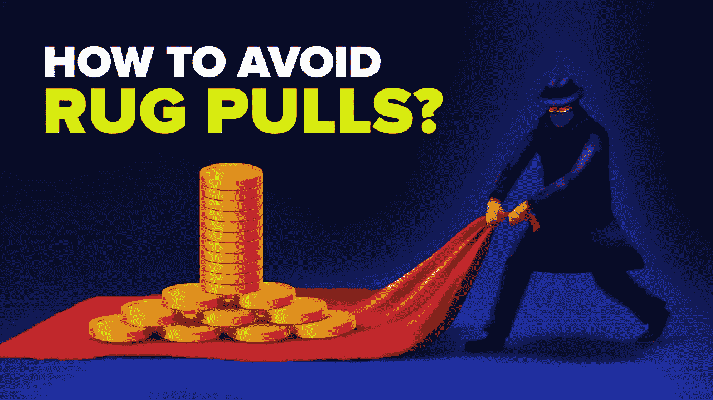
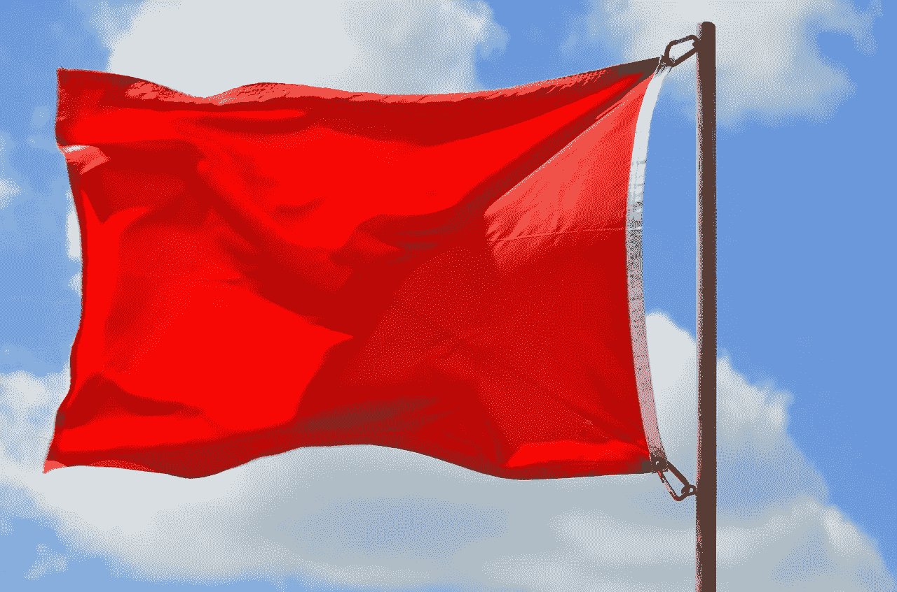
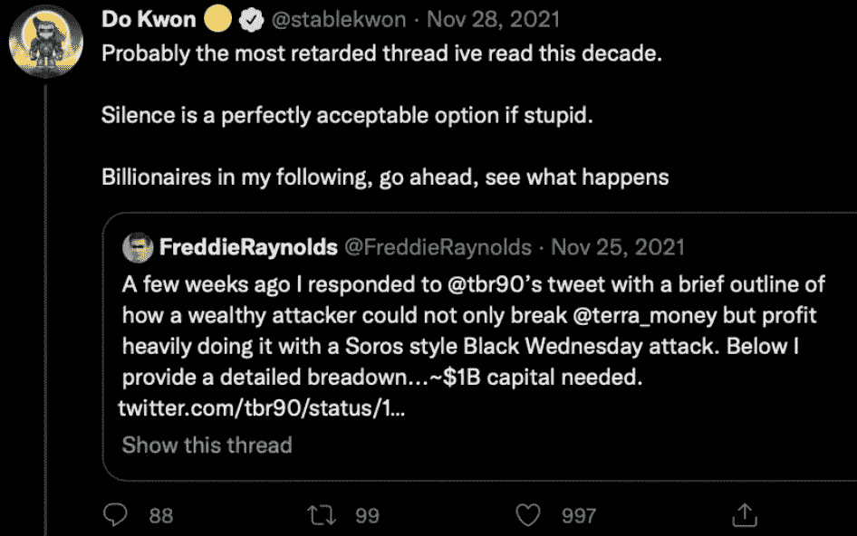
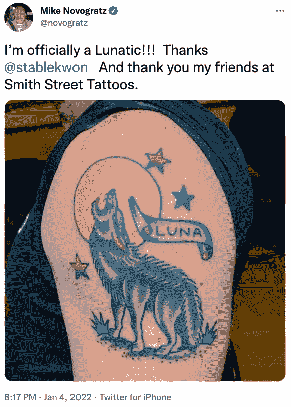
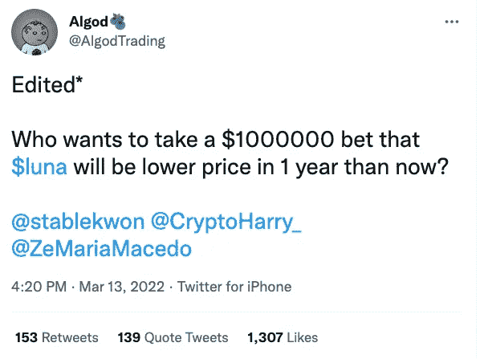
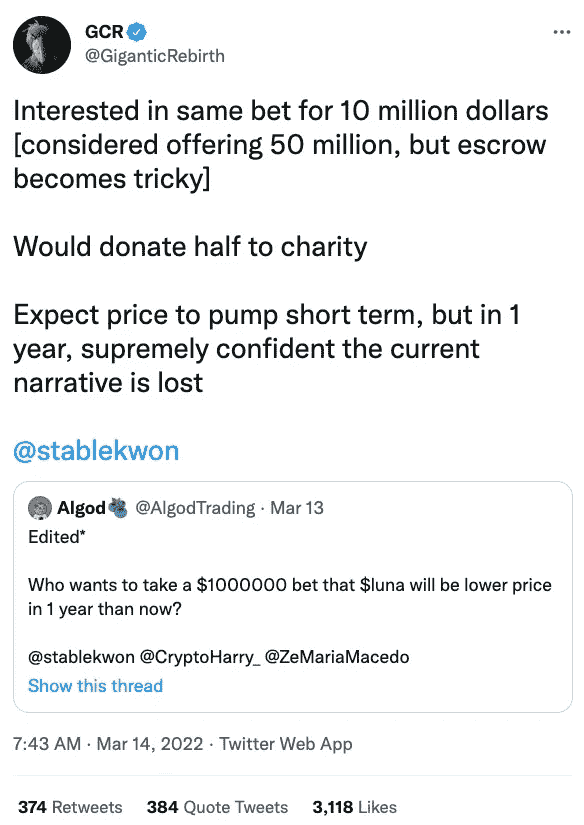
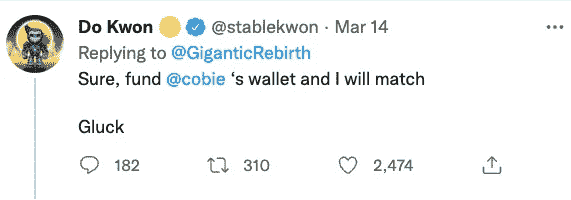
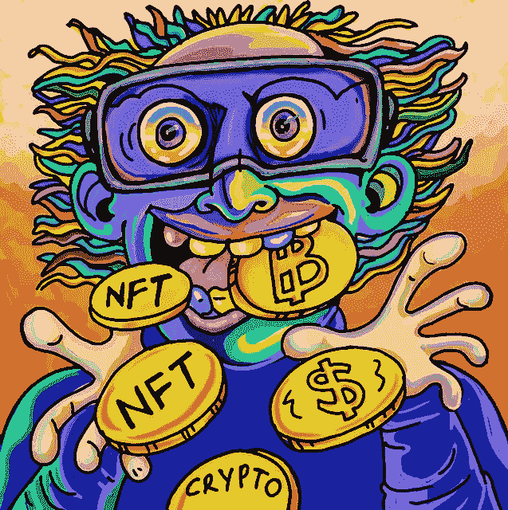
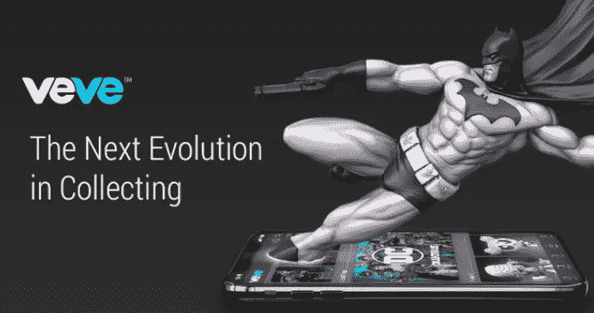

# 如何通过 5 个简单的步骤不被隐藏

> 原文：<https://medium.com/coinmonks/how-not-to-get-rug-pulled-in-crypto-with-5-simple-steps-fe1a701b73d0?source=collection_archive---------9----------------------->

众所周知，在加密市场上，这是一场明目张胆的大规模骗局。与 2020 年的 1%相比，2021 年地毯拉布占所有诈骗收入的 37%**。根据 Chainalysis 的数据，2021 年，加密投资者在 rug pulls 身上损失了超过**28 亿美元。来源:[**https://www . coin desk . com/markets/2021/12/17/defi-rug-pull-scams-pulled-in-28 b-this-year-chain analysis/**](https://www.coindesk.com/markets/2021/12/17/defi-rug-pull-scams-pulled-in-28b-this-year-chainalysis/)****

**显然，问题不在于秘密骗局是否正在发生，而在于"**你如何避免它们，让你的投资不被骗子窃取？****

**让我们从什么是**“地毯拉扯”**开始，然后我们将深入探讨如何避免它们。一个松散的定义是，当一个 **NFT 收藏或加密令牌/硬币**的创造者没有按照他们的路线图或意图行事，基本上他们就消失了。**

**他们可能承诺一个项目，**大肆宣传这个项目，**出售代币，然后从不交付，他们只是拿了钱就跑。NFTs 也是如此。他们可能会也可能不会交付 NFTs，然后就消失了。没有承诺的“元宇宙”或“效用”等…你买了代币或 NFT，现在几天，几周或几个月后**它们不见了**。推特被删除，网站消失，不和被放弃，没有回复邮件或其他任何东西。你被鬼上身了！**

****

****Ghosted****

**迄今为止，我从未成为秘密骗局或骗局的受害者。我相信这是因为我做了很多事情，大大降低了我被诈骗的几率。我自 2017 年第三季度以来一直在加密领域工作，所以我不像一个 1-2 年的投资者。已经 5 年了，这是我一生的密码生涯。**

**我想用一个最近的现实生活中的例子，那就是发生在 TerraUST 和 Luna 身上的事情，以及我是如何避免这 400 多亿美元的灾难的！**

**我要告诉你的第一件事是，我没那么聪明……我不是工程师、科学家、医生，也不是金融或密码专家。我甚至没有大学文凭🙀。我这么说是因为如此多受过良好教育的投资者、对冲基金经理等令人震惊。在有许多警告的时候陷入了 Terra Luna 灾难。我是这样避免的。**

**大约在月神号和 T2 号坠毁前 4 周，我在研究它们。让我倒回去一秒钟，露娜和特拉是由 **Terraform Labs** 创建的**Daniel Shin**[**@ hyunsung 1112**](http://twitter.com/hyunsung1112)和一个叫**Do Kwon**[**@ stable Kwon**](https://twitter.com/stablekwon)的非常自大的家伙。几年后，他们成立了一个新加坡非营利组织，名为**LFG 露娜基金会护卫队。****

**不用细说，他们有一种叫做**卢娜**的本地硬币和一种叫做 **UST** 的稳定硬币。他们有一个名为**锚协议**的区块链项目，这就是有趣的地方。当你下注 UST 的时候，锚协议每年支付 20%的利息，疯狂吧？**

**所以，当我在 Twitter 上看到 Anchor 支付 20%的利息时，我心想，“**嘿，伙计，你为什么不用你的比特币借点钱，然后用它来购买并存入 UST，赚取 20%的利息？”如果我用我的比特币获得抵押贷款，比如说 5%，那么我就可以净赚 15%。**天才！！！等等，这听起来好得难以置信，他们怎么能支付 20%，这合法吗？******

**这就是引导我走上研究道路的原因。显然，你要做的第一件事是**在投资前研究一个项目** …我在浏览器的搜索栏开始搜索“Anchor Protocol”，然后看到了这篇文章:[**https://www . Yahoo . com/life style/terra-LFG-commit-450-million-103506224 . html**](https://www.yahoo.com/lifestyle/terra-lfg-commit-450-million-103506224.html)**

****

****Red Flag Warning, Pay Attention or Get Scammed****

**这是一个重大的危险信号。如果这是不可持续的，他们必须注入现金来维持他们的利率支付，那么这是一个灾难的配方！仅此一点就足以**取消我的“天才”计划**将资金投入主播协议。**

**我更深入地在 Twitter 上搜索了锚协议。你只需使用一个标签 **#anchorprotocol** 就可以很容易地看到所有的推文被发布在那里。这就是事情变得**非常丑陋**的原因，因为我发现**跆拳道**在他的主播协议上受到**挑战**，人们指责他，称之为**庞氏骗局**。推特上的人解释说，让整个月球土地生态系统崩溃是多么容易！**

**[****推特上的@FreddieRaynolds****](http://twitter.com/FreddieRaynolds) 早在 2021 年 11 月就拉响了**警报。看看权道的反应有多自大！****

****

**听着，有些人如此迷恋露娜，以至于他们的推特账户只专注于露娜·特拉的所有事情。一个名叫**迈克·诺沃格拉茨**、[、**@诺沃格拉茨**、的著名对冲基金经理甚至在他的手臂上纹了一个**露娜纹身**。](http://twitter.com/novogratz)**

**诺沃格拉茨是 LUNA Terra 的大投资者，他自称是“疯子”**……这个家伙是一个拥有经济学学位的亿万富翁**却仍然**拒绝**看到警告信号。******

********

****不仅仅是亿万富翁和百万富翁损失了钱，大多数普通投资者也损失了他们一生的积蓄，至少可以说这很可怕。****

****可能最疯狂的故事之一是，一个名为[**@ AlgodTrading**](http://twitter.com/AlgodTrading)的人在 Twitter 上公开打赌说，到 2023 年 3 月 14 日，LUNA 的价格将低于**的 88 美元**。这是一个 100 万美元的赌注，跆拳道接受了这个赌注。不久之后，这个赌注在 Twitter 上疯传，并广为人知，一个名叫**Cobie**[**@ Cobie**](http://twitter.com/cobie)的家伙充当了托管人。Do Kwon 和 AlgoTrading 各出资 100 万美元进行托管。****

********

****然后另一个加密推特人物**GCR**[**@巨人重生**](https://twitter.com/GiganticRebirth) 用跆拳道下了同样的赌注但是为了**10，000，000 美元**和跆拳道**接受了！******

****************

****所以，让我们回顾一下我在开始研究用我的**比特币借款购买 UST 并从 Anchor Protocol** 获得 20%的年利率是否是个好主意时的发现。🤷‍♂️****

******1)** 我通过简单的搜索发现，Anchor 协议必须从 Luna Foundation Guard 获得**4.5 亿**美元的现金注入。这= **重大红旗！******

******2)** 我在推特上搜索，发现推特上有人打赌道权的协议会失败，他们赌了 1100 万美元。这= **重大红旗！******

****我发现有些人，比如说弗雷迪耶雷诺兹(FreddieRaynolds)曾经大致描述过**搞垮整个**月球地球生态系统是多么容易。这= **重大红旗！******

****你认为任何头脑正常的人**在发现这些主要的危险信号后**会用他们的比特币借款或者投资他们的钱到 Anchor Protocol 吗？不，你只是继续前进，继续研究其他项目…****

****这么多投资者是如何在这些危险信号下陷入月球土地生态系统的？当投资你的钱时，它可以归结为几个简单的规则，**永远**= = = =>遵循，设置提醒，在社区中活跃，保持参与并对你投资的项目进行研究。****

****让我们来分解一下，因为这真的很容易做到。我又要拿自己举例子了。**我的钱 88.20%** 投资比特币，其余是 alt 币。(**我是比特币超级玩家**)😹😹😹现在就在我的 alt 币里(不包括比特币)，其中一个是 **71.53%** 然后剩下的在另外 4 个币里。****

********

******Bitcoin Maxi-Lite******

****所以基本上我的整个退休生活，在很大程度上，只是在两项投资中，**比特币和一枚来自 **Ecomi** 的 **$OMI** 替代币。这家公司 Ecomi 拥有**VEVE NFT**app[**@ VEVE _ official**](http://twitter.com/veve_official)**用于购买**迪士尼、蝙蝠侠、蜘蛛侠、超人、泰山、米老鼠、达斯维达**等授权 NFTs********

**在写这篇文章的时候，我的$CRO，$MATIC，$FET 和$SAND 的金额要小得多，并且我也在从事出租房地产的工作。**

**因此，以下是我为避免投资失败所做的事情。**

**我按照上面的描述进行研究。你必须**确保这是一个可行的项目**，团队**是否被授权**(他们的身份是公开的)，团队**是否有经验**，阅读**白皮书**，了解**令牌学**，是否有**实用工具**，项目**是否正在赚钱**，团队**是否可以联系到**并在 Twitter 上回复人们，是否**

**你发现危险信号了吗？他们是合法的危险信号还是只是在推特上表现轻率的人？真正的危险信号和人们在推特上谈论另一个项目是有区别的。**

**一旦你投资了一个项目，现在它就变成了一个不断监控项目的游戏计划。你是怎么做到的？你在 Twitter、Medium、Instagram、Telegram 上关注他们，关注他们的不和谐。Twitter 和 Discord 是大多数加密公司与投资者交流的地方。**

****4)** 为公司名称设置“**新闻提醒**”，这样你就可以随时看到最新的新闻发布。**

****5)** 参与到他们的社区**中来**那里是他们最常去的地方，通常不是 Twitter 就是 Discord。**

**追随他们并融入他们的社区是你拥有的最大优势。我最大的投资是比特币和$OMI。这两笔投资没有发生我不知道的事情。我每天阅读和关注比特币新闻。我很清楚为什么**比特币会 365/24/7** 上涨或下跌或横盘。我真的在**生活，吃饭，呼吸比特币！****

**几个月前，我去迈阿密参加了**比特币 2022 大会**，只是为了听听不同的演讲者。我在推特上关注比特币领域的所有大牌，我听比特币播客，比如安东尼·庞普利亚诺的《T10》和彼得·麦考马克的《T15》和《T16》播客，更不用说我还订阅了大量的《T25》**

**在比特币的生态系统中，没有我不知道的事情发生，因为我的退休取决于它。**

**Ecomi 和他们的$OMI 代币和他们的 VEVE 应用程序也是如此。我订阅了他们的 Twitter feeds、Medium blog、Discord、YouTube 频道，我还订阅了至少 **8 个不同的 YouTube 频道**，他们所做的就是发布关于 **VEVE 和 Ecomi 生态系统的视频**。**

**Ecomi/VEVE 生态系统中没有我不知道的事情，因为**我的退休取决于它** …实际上我在 Medium 上的第一篇**文章**是关于 VEVE 和他们的授权 NFT 的。喜欢的可以看这里:
[**https://medium . com/@ hum dog/will-ECOM is-licensed-NFT-s-veve-app-flip-opensea-6e 620 aa 3a 8 b 5**](/@HumDog/will-ecomis-licensed-nft-s-veve-app-flip-opensea-6e620aa3a8b5)**

****

**Licensed NFTs Disney, Marvel, DC, Star Wars, Coke , USPS, Cartoon Network…**

**对于投资来说，尤其是使用 crypto 时，没有所谓的“设置它并忘记它”!它发展太快，技术也在不断变化。**

**所以总结一下，这实际上可以归结为五个简单的步骤，并把它们做好。研究、观察危险信号、监控、新闻警报并参与其中。**

**如果你**做全职工作**，那么在工作前阅读任何关于你的加密项目的新闻，在工作前滚动 Twitter，在开车上班或午休时听播客或 YouTuber，在工作或晚餐后冲洗并重复。**让它成为你日常生活的一部分**，你会大大**减少**你变得强壮的机会。你会看到警告信号，并能在为时已晚之前卖出。**

**如果你喜欢这篇文章，请帮我一个忙，分享它，并在 Twitter 上给我一个关注[**@ humdog 64**](https://twitter.com/HumDog64)**和最后一个奖励提示，**永远不要点击不一致的链接**消息**或回复 Twitter 或电报回复中的链接等。这些也是骗子！******

****像往常一样，这不是财务建议，我不是财务顾问。我只是一个穿人字拖、短裤和猫 t 恤(我妻子讨厌这些)的人，😼他在我的家庭办公室经营自己的电子商务业务。****

> ****加入 T21 电报集团，学习加密交易和投资****