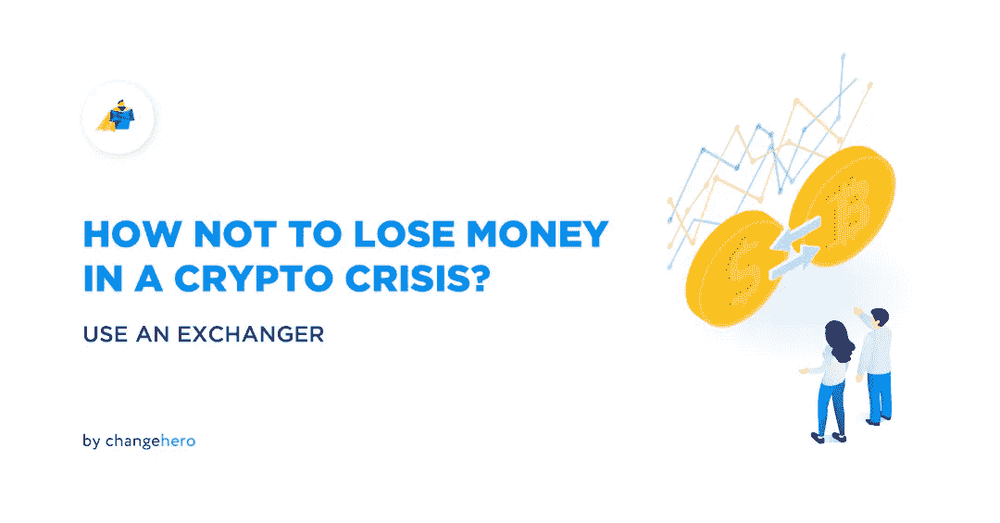
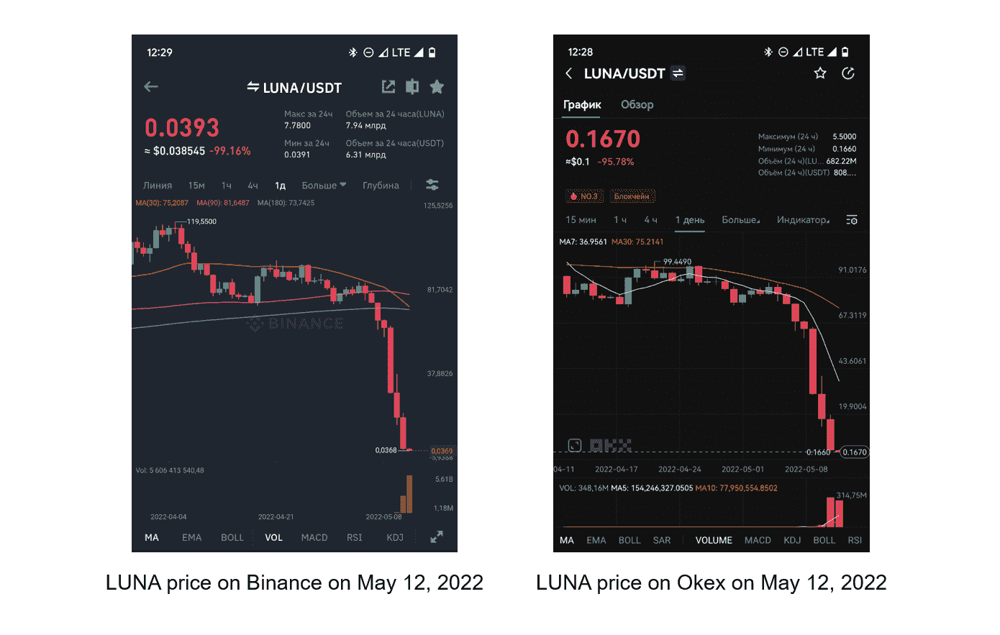

# 如何在加密危机中不损失金钱？使用交换器

> 原文：<https://medium.com/coinmonks/how-not-to-lose-money-in-a-crypto-crisis-use-an-exchanger-ff2dc46f5f6f?source=collection_archive---------50----------------------->

在动荡时期，人们拼命挽救他们的资产。但 FOMO 和市场恐慌促使持有者卖出硬币，结果，他们犯了致命的错误。如果你不想在匆忙中亏钱，那么这篇文章是给你的。

加密货币在不同的主要交易平台上的价格可能会有很大差异。例如，5 月 12 日，LUNA 在 Okex 的交易价格为 0.17 美元，同时在币安的交易价格为 0.04 美元。相差 80%！

加密货币的价格由交易者购买加密货币的出价决定。这就是为什么不同交易所的汇率不同。

不要浪费时间寻找理想的价格，试试 ChangeHero 的“最佳价格”！这种交易不需要注册账户。当您开始交易时，ChangeHero 会为您的密码找到市场上最有利可图的利率，而佣金最低。您可以确信，您的代币将会以最快、最优惠的速度进行兑换。

以下是如何使用最佳汇率的逐步说明:

**第一步:**进入 [ChangeHero](https://changehero.io/) 网站，选择想要兑换的加密货币，输入金额，选择顶部**的“最佳汇率”。**

**第二步:**点击“交换”后，您将被重定向至处理页面。首先，系统会提示您提供要兑换的货币的收款人地址。

**第三步:**点击“下一步”后，您将看到兑换的详细信息和汇率。在继续之前，不要忘记检查使用条款和 KYC 政策；

**第 4 步:**接下来，系统会提示您在一次交易中发送您要兑换的金额。可以复制 ChangeHero 钱包地址，也可以扫描二维码。

**第 5 步:**一旦我们收到您发送的资金，将会显示附加信息，如转账哈希。我们使用您的资金到达并开始交易时的当前汇率。

**第 6 步:**最后，我们会快速处理您的交易，并在几分钟内将密码发送到您的钱包。

就是这样！很容易，不是吗？在任何情况下，如果您有任何困难，请不要犹豫，通过我们网站上的实时聊天或通过电子邮件联系我们的客户支持服务:support@changehero.io。我们始终在线！

试试看，看看 ChangeHero 的最佳速率有多靠谱！

现在在 [ChangeHero](https://changehero.io/) 上交换！