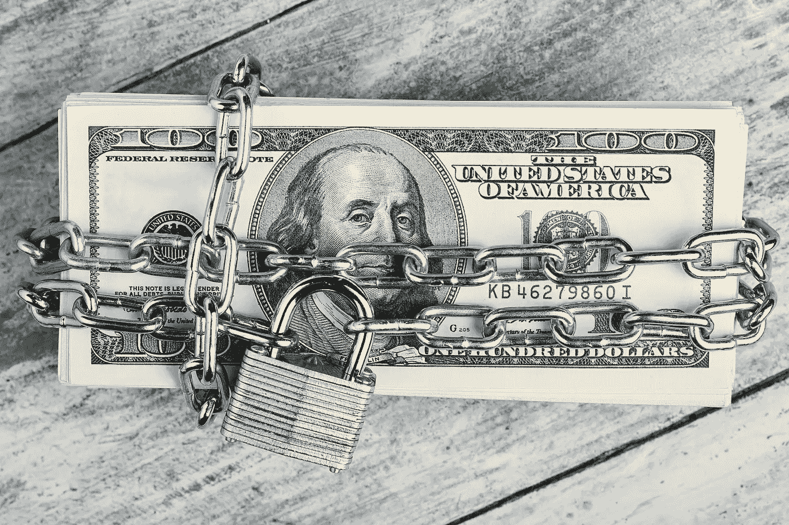

# 我们的 DeFi 信用体系是如何削弱自身的——(以及如何修复它)

> 原文：<https://medium.com/coinmonks/how-our-defi-credit-system-is-crippling-itself-and-how-to-fix-it-62299380e877?source=collection_archive---------3----------------------->

**传统贷款**

当你想到贷款时，你可能想到的是借钱，并承诺有利息回报。人们倾向于贷款，因为他们想进行投资，但没有现成的钱。例如，如果你想投资一个价值 3 万美元的学位，而你或你的父母手头没有一大笔现金，你可以向银行贷款。他们会期望你在一定时间内偿还，但是你承担了这个风险，因为你期望用你的学位赚更多的钱。当然，投资不一定要有财务回报，人们贷款购买私人汽车、私人或出租房屋、企业等。有时预期收入就足够了，其他时候，房子或汽车的问题将被用作抵押品，以确保贷款的价值将被归还。你获得 30 万美元的贷款，并提供你将要购买的房子作为抵押。如果你无力支付，房子将被出售，你的债务将从出售中收回。在下面的例子中，单词“银行”将用于任何提供贷款的平台，无论它们是实体银行还是 DeFi 贷款协议。

**密码领域的贷款**

现在想象一下，你正在取得同样的 300.000 美元贷款，但不是提供财产作为抵押，你必须提供一笔€400.000 美元(写作时价值 450.000 美元多一点)。在前面。鉴于欧元对美元只会升值(对吗？)，加强你的抵押品，这似乎是一个惊人的交易！你很快与朋友和家人一起凑齐€40 万，与银行锁定€40 万，他们会给你 30 万美元用于购买。当然，你还是要还清银行的贷款，这样可以避免银行把你抵押的欧元换成美元出售(有时会收取额外的“清算税”)。如果整个系统对你来说非常低效，那可能是因为整个系统非常低效。这种提供比贷款总额更多的抵押品的过程被称为“超额抵押”，尽管对银行来说这似乎是一笔好交易，但对他们来说，这个系统可能更糟糕。

**为什么这是个问题**

过度抵押在传统金融(TradFi)中广泛使用，主要是在抵押的意义上。到目前为止，它还是分散融资(DeFi)中唯一安全且匿名的贷款方式。虽然这个系统可能在 TradFi 中工作，但两者之间有三个重要的区别，这导致了后者的严重后果。

1)在 DeFi 担保品中，无需事先通知即可完全索回。当然，人们也可以采取传统的抵押贷款，并在一周内全额偿还，但在实践中，这是不会发生的事情。大多数人只是没有资金这样做，在这种情况下，出售抵押品——他们可能已经习惯了——将是偿还债务的唯一选择。在 DeFi 中，投资者倾向于不与他们的特定代币发展任何有意义的关系(至少——远不及人们对他们家的爱)。大多数投资者一有更好的投资机会，就会卖掉手中的代币。这意味着 Defi 银行将承担风险，借出它们欠投资者的抵押品。虽然在 TradFi 中，这是一个以前已经冒过的风险，有时会产生灾难性的后果，但我们的下一个区别解释了为什么 DeFi 的风险更大。

2)在 DeFi，投资机会像风一样变化。至少可以说，你想在两个月内归还新买的房子，只是为了搬到另一个地方的可能性很低。然而在 DeFi，一个伟大的项目可能在一个月内就过时了；马斯克可以发推特；中国可能会第七次禁止加密，或者一项新的协议可能会带来大量令人惊叹的新项目。我们只是不知道。当然，有很多长期的霍德勒，无论发生什么都致力于他们的项目，但事实是 DeFi 改变了。很快。而大多数投资者都愿意以同样的速度改变。不管是好是坏，密码的流动性。

3)所有这些导致了 TradFi 和 DeFi 在贷款方面最重要的区别:DeFi 银行被迫坐拥大量现金。在传统金融中，抵押品的用途是:你住在里面或者把它租出去；它被驱动或者用来赚更多的钱。无论如何，它正在为整个经济提供价值。在 DeFi 中，情况并非如此。由于可能会突然出现抵押品要求以及快速变化的 DeFi 趋势和机会，银行被迫坐拥大量现金，以避免偶尔的银行挤兑。

如果你想知道坐拥大量现金的大型机构会有什么影响，那就是:现金是任何金融生态系统的血液。

> 如果不流动，就会瘫痪。

确实如此。在加密领域，每借出 100 美元，就有大约 77 到 106 美元暂时从流通中消失。如果只有一两个人偶尔贷款的话，这个数目将是暂时的。相反，在过去的一年里，贷款项目每天锁定超过 63，000，000 美元。这让我们想到了今天，我们在这些储备池中共有 42，000，000，000*美元。想象一下，如果有一种安全的方式将所有这些抵押品用于实际投资，那么可以在 hyperdrive 中投入多少开创性的项目。

那么，你也有好消息吗？

这就是**的用武之地。到现在为止，这可能是不言而喻的，但与过度放牧相反，过度放牧保持了血液流动和我们生态系统的健康。这类贷款唯一但重要的挑战是确保借入资金的投资者总是能够偿还。在 Avalanche 的推动下，我们将“智能”放回到智能合同中，以实现这一目标。DeltaPrime 是一个分散式贷款平台，以最简单、最直观的方式向基于智能合同的账户发放不可靠、抵押不足的贷款，由您控制。通过这种方式，投资者有能力释放他们的全部投资潜力，包括使用他们的抵押品进行投资，同时确保资本提供者全额偿还贷款。**

**这样我们就解锁了区块链。**

***【https://defipulse.com 2022 年 1 月 17 日进入**

# **— — — — — — — — — — — — — — — — — —**

# **关于 DeltaPrime**

**DeltaPrime 是您的主要经纪人，致力于释放 DeFi 的全部潜力。我们通过提供安全的低抵押贷款，重新分配资产，关注资金效用最大化来实现这一目标。我们的投资者建立在 Avalanche 网络的坚实基础之上，可以确保他们最重要的投资获得快速可靠的交易。**

**一定要来看看我们！**

> **™️ [DeltaPrime](https://deltaprime.io) |🐦[推特](https://twitter.com/DeltaPrimeDefi)👾[不和](https://discord.gg/9bwsnsHEzD)**

# **— — — — — — — — — — — — — — — — — —**

**加入 Coinmonks [电报频道](https://t.me/coincodecap)和 [Youtube 频道](https://www.youtube.com/c/coinmonks/videos)了解加密交易和投资**

# **另外，阅读**

*   **[有哪些交易信号？](https://coincodecap.com/trading-signal) | [Bitstamp vs 比特币基地](https://coincodecap.com/bitstamp-coinbase) | [买索拉纳](https://coincodecap.com/buy-solana)**
*   **[ProfitFarmers 回顾](https://coincodecap.com/profitfarmers-review) | [如何使用 Cornix Trading Bot](https://coincodecap.com/cornix-trading-bot)**
*   **[十大最佳加密货币博客](https://coincodecap.com/best-cryptocurrency-blogs) | [YouHodler 评论](https://coincodecap.com/youhodler-review)**
*   **[MyConstant 点评](https://coincodecap.com/myconstant-review) | [8 款最佳摇摆交易机器人](https://coincodecap.com/best-swing-trading-bots)**
*   **[MXC 交易所评论](/coinmonks/mxc-exchange-review-3af0ec1cba8c) | [Pionex vs 币安](https://coincodecap.com/pionex-vs-binance) | [Pionex 套利机器人](https://coincodecap.com/pionex-arbitrage-bot)**
*   **[我的加密副本交易经历](/coinmonks/my-experience-with-crypto-copy-trading-d6feb2ce3ac5) | [比特币基地评论](/coinmonks/coinbase-review-6ef4e0f56064)**
*   **[CoinFLEX 评论](https://coincodecap.com/coinflex-review) | [AEX 交易所评论](https://coincodecap.com/aex-exchange-review) | [UPbit 评论](https://coincodecap.com/upbit-review)**
*   **[AscendEx 保证金交易](https://coincodecap.com/ascendex-margin-trading) | [Bitfinex 赌注](https://coincodecap.com/bitfinex-staking) | [bitFlyer 审核](https://coincodecap.com/bitflyer-review)**