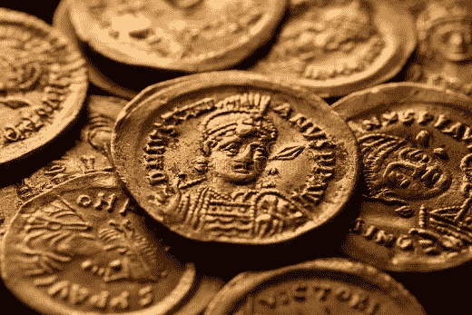
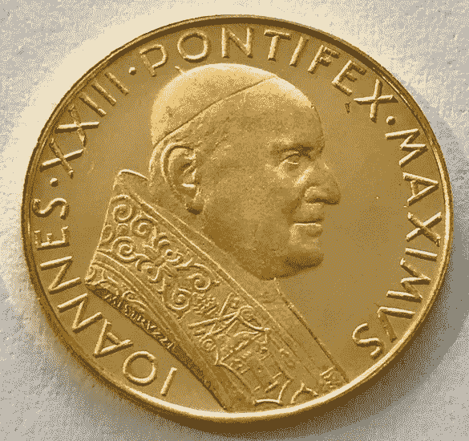
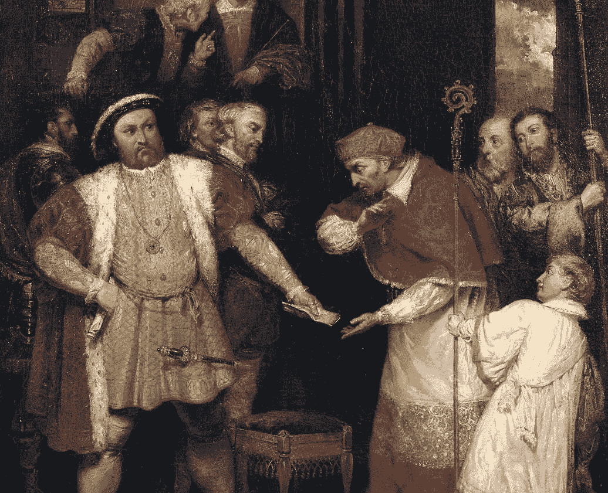

# 宗教如何被用作征税的借口

> 原文：<https://medium.com/coinmonks/how-religion-was-used-as-an-excuse-for-taxation-5e8aac75c091?source=collection_archive---------26----------------------->

## 帝国如何利用宗教来收税和维持他们的权力？

在这篇文章中，我将解释帝国如何利用宗教来控制和征税。与数字世界类似的是，银行和政府如何利用税收产生经济能量，而只有少数人从中受益。

通过一系列文章，我将解释我们如何实现今天的数字化转型，以及为什么这是比特币在现代世界取得成功的关键。

# **帝国中心大城市的形成**

让我们先来看看欧洲的一些城市是如何成为帝国中心的。

欧洲从中世纪(15-16 世纪)过渡到文艺复兴时期。文艺复兴之后(大约 17 世纪)，欧洲所有的大城市都发展成为一个联系。节点是一个帝国的中心节点，主要是大部分贸易物流的终点。也就是说，罗马是罗马帝国的一部分，巴黎是法兰克帝国的一部分。

当这些帝国中的一些失败时，它们就崩溃了，被从历史中抹去了。比如一些生态系统或动物是如何在大自然中灭绝的。有证据表明它们存在过，但我们对它们了解不多。

让我们仔细看看一个帝国中一个关系网的演变。

## **帝国建立在经济、海关和税收的基础上**

在欧洲早期(1600-1700 年)建设一个伟大城市的唯一方法是对你管辖范围内创造的所有经济能量征税。关于能量，我指的是所有产生的贸易和金钱。

一个隐喻的例子是，大城市是一个渔夫，他撒下一张大网来捕捉鱼——有些东西最终会落入网中。这就是你如何收取经济租金来扩大你的帝国。

## 税收交易网络

当你到达罗马港口时，典型的税收惯例是对你的货物征收 10%的税。到了下一个港口再加 10%的税。他们会拿走价值的 20-30%。货物经销商在起航前必须计算合法盗窃作为缓冲。如果你去威尼斯看看大运河，那里只有货船。几个世纪以来，这些网络一直被用于征税。

Trading network in the Mediterranean

地中海由许多贸易网络组成。例如，威尼斯到亚历山大港是一个贸易网络。威尼斯到伊斯坦布尔是另一个贸易网络。这些是为 nexuses 建立的运输网络，可以在你到达目的地的途中向你征税。天才，如果你是连接。如果你是交易者，就没那么天才了。

# **第一个现代逃税方法**

旅行推销员问题提出了以下问题:“给定一个城市列表和每对城市之间的距离，恰好访问每个城市一次并返回起始城市的最短可能路线是什么？”我想补充一下；"在路上不被征税致死吗？"。

例如，如果你是一个使用伊斯坦布尔-威尼斯贸易网络的货船所有者。你将在每个港口被过度征税或勒索。

当时使用的辐条-中心配送系统是基于将物流从一个中心连接到另一个中心。通常由一个相互通婚并相互信任的公司或家族控制。如果你不是顶级公司之一，或者和掌控公司的家族没有关系，那就和你一半的商品说再见吧。

处于网络中心的人们获得了所有的商业利润。他们正在收集所有的经济能量。这相当于今天的政府，受益于在其管辖范围内进行交易并向其征税的公司。

## **nexus 是如何阻止走私者的？他们杀了他们**

走私者或海盗的定义是不愿意捐出一半财产的人。你如何阻止人们逃税？建立一支海军去杀他们。

## **迦太基德林达东部时间**

你如何阻止竞争关系对与你相同的行业征税？你也杀了他们。

“*迦太基 Delinsa Est* ”是罗马和迦太基之间第三次布匿战争(公元前 149-146 年)前罗马元老院辩论中的一个著名短语。在参议院的每一次演讲后，一位名叫卡托的政治评论家都用这个短语来推动战争。意思是“*袁绍必灭*”。

Carthage was a settlement in modern Tunisia

为什么迦太基必须被摧毁？税收目的。迦太基人在地中海有自己的港口，并向该地区的商人征税。两个人不能把同一个人抖下来。让税收战争开始吧。

罗马帝国的扩张和迦太基的衰落根源于对港口的控制，最终是谁掌管着帝国的税收。

**莱潘托之战——“基督教 vs 穆斯林”**

莱潘托战役是天主教国家联盟与奥斯曼帝国之间的一场海战。西班牙国王与罗马教皇和威尼斯总督结盟。当奥斯曼军队从他们在莱潘托的海军基地向西航行时，他们遇到了自称为神圣联盟的舰队。

这三支海军的联盟正在与“来自伊斯坦布尔的入侵穆斯林”作战。这场胜利标志着奥斯曼帝国向地中海军事扩张的转折点。然而，胜利仅限于扩张，奥斯曼帝国于次年扩张到塞浦路斯。从道德上讲，这很重要，因为土耳其人最终会被打败。

Battle of Lepanto portraited

他们为什么打架？

他们在争夺商业网络的控制权。一旦你控制了商业网络，你就控制了每艘驶往地中海盟国港口的船只所产生的税收。

他们将战争建立在宗教的基础上，但正如我在之前的文章中提到的，如果你不控制宗教，你就不控制帝国。

## 金钱和宗教是相互关联的。

威尼斯人为什么要终止威尼斯的天主教会？

离开天主教堂，你就切断了与罗马教皇的联系。你成了自己的税务联系人。所有运往威尼斯的货物都停在那里，你从贸易中收取的经济租金留在你的管辖范围内。

这一选择的不利之处在于，威尼斯开始在该地区失去权力，因为它在宗教方面失去了经济活力。他们开始下沉。当你是一个帝国时是有成本的，你的收入来自以上帝的名义征收的税。为了在一个关系中保存能量，一个人必须把它连接到教会，并用宗教来控制它。

金钱和宗教是相互关联的。如果历史书不一样，那就是撒谎。

罗马人、威尼斯人、迦太基人、加尔人、撒克逊人等等。竞争成为该地区的守门人。如果你不控制宗教，你就不能控制帝国。如果你没有信仰，任何人都可以拿走你一半的钱。

**信仰与帝国的关联**

信仰和帝国之间的关联的一个例子来自古罗马。

*教皇麦克西穆斯*被认为是教皇学院的首席大祭司。作为罗马的统治者，奥古斯都·张敬利(公元 12 年)任命自己为罗马的首席祭司，也是罗马最高祭司委员会的主席。

Pope portraited as Pontifex Maximus on gold coin

这意味着罗马执政官也是大祭司。罗马人没有把这些角色分开。它主要是为了政治利益，试图通过信仰来恢复传统的罗马价值观。也能够征服和收取经济租金。

## 以上帝的名义，我们向你征税。

如果你必须把所有的税收都送到罗马，那就不可能提升你的关系或文明。那么另一个 nexus 是如何成长的呢？

中世纪历史:征服者威廉，德国贵族，亨利八世决定让教皇马克西姆斯成为这个国家的最高教堂。

Henry VII (1535)

简单地说，这意味着亨利八世和其他人宣称自己是教会的最高领袖，而不是罗马教皇，他们的决定启动了英国宗教改革。如果英格兰改变了他们的信仰，他们不再需要得到意大利的批准，也不再需要给他们寄钱。

有上帝站在你这边是有帮助的。还不如干脆换个神。

出于宗教、政治和经济原因，北欧脱离了罗马天主教徒。

**总结**

一般原则:在地球上任何你看到大城市的地方，它都曾经是帝国的中心——巴黎、伦敦、罗马、香港、纽约。每当你看到一座城市被摧毁——帝国消失了——迦太基、特洛伊、威尼斯。大自然自有办法淘汰弱者，让适应性最强的继续茁壮成长。假设你去巴黎看诺特雷丹。他们靠一个早已逝去的帝国的遗迹为生。帝国的能量仍然存在，并且在它垮台后还会存在很长一段时间。能量是如何变得如此密集的？因为税。帝国如何征税？通过宗教和战争。

简而言之；金钱和宗教是直接相连的。如果历史书不一样，那就是撒谎。

在接下来的文章中，我将解释自 20 世纪以来现代城市的演变对比特币成功的贡献。

网址:【shawnmunir.com[推特:](https://shawnmunir.com/)[twitter.com/munirshawn](https://twitter.com/munirshawn)
邮件:[me@shawnmunir.com](mailto:me@shawnmunir.com)
媒介:[blog.shawnmunir.com](https://blog.shawnmunir.com/)

> 加入 Coinmonks [电报频道](https://t.me/coincodecap)和 [Youtube 频道](https://www.youtube.com/c/coinmonks/videos)了解加密交易和投资

# 另外，阅读

*   [Bookmap 评论](https://coincodecap.com/bookmap-review-2021-best-trading-software) | [美国 5 大最佳加密交易所](https://coincodecap.com/crypto-exchange-usa)
*   最佳加密[硬件钱包](/coinmonks/hardware-wallets-dfa1211730c6) | [Bitbns 评论](/coinmonks/bitbns-review-38256a07e161)
*   [新加坡十大最佳加密交易所](https://coincodecap.com/crypto-exchange-in-singapore) | [购买 AXS](https://coincodecap.com/buy-axs-token)
*   [红狗赌场评论](https://coincodecap.com/red-dog-casino-review) | [Swyftx 评论](https://coincodecap.com/swyftx-review) | [CoinGate 评论](https://coincodecap.com/coingate-review)
*   [投资印度的最佳密码](https://coincodecap.com/best-crypto-to-invest-in-india-in-2021)|[WazirX P2P](https://coincodecap.com/wazirx-p2p)|[Hi Dollar Review](https://coincodecap.com/hi-dollar-review)