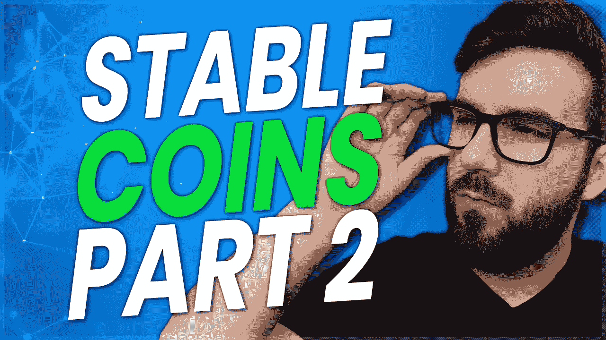

# 稳定硬币有多安全第二部分——算法硬币

> 原文：<https://medium.com/coinmonks/how-safe-are-stablecoins-part-2-algorithmic-coins-a0aa6ca1810e?source=collection_archive---------49----------------------->

我们今天要回答的问题是稳定的硬币有多安全和稳定？让我们深入研究一些失败的算法稳定的例子，如 UST、Basis Cash 和 IRON，以及一些新的例子，如 Tron 的 USDD。

[https://rumble . com/v17y 1 TL-how-safe-are-stable coins-part-2-algorithmic-coins . html](https://rumble.com/v17y1tl-how-safe-are-stablecoins-part-2-algorithmic-coins.html)

https://odysee.com/@ScottCBusiness:4/stablecoins-part-2:9

在系列的这一部分中，我们将涵盖算法稳定硬币，同时主要看一看过去失败的硬币，如最近导致加密市场崩溃的 UST，由 Do Kwan 创作的 Terra 和由 Titan Finance 创作的 IRON，马克·库班大力推动了类似的消亡。我们还会看到其他一些硬币，但一个共同的主题是这些硬币会脱落并失效。

以下是 CoinmarketCap 上分享的所有算法稳定点数的列表:【https://coinmarketcap.com/view/algorithmic-stablecoin/】T4——浏览一下列表，看看有多少不与 1 美元挂钩。

首先，什么是算法 stable coin—[https://coinmarketcap . com/Alexandria/glossary/algorithmic-stable coin](https://coinmarketcap.com/alexandria/glossary/algorithmic-stablecoin)。CoinMarketCap 的定义是一种合理的表述方式——“旨在通过盯住美元等储备资产，例如黄金或任何外币，实现价格稳定并平衡资产的流通供应。”这个概念是，你不必为硬币提供支持或抵押，而是可以通过在价格超过 1 美元时发行更多硬币或在价格低于 1 美元时从市场上购买硬币来保持联系。

TLDR:对许多这种硬币的简单考验是询问它们如何能够提供收益。如果他们声称你可以“押注”加密货币以获得通胀回报，那么你可能真的只是在使用一种类似于 ust 在 Anchor protocol 中所做的借贷机制。每一枚硬币都表明它们会有所不同，似乎大多数都没有。

# 基础现金(失败)

这个项目确实有助于正确看待 Terra 的 UST 发生了什么。Basis Cash 是由 Do Kwon 和 Nader Al-Naji(Bitclout & $ DESO 的创始人)于 2020 年开发的，很快被美国证券交易委员会取缔并关闭，尽管你今天仍然可以交易它，因为在撰写本文时它的价格是 0.0076 美元。

像大多数算法稳定币一样，这个概念是，虽然没有任何东西支持稳定币，但它将通过对用户的激励来维持。用户将通过基差股或持有基差债券来获利，基差债券“承诺”当 BAC 或基差现金回到 1 美元挂钩时，持有人将获得溢价。他们总是依赖某种奖励机制或称为铸币税的套利。

铸币税是铸造和发行新硬币的成本低于其面值的过程，这意味着它是 100%不可持续的，但许多人认为这是一个赚钱的经济机会。在 Coinmarket 上有一个专门的类别，这里几乎每一个稳定的硬币都是脱钩的，除了后面提到的 Frax。这基本上是算法稳定的墓地——https://coinmarketcap.com/view/seigniorage/。

不仅如此，就像 Terra 一样，还有第二个版本的 Basis Cash，叫做 Basis Dollar，它试图恢复这个项目，但又失败了。

# 特拉的 UST(失败)

现在让我们来谈谈发生在特拉实验室、卢娜和 UST 身上的事情。虽然没有确切的证据证明到底发生了什么，有几种理论在流传，但我们可以肯定地认为这是一起谋杀。

实际情况是，在 UST 与美元脱钩后，人们试图通过铸造两种货币之间的套利交易来平衡联系汇率，但没有足够的人愿意继续压低价格。有猜测和理论认为像贝莱德这样的大型机构参与了此事，但我现在更倾向于认为道权从一开始就预料到了这一切。

Terra 的$LUNA 现在被称为 LUNC 或 Terra Classic，而 Do Kwon 继续制作另一个版本，也从一开始就失败了，从不到 20 美元暴跌到现在的 3 美元。

许多人抱怨空投的处理方式，这显示了我们已经知道的东西。骗子和运行一个似乎是故意失败的项目的人可以毫不犹豫地立即进入下一个骗局。这一点已经被许多名人清楚地证明了，他们运行了多种骗局，像 Basis Protocol 这样的项目导致了 Bitclout 然后$DESO，以及更多无数的例子。关于这一切最有趣的事情是道权实际上致力于基础协议来制造基础现金，这是一个失败的算法稳定币，这意味着这是道权的第二个失败的项目。—[https://www . theblockcrypto . com/linked/146380/terraform-labs-CEO-假名-共同创造-失败-稳定-项目-基础-现金-硬币-报告](https://www.theblockcrypto.com/linked/146380/terraform-labs-ceo-pseudonymously-co-created-failed-stablecoin-project-basis-cash-coindesk-reports)

[https://protos . com/basis-cash-the-failed-algorithm-stable coin-do-kwon-not-learn-from/](https://protos.com/basis-cash-the-failed-algorithmic-stablecoin-do-kwon-didnt-learn-from/)

所有这一切真正令人难过的是，我们本可以预见它的到来。这两个人做了一个非常粗略的失败项目/骗局，然后都继续创造更多的骗局。这就像查看他们的历史一样简单，但他们是伪匿名的，长期以来回避围绕他们新项目的问题，以至于他们从裂缝中溜走了。

[https://www . coindesk . com/markets/2022/05/15/the-collapse-of-the-terra-is-destructive-but-there-was-the-hope-for-crypto/](https://www.coindesk.com/markets/2022/05/15/the-collapse-of-terra-was-devastating-but-there-is-still-hope-for-crypto/)——2021 年 12 月，coin desk 采访了 Ryan Clements 和 Do Kwon 本人。Ryan 解释说，基本的脆弱性是平衡器或投资令牌持有者的集中风险。由于这种风险，个人或团体有可能以重大方式操纵市场。这正是发生在德佩格·UST 身上的事情，它摧毁了地球的生态系统。保护区不在最初的设计中，Terra 利用保护区的举动表明他们对最初的设计没有信心。

道权最初是这样描述它的工作方式的:

*“这个想法是，在任何给定的时间，一个人可以燃烧一美元的月神来铸造一个美元，反之亦然，你可以随时用一个美元兑换一美元的月神。因此，只要月神币有某种市场价值，你就可以随时尝试对系统进行套利，以铸造和赎回稳定币。”*

*“万一发生脱钩事件，例如，如果 TerraUSD 的交易价格为 0.90 美元，套利者只需从公开市场买入 TerraUSD，然后根据协议将其交易为价值 1 美元的 Luna，从而获得 10%的套利利润。反之亦然，如果 TerraUSD 的交易价格为 1.10 美元，你可以从公开市场购买价值 1 美元的 Luna，铸造 TerraUSD，然后卖出，从另一方获得 10%的利润。”*

本质上，价格是由用户在两种加密货币之间平衡支撑的，只有当人们继续对 Terra 生态系统抱有信心时，价格才能保持偿付能力。一些内部人士控制着价值数十亿的比特币的密钥，这意味着要保护挂钩。他们首先向交易公司借出 15 亿美元的比特币，以支持市场活动，并试图维持盯住汇率。死亡螺旋的产生是因为随着价格下跌，人们失去信心并出售他们的加密货币，最终，交易所暂停交易，然后一切都分崩离析。

这导致了对稳定硬币进行监管的推动，这最终对去中心化来说是可怕的-[https://www . the block crypto . com/linked/146048/us-treasury-secretary-yellen-points-to-ust-slip-asks-new-stable coin-legislation-by-end of 2022](https://www.theblockcrypto.com/linked/146048/us-treasury-secretary-yellen-points-to-ust-slip-asks-for-new-stablecoin-legislation-by-the-end-of-2022)但实际上，由于大多数稳定硬币是 100%集中的，不受监管，这可能是必要的。

# DEI(失败)

这是 https://coinmarketcap.com/currencies/dei/的 T2。

这个算法硬币最近脱钩，并在 UST 会议后不久失败。这枚硬币是一个很好的例子，说明了为什么你不能依靠稳定硬币来储备其他稳定硬币。UST 失败后稳定的货币市场遭受的巨大打击导致 DEI 崩溃，然后也失败了。—[https://cryptoslate . com/another-algorithmic-stable coin-dei-loses-peg/](https://cryptoslate.com/another-algorithmic-stablecoin-dei-loses-peg/)

还值得一提的是，就在这次崩溃之前，他们的德乌斯协议链在 2022 年 4 月遭到了 1340 万美元的黑客攻击。围绕“分散式”稳定币的一个担忧是，黑客攻击、错误或可能发生的某种问题会彻底破坏稳定币。算法稳定币的稳定性通常很大程度上基于对它的信心。至少对于集中式 stablecoins 来说，它们可以阻止这些事情的发生或者追溯撤销它们。

# 钢铁金融钢铁、泰坦和钢铁(失败)

可以在这里找到铁与泰坦:[https://coinmarketcap.com/currencies/iron-titanium-token/](https://coinmarketcap.com/currencies/iron-titanium-token/)&[https://coinmarketcap.com/currencies/iron-finance/](https://coinmarketcap.com/currencies/iron-finance/)。

马克·库班(Marc Cuban)支持《钢铁与泰坦》(Iron and Titan)后不久，整个项目就崩溃了，锁定的资金从约 21.8 亿美元降至不到 1050 万美元。发生在所有算法稳定点上的同样的事情发生了。铁矿石与美元脱钩，随后泰坦和铁矿石之间的套利变得无利可图，因此人们开始抛售，因为这不再是可持续或稳定的。当这种情况发生时，交易所将停止交易，并将其送入死亡螺旋。泰坦在短短几天内从 50 美元左右跌到了 0 美元。

由于每个人都在取款，这基本上引发了银行挤兑他们无法支持的硬币，从而导致它崩溃。

以下是一些对此进行报道的消息来源:[https://www . coin desk . com/markets/2021/06/17/iron-finances-titan-token-falls-to-near-zero-in-defi-panic-selling/](https://www.coindesk.com/markets/2021/06/17/iron-finances-titan-token-falls-to-near-zero-in-defi-panic-selling/)&[https://cipher trace . com/analysis-of-the-titan-token-collapse-iron-finance-rug pull-or-defi-bank-run/](https://ciphertrace.com/analysis-of-the-titan-token-collapse-iron-finance-rugpull-or-defi-bank-run/)。

# USDD 龙岛自然保护区(新)

分散的美元(USDD)是第一个分散的算法稳定的硬币在特龙道储备的指导下发行。——【https://tdr.org/#/&[https://usdd.io/#/](https://usdd.io/#/)[。](https://tdr.org/#/)

我不会费心去深入这个问题的细节，而只是说，如果它遵循与其他算法稳定器相同的机制和协议，并延续 Tron 创始人 Justin Sun 的遗产或摧毁他接触的每个项目，如 DLive 或 Steemit，那么我预计这将严重出错。

你需要知道的一切都写在他们创道储备的首页上——他们提供无风险收益，他们使用“股份”这个词像往常一样，高收益赌注可能是贷款，任何有稳定硬币的赌注都是贷款。他们保证无风险收益，这是不可能的，讽刺的是，他们提供 20%，这是 Anchor 失败前提供的。

他们的预备队由 USDT、特隆和 BTC 组成，这与 UST 的做法非常相似。他们还储备了其他硬币，如硬币卢娜和 BTC。他们的主要主张是他们被过度抵押(所以不用担心)和分散化(这是不正确的)。不管 USDD 是否应该去中心化，创不是，它是建立在创之上的。

# 还有几个:

这里有几个比较流行的算法稳定点需要注意。

Frax 协议是第一个分数算法 stablecoin 系统，它使用 Frax 股票进行治理，这些股票的价值大幅下降，但仍在进行绿色交易。——[https://coinmarketcap.com/currencies/frax/](https://coinmarketcap.com/currencies/frax/)&[https://coinmarketcap.com/currencies/frax-share/](https://coinmarketcap.com/currencies/frax-share/)

中微子 USDN 是一种与美元挂钩的算法加密抵押稳定币—[https://coinmarketcap.com/currencies/neutrino-usd/](https://coinmarketcap.com/currencies/neutrino-usd/)

Ampleforth 是一种基于以太坊的加密货币，其流通供应量通过 rebases 算法自动调整。—[https://coinmarketcap.com/currencies/ampleforth/](https://coinmarketcap.com/currencies/ampleforth/)

这些都是不同种类的算法稳定点，让你更好地理解不同的协议试图解决算法稳定点。然而，正如你在 Coinmarketcap 上看到的那样，在为数不多的实际挂钩的硬币中，许多在过去已经脱钩，或者它们所连接的加密货币已经失去了太多的价值，以至于该项目对它不再有信心。

我个人支持 HBD，尽管我还在尽可能多的了解它的过程中，并且很快会和来自 3Speak 的丹做另一个访谈，讨论为什么 HBD 和其他 stablecoins 不一样。我已经戏剧性地减少了对任何稳定消息的依赖，直到我对它们有了更多的了解，因此有了这些研究。

你有稳定的硬币吗？你相信算法稳定的分数吗？是只有几个害群之马，还是所有的算法稳定点都有风险？请在下面的评论中告诉我你对此的看法，别忘了订阅哦！

***免责声明:这不是财务建议，纯粹出于娱乐目的。您看到的、听到的或读到的都是我的个人观点，所做的任何陈述都是基于我的观点，不应被误解为事实。我的加密组合可能是模拟的，也可能不是***

👥支持我&跟随我去别的地方👥

👉【http://www.scottcbusiness.com 

在我的电报中提问:[https://t.me/cryptoandthings](https://t.me/cryptoandthings)

加密捐款:[https://cointr.ee/scottcbusiness](https://cointr.ee/scottcbusiness)

你可以在这里找到我其余的赞助、推荐、捐赠、额外信息:[https://read . cash/@ scottbusiness/sponsorships-referral-support-resource-F7 efb 629](https://read.cash/@scottcbusiness/sponsorships-referral-support-resource-f7efb629)

> 加入 Coinmonks [电报频道](https://t.me/coincodecap)和 [Youtube 频道](https://www.youtube.com/c/coinmonks/videos)了解加密交易和投资

# 另外，阅读

*   [购买比特币印度](/coinmonks/buy-bitcoin-in-india-feb50ddfef94) | [Pionex 审查](/coinmonks/pionex-review-exchange-with-crypto-trading-bot-1e459d0191ea) | [加密交易机器人](/coinmonks/crypto-trading-bot-c2ffce8acb2a)
*   [n 零复习](/coinmonks/ngrave-zero-review-c465cf8307fc) | [Phemex 复习](/coinmonks/phemex-review-4cfba0b49e28) | [PrimeXBT 复习](/coinmonks/primexbt-review-88e0815be858)
*   最佳[区块链分析](https://bitquery.io/blog/best-blockchain-analysis-tools-and-software)工具| [赚比特币](/coinmonks/earn-bitcoin-6e8bd3c592d9)
*   [Cloudbet 赌场评论](https://coincodecap.com/cloudbet-casino-review) | [点火赌场评论](https://coincodecap.com/ignition-casino-review)
*   [加密套利](/coinmonks/crypto-arbitrage-guide-how-to-make-money-as-a-beginner-62bfe5c868f6)指南| [如何做空比特币](/coinmonks/how-to-short-bitcoin-568a2d0b4ae5)
*   [如何在加拿大购买加密货币？](https://coincodecap.com/how-to-buy-cryptocurrency-in-canada)