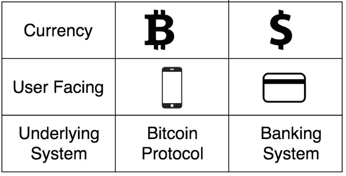

# 比特币到底有多安全？

> 原文：<https://medium.com/coinmonks/how-safe-is-bitcoin-really-937f5f1750fa?source=collection_archive---------78----------------------->

[https://tenor.com/view/bitcoin-crypto-animated-cryptocurrency-coin-gif-17578362](https://tenor.com/view/bitcoin-crypto-animated-cryptocurrency-coin-gif-17578362)

比特币是一种数字货币，其运行不受任何中央控制，也不受银行或政府的监管。相反，它依赖于点对点软件和加密技术。

每个事务都公开广播到网络上，并在节点间共享。每隔十分钟左右，这些交易就被矿工们收集到一个叫做区块的组中，并永久添加到区块链中。这是比特币的权威账本。

# **比特币系统 vs 现行系统。**

[https://www.researchgate.net/figure/Bitcoin-system-vs-current-system_fig1_331040157](https://www.researchgate.net/figure/Bitcoin-system-vs-current-system_fig1_331040157)

比特币和其他加密货币不断因其价格波动而成为新闻。但你知道吗，比特币其实比某些金融系统更安全？请继续阅读，了解为什么比特币最安全，它是如何工作的，以及如何保护您的数字资产的安全。

**比特币安全问题** 虽然比特币技术相当安全，但在投资前还是有一些风险需要考虑。比特币不是匿名的，加密货币的价格可能非常不稳定，比特币依赖于密码，加密货币钱包也不能幸免于盗窃。

> *加入 Coinmonks* [*电报频道*](https://t.me/coincodecap) *和* [*Youtube 频道*](https://www.youtube.com/c/coinmonks/videos) *了解加密交易和投资*

# 另外，阅读

*   [有哪些交易信号？](https://coincodecap.com/trading-signal) | [Bitstamp vs 比特币基地](https://coincodecap.com/bitstamp-coinbase) | [买索拉纳](https://coincodecap.com/buy-solana)
*   [ProfitFarmers 回顾](https://coincodecap.com/profitfarmers-review) | [如何使用 Cornix Trading Bot](https://coincodecap.com/cornix-trading-bot)
*   [十大最佳加密货币博客](https://coincodecap.com/best-cryptocurrency-blogs) | [YouHodler 评论](https://coincodecap.com/youhodler-review)
*   [my constant Review](https://coincodecap.com/myconstant-review)|[8 款最佳摇摆交易机器人](https://coincodecap.com/best-swing-trading-bots)
*   [MXC 交易所评论](/coinmonks/mxc-exchange-review-3af0ec1cba8c) | [Pionex vs 币安](https://coincodecap.com/pionex-vs-binance) | [Pionex 套利机器人](https://coincodecap.com/pionex-arbitrage-bot)