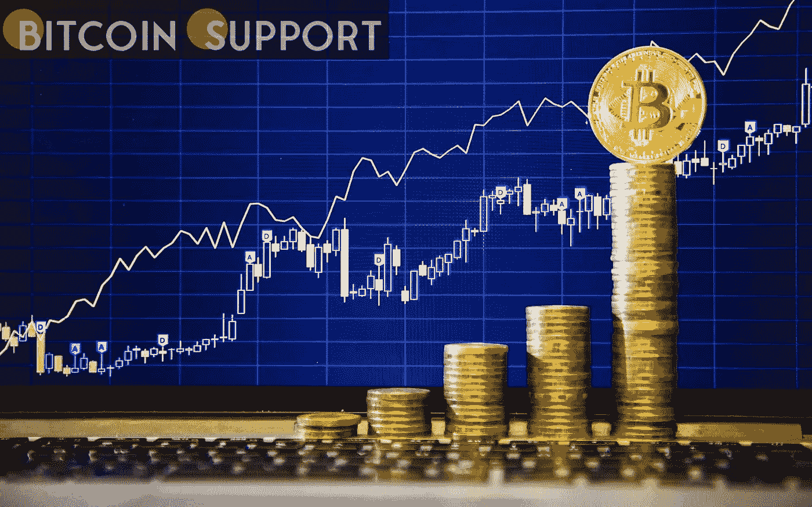
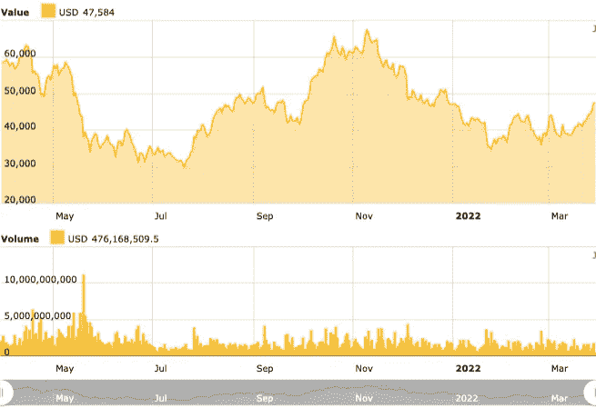

# 典型的投资者应该如何在厨房餐桌上处理比特币？

> 原文：<https://medium.com/coinmonks/how-should-typical-investors-handle-bitcoin-at-the-kitchen-table-e6de27de5056?source=collection_archive---------77----------------------->

**Visit our website:-** [**https://bitcoinsupports.com/**](https://bitcoinsupports.com/)

散户如果想投资加密货币，应该怎么做？追求登月还值得吗？近年来，加密货币已经取得了长足的进步，其市值已经超过 2 万亿美元，特斯拉和 MicroStrategy 等大型公司也在比特币上投资了数十亿美元(BTC)。

虽然近年来对加密资产的机构投资有所增加，但社交媒体一直被散户投资者应如何对待加密货币投资的讨论所主导。虽然有些人主张对小盘股替代币孤注一掷，但更谨慎的策略包括只投资比特币或利用指数来获得敞口。加密货币在年轻一代中更受欢迎，调查显示 83%的千禧一代百万富翁目前持有加密货币。那些不是百万富翁却挣着普通工资的人呢？到底该不该考虑加密货币？

**先照顾好自己**

传统的个人理财建议建议，在开始投资组合之前，投资者应该以现金形式积累几个月的生活费用，以备不时之需。节省这些钱的最佳方式因提供建议的人而异，但有一点是不变的，那就是你应该首先支付自己。

**Visit our website:-** [**https://bitcoinsupports.com/**](https://bitcoinsupports.com/)

比特币投资软件凯西的首席执行官比尔·巴尔海德特(Bill Barhydt)在接受采访时呼应了这一态度，称散户投资者“应该永远首先支付自己”另一方面，根据他的说法，首先支付自己，“意味着长期将储蓄储存在密码中，特别是比特币和以太网”。“除了高收益利息账户中的一些现金，”巴尔海德继续说道，他的大部分财富都是加密货币。他声称，在市场低迷时期，他会将 10%至 25%的储蓄投资于股票。

根据 Barhydt 的说法，加密货币资产应该包括在散户投资者的投资组合中，尽管他自己对“平衡投资组合概念”持保留意见“平衡的投资组合是为那些不做研究、不了解市场或者不能忍受短期损失的懒人准备的，”他继续说道。Barhydt 认为，成功的投资者“明白根据自己的信念和功课以及处理损失的能力集中投资是他们成功的秘诀。”加密货币交易所 Bittrex Global 的首席执行官斯蒂芬·斯通伯格(Stephen Stonberg)表示，对于小额投资或投资组合计划受限的散户投资者来说，“大规模加密投资可能不是最有意义的——但这并不意味着他们不应该投资”。根据 Stonberg 的说法，投资加密被比作 1993 年投资互联网，就在互联网泡沫破裂之前，“最好的方法是投资更成熟的货币，如比特币和以太”，它们有强大的用例和成熟的社区。他接着说，“

**”加密应该是更广泛投资组合的一部分，投资者应该进行自己的尽职调查。“多元化是一种屡试不爽的投资组合策略，事实证明它在面对动荡时具有弹性。”投资和金融网站 Investopedia 的主编凯莱布·西尔弗(Caleb Silver)更为谨慎，称加密货币是“波动性和投机性极强的资产，应该如此对待。”根据西尔弗的说法，加密货币“不应被视为平衡投资组合的工具。”根据该报告，鉴于“几个顶级加密货币”的成功，投资者可能希望考虑对该资产类别的有限敞口，但“不应该依赖它来平衡他们的投资组合”。北海巨妖的业务运营和战略主管托马斯·帕梅罗(Thomas perfume o)告诉记者，该交易所“不能就客户应该如何使用他们的钱提出建议”，但他对“通过下注获得激励的可能性”表示了热情当被问及一个投资组合应该投入多少资金时，大多数专家说，“因人而异”，任何实际数字总是低于 10%。

**投资加密货币、基金、还是指数好？**

2021 年初，摩根大通策略师认为，比特币 1%的投资组合配置可能会缓冲包括股票、债券和大宗商品在内的传统资产类别的波动。作为通胀对冲，亿万富翁雷伊·达里奥建议在 2022 年 1 月将旗舰加密货币的配置比例设定为 1-2%。Bittrex Global 的 Stonberg 表示，一个有点“安全”的配置是 5%，这被认为是低风险的，同时还允许“边际利润”。西尔弗表示，投资者在分配这 5%时，应该“充分意识到他们可能会很快失去这 5%”，他对斯通伯格的数据表示赞同。根据 Silver 的说法，加密指数基金、期货交易所交易基金(ETF)和其他多元化投资的风险可能较小，但仍然提供“比单个代币小得多的上行空间”他认为，区块链领域的公司和 ETF 将是一种选择。根据 Stonberg 的说法，“最经济的方法是直接购买加密货币，而不是持有指数”，因为如果投资者可以直接选择加密货币，就没有理由支持指数的托管和营销成本。**

**Visit our website:-** [**https://bitcoinsupports.com/**](https://bitcoinsupports.com/)

加密货币交易所 KuCoin 的首席执行官 Johnny Lyu 没有表明将进行何种类型的分配。相反，他指出，具体的建议是基于多种因素的，包括投资者的金融和技术素养，以及他们的目标、策略和风险偏好。根据 Lyu 的说法，更多精通密码的投资者应该比那些只感兴趣的投资者投入更多的资金。他接着说，“

**”不管你在加密上投资多少，知道数字货币如何工作都会给你在个人、财务和职业发展方面带来一定的优势。根据 Lyu 的说法，多元化是任何投资的黄金法则。各种类型的硬币，如顶级加密资产、稳定硬币、不可伪造代币、分散金融工具等等，构成了一个优秀的加密组合。他建议，这样的投资组合应该是包括非加密资产在内的更广泛投资组合的一部分。该领域的一个常见警告是，只投资投资者能够承受的损失，但如果投资者无法承受可能发生的损失，该怎么办？在暴跌之前，BTC 在 2017 年升至 2 万美元的高点。到 2018 年底，它已经吓坏了成千上万的投资者，交易价格略高于每股 3000 美元。

**说到加密投资，这一切都归结于风险承受能力**

随着比特币在 2021 年末达到近 69，000 美元的新高，那些有毅力继续其策略的人受益了。那些没有看到过山车展开的人都惊呆了。斯顿伯格提出了问题的答案:

**“从 crypto 开始，一个很好的方法就是搞清楚你的风险承受能力:你要投入多少资金，你要冒多大的风险。"**

即使一些投资者在明知自己的投资可能会失去所有价值的情况下将辛苦赚来的钱投入加密货币，加密货币及其创新显然将会长期存在。BTC 变得如此受欢迎，以至于被比作数字形式的黄金。随着加密货币变得越来越普遍，斯顿伯格认为“在未来一两年内，加密投资将成为一个家庭经常谈论的话题。西尔弗对此表示赞同，称“金融、投资和支付正在向密码世界转移。“我们对这些话题谈论和了解得越多，我们对消费者和投资者就越有利。”根据 Barhydt 的说法，加密货币投资应该是一个次要的投资辩论，首先是“家庭如何确保他们能够首先支付自己？”最终，首先考虑比特币投资的目的是非常关键的。由于 BTC 抵制审查，购买其股票的投资者很容易容忍短期价格波动。对于那些想提前退休、住在孤岛上的人来说，无论选择何种投资工具，熊市都可能成为一场噩梦。

**访问我们的网站:-**[**https://bitcoinsupports.com/**](https://bitcoinsupports.com/)

**免责声明:以上为作者观点，不应视为投资建议。读者应该自己做研究。****

> 加入 Coinmonks [电报频道](https://t.me/coincodecap)和 [Youtube 频道](https://www.youtube.com/c/coinmonks/videos)了解加密交易和投资

# 另外，阅读

*   [AscendEx 保证金交易](https://coincodecap.com/ascendex-margin-trading) | [Bitfinex 赌注](https://coincodecap.com/bitfinex-staking) | [bitFlyer 点评](https://coincodecap.com/bitflyer-review)
*   [Bitget 回顾](https://coincodecap.com/bitget-review)|[Gemini vs block fi](https://coincodecap.com/gemini-vs-blockfi)cmd |[OKEx 期货交易](https://coincodecap.com/okex-futures-trading)
*   [AscendEx Staking](https://coincodecap.com/ascendex-staking)|[Bot Ocean Review](https://coincodecap.com/bot-ocean-review)|[最佳比特币钱包](https://coincodecap.com/bitcoin-wallets-india)
*   [霍比评论](https://coincodecap.com/huobi-review) | [OKEx 保证金交易](https://coincodecap.com/okex-margin-trading) | [期货交易](https://coincodecap.com/futures-trading)
*   [网格交易机器人](https://coincodecap.com/grid-trading) | [Cryptohopper 审查](/coinmonks/cryptohopper-review-a388ff5bae88) | [Bexplus 审查](https://coincodecap.com/bexplus-review)