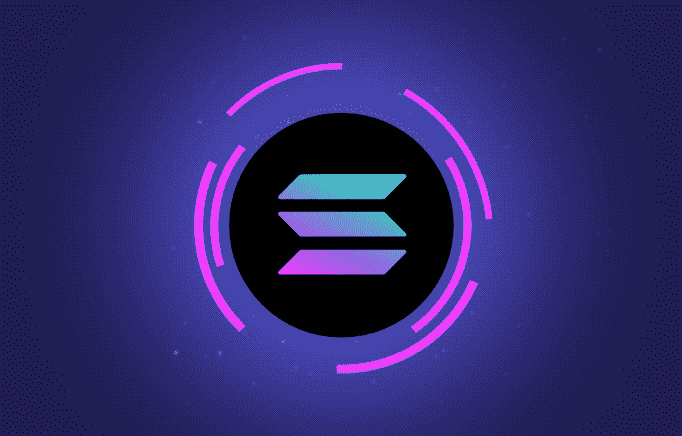

# 索拉纳如何革新区块链技术

> 原文：<https://medium.com/coinmonks/how-solana-is-revolutionizing-blockchain-technology-6344dd9fa199?source=collection_archive---------25----------------------->

加密货币通过引入点对点交易，并从传统金融服务的设计中去除中介，标志着金融和技术新时代的开始。然而，比特币和以太坊等流行的加密货币在可扩展性方面具有突出的局限性。就特定的交易顺序达成共识所需的时间不可能按比例增加，这就是为什么像 Solana 或 SOL 这样的替代品成为解决这类问题的有希望的解决方案。

Solana 是一种新的区块链技术，它正在彻底改变我们对加密货币的看法。有了索拉纳，交易就不需要中间人了。这意味着点对点交易现在是可能的，这是密码世界的一大进步。此外，Solana 比其他流行的加密货币如比特币和以太坊的可扩展性强得多。这是因为索拉纳在就特定的交易顺序达成共识所需的时间方面没有同样的限制。因此，索拉纳绝对是一个值得关注的区块链技术！

如果你有兴趣了解更多关于索拉纳的信息，请点击这个链接:solanalabs.com/whitepaper.pdf。solana-one.com 也是了解索拉纳最新消息的一个很好的资源。最后，一定要在 Twitter 上关注@solana，了解最新消息和更新！区块链技术肯定是未来几年需要关注的东西。谁知道呢，索拉纳甚至可能会彻底改变我们对加密货币的看法！

你对索拉纳有什么看法？你一直在关注它的发展吗？请在下面的评论中告诉我们！

阅读这篇文章的人也阅读了[绿色氢:燃料的未来](/@hydrogencoin/green-hydrogen-the-fuel-of-the-future-cc7e3f18e179)

 [## Hydrogencoin -基于 Solana 区块链的 DeFi 基金

### Hydrogencoin.io 是全球首个绿色氢的 DeFi 基金

氢币. io](http://hydrogencoin.io/) 

> 加入 Coinmonks [电报频道](https://t.me/coincodecap)和 [Youtube 频道](https://www.youtube.com/c/coinmonks/videos)了解加密交易和投资

# 另外，阅读

*   [Pionex 双投](https://coincodecap.com/pionex-dual-investment) | [AdvCash 审核](https://coincodecap.com/advcash-review) | [支持审核](https://coincodecap.com/uphold-review)
*   [面向开发者的 8 个最佳加密货币 API](https://coincodecap.com/best-cryptocurrency-apis)
*   [维护卡审核](https://coincodecap.com/uphold-card-review) | [信任钱包 vs MetaMask](https://coincodecap.com/trust-wallet-vs-metamask)
*   [赢取注册奖金——10 大最佳加密平台](https://coincodecap.com/earn-sign-up-bonus)
*   [Exness 回顾](https://coincodecap.com/exness-review)|[moon xbt Vs bit get Vs Bingbon](https://coincodecap.com/bingbon-vs-bitget-vs-moonxbt)
*   [如何开始通过加密贷款赚取被动收入](https://coincodecap.com/passive-income-crypto-lending)