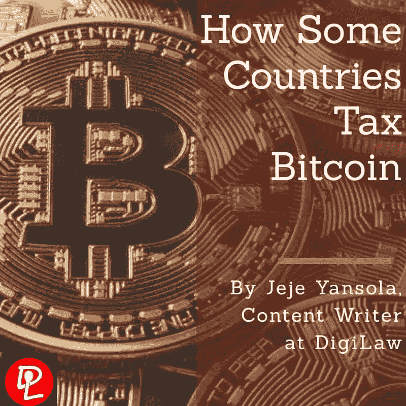
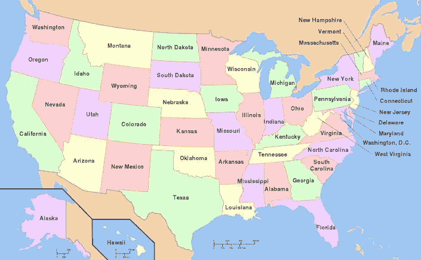
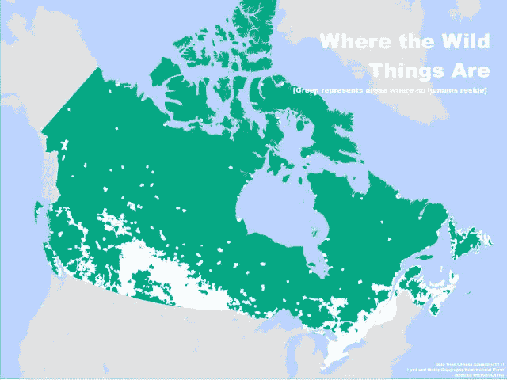
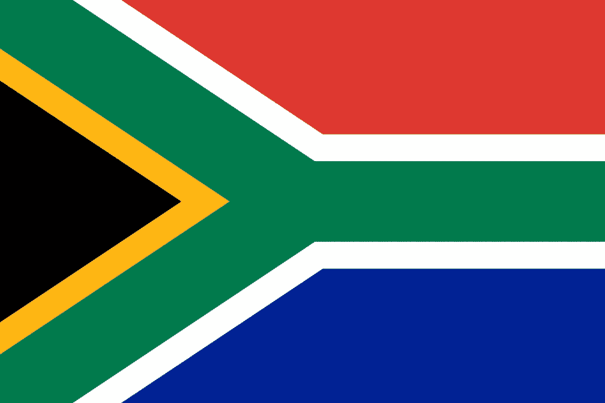

# 一些国家如何对比特币征税

> 原文：<https://medium.com/coinmonks/how-some-countries-tax-bitcoin-d0ad6595c8a0?source=collection_archive---------57----------------------->

最初发表于 2019 年 3 月 24 日，作者 [Oluwanyansola Jeje](https://www.linkedin.com/in/oluwayansola/)

## 介绍

*“这个世界上没有什么是确定的，除了死亡和税收”*

*   本杰明·富兰克林

加密货币是一种数字资产，旨在作为一种交易媒介，使用强大的加密技术来保护金融交易，控制额外单位的创建并验证资产的转移。“硬币”带有可以转移的价值，尽管由于这种价值纯粹是投机性的，没有基础资产或中央权力机构(如银行)的支持，它可能非常不稳定。

正是因为这个原因，它通常被称为数字或加密资产，而不是货币。

在这个加密货币投资的季节，市场可能看起来像一场淘金热；提供承诺，但以牺牲可预测性为代价。对比特币交易商来说，对加密货币征税是最大的变化。在几乎所有司法管辖区，都没有关于加密货币税收的具体税法，因此，税务处理基于税务机关发布的一般原则和指导。

但是，加密货币到底是数字货币还是应税商品？由于其不稳定性，大多数国家都没有将加密货币视为一种国内法定货币。这可能会在不久的将来改变。

## 美利坚合众国

在美国，IRS 通知 2014–21 将虚拟货币定义为财产。这意味着，使用数字货币购买的任何东西都可能被作为资本利得征税，无论是短期还是长期，取决于资产持有的时间。为了说明这一点，如果你用价值 1000 美元的比特币买了一杯咖啡，你还必须考虑购买咖啡时比特币的价格。

如果你买咖啡时比特币的交易价格是 1200 美元，那么你就购买了一件以美元计价的商品，而另一项资产的美元价值现在比过去更高了。这意味着你花在咖啡上的比特币金额将根据资本收益规则被征税。

值得注意的是，购买和持有加密货币不是一件应纳税的事情，但如果你使用数字硬币购买任何东西，即使只是一杯咖啡，在你的持有物增值后，你就获得了收益，这是应纳税的。因此，对于每一次购买，你必须报告你花了多少钱，以及你花这笔钱时的币值和你第一次得到这笔钱时的币值之间的差额。

对于敏锐的眼睛来说，这些原则暴露了一些灰色地带。作为 CoinTracker 的创始人之一，Chandan Lodha 观察到:

*“你对加密货币的使用越投入，追踪国税局需要的一切就越复杂”*

这意味着，你必须在会计和记账方面做大量的工作，才能真正希望正确纳税。

此外，一些交易商通过诉诸一种名为“同类例外”的东西，成功地避免了加密货币对加密货币交易的税收，这种东西允许人们在用一种财产交易另一种类似财产时推迟纳税。举例来说，如果你把你的房子换成另一栋房子，房子增值了，在你有现金购买之前，你不必为这种增值缴税，因为增值或增值实际上与房子本身有关。

然而，2017 年税收法案的一部分将这一例外限制在房地产领域，这意味着加密货币交易商必须对 2017 年 12 月 31 日之后进行的加密对加密交易纳税。那之前的交易呢？那有点模糊。

## 德国

在德国，比特币销售不产生资本利得税。就是德国不会对你用比特币买咖啡征税。但是，如果投资期限少于一年，则适用德国所得税。也就是说，如果你在 12 个月/一年或更长时间后出售你的比特币，那么这些资本收益是完全免税的。举例来说，假设你在 2016 年 8 月 1 日买了 1 个比特币，在 2018 年 9 月 1 日又买了 1 个比特币。

2018 年 9 月 2 日，你卖出了你在 2016 年 8 月 1 日买入的 1 比特币。在这种情况下，你在菲亚特套现第一个比特币后，不需要支付任何资本税收益。正是因为这个原因，大多数税务专家认为德国是中长期加密持有者的免税天堂。德国的所得税更具累进性，最高可达 45%。

到目前为止，没有一个国家在税法中接受加密货币方面迈出了如此开放和雄心勃勃的一步。

## 澳大利亚

然而，在澳大利亚，澳大利亚税务局(ATO)在其官方网站上发布了一些关于加密货币税收的指导方针，并向公众开放。在澳大利亚，比特币既不被视为货币，也不被视为澳大利亚货币或任何其他外币，这让事情变得有点扭曲。它被视为一种资产，应缴纳资本利得税(CGT)，除非作为个人资产使用(如果加密货币是作为投资、盈利计划或开展业务的过程中获得、保存或使用的，则不属于个人资产)。

这适用于所有其他加密货币，如比特币。

根据澳大利亚税务局的说法，当你出售你的加密货币时，CGT 是适用的。然而，你所有的持股必须在报税时提及，以避免任何问题。从本质上说，你只在卖出时纳税，而不仅仅是买入和持有。

如前所述，加密到加密交易是税务领域最大的问题之一。在澳大利亚，这种交易是要纳税的。澳大利亚税务局特别提到，在兑换一种加密货币以赚取另一种加密货币的同时，意味着你在出售第一种加密货币，并购买第二种加密货币。

## 加拿大

2013 年，加拿大税务局(CRA)认为比特币和其他加密货币不是货币，而是应该被视为商品。实质上，50%的收益是要纳税的，并计入你当年的收入。为了说明这一点，如果你以 1000 美元购买了一种加密货币，随后以 3000 美元出售，你必须报告 1000 美元的资本利得(2000 美元的 50%)，这将被添加到你的收入中，并按你的边际税率征税。

然而，假设你花 100 美元买了 1 个比特币，但它目前的市场价值是 15，000 美元，你决定翻新你的房子，承包商同意用他的服务换 1 个比特币，通常价值 15，000 美元。税收待遇如何？在这种情况下，双方都有纳税义务。原始所有者将支付 7450 美元的资本收益(14900 美元的 50%)，而承包商仍需要报告 15000 美元的业务收入。

这种交易被称为易货交易，在《加拿大所得税法》第 3、6 和 69 节中有充分的规定。

老实说，说这种税收待遇有点苛刻是一种保守的说法。

## 南非

作为南非主要的税收监管机构，南非税务局于 2018 年 4 月发布了一项加密货币税收立法草案。根据立法，像比特币这样的数字货币将被列为无形资产，需要缴纳所得税。因此，如果该草案成为法律，南非人将依法申报从加密交易中获得的收入。

然而，该立法草案还规定，加密货币交易免征增值税(VAT)。这一决定的前提是，特别报告员认为此类交易与金融服务交易是分开的。因此，在拟议的加密货币税收模式下，购买、出售、转让、拥有、发行和持有数字代币不会产生增值税。

## 结论

就像所有的秘密一样，兔子洞越挖越深，一些人正在尝试各种方法来减少他们的税单。

然而，尽管许多关于在不同国家对加密货币征税的一般原则的问题仍然没有答案，但我们只能希望在不久的将来会更加清晰。这种不明确性并不会影响或动摇税收在一国经济中的重要性。SPA Ajibade 的助理律师 Olukayode Ehimosan 在他题为“[改善尼日利亚的税收制度”](https://mylawaxis360.wordpress.com/2019/01/18/improving-the-nigerian-tax-ttitude/)的文章中尖锐地讽刺说，税收对于一个国家的经济就像是一扇门的铰链

*“税收是维持经济平衡和使经济适当多样化的最可行的希望。它的潜力太大，无法量化……”*

加密货币已经进入集体意识，并在全球范围内得到越来越多的采用。各国政府仍在试图找出向他们征税的方法。虽然有些取得了成功，但有些遇到了困难。或许，在不久的将来，我们可以找到更有创意的方法来有效地对加密货币征税。

> *加入 Coinmonks* [*电报频道*](https://t.me/coincodecap) *和* [*Youtube 频道*](https://www.youtube.com/c/coinmonks/videos) *了解加密交易和投资*

# 另外，阅读

*   [3 商业评论](/coinmonks/3commas-review-an-excellent-crypto-trading-bot-2020-1313a58bec92) | [Pionex 评论](https://coincodecap.com/pionex-review-exchange-with-crypto-trading-bot) | [Coinrule 评论](/coinmonks/coinrule-review-2021-a-beginner-friendly-crypto-trading-bot-daf0504848ba)
*   [莱杰 vs n rave](/coinmonks/ledger-vs-ngrave-zero-7e40f0c1d694)|[莱杰 nano s vs x](/coinmonks/ledger-nano-s-vs-x-battery-hardware-price-storage-59a6663fe3b0) | [币安评论](/coinmonks/binance-review-ee10d3bf3b6e)
*   [Bybit Exchange 审查](/coinmonks/bybit-exchange-review-dbd570019b71) | [Bityard 审查](https://coincodecap.com/bityard-reivew) | [Jet-Bot 审查](https://coincodecap.com/jet-bot-review)
*   [3 commas vs crypto hopper](/coinmonks/3commas-vs-pionex-vs-cryptohopper-best-crypto-bot-6a98d2baa203)|[赚取加密利息](/coinmonks/earn-crypto-interest-b10b810fdda3)
*   最好的比特币[硬件钱包](/coinmonks/hardware-wallets-dfa1211730c6) | [BitBox02 回顾](/coinmonks/bitbox02-review-your-swiss-bitcoin-hardware-wallet-c36c88fff29)