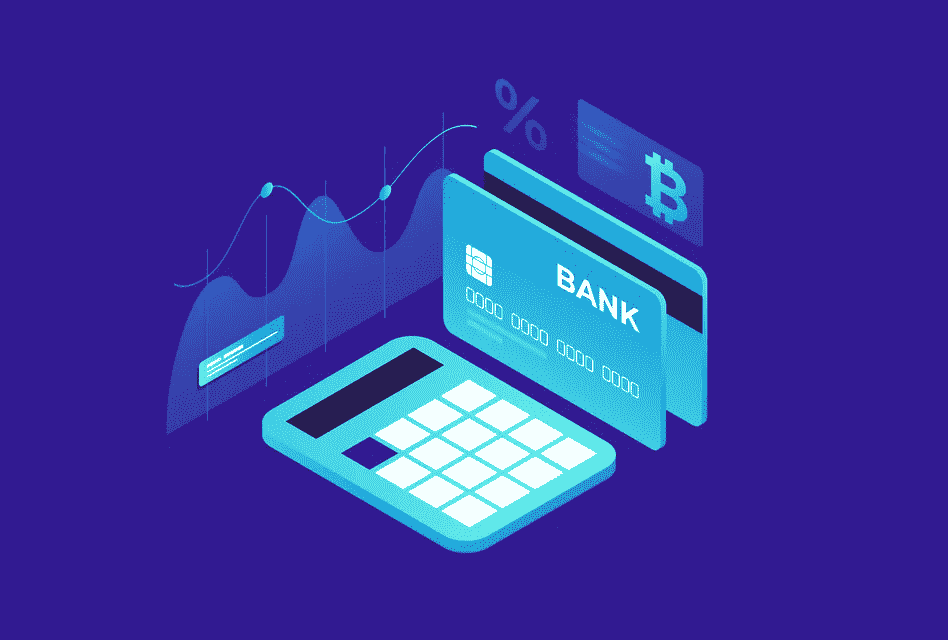

# 区块链如何优化 Nostro 账户的流动性以降低成本

> 原文：<https://medium.com/coinmonks/how-the-blockchain-optimizes-liquidity-of-nostro-accounts-to-reduce-costs-1fb0c23c651c?source=collection_archive---------34----------------------->

**什么是往来账户？**

往来账户是公司用来管理国际支付的外币银行账户。Nostro 一词来自意大利语，意为“我们的”,指的是由另一个国家的银行持有的任何货币账户。

**它们是如何工作的？**

Nostro 账户允许银行跨境转移资金，而无需实际转移资金。因此，举例来说，当您进行国际支付时，您的银行会将钱从您所在国家的往来账户汇至收款人所在国家的往来账户。这确保了资金安全、快速、低成本地到达。

**它们是做什么用的？**

Nostro 账户最常用于有许多国际交易或全球子公司的大公司。然而，它们也可以用于有外国投资的公司或需要在国家之间频繁转移资金的子公司。

但是，重要的是要注意往来账户的一些限制；

1.它们的维护成本很高。

2.管理它们可能非常耗时，尤其是当您有多个交易对手时。

3.它们要求你为每个对手持有额外的资本，这会影响你的股本回报率和流动性比率。

[**区块链何去何从**](https://www.linkedin.com/in/wale-badmus-5b848923a/)

**区块链提供 Nostro 账户的分布式追踪。**

银行维持往来账户以方便国际支付。它们被用来结算使用不同货币的贸易伙伴之间的支付，银行的资金必须支持它们。

区块链提供了对这些账户的实时跟踪，这有助于降低成本和提高效率。

**区块链实时跟踪未决和失败的交易**

Blockchain is able to track all transactions

由于与未决交易相关的问题，Nostro 账户中的实时流动性更新几乎不可能实现。挂起的事务有时会保持挂起状态几个小时甚至几天。

因为某些交易可能是非法活动调查的一部分，所以我们在营业时间后显示交易的状态。因此，我们无法向您展示该交易在一天中会发生什么，但我们可以在交易完成后告诉您其状态。

由于系统的分散结构，区块链交易处理速度很快。未决交易可以通过一个名为 mempool 的独特系统进行跟踪，该系统可以显示哪些交易在 BTC 和瑞士联邦理工学院失败了。成功的交易会立即显示在 Etherscan 上。

如果 Nostro 帐户正在使用区块链，那么跟踪未决交易将很容易。所有报告都可以实时生成，无需等到一天结束时才能准确了解待处理和成功的交易。

**不变性、持久性和稳定性**

区块链的不变性、持久性和可扩展性属性可以帮助减少与 Nostro 帐户相关的流动性问题，方法是永久存储每笔交易，并使其在未来易于引用。

这意味着 Nostro 帐户持有人可以完全了解他们的帐户信息，包括余额、付款和收款，这可能有助于减少维护健康的资产负债表所需的手动对账。

**降低运营成本**

通过使用区块链解决流动性问题可以大幅降低运营成本。与往来账户相关的运营成本主要来自对账活动。

如上所述，[区块链可以帮助优化实时流动性跟踪。](https://www.linkedin.com/in/wale-badmus-5b848923a/)这种优化将降低运营成本。通过实时提供数据，对账将实时完成；因此，仅提供实时数据就能大幅降低运营成本。

总之，区块链技术解决了 Nostro 账户的许多弊端，它允许跟踪者拥有一个单一的网络来处理他们所有成功的和未决的交易，使他们无需太多帮助就可以轻松地更新流动性数据。

> 加入 Coinmonks [电报频道](https://t.me/coincodecap)和 [Youtube 频道](https://www.youtube.com/c/coinmonks/videos)了解加密交易和投资

# 另外，阅读

*   [MXC 交易所评论](/coinmonks/mxc-exchange-review-3af0ec1cba8c) | [Pionex vs 币安](https://coincodecap.com/pionex-vs-binance) | [Pionex 套利机器人](https://coincodecap.com/pionex-arbitrage-bot)
*   [我的加密副本交易经历](/coinmonks/my-experience-with-crypto-copy-trading-d6feb2ce3ac5) | [比特币基地评论](/coinmonks/coinbase-review-6ef4e0f56064)
*   [CoinFLEX 评论](https://coincodecap.com/coinflex-review) | [AEX 交易所评论](https://coincodecap.com/aex-exchange-review) | [UPbit 评论](https://coincodecap.com/upbit-review)
*   [AscendEx 保证金交易](https://coincodecap.com/ascendex-margin-trading) | [Bitfinex 赌注](https://coincodecap.com/bitfinex-staking) | [bitFlyer 评论](https://coincodecap.com/bitflyer-review)
*   [麻雀交换评论](https://coincodecap.com/sparrow-exchange-review) | [纳什交换评论](https://coincodecap.com/nash-exchange-review)