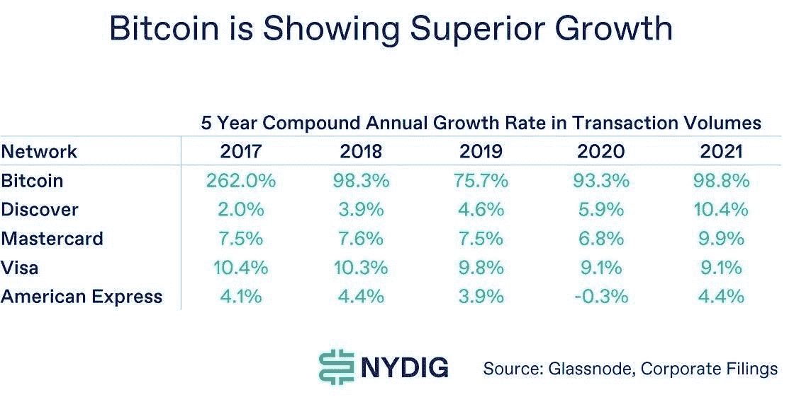

# 经济衰退将如何影响比特币和加密？

> 原文：<https://medium.com/coinmonks/how-the-economic-recession-will-affect-bitcoin-crypto-37010a92ea8f?source=collection_archive---------4----------------------->

Image source: ccnull.de

随着全球通胀逐月创新高，美联储和各国央行采取更加强硬的语气，美国和全球经济非常容易受到即将到来的衰退或可能的滞胀的影响。

如果预测是正确的，全球经济最早将于明年面临另一场重大衰退，加密货币市场和比特币可能会出现截然不同的结果。

# 这对比特币和加密货币市场意味着什么？

Image source: QuoteInspector.com

加密货币市场前所未有地与股票和债券同步发展。道琼斯市场数据显示，加密货币与美国主要股指的三个月相关性在上周达到最高水平。

相关性为 1 表示市场同步运行，而相关性为 0 表示它们不相关。根据市场情报工具 IntoTheBlock 的数据，股市和加密之间的关联度现在达到了 0.9 的历史高点。

Image source: twitter.com/intotheblock

这是 2019 年至 2021 年加密货币和 SNP500 之间平均相关性的三倍以上。

这意味着，当投资者在下跌的市场中抛售时，通常影响股市的所有宏观经济逆风将对所有数字资产产生相同的影响。

然而，必须区分比特币和加密货币领域的其他产品。

# 截然不同的事

风险资本和机构投资者为大多数智能合约区块链和许多其他加密货币项目提供资金。这些区块链是由注册公司(许多是离岸公司)开发和推出的，这些公司都有营销预算、分配给团队和基金会的令牌、赠款池、总部、创始人、首席执行官、首席财务官、首席运营官等等。

Image source: bloomberg.com

从本质上讲，这些是私有软件公司，它们将去中心化的区块链作为它们的主要产品/服务，同时遵守 ESG 公司政策。有些人比其他人更成功，但目标是一样的:为一个去中心化的区块链提供智能合约。

他们有多分散？

尽管一些著名的智能链在区块链级别上是分散的，具有大量广泛分布的节点，但它们在其他方面不是分散的。

绝大多数在团队/开发者层面没有去中心化，依靠少数个人和机构来开发和运营区块链。以太坊就是一个很好的例子，它的发展在很大程度上是按照其创始人 Vitalik Buterin 的愿景进行的，Vitalik buter in 有权按照自己的喜好指挥项目(例如以太坊的“难度炸弹”)。此外，没有机构群体共识流程来批准方案变更。

此外，在最初的硬币分配中，各种集中化方面可能是明显的；治理；或者基础设施级别，例如依赖中央组织，如 Infura 或 AWS 的云计算服务来操作 dApps 与 dApps 交互或存储整个交易历史。

去年 3 月，非托管钱包提供商 MetaMask 就发生了这样的事件，该公司原本打算去中心化。

Image source: metamask.zendesk.com

**投资者和熊市**

在行为经济学的子领域行为金融学中，投资者在投资时表现出羊群行为，投资者在熊市中偏向于风险资产(Kjelldorff & Keskitalo，斯德哥尔摩经济学院，2009 年 11 月)。

因此，在熊市期间，支持大多数区块链项目的机构可能会大幅降低其资金/投资或完全放弃一些项目，这将对加密市场产生重大影响。

Image source: pwc.com

在互联网繁荣时期，我们目睹了网络股的类似表现。许多投资者急于投资任何网络初创公司，不管价值如何。吸引风险资本很简单，而从 IPO 中获得丰厚利润的投资银行刺激了投机和技术投资。然而，在互联网泡沫破裂期间，机构投资者撤资，导致许多公司破产，其他幸存下来的公司，如亚马逊和思科，市值损失 80%。

智能合同区块链尚未实现主流采用。与早期的科技股类似，DeFi、区块链游戏、元宇宙、health on chain、move-to-earn、NFTs 行业需要更多的创新和开发，以推动加密市场的采用和价值。因此，随着更多使用案例和新的创新应用的开发，密码市场可能会出现反弹。如果滞胀和经济危机与上世纪 70 年代类似，这可能需要数年时间。

必须指出的是，许多智能合同区块链有巨大的潜力。已经实现了令人难以置信的大量创新，或许从长远来看，随着加密令牌的成熟和发展，我们将看到加密资产与科技股脱钩。

另一方面，比特币是另一回事。

# 比特币

Image source: flickr.com

是的，比特币和其他密码一样，与股票市场相关，可能会面临巨大的抛售压力，但我们认为这将是暂时的。

**安娜·卡列尼娜原理**

安娜·卡列尼娜原则是基于列夫·托尔斯泰的《安娜·卡列尼娜》*的开篇台词，“所有幸福的家庭都是相似的；不幸的家庭各有各的不幸”*适用于金融市场。

本质上，牛市似乎有许多特征:万物繁荣，央行参与，情绪良好，资金流动。然而，在熊市中，每种资产似乎都有自己的“不开心之处”。

比特币将按照自己的规则运行，在我们看来，它将更快复苏。这样做的理由很简单:比特币是一种公共商品——一个由能源而非人类决策驱动的去中心化支付网络，其中每个人都可以就其分类账和历史交易数据达成一致——这是真正的民主化和货币去中心化。

# 比特币——作为支付网络

比特币是世界上最安全、发展最快的支付网络。截至 2021 年底，交易量在过去 5 年中每年增长约 100%(g . Cipolaro，E. Kochav，NYDIG，2022 年 1 月):

Image source: NYDIG report (LinkedIn)

人类已经彼此交易了数千年，并将继续这样做数千年。在过去的 10，000 年里，货币的物质形式发生了巨大的变化，从牛和贝壳到今天的电子货币。只要人类存在，交易就会继续，比特币是增长最快的替代货币形式，尽管只有 13 年的历史，但已被两个民族国家作为法定货币使用。

**闪电网**

闪电网络是建立在比特币之上的支付协议。这是一个分散的系统，用于用户之间的即时、大量小额支付。这可以说是确定比特币作为“支付网络”的用例的最佳工具，以及它被用于支付真实世界商品和服务的活跃程度，而不仅仅是“交易”。

比特币闪电网络正在快速增长，现在估计有超过 8000 万用户可以访问这个网络，而 2021 年 8 月只有 10 万。根据 Arcane Research 的数据，在 2022 年的前两个月，Lightning Network 处理了超过 100 万笔支付，支付额约为 4500 万美元，同比增长 410%。

所有这些付款的分布如下:

Image source: Arcane Research Report 2022

通过对闪电网络交易进行分解，我们可以更好地理解它们。在 2022 年的前两个月，总支付量的大约一半是在个人之间直接交换的。这些款项可用于各种目的，包括向海外家庭汇款、借钱给朋友、从邻居那里购买物品等等。

20%的支付是通过支付处理器处理的商品或服务购买，或通过礼品卡间接购买。

由于大多数闪电网络交易反映了真实经济价值的支付，如支付商品和服务，比特币作为支付网络的用例得到了加强。

**比特币引领采用**

就市值和用户数量而言，比特币继续占据加密市场的最大份额。

根据 Crypo.com 报告，截至 2022 年，全球 2.95 亿加密用户中约有 1.76 亿人(不到 60%)拥有比特币，而只有约 2300 万人(不到 8%)拥有以太坊。

Image source: crypto.com

尽管比特币的市值下降，表现为 2021 年 11 月至 12 月 BTC 的主导地位下降到 40%以下，但这并没有影响拥有比特币的人数。

新的加密用户正在采用比特币，而不是以太坊或任何其他加密货币。

Image source: crypto.com

根据该报告，2021 年下半年，比特币用户数量增长了 37.5%，从 7 月的 1.28 亿增加到 12 月的 1.76 亿。另一方面，以太坊的用户数量在此期间仅增长了 1.4%。

尽管以太坊(Ethereum)等智能合约区块链在 DeFi、游戏和 NFT 方面表现出了实质性的创新，但全球采用还需要更多时间，而比特币已经有了一个经过验证的真实世界用例——一个安全、值得信赖的支付网络，被全球数百万人使用。

**质量超过数量**

虽然像 Solana 和以太坊这样的智能合约区块链处理的交易比比特币多得多，但这些交易中的大多数都没有什么经济价值。

例如，挖掘池是加密挖掘系统的集合，在它们之间分发部分加密货币，在区块链上创建成千上万的交易。这些没有任何经济价值。另一个例子是垃圾邮件，它是交易数量上升的主要原因。以太坊尤其如此，它在区块链上支持数千个代币。彭博报告指出，垃圾邮件为以太坊贡献了 19%的非经济价值。

根据 Coinmetrics 的数据，Cardano 的整体交易中有 98%是毫无价值的。另一家分析公司 Elementus Inc .发现，以太坊网络上 45%的交易由非经济交易组成，如垃圾邮件。Coinmetrics 从以太坊的区块链中扣除了非经济交易的数量，得出了以太坊每天 7 亿美元的真实经济交易额，即每年 2550 亿美元。

相比之下，比特币的真实经济交易量为每年 3 万亿美元。根据 NYDIG 的研究，比特币在 2021 年处理了 3.0T 美元的支付，超过了美国运通(1.3T 美元)和 Discover(0.5T 美元)等知名的卡网络。为了避免误报这些数据，NYDIG 报告排除了没有经济价值的交易。

Image source: NYDIG report (LinkedIn)

鉴于以太坊是区块链最大的智能合约，拥有大多数 DeFi 和 NFT(根据 defillama.com)，有理由假设另一个区块链处理的真实经济交易量远低于以太坊。

# 比特币——作为价值储存手段

Image source: Flickr.com

摩根大通全球市场策略师 Nikolaos Panigirtzoglou 和他的团队认为，比特币可能会成为黄金的替代品。通常被称为“数字黄金”的比特币拥有一些与黄金相同的属性，这些属性使黄金成为历史上最重要的资本守护者之一:它很难开采，它很稀缺，耐用，并且没有主权。

这家投资银行的策略师表示，比特币和黄金的总市值最终可能会持平，因为它们服务于相同的目的。然而，由于波动性在机构投资者的风险管理中非常重要，在波动性消退之前，机构持有的比特币市值不太可能达到黄金的水平。最新数据表明，这已经开始发生。

Image source: Bloomberg Finance

# 比特币——作为人权活动家的工具

此外，比特币在许多场合被用作全球人权活动人士的金融工具。罗亚·马布卜是非营利数字公民基金的创始人，她和姐姐在赫拉特和卡布尔的中心教授数千名女孩和妇女基本的计算机技能。女性也写博客和制作视频，她们的报酬是比特币，因为大多数女孩和妇女没有银行账户，因为她们不被允许。

或者是 Farida Nabourema 的故事，他是多哥的一名人权活动家，他抗议多哥的独裁政权要求民主变革，有史以来第一次带领数十万人走上街头，但遭到大规模镇压。Farida 运动支持者的捐款帮助组织了抗议活动并提供了基本资源，但被多哥政府冻结。这导致他们向邻国汇款，并将现金跨境走私到多哥，直到她发现了比特币。这使得资金可以直接转移，多哥的极权政府无法没收任何资金。

# 摘要

正如国际货币基金组织、高盛和德意志银行等多家知名机构所预测的那样，我们似乎正处于全球衰退的风口浪尖，所有市场都将受到影响。投资者将会寻找安全的避风港，最好的自然会存活下来。

重要的是要明白加密和比特币不是一回事。智能合同区块链在这里停留，由于他们令人难以置信的创新和创造新的市场机会。比特币可能会偏离轨道，打造自己的道路。比特币的关键属性是它真正的去中心化——它是唯一一种不需要你信任某人的交易媒介，这在当今不完美的世界中是一个重大突破。

*免责声明:本文包含的信息仅用于教育目的，并不构成 Wheatstones 的任何形式的建议或推荐，用户在做出(或避免做出)任何投资决定时也不打算依赖这些信息。*