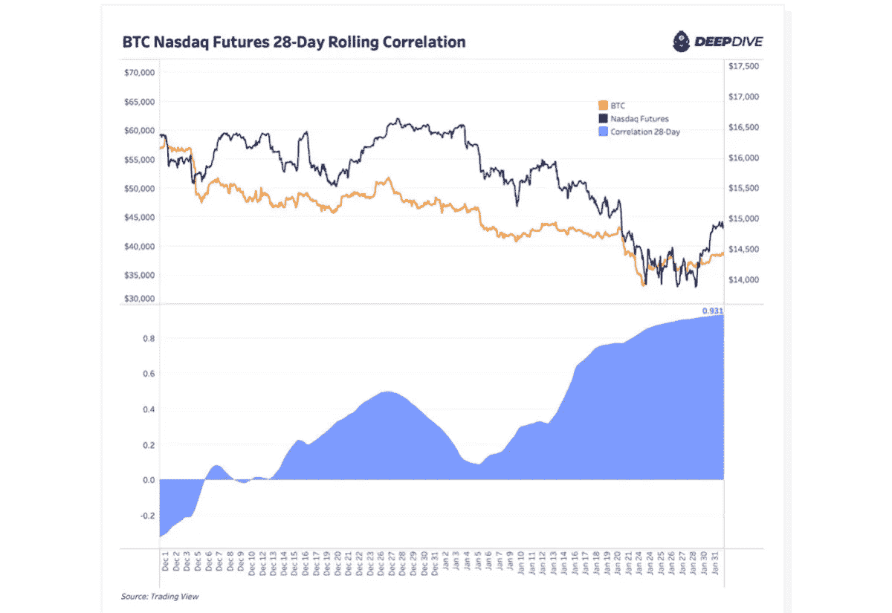
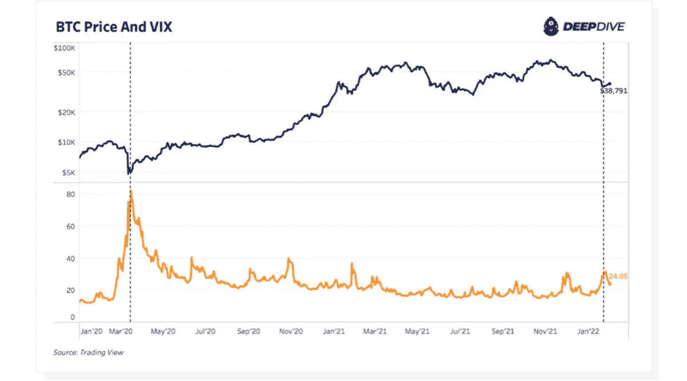
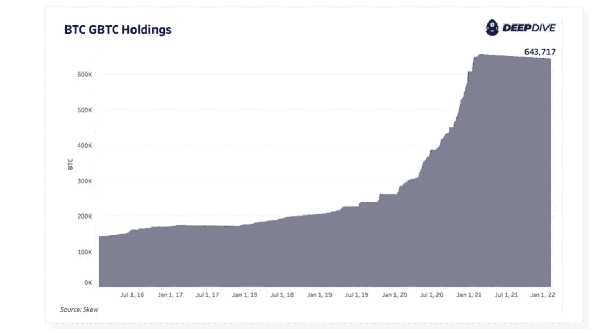
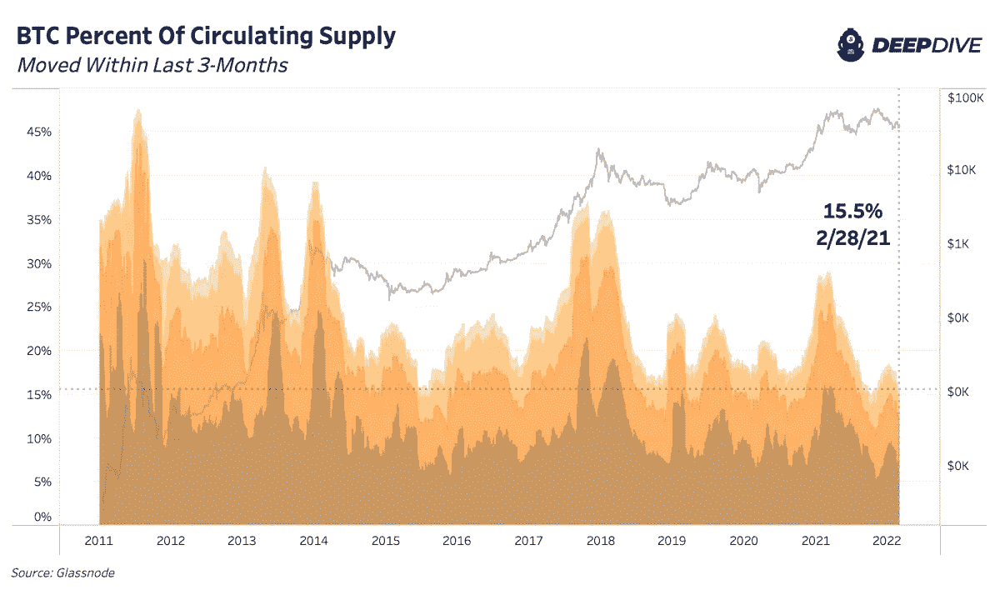
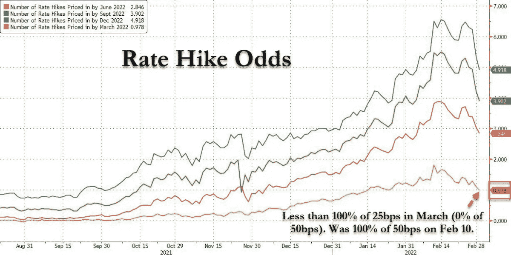

# 最新的宏观经济趋势如何影响比特币

> 原文：<https://medium.com/coinmonks/how-the-latest-macroeconomic-trends-are-impacting-bitcoin-b51f8b864dc2?source=collection_archive---------84----------------------->

股票相关性、灰度、俄罗斯、稳定的硬币、加息等等如何影响今天的比特币价格。

[**在 YouTube 上看这一集**](https://www.youtube.com/watch?v=Q4IhNBCQ_X8&t=13s)

**听这一集:**

*   苹果
*   [Spotify](https://open.spotify.com/episode/2VDy3IwK5bGqIp4iqpDZES?si=c8d236c7412042cc)
*   [谷歌](https://podcasts.google.com/feed/aHR0cHM6Ly9mZWR3YXRjaC5saWJzeW4uY29tL3Jzcw/episode/ZTZkYzM1ZDQtMWUzOS00ODM0LWI3NDMtNTA3YjA2ZDQ3NGJi?sa=X&ved=0CAUQkfYCahcKEwiY18Txxaz2AhUAAAAAHQAAAAAQcw)
*   [Libsyn](https://fedwatch.libsyn.com/macro-deep-dive-ft-dylan-leclair-fed-84)
*   [阴天](https://overcast.fm/+m2ad575So)

在这一集《比特币杂志》的“美联储观察:播客”中，我和 CK 继续和《深度探索》报告的作者迪伦·勒克莱尔的每月系列。我们有机会讨论了他关注的比特币市场的指标，他是这方面的专家。他们有每天发布的免费报告版本，以及每月和每年的独家付费版本。跟随他的[滑梯来到这里](https://docs.google.com/presentation/d/1yVKQoFiElxcXpPgFiy6Vy4hCfuPG3BzLcHTLqNXRUv4/edit?usp=sharing)。

“美联储观察”是一个播客，面向对央行时事感兴趣的人。比特币总有一天会消耗央行，理解并记录这是如何发生的，是我们在“美联储观察”的目的。

# 比特币与股票和 VIX 的相关性

这一集我们讨论的第一个话题，也是 Deep Dive 一月号的第一个话题，是比特币与股票和波动性指标 VIX 的相关性。勒克莱尔描述了为什么这种相关性在去年出现，以及它可以告诉我们比特币市场的健康状况。

*Source:* [*January 2022 Deep Dive*](https://deepdivebtc.substack.com/p/the-deep-dive-monthly-report-january?s=r)

*Source:* [*January 2022 Deep Dive*](https://deepdivebtc.substack.com/p/the-deep-dive-monthly-report-january?s=r)

# 灰度 GBTC 和比特币价格

我们与 LeClair 谈论的一个更大的话题是灰度以及这个市场巨头对比特币价格的影响。

*Source:* [*January 2022 Deep Dive*](https://deepdivebtc.substack.com/p/the-deep-dive-monthly-report-january?s=r)

正如你在上面的图表中看到的，GBTC 资本流入在 2021 年 1 月突然停止，比这份报告早一年，有趣的是，在撰写本文时，比特币的价格非常接近 42，000 美元。

LeClair 向我们介绍了这款产品及其对市场的影响。我们谈到了主要的机构，也就是做市商，他们可能在这场交易中陷入了错误的一方，因为促进“无风险”套利的巨大溢价突然变成了折价。

# 比特币流通供给的链上分析

*Source:* [*Slide deck of February 2022 Deep Dive*](https://docs.google.com/presentation/d/1yVKQoFiElxcXpPgFiy6Vy4hCfuPG3BzLcHTLqNXRUv4/edit?usp=sharing)

顾名思义，Deep Dive 是一份深入研究比特币网络具体指标的报告。其中之一是我所解释的流通供给的流动性及其与价格的相关性。正如你在上面的图表中所看到的，这些形状区域代表了在三个月内变化的硬币。它与流通速度有关，但当流通速度与交易数量有关时，流通供给的流动性是至少移动过一次的总供给的百分比。

当价格接近峰值时，流动性供应的百分比开始上升，当价格巩固时，供应的百分比重新降低。该模式正在出现较低的顶级流通供应和较低的低点。如果我们从顶部和底部的购买力来考虑，这是有道理的。换句话说，每一个高峰都意味着更低的人口数量，但更高的购买力水平，因为价格明显更高。反之亦然，低点是较低的 satoshis 数量，但较高的购买力水平。

如果比特币将继续升值，我们预计这种模式将会继续。随着新进入者进入市场，他们会发现可购买的 satoshis 数量减少，即使是在 FOMO 时期。

# 稳定资本作为抵押品和主权债务持有人

我们讨论的下一部分让我大吃一惊。勒克莱尔讨论了 Tether 等稳定货币的兴起，这些货币越来越多地被用作比特币杠杆交易的抵押品。过去，人们倾向于用比特币作为抵押品，这加剧了价格波动。随着稳定币扮演更多的角色，比特币价格的波动性应该会小得多。

LeClair 还提到了这样一个事实，即 Tether 和其他 stablecoins 为美国政府证券提供了小而明显的购买压力。他们有大量的美元储备，需要投入到安全资产中。这比美国国债更好吗？

我认为，美国政府债券的外国持有者的典型名单应该扩大，不仅包括外国央行，或许在未来还包括像 Tether 这样的公司。看到与德国、中国或日本等国家一样多的美国国债挂钩，这有多疯狂？这将立即使系绳和其他稳定加入巨大的地缘政治玩家。

# 美联储和加息

在 2022 年 3 月 1 日录制这个直播的那天，债券市场正在疯狂波动。因此，我们调查了正在发生的事情，并给了我们的听众对今年剩余时间的一些期望。

下图显示，本月加息 50 个基点的可能性现在为零，任何加息的可能性都在继续下降。到今年年底，暗示加息的次数已从近 7 次降至目前的不到 5 次。我怀疑，在接下来的几个月里，利率将继续下降，到 2022 年，T2 最多加息三次。

*Source:* [*Zerohedge*](https://cms.zerohedge.com/s3/files/inline-images/rate%20hike%20odds%20march%201.jpg?itok=aAiVPTiI)

# 快速选择，黄金和俄罗斯

在这一集的最后，我们谈到了俄罗斯和乌克兰的情况，以及对 SWIFT 网络的制裁。唯一可行的替代品是比特币。备受讨论的俄罗斯/中国替代方案仍处于初级阶段，仍将银行作为易受制裁的节点。黄金不是快速国际结算的选择，在这种情况下可能会遭受价格下跌，因为俄罗斯需要获得美元，并可以出售黄金来实现这一点。

俄罗斯/中国银行间替代方案不是替代性的银行或金融系统，它只是一个信息传递协议。它与央行数字货币(CBDC)同舟共济，它是新的，但不是革命性的。它仍然有所有的失败点，像腐败的机构和过去的铁路。另一方面，比特币从根本上说是一个新系统，有一个新的货币单位。这是目前唯一适合作为 SWIFT 和陈旧的菲亚特系统替代方案的法案。

*这是安塞尔·林德纳的客座博文。所表达的观点完全是他们自己的，不一定反映 BTC 公司或比特币杂志的观点。*

*原载于 2022 年 3 月 8 日 https://bitcoinmagazine.com**的* [*。*](https://bitcoinmagazine.com/markets/latest-macroeconomic-trends-impacting-bitcoin)

> 加入 Coinmonks [电报频道](https://t.me/coincodecap)和 [Youtube 频道](https://www.youtube.com/c/coinmonks/videos)了解加密交易和投资

# 另外，阅读

*   [加密套利](/coinmonks/crypto-arbitrage-guide-how-to-make-money-as-a-beginner-62bfe5c868f6)指南| [如何做空比特币](/coinmonks/how-to-short-bitcoin-568a2d0b4ae5)
*   [如何在加拿大购买加密货币？](https://coincodecap.com/how-to-buy-cryptocurrency-in-canada)
*   [无聊猿游艇俱乐部(BAYC)回顾](https://coincodecap.com/bored-ape-yacht-club-bayc-review) | [拜比特 vs 比特币基地](https://coincodecap.com/bybit-vs-coinbase)
*   [5 款最佳加密交易终端](https://coincodecap.com/crypto-trading-terminals) | [最佳 DeFi 应用](https://coincodecap.com/best-defi-apps)
*   [比特币基地 vs 瓦济克斯](https://coincodecap.com/coinbase-vs-wazirx) | [比特鲁点评](https://coincodecap.com/bitrue-review) | [波洛涅克斯 vs 比特鲁](https://coincodecap.com/poloniex-vs-bittrex)
*   [德国最佳加密交易所](https://coincodecap.com/crypto-exchanges-in-germany) | [Arbitrum:第二层解决方案](https://coincodecap.com/arbitrum)