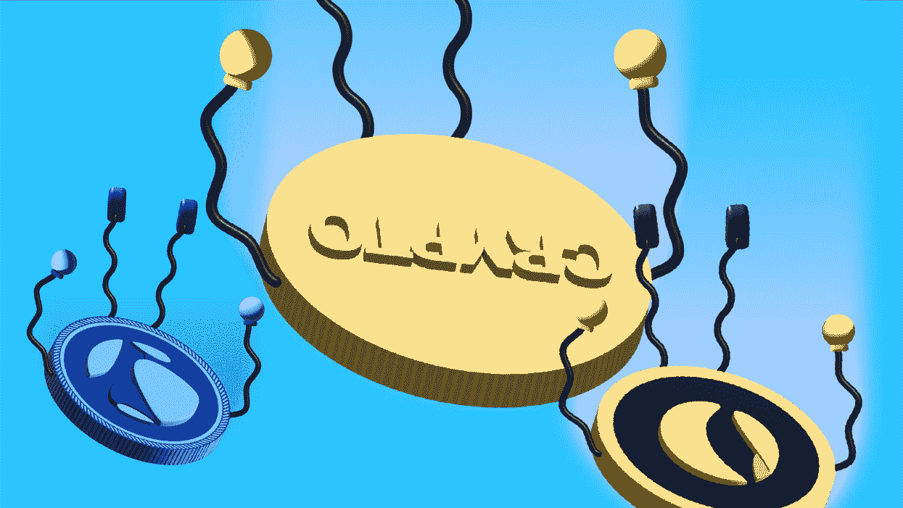

# 卢娜 LUNA 号失事如何解释

> 原文：<https://medium.com/coinmonks/how-the-luna-ust-crash-explained-45999dd428c7?source=collection_archive---------50----------------------->

2022 年 5 月，受欢迎的区块链协议 Terra 的价值损失了 99%以上，该协议支持与法定货币挂钩的分散稳定货币，并使用比特币储备来保护这种挂钩。这引发了近年来最残酷的密码市场崩溃。为了帮助理解 Terra 发生了什么，首先理解什么是稳定币可能是有帮助的。最基本的，稳定币是一种加密货币，其价值与另一种货币挂钩。最受欢迎的稳定硬币包括系绳(USDT)和美元硬币(USDC)——两者都与美元挂钩。

Stablecoins 旨在解决加密货币的极端波动性，并为投资者提供一种以更可预测的价值保护其持有资产的方式。例如，投资者可以将他们的密码转换成 USDT，而不是持有价值上下波动的比特币，因为 1000 USDT 永远可以兑换 1000 美元(波动非常小)。

现在，Terra stablecoin，TerraUSD (UST)，不同于常规的 stablecoin，如 USDT，它是新一代所谓的算法 stable coin 的一部分。

USDT 和 USDC 等稳定的国家得到实际美元储备的支持，理论上比例为 1:1。这意味着每发行一只 USDT 或 USDC 债券，发行人还必须持有 1 美元储备。实际的公司必须手动管理这种平衡 must 由一家名为 Tether 的公司管理，而 USDC 由一家名为 Centre 的公司管理。

但是稳定的硬币在历史上是有问题的。由于它们仍是中央集权的货币形式，它们的内部运作一直不完全透明，而且被视为容易受到政治和商业利益的操纵。

然而，像 Terra 的 UST 这样的算法稳定币选择了一种更“去中心化”的稳定币形式，使用高度复杂的计算机算法——和比特币储备而不是美元——通过根据主要市场条件自动扩大或缩小其供应来维持与美元的挂钩。它也意味着以一种分散化的方式进行管理，使其能够抵抗可能的操纵。

> 加入 Coinmonks [Telegram group](https://t.me/joinchat/Trz8jaxd6xEsBI4p) 并了解加密交易和投资