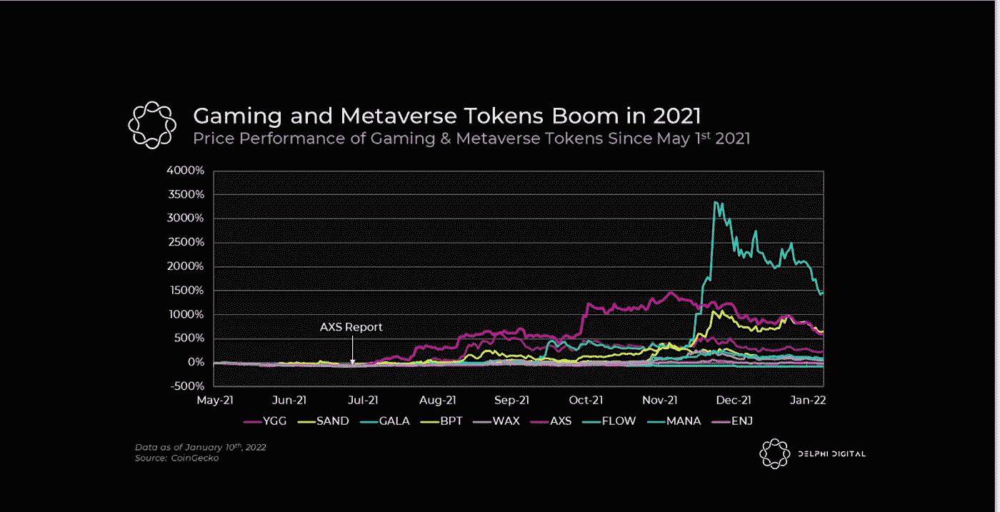
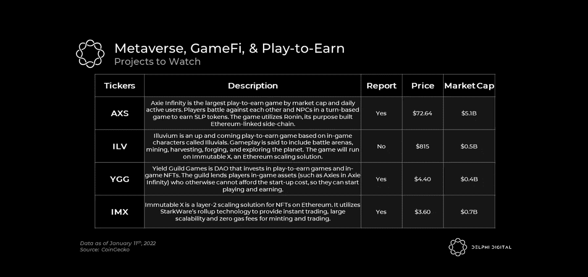

# 元宇宙、GameFi 和 play to earn 如何革新游戏产业。

> 原文：<https://medium.com/coinmonks/how-the-metaverse-gamefi-play-to-earn-revolutionizes-the-gaming-industry-f59d94e515ef?source=collection_archive---------41----------------------->

去年，Axie Infinity 引发了可能是加密领域最大的一次叙事，并证明了游戏赚钱的概念。因此，现在 P2E 游戏界出现了试图复制 Axie 成功的爆炸式增长。随着生态系统的倍增，过滤创新噪音将变得越来越重要和困难。P2E 是一个视频游戏和虚拟世界，玩家玩这个游戏是为了获得加密令牌奖励。一些游戏需要投资代币或 NFT，而其他游戏允许人们通过玩来获得密码。

就像任何一个处于抢地盘时刻的市场一样，大多数项目最终都会半途而废。然而，在我们看来，这只是游戏新时代的开始。像 Illuvium、加密独角兽和 Ember Sword 这样的项目带来了一流的图形和游戏性。此外，我们还没有看到“GamingChain”的竞争，目前突出的是 Immutable X、Ronin Chain、Solana 和 Polygon。

# 缩放解锁新游戏

image by Delphi Digital

虽然估值极高，但可能会出现 L1/L2 可扩展性的完美风暴，以及更广泛的娱乐行业的觉醒。
****X**:IMX 正骑在将在 2022 年成为关键的游戏和 zk rollup 叙事上。快速、安全、便宜的交易。许多团队现在都在它的基础上构建。在它上面部署一个成功的应用可能只是时间问题。Immutable 创建了 Immutable X，这是以太坊(第二大区块链网络)上的 NFTs 的第二层可伸缩性协议。这意味着它能够以比以太坊更快的速度进行交易，需要较低的计算能力，并具有较低的环境影响。**

# **新的激励机制**

**“玩到赚”只是一个不断增长的行业的一个子集，该行业专注于围绕游戏建立强大的代币经济，利用 web3 基础设施甚至 DeFi 原语来创建独特的激励系统，通过娱乐和金融动机来吸引玩家。**

**Axie 以 P2E[游戏赚钱]掀起了一场风暴，但许多人没有意识到 P2E 只是金融化游戏广泛叙事的一个方面。DeFi 有几个方面可以引入加密游戏，使其既有利可图又引人入胜，因为，让我们面对它，交易和投机本身基本上是一种游戏。**

# **玩家收入**

****

**image by Delphi Digital**

**在过去的一年里，游戏赚取协会的兴起也是一个重要因素，这些协会将玩家联系在一起，为他们提供游戏中的资产，让他们可以玩游戏赚取实际收入。**

# **监管机构在关注 GameFi 吗？**

**在这一点上，监管机构仍在努力赶上早期的加密发展浪潮。他们已经表示，他们对 DeFi 的自由世界感到担忧，并可能在今年发布更多的规则。不难想象，具有类似 DeFi 功能的游戏将不得不遵守同样的规则——如果像 Axie Infinity 这样的成功故事值得借鉴的话，这可能是迟早的事。**

# **加密游戏市场的流动性**

**鉴于加密游戏严重依赖游戏市场，解决这些市场的流动性水平也是至关重要的。就其最基本的形式而言，流动性是指在游戏市场内任何时间点可以买卖的资产的最大数量。流动性越多，市场越健康；因此，流动性是任何市场的一个有用指标。加密游戏市场可以包括 NFT 和金融时报的资产，以增加流动性。虽然金融资产可以扩展到具有高流动性的市场，从而用于游戏中的公用事业/消耗品资产，但 NFT 资产因其稀有性可以得到更多的使用，通常具有高价值但交易量低。**

**希望你有一个精彩的阅读。**

> **加入 Coinmonks [电报频道](https://t.me/coincodecap)和 [Youtube 频道](https://www.youtube.com/c/coinmonks/videos)了解加密交易和投资**

# **另外，阅读**

*   **[如何在 FTX 交易所交易期货](https://coincodecap.com/ftx-futures-trading) | [OKEx vs 币安](https://coincodecap.com/okex-vs-binance)**
*   **[OKEx vs KuCoin](https://coincodecap.com/okex-kucoin) | [摄氏替代品](https://coincodecap.com/celsius-alternatives) | [如何购买 VeChain](https://coincodecap.com/buy-vechain)**
*   **[ProfitFarmers 点评](https://coincodecap.com/profitfarmers-review) | [如何使用 Cornix Trading Bot](https://coincodecap.com/cornix-trading-bot)**
*   **[如何匿名购买比特币](https://coincodecap.com/buy-bitcoin-anonymously) | [比特币现金钱包](https://coincodecap.com/bitcoin-cash-wallets)**
*   **[瓦济里克斯 NFT 评论](https://coincodecap.com/wazirx-nft-review) | [比茨盖普 vs 皮奥克斯](https://coincodecap.com/bitsgap-vs-pionex) | [坦吉姆评论](https://coincodecap.com/tangem-wallet-review)**
*   **[如何使用 Solidity 在以太坊上创建 DApp？](https://coincodecap.com/create-a-dapp-on-ethereum-using-solidity)**