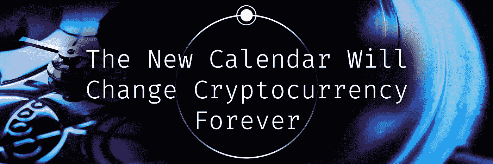

# 新日历将如何改变我们的交易方式

> 原文：<https://medium.com/coinmonks/how-the-new-calendar-will-change-the-way-we-trade-736e3b1d3d7b?source=collection_archive---------50----------------------->

锁链是一项革命性的技术，它改变了世界，让世界各地的人们在管理和转移价值方面更加自由。加密货币已经改变了金融，但它仍然受到世界上大多数人持有的偏见的阻碍，这些信仰是共同的，但不常被检验。**盲目信任** [**中央集权的银行业**](https://animalcrossing.fandom.com/wiki/Tom_Nook) **尽管面临资金短缺、崩溃和安全风险**。阻碍我们前进的不仅仅是对金融的无知，而是对过去舒适生活的牢牢把握，那些艰难前行、勉强维系的系统，只是因为我们不愿意改变。尽管存在这些社会问题，比特币和它的继任者已经在不信者背后改变了世界——现在它将改变日历。

过去三十年来，世界顶尖大学的经济学家和跨学科社会学家联合进行了广泛的研究，最终形成了一项计划，并得到了各国政府的认真对待，这项计划旨在改变月份和日期。

> “将近两千年过去了，在这段时间里，我们的世界发生了巨大的变化。比特币是一种东西，我不认为朱利亚斯·张敬利、奥古斯都皇帝或费布鲁阿鲁斯将军能够预见到加密货币——所以我们为什么要让这些罗马人决定我们的年代？”—玛尔塔·兰博托，社会学博士

研究表明，月份的交替长度对金融市场有着重大影响，尤其是在月末有如此多的交易发生的情况下。对日历的无知:认为一个 30 天的月有 31 天，美国人每年要支付超过 45 亿美元的滞纳金——其中 40%发生在 2 月后的第一天。

这些经济学家打算如何解决这个问题？显然，这是为了使所有月份都是 73 天，一个完美地分解成 365 的数字；一年中的天数。

考虑到这一点，还有闰年的问题。闰年的出现是因为地球绕太阳一周需要 365 天多一点的时间，每四年我们都会增加一天，这样我们的曾、曾、曾、曾、曾孙就不会在七月遭遇暴风雪。

> 闰年增加了历法的混乱和随之而来的困难；新日历将取消这额外的一天。这些月份将被编号为 1 到 5，以避免任何一个名字与夏天、秋天或春天联系在一起。”麻省理工学院心理学主任 Deget L. Truft

这将在一个主要方面极大地影响加密市场，除了 73 天的月份，周现在将是 5 天长，保留名称，但删除两个最不喜欢的日子。牛津大学进行的一项国际调查决定了要取消的天数。改变星期的举动启发了最初的日历重组。

> “我们不知道我们会改变月份。我们厌倦了以太坊上波动的油价，这迫使我们在周末熬夜——这个时候我们应该休息，而不是喝咖啡和做交易。从那以后，我们说‘如果我们要改变一周，那为什么不改变该死的一整年？’我说当然，让我们看看。在我们意识到之前，外交官们已经在敲我们的收件箱，自愿尝试新的日历。“弗兰克·里特拉丁，顾问

## **DeFi 煽动了变革，但普通人有什么可说的呢？**

在 2021 年关于工作日清洗的报告中，一位科学家评论道:

> “我们发现，绝大多数受访者不喜欢周一和周三。这是个人最害怕的日子。周三是工人们感觉被困在一周中间的时候，周末在时间上是等距的，所以我们一致认为必须取消。至于周一，当许多人开始他们的工作周时，他们感觉像是刚开始去健身房的人，像是必须将自己推入不喜欢的任务的人。每周人们周一去上班时都会感觉心情不好，这种情况越来越多。”

新的一周将对我们如何在加密市场交易产生另一个重大影响，因为我们知道周一比特币的价值回报最高。据推测，新的周线结构将意味着市场波动性更小，加速了广泛采用加密的进程。 ***通过解开周一对更高回报的把握，这一价值可以在一周的其余日子里平均分配。***

14 个国家已经测试了新日历，其中 12 个国家，包括罗得西亚、新格林纳达和巴苏托兰，决定在研究期结束后保留日历；将经济繁荣和国民心理健康水平的提高归功于新的年度结构。有了这样的结果，你可能很快就会在**周日说新年快乐，第一个。**

你对新的一年感到兴奋吗？

告诉我们为什么或为什么不。

 [## 加入 Lunifty 艺术不和谐服务器！

### 在 Discord 上查看 Lunifty 艺术社区-与其他 41 名成员一起闲逛，享受免费的语音和文本聊天。

不和谐. gg](https://discord.gg/gzQ2EWNWFk)  [## 在 Twitter 上关注 Lunifty

twitter.com/lunifty.](https://twitter.com/lunifty) 

# 另外，阅读

*   [Bookmap 点评](https://coincodecap.com/bookmap-review-2021-best-trading-software) | [美国 5 大最佳加密交易所](https://coincodecap.com/crypto-exchange-usa)
*   最佳加密[硬件钱包](/coinmonks/hardware-wallets-dfa1211730c6) | [Bitbns 评论](/coinmonks/bitbns-review-38256a07e161)
*   [新加坡十大最佳加密交易所](https://coincodecap.com/crypto-exchange-in-singapore) | [购买 AXS](https://coincodecap.com/buy-axs-token)
*   [红狗赌场评论](https://coincodecap.com/red-dog-casino-review) | [Swyftx 评论](https://coincodecap.com/swyftx-review) | [CoinGate 评论](https://coincodecap.com/coingate-review)
*   [投资印度的最佳密码](https://coincodecap.com/best-crypto-to-invest-in-india-in-2021)|[WazirX P2P](https://coincodecap.com/wazirx-p2p)|[Hi Dollar Review](https://coincodecap.com/hi-dollar-review)