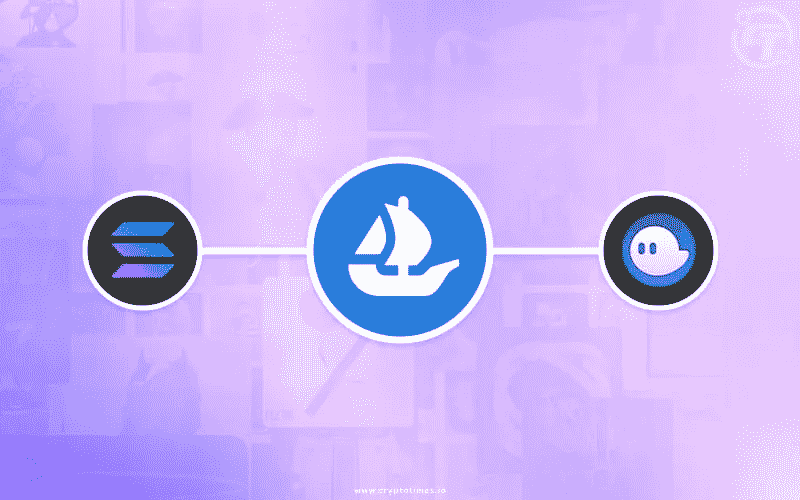

# OpenSea x Solana 集成如何有利于 SOL price 和他们的 NFT……但阻碍了 Magic Eden

> 原文：<https://medium.com/coinmonks/how-the-opensea-x-solana-integration-could-benefit-sol-price-and-their-nfts-but-hinder-magic-eden-57105748f1ac?source=collection_archive---------32----------------------->

Integration of Phantom Wallet and Solana onto OpenSea

**NFT 市场**

尽管从一开始就有 220 亿美元的 NFT 交易在 **OpenSea (OS)** 上完成，但是**以太坊(ETH)** 网络上的汽油费一直是美中不足的地方。在 NFT 的另一边， **Solana (SOL)** 在 NFTs 中产生了 12 亿美元的销售额——即通过像 **Magic Eden (ME)** 和 Solanart 这样的市场。换句话说，只有 5%的 NFT 交易是通过 SOL 完成的！

这就引出了我的下一个关键点；如果操作系统允许 SOL 集成以及**幻影钱包**功能，这将打开 SOL NFT 市场，到目前为止在操作系统中已经发生的上述 220 亿美元的潜在购买力。但是，有一个至关重要的区别，除了没有汽油费… **撇开 BAYC，索拉纳猴子生意就是生意！**

这种整合的另一个好处是，我们将能够在一个地方看到两个 ETH SOL 的**趋势和顶级 NFT 收藏**！这也有助于 OS 获得比竞争对手更多的市场份额，比如 ME 和 LooksRare。

**SOL vs ETH 费用**

当有人在操作系统上购买 NFT 时，我们永远都会读到关于**荒谬的联邦天然气费**的文章、博客和推特。作为一个狂热的 SOL NFT 买家，我看到了这个区块链的好处，并认为它比 ETH 便宜 60 倍。

然而，这种整合可能会阻碍我的成长，但只有时间会证明。我们可以确定的一件事是 ME 在 SOL 领域非常受欢迎，尽管人们对它的 [**误导 UI**](/@omakai/how-magic-eden-has-been-deceiving-the-public-to-seem-like-the-most-successful-nft-marketplace-on-ec6987821405) **提出了质疑。**

**以太坊杀手**

Solana 上的单笔交易能耗为 **0.00051 千瓦时**，而以太坊的能耗为 **238.22 千瓦时。**这让 SOL 在每笔交易的**成本**(既高效又可扩展)以及它们的**更小的环境足迹**方面获得了正面评价。这就是人们称索尔为“以太坊杀手”的一些原因。

**结论**

我认为 SOL 和 Phantom Wallet 的操作系统集成是一件好事。我们不应该指望**会直接从非 SOL 用户那里大量采用**，但随着时间的推移，这将**增加 SOL 的价值**，并带来很多**对 SOL NFT**的关注，因此他们可以与第三方公平竞争。

谢谢你看完。如果您对本文有任何意见或问题，请留言。还有，如果内容有错误，如果你能指出来，我会很感激。

查理·索尔

> 加入 Coinmonks [电报频道](https://t.me/coincodecap)和 [Youtube 频道](https://www.youtube.com/c/coinmonks/videos)了解加密交易和投资

# 另外，阅读

*   [如何在 Uniswap 上交换加密？](https://coincodecap.com/swap-crypto-on-uniswap) | [A-Ads 审查](https://coincodecap.com/a-ads-review)
*   [加密货币储蓄账户](/coinmonks/cryptocurrency-savings-accounts-be3bc0feffbf) | [YoBit 审核](/coinmonks/yobit-review-175464162c62)
*   [Botsfolio vs nap bots vs Mudrex](/coinmonks/botsfolio-vs-napbots-vs-mudrex-c81344970c02)|[gate . io 交流回顾](/coinmonks/gate-io-exchange-review-61bf87b7078f)
*   [CoinFLEX 评论](https://coincodecap.com/coinflex-review) | [AEX 交易所评论](https://coincodecap.com/aex-exchange-review) | [UPbit 评论](https://coincodecap.com/upbit-review)
*   [AscendEx 保证金交易](https://coincodecap.com/ascendex-margin-trading) | [Bitfinex 赌注](https://coincodecap.com/bitfinex-staking) | [bitFlyer 审核](https://coincodecap.com/bitflyer-review)
*   [Bitget 评论](https://coincodecap.com/bitget-review)|[Gemini vs block fi](https://coincodecap.com/gemini-vs-blockfi)cmd |[OKEx 期货交易](https://coincodecap.com/okex-futures-trading)