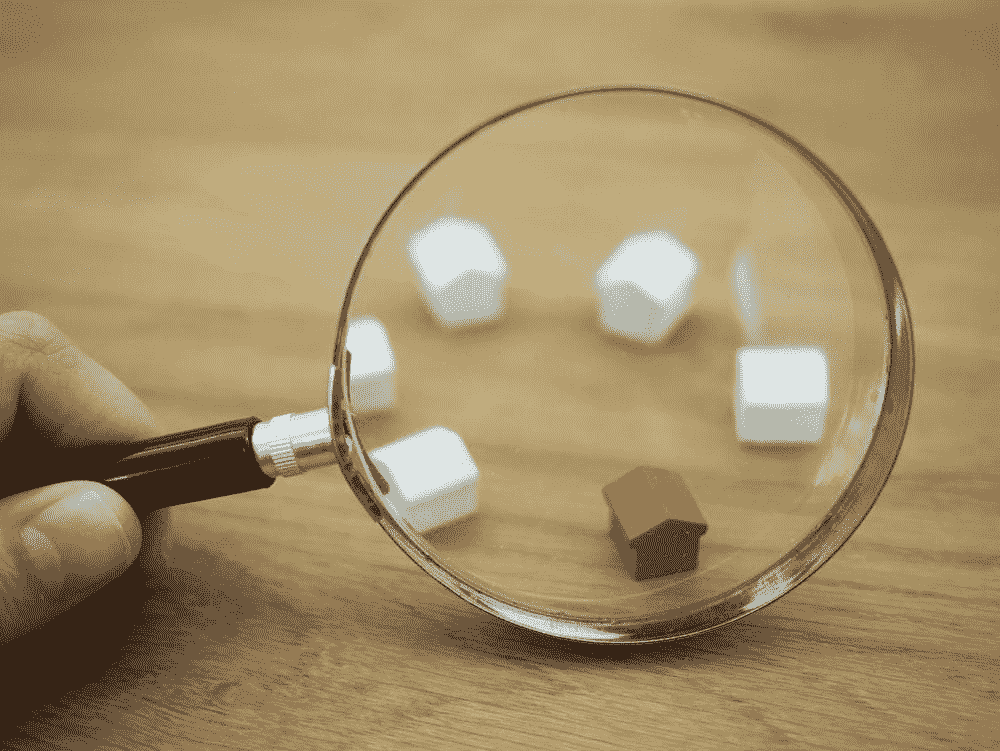
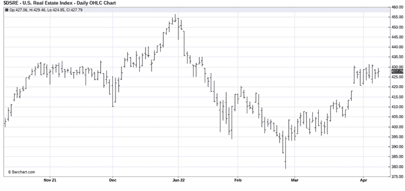
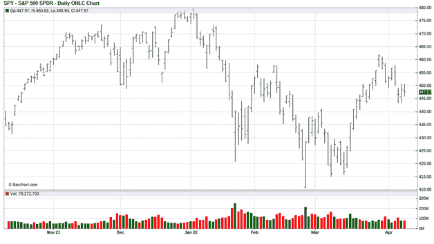

# 股票市场与住房市场的关系

> 原文：<https://medium.com/coinmonks/how-the-stock-market-is-related-to-the-housing-market-f8227fe6286f?source=collection_archive---------52----------------------->

股市如何影响房地产？这两者有什么关联吗？当 2008 年房地产泡沫破裂时，世界看到了房地产市场如何影响股票市场——但这种影响是否也会以相反的方式发生？

股票市场的市场波动可以引发各种行为和行动，间接影响人们如何购买或出售房屋。虽然股票和房地产之间没有直接联系，但两个市场的大幅波动仍有可能影响对方的行为。

现在，当然——比较股票市场和房地产市场有点像苹果和橘子。房地产不是股票。与此同时，房地产行业存在价格投机现象；就像股票价格投机一样，住宅和商业地产具有基本的、有形的功能。你住在你的家里，所以你每天都在体验它的真正价值，更不用说股权了。店家体验商业地产的实际价值。财产本身具有真实、有形的价值。

另一方面，股票具有无形价值。投资者基于具体的(如收益报告)和潜在的(如分析师的建议)价值进行买卖。

那么，股市是如何影响房地产的呢？

# 影响股票市场的因素

在股市中，个别公司的表现可能会有所不同。分析师评级、新闻报道和收购公告都会发挥作用。外部影响既可以影响单个股票，也可以影响整个股票市场，例如:

*   政治发展
*   自然和人为的灾难
*   市场心理学

这不是一个详尽的影响列表，但这些可能是最重要的回顾。

# 经济学

当你把经济作为一个整体来考虑时——从宏观角度来看——利率和通货膨胀等因素会影响股票市场。但是股市是如何影响房地产的呢？经济的增长或停滞是经济健康的一个指标——经济增长可以让股市进入牛市。相反，停滞、经济下滑和失业率上升意味着熊市。

当利率下降时，股市通常会走高——利率下降意味着经济增长。另一方面，当通胀开始上升时，利率也开始上升，这标志着经济放缓的开始。

随着失业率上升，经济增长陷入低迷。投资者知道，当失业率开始下降时，经济增长就在眼前。随着这个数据的上报，它可以带动股票。然而，如果投资者预期会出现这些变动，那就不会有什么变化。同时，监控这些数字仍然很重要。这样做可以帮助你预测——尽管不是每次都 100%准确——股票市场是上涨还是下跌。

# 政治发展

投资者有时认为，无论是民主党还是共和党掌权，都可能是一种优势或劣势，从而有能力推动股市。如果美国——甚至全世界——处于动荡之中，这一点尤其站得住脚。如果是，那么股市是如何影响房地产的？虽然国内事件肯定会影响市场，但其他国家的重大事件也会影响美国市场。例如，如果我们的一个贸易伙伴或盟友的政府投票给一个相当敌对的领导人，它可以推动美国市场走低。

但是反过来也是正确的。如果我们的一个伙伴选出一个友好的领导人，它可以推动美国市场走高，比如当一个盟国是民主国家时。如果一个国家不是民主国家，政变或罢工的可能性就会增加。

总而言之，积极和消极的影响取决于环境——但是，最终，任何不确定性和美国市场往往会出现低迷。

# 灾难

自然灾害和人为原因都会影响经济，经济也会影响股市。例如，如果硅谷发生地震，市场可能会大幅下跌，因为投资者可能会看到这对经济的负面影响。

另一方面，一场非自然的灾难也会产生类似的影响。如果一家对经济有重要意义的公司或设施，比如一家石油公司，经历了一场灾难——比如炼油厂爆炸或大规模漏油——股票可能会大幅下跌。

# 市场心理学

抛开所有外部影响不谈，股市波动最终是由一件事引起的——人类。一个繁荣的牛市出现了，每个人，甚至非投资者，都准备买入。即将到来的熊市？每个人都准备卖掉他们所有的股份。

# 影响住房市场的因素

那么，股市是如何影响房地产的呢？虽然股市和房市之间没有明确的联系，但有一些间接的联系和后续影响，例如:

*   当前利率的影响
*   消费者情绪心理学。
*   消费者行为心理学。

那么，房地产市场到底受到了怎样的影响？

# 当前利率的影响

房产投资者通常会考虑出租房产或倒卖房屋，但第一步是计算出购买的成本。买房是一项相当大的投资，大多数投资者没有那么多现金一次性购买。这些房地产投资者然后转向贷款机构获得资金，开始投资房地产。

抵押贷款有附加利率。这些利率构成了整个投资的很大一部分。市场波动会对你的整体投资组合和投资收入产生负面或正面影响，这让“股市如何影响房地产”成为一个有点争议的话题。买家信心和经济健康是当前抵押贷款利率的主要影响因素，两者也与股市表现有着不可分割的联系。

# 消费者情绪心理学

当消费者和投资者都对当前的经济环境或他们未来的财务状况没有信心时，他们就不太可能买房或投资。

如果股指看涨，甚至只是健康的，房地产投资者更有可能参与进来。通常，房地产投资者只有在广泛的股指上涨时才会购买投资性房地产。这提高了消费者的信心——投资者对构建他们的金融未来感觉良好。

当主要指数开始下跌时，投资者就会失去这种信心。购买投资性房产会带来风险——一种他们可能不愿意承担的风险。在指数下跌时购买投资性房地产可能会让投资者背上债务，而不是收益回报资产。

例如，即使你发现了一些便宜的房产，下跌的股市可能会阻止你购买。有时候，在支付任何首付款之前，最好等待并评估你的期权和未来的股市波动。

另外，市场波动也会影响卖家。买方对住房需求的下降意味着卖方不得不降低价格。与此同时，这可以使购买变得更容易，但从投资的角度来看，这仍然是一个风险——尤其是在股市经历高波动的情况下。

最后，你还必须考虑更高的抵押贷款利率和可能更大的首期付款。把所有的希望都放在你能建立的股票上，你的潜力会突然减少很多。以上所有因素都可能影响房地产市场的表现。

# 消费者行为心理学

先有鸡还是先有蛋？股市和房市之间的这种表面相关性也是如此。股市对房市有影响吗？房市影响股市吗？股市表现影响消费者行为。消费者行为通常会影响房地产投资变化是否会转化为股市波动。

当股市上涨时，消费者更倾向于冒险投资房地产——当市场下跌时，消费者支出也会下降。当市场开始走向熊市时，人们不会像市场飙升时那样乐于消费，这意味着投资者可能也不会出售他们已经拥有的任何房产。这就形成了一个小心谨慎和为未来存钱的循环。

# 股市如何影响房地产？

无论好坏，股票市场的任何变化都会影响房地产市场的表现——房地产市场的所有方面，从买家的看法到贷款行为和规划。上述任何变化在股市波动时都会变得更加明显。

最终，房地产投资者关注的是股市。当他们把有关上涨、下跌和整体稳定性的信息放在一起时，投资者决定在那个时候购买或投资房地产是否有益。

美国股票指数在过去几年中大幅下跌，但这并不一定会转化为一个破败的房地产市场。投资者总是希望股市能在房地产行业受到太大伤害之前反弹。大量的在线工具可以帮助你找到有利可图的投资机会，即使市场波动看起来像是在走向亏损。

下图显示了 2021 年 10 月至 2022 年 4 月美国房地产指数的快照。

[*图片来源*](https://imgur.com/7wNS9wa) *(* [*原始图片在此找到*](https://www.barchart.com/stocks/quotes/%24DSRE/technical-chart?msclkid=5259212eb8c611eca84e35592184f58c) *)。图像归功于 Barchart.com)*

下一张图显示了同期的标准普尔 500 SPDR 指数基金，从 2021 年 10 月到 2022 年 4 月。

[*图片来源*](https://imgur.com/a/66UPYh0) *(* [*原始图片在这里找到*](https://www.barchart.com/etfs-funds/quotes/SPY/technical-chart?msclkid=5259212eb8c611eca84e35592184f58c) *)。*归功于 Barchart.com)

很奇怪——这两张图表似乎显示了几乎相同的运动！仔细观察，这说明了股票和房地产之间的一种舞蹈——一种非常轻微的“当你下跌时，我下跌；你崛起，我也崛起”的关系。2021 年 10 月，美国房地产指数刚刚超过 400 美元。标准普尔 500 是 435 美元多一点。到 12 月底，房地产指数达到了 6 个月来的最高点，略低于 455 美元，标准普尔 500 的最高点是在 2022 年 1 月的第一周，略低于 480 美元。随着俄罗斯和乌克兰之间的紧张局势加剧，这两个指数在 1 月下旬开始下跌，并在 2 月中旬跌至最低点。

这两个指数之间的这种“舞蹈”最有趣的一面是，美国房地产指数总是在标准普尔 500 SPDR 之前移动。那么，股市是如何影响房地产的呢？或许，上面的市场波动图恰恰相反——或许房地产市场会影响股票市场？或者这两个市场真的像图表显示的那样交织在一起。

无论如何，如果没有其他因素，如利率、通胀、整体消费者情绪，甚至国外的政治紧张局势，这种关系舞蹈就不会存在，如上所述。随着通货膨胀率持续上升，从燃料到食品的价格持续上涨，房价也在上涨。房价的持续上涨能否持续还有待观察。

# 最后的想法

对所有投资者来说，了解股票市场的最新动态是至关重要的。你可能也已经开始关注房地产市场，关注利率和抵押贷款利率，权衡消费者信心、行为和当前房价——关注这两个市场没什么不同。你可以了解最新的趋势、牛市和熊市，看看这些市场波动是否会影响你对房地产市场的感觉。如果你以前从未这样做过，这是一个很好的方法来帮助你学习投资组合多样化的诀窍，并在未来争取更好的回报。

> *加入 Coinmonks* [*电报频道*](https://t.me/coincodecap) *和* [*Youtube 频道*](https://www.youtube.com/c/coinmonks/videos) *了解加密交易和投资*

# 另外，阅读

*   [3 商业评论](/coinmonks/3commas-review-an-excellent-crypto-trading-bot-2020-1313a58bec92) | [Pionex 评论](https://coincodecap.com/pionex-review-exchange-with-crypto-trading-bot) | [Coinrule 评论](/coinmonks/coinrule-review-2021-a-beginner-friendly-crypto-trading-bot-daf0504848ba)
*   [莱杰 vs n rave](/coinmonks/ledger-vs-ngrave-zero-7e40f0c1d694)|[莱杰 nano s vs x](/coinmonks/ledger-nano-s-vs-x-battery-hardware-price-storage-59a6663fe3b0) | [币安评论](/coinmonks/binance-review-ee10d3bf3b6e)
*   [Bybit 交易所评论](/coinmonks/bybit-exchange-review-dbd570019b71) | [Bityard 评论](https://coincodecap.com/bityard-reivew) | [Jet-Bot 评论](https://coincodecap.com/jet-bot-review)
*   [3 commas vs crypto hopper](/coinmonks/3commas-vs-pionex-vs-cryptohopper-best-crypto-bot-6a98d2baa203)|[赚取加密利息](/coinmonks/earn-crypto-interest-b10b810fdda3)
*   最好的比特币[硬件钱包](/coinmonks/hardware-wallets-dfa1211730c6) | [BitBox02 回顾](/coinmonks/bitbox02-review-your-swiss-bitcoin-hardware-wallet-c36c88fff29)