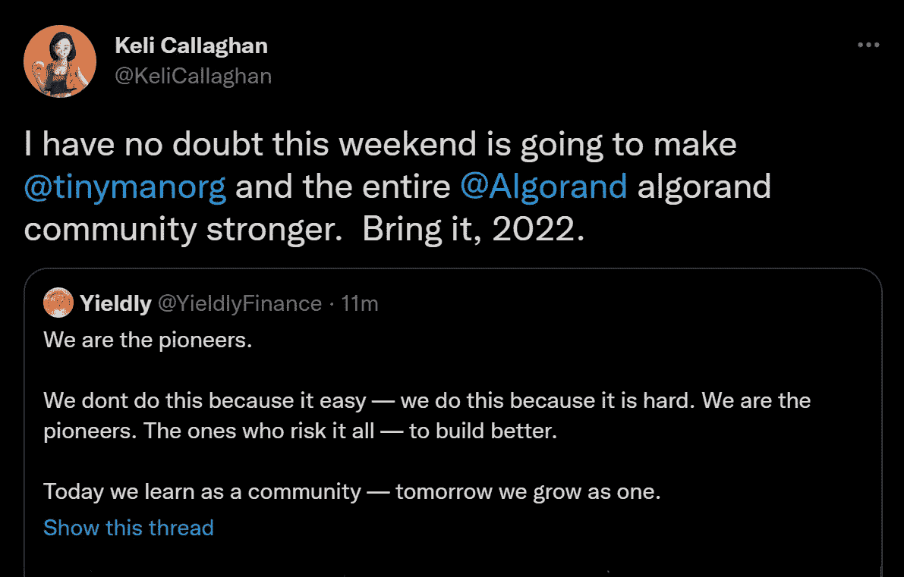
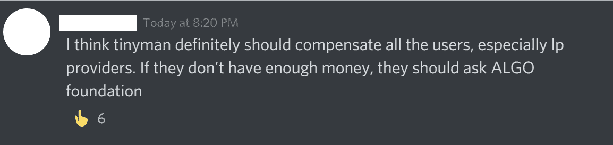
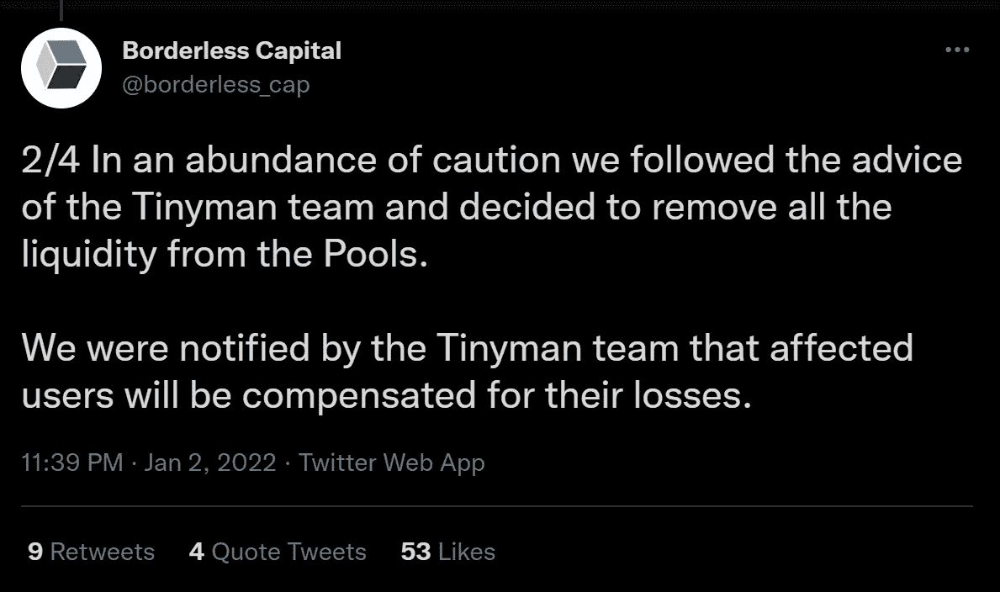
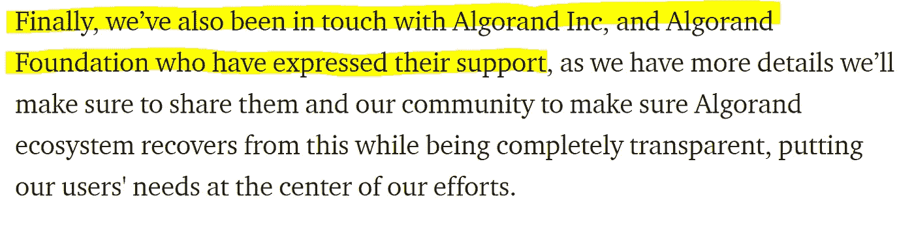

# 铁皮人的剥削是如何加强阿尔格兰德的

> 原文：<https://medium.com/coinmonks/how-the-tinyman-exploit-can-strengthen-algorand-7813303b4de2?source=collection_archive---------3----------------------->

## 在区块链上发展安全生态系统

当我昨晚上床睡觉时，Tinyman 是一家充满活力的自动化做市商，为 Algorand 社区提供服务，但当我今晚上床睡觉时，它将变成一个空壳，缺乏流动性，声誉下降。

Tinyman exploit 的崩溃不仅仅是今天那些因黑客而失去辛苦挣来的代币的人的悲剧，如果我们没有从中吸取任何教训，明天继续下去，就好像什么都没有改变一样，这可能是对整个 Algorand 社区的巨大打击。

## 问题是

如果不采取任何措施来提高 Algorand 生态系统上 dApps 的安全性，这将是一场悲剧，因为这种黑客攻击是不可避免的，如果没有任何改变，很可能会发生更多的黑客攻击，每一次都在侵蚀整个生态系统的信任。这不是 Tinyman 在技术上不称职，或者没有像其他人一样做足够多的事情来确保用户资金的安全——他们成功地通过了审计，并受到了好评。这是一个系统性的问题，需要阿尔格兰德基金会的领导来解决。

## (基金会的)救助不是答案

在我开始谈论我认为应该发生的事情之前，我想说为什么我会对阿尔格兰德基金会救助成为黑客受害者的 dApps 感到不安。这包括 Tinyman 或其用户([或其盈利性风险投资支持者](https://www.coindesk.com/business/2021/10/07/defi-for-the-small-guy-algorand-based-tinyman-raises-25m-ahead-of-dex-launch/))以换取或不换取该平台的股份。

Anon Tinyman user seen on Discord

这非但不会增强人们对区块链的信心，反而会造成以下后果:

*   浪费钱——用于创新的资金越少意味着长期增长越慢。
*   导致集中化——如果只有大型项目得到救助，那么它们将会不公平地击败更有能力的小型竞争对手。
*   引入一个[道德风险](https://www.investopedia.com/ask/answers/09/moral-hazard.asp)——人为降低风险的投资者和 dApps 股东会做出糟糕的决策。
*   减轻小偷的道德负担——罪犯应该生活在没有帮助他们晚上睡觉的合理化的环境中。

It seems that there will be compensation, but how much and by whom remains to be seen

Official Announcement About the Incidents of 01.01.2022 — Tinyman

在我看来，如果有限合伙人得到纾困，应该由 dApps 的股东来买单。

## 怀特·哈特的赏金计划

在我看来，如果这是一件事，它可以帮助激励人们负责任地发现和报告像 Tinyman 遭受的攻击，这样他们就可以在 lp 失去他们的钱之前得到修复。

我听到一些人反驳说，像 AlgoFi 这样的项目已经有了奖金项目，我也听到其他人反驳说，我坚决反对将奖金用于资助风险投资公司。如果你是这些声音中的一个，我说你是正确的，但是慷慨的安全计划的目的不是为风投节省提供他们自己的安全的费用，而是:

1.  激励社区中更多的开发人员学习蓝绿色
2.  让更多的白人进入阿尔格兰德社区
3.  一旦每个漏洞被解决，就在[algrand 开发者门户](https://developer.algorand.org/)上发布每个漏洞的细节以及如何被发现、修复和解决，以增加智能合同开发者的专业知识。

换句话说，基金会将不(仅仅)为私人投资者的安全买单，它将增加生态系统中有能力、有安全意识的开发人员、审计人员和政府官员的数量。

好吧…你说“但是你会不会通过鼓励搭便车的人以牺牲基金会的利益为代价采取更少的预防措施来降低生态系统的安全性？”

为了避免滥用，它只能涵盖已经采取和正在采取适当预防措施以保护其用户的项目，如由声誉良好的公司进行审计。

## 坚持将某些标准作为授予项目赠款的先决条件

在我看来，基金会似乎有很大的权力，可以在项目开发的赠款阶段对其行使权力，以承诺遵守最佳实践或开放的标准。例如，他们可以激励(并资助)赠款接受者在 smart 合同审计之前或之后的一段时间内进行 testnet bounty，在此期间，他们的 TEAL 和 pyTEAL 将被公布以供全面审查，所有漏洞和修复都将公布在 Algorand 开发人员门户网站上，以进一步帮助未来的开发。

## 发出警告

我今天早些时候问自己，在 Tinyman 漏洞被修补并且 AlgoDEX 在 mainnet 上成功推出后的几周时间里，我是愿意为 Tinyman，一个最近被黑客攻击的 dApp，还是一个没有被黑客攻击但没有在战斗中测试过的 AlgoDEX 提供流动性…

对于那些希望继续投资 DeFi 的人来说，最明智的答案是，所有的 DeFi 用户都应该适当地分散投资，并有风险意识。这并不光彩，但在传统金融中，免责声明很常见。DeFi Investments 应该发布某种非强制性免责声明的最佳实践，警告人们他们的钱有风险，不要拿他们负担不起的东西冒险，他们应该保持多元化。

## 最后

阿尔格兰德基金会在建立阿尔格兰德生态系统方面取得了巨大的成功，为其 DeFi 部门带来了爆炸性和令人兴奋的增长。因此，it 部门需要寻找方法来发展一个关注安全的生态系统，以跟上这些发展的步伐。

以上只是我认为阿尔格兰德基金会可以做到这一点的一些建议。如果您同意或不同意，请告诉我，如果您对生态系统如何在未来提高其 dApps 的安全性有任何其他建议，也请告诉我。

> 加入 Coinmonks [电报频道](https://t.me/coincodecap)和 [Youtube 频道](https://www.youtube.com/c/coinmonks/videos)了解加密交易和投资

## 也阅读

 [## 杠杆代币[多头代币]终极指南

### 杠杆化令牌是具有杠杆化风险敞口的 ERC20 令牌，不考虑保证金、要求、管理…

medium.com](/coinmonks/leveraged-token-3f5257808b22)  [## 最佳加密交易所| 2021 年十大加密货币交易所

### 编辑描述

blog.coincodecap.com](https://blog.coincodecap.com/crypto-exchange)  [## 2021 年最佳加密交换平台| CoinCodeCap

### 如果我们看看今天的场景，许多加密货币交换平台提供了广泛的功能和深度…

blog.coincodecap.com](https://blog.coincodecap.com/best-swap-platforms)  [## 10 大最佳网上赌场[2021] |赢取免费 BTC | CoinCodeCap

### 编辑描述

blog.coincodecap.com](https://blog.coincodecap.com/best-online-casinos)  [## 2021 年最佳加密借贷平台| 6 大比特币借贷平台

### 获得比特币和其他加密货币的最佳贷款利率

medium.com](/coinmonks/top-5-crypto-lending-platforms-in-2020-that-you-need-to-know-a1b675cec3fa)  [## 2021 年 6 大最佳硬件钱包|顶级加密硬件钱包[更新]

### 最好的加密货币硬件钱包是绝对必要的。我们将在 NGRAVE、Ledger Nano X 和…

medium.com](/coinmonks/the-best-cryptocurrency-hardware-wallets-of-2020-e28b1c124069)  [## 2021 年最佳免费加密交易机器人

### 2021 年币安、比特币基地、库币和其他密码交易所的最佳密码交易机器人。四进制，位间隙…

medium.com](/coinmonks/crypto-trading-bot-c2ffce8acb2a)