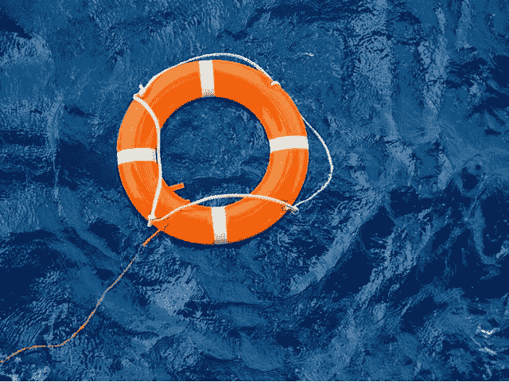

# WingRiders 团队如何拯救 MinSwap 免于被黑

> 原文：<https://medium.com/coinmonks/how-the-wingriders-team-saved-minswap-from-being-hacked-1962411e2f2d?source=collection_archive---------14----------------------->

2021 年 9 月中旬，出现了阿隆佐硬分叉。2022 年 3 月，去中心化 exchange MinSwap 上的第一次重大黑客攻击本来可以发生，但由于 WingRiders 团队的警惕性和专业性，它没有发生。

# 发生了什么

MinSwap 是一个在 Cardano 上运行的分散式 AMM 交换机。2021 年**1 月 21 日**，团队…