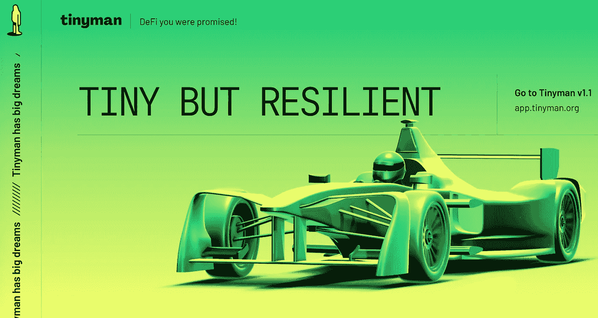
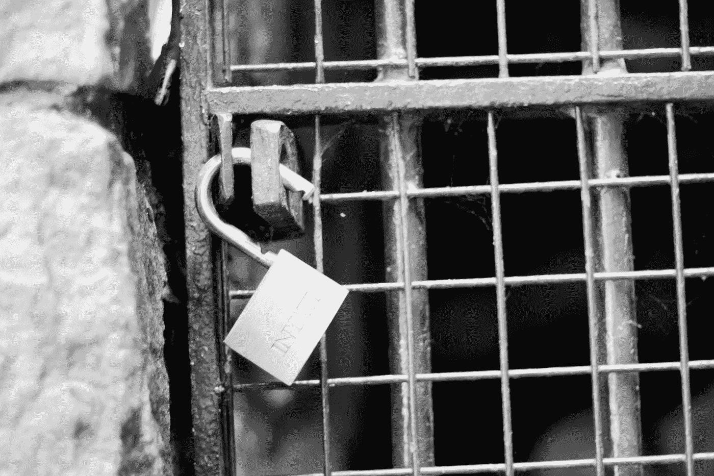
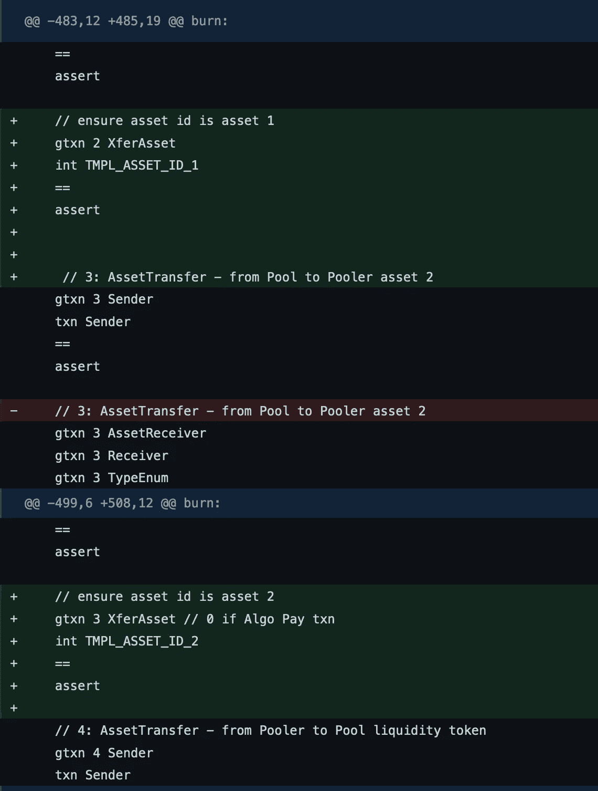
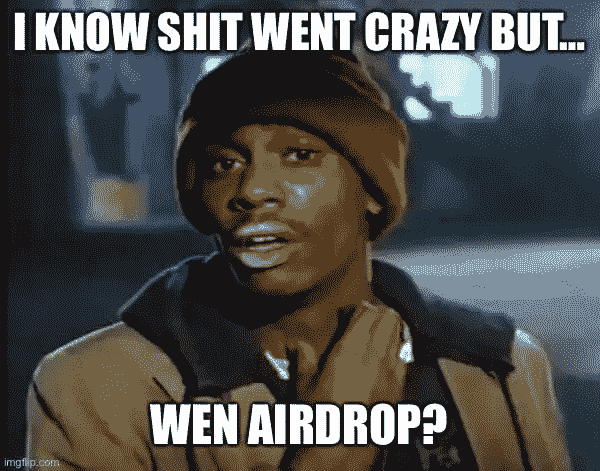

# 铁皮人是如何损失 300 万美元的

> 原文：<https://medium.com/coinmonks/how-tinyman-lost-3-million-dollars-6db5d5d65b09?source=collection_archive---------7----------------------->

对阿尔格兰德的第一次大破解的解剖…

Photo by [Piron Guillaume](https://unsplash.com/@gpiron?utm_source=medium&utm_medium=referral) on [Unsplash](https://unsplash.com?utm_source=medium&utm_medium=referral)

2021 年最后一个季度标志着阿尔格兰德社区取得了巨大成功。全年进行了大量的投资，事情开始有回报了。一个新的 DeFi 生态系统的基本构建模块已经开始在 Algorand 的闪电网络上出现。这些构建模块包括:

*   **USDC 支持**——支持与美元挂钩的稳定货币 USDC。
*   [**algo mint**](https://app.algomint.io/)**—在 Algorand 网络上实现 BTC 和 ETH 一对一支持的桥接协议。这使得交易和移动 ETH 和 BTC(代表 goETH 和 goBTC)与阿尔格兰德的快速交易速度和低费用。**
*   **[**AlgoFi**](https://app.algofi.org/staking) —一种允许借贷和超额抵押借款的货币市场协议。它还试图创建自己的加密担保品 stablecoin (STBL)。**
*   **[**Tinyman**](https://app.tinyman.org/) —一家 AMM DEX(自动做市商，分散式交易所)，允许在 Algorand 网络上进行令牌对令牌互换和流动性池(LP)养殖。Uniswap 是 AMM DEX 最著名的例子**

**这些重要的建筑材料让我想起了以太坊 DeFi summer 的早期。它们都是连锁反应的必要试剂，这种连锁反应可能会爆发出一个强大的新 DeFi 生态系统。毫无疑问，2021 年第四季度是一个乐观的时期。**

**然而，我从 DeFi summer 学到的另一个不那么令人愉快的教训也在 Algorand 生态系统中再次出现:**智能合约风险****

> **新年带来了一个恶毒的惊喜——一个估计花费了 Tinyman an 万美元的惊喜。**

# **什么是铁皮人**

****

**Tinyman.org Homepage**

**在开始之前，理解 Tinyman 是什么以及它是如何工作的是很重要的。如上所述，Tinyman 是一个分散式交易所(即 DEX ),它使用自动做市商(AMM)。**

**DEX 是通过区块链的智能合约托管的交易所。你用你的钱包与智能合约互动，永远不会失去你的资金保管。这与集中式交易所(CEX)相反，比如比特币基地、[双子座](https://www.gemini.com/share/xqynwwsx)或[库科恩](https://www.kucoin.com/land/register/r/rJ3TEWH)，你将资金存入他们的托管账户进行交易。**

**因为 DEXes 是通过智能合约托管的，所以它获得了它所在的区块链的所有好处。在 Algorand 上，这些优势包括:**

*   **分散**
*   **自我监护**
*   **可量测性**
*   **抵制审查**
*   **隐私**

**智能合约代码也和区块链交易一样具有不变性。这带来了上面列出的许多好处，但也带来了错误导致灾难性结果的风险。这就是所谓的智能合约风险。**

> **不管是好是坏，代码就是法律**

**Tinyman DEX 是一种特殊类型的交易所，它使用一种叫做自动做市商(AMM)的机制。大多数交易所基于*订单簿*进行交易，或者当有大于或等于最低卖出订单的买入订单时，所有买入和卖出订单的日志。**

**要有流动性，总要有人愿意买，有人愿意卖。在许多交易所，资金经常被留出，用于作为交易对手和保持资产流动性的明确目的。这在股票领域和密码领域都很常见，尤其是(但不仅限于)在集中交易中。([此链接](https://www.investopedia.com/terms/d/designated-market-maker-dmm.asp)举例说明了纽约证券交易所是如何做到这一点的)**

**另一方面，AMMs 是区块链世界最近创造的一项创新，它根据一条由数学公式而不是交易员的指令簿创建的曲线来为资产定价。流动性不是依赖于指定的做市商，而是来自流动性池，任何为流动性池提供资金的人都是流动性提供者，并通过交易费和其他激励措施获得补偿。**

> **上面的要点是，Tinyman 是一个由不可变的、可直接访问的智能合约驱动的交易所。流动性来自一个代币池，价格基于一个数学公式。**

**Tinyman 的黑客依靠这些属性从流动资金池中抽走了大约 300 万美元。**

# **黑客——Eli 5 它是如何工作的**

****

**Photo by [Hennie Stander](https://unsplash.com/@henniestander?utm_source=medium&utm_medium=referral) on [Unsplash](https://unsplash.com?utm_source=medium&utm_medium=referral)**

**这个黑客有趣的地方在于，事后来看很清楚，但是不去找的时候很容易错过。下面简单解释一下它是如何工作的。(感谢 u/mCseq 的启发性[解释](https://www.reddit.com/r/algorand/comments/ruv60p/comment/hr1ogry/?utm_source=share&utm_medium=web2x&context=3))**

**Tinyman 有一个智能契约，它接受以下内容。**

*   **交易对(例如，goBTC 对 ALGO)**
*   **你期望给予和得到的东西(例如，1 戈博德兑换 18，000 ALGO)**

**合同检查现行汇率，并确保数字匹配。如果数字相同，那么它将使用交易对的流动性池执行请求中所述的交易。**

**智能合约确实确保了数字匹配，以及 AMM 公式的准确性。然而，有一件毁灭性的事情它忘了检查。**

> **智能合约没有检查请求上的令牌类型是否不同，黑客利用了这一点。**

## **通过例子学习**

**例如，让我们假设 18 个 ALGO 在 ALGO/全球期货交易池中交易 0.001 个全球期货交易价格。一个正常的请求如下:**

*   **在 ALGO/goBTC 交易池进行交易**
*   **为 18 ALGO 请求 0.001 goBTC**
*   **智能合约将从流动性池中获取 0.001 goBTC 并提供 18 ALGO**

**然而，恶意请求是可能的，如下所示:**

*   **在 ALGO/goBTC 交易池进行交易**
*   **为 18 个 **goBTC** 请求 0.001 个 goBTC(*而不是 18 个 ALGO)**
*   **智能合约将义务性地从流动性池中提取 0.001 goBTC 并支付 18 goBTC，使攻击者净得 17.999 goBTC！**

**攻击者然后可以针对新的价格进行调整，并且重复该操作任意多次，直到所有的 BTC 被从池中移除或者池中 ALGO 的价格大于 BTC 的价格。**

**完成后，他们可以在其他地方交易 goBTC(例如，通过 AlgoMint 将其转换为实际的 BTC)**

## **所需的编码技能**

**Tinyman 网站不支持这种类型的请求，但是由于契约的公共 API 是可以直接访问的，所以稍微有点编码头脑的人就可以进行这些调用，并带着池中的整个 BTC 供应逃跑。**

**事实上，这就是在几个资金池中发生的情况，许多微不足道的流动性池被抽干。更糟糕的是，即使 Tinyman 发现了这个问题，他们作为一个公司也无能为力。**

> **不像币安或罗宾汉，Tinyman 不能任意阻止/审查你的交易。这很好，但是同样的机制意味着他们不能阻止黑客利用池，即使在找出漏洞之后。**

**Tinyman 团队唯一能做的是阻止网站允许未来的 LP 存款，并尽可能公开地宣布 LP 应该尽快从所有交易池中移除他们的资金。**

**除了移除已经提供的流动性的功能之外，网络交易界面被移除。之后，Tinyman 团队疯狂地寻找、创建和审计更新的合同，以取代旧的合同。**

# **深入研究代码——探索契约**

****

**Photo by [Florian Olivo](https://unsplash.com/@florianolv?utm_source=medium&utm_medium=referral) on [Unsplash](https://unsplash.com?utm_source=medium&utm_medium=referral)**

**关于 Tinyman 的合同的一个好处是，它们存储在一个公共可访问的 github repo ( [链接](https://github.com/tinymanorg/tinyman-contracts-v1/commit/3ea1af92f55763be6ebac2f44467793852c70883))中。因此，当他们解决问题并升级合同时，很容易就能看出他们改变了什么，进而看出哪里出了问题。**

**这个[提交](https://github.com/tinymanorg/tinyman-contracts-v1/commit/8ddcc085f4e4ff2e75821d0eb618226bfa3674cd)似乎已经解决了这个问题。请记住，问题的发生是因为恶意请求中的资产 id 是相同的。**

****

**诚然，蓝绿色是相当乏味和难以阅读的，但这份公关实际上很容易理解，这要感谢笔记和突出强调，以集中你的注意力。**

> **在上面的代码中，绿色的附加物显示添加了一个检查，以确保 asset_1 和 asset_2 的标识符现在得到了验证。**

**由于利用依赖于交易双方输入相同的资产 id，所以尝试相同的恶意请求会使断言失败，不会成功。**

# **铁皮人的回应**

****

**Photo by [Diana Polekhina](https://unsplash.com/@diana_pole?utm_source=medium&utm_medium=referral) on [Unsplash](https://unsplash.com?utm_source=medium&utm_medium=referral)**

## **快速透明的报告**

**Tinyman 做得很好的一件事是承担责任，努力迅速恢复受影响者的资产。在发现漏洞的一天内，Tinyman 团队关闭了他们能关闭的任何服务，并发布了一份关于他们所知道的黑客攻击的报告。**

**作为一个小型的新兴社区，他们不知疲倦地、透明地工作，并得到了似乎是整个阿尔格兰德·迪菲社区的支持。**

> **我们一直在与生态系统中的大多数团队保持沟通，这对帮助理解和解决问题至关重要。我们已经和很多 LP 联系过了——Borderless、Arrington 和 Meld。在此期间得到他们的支持令人羞愧，我们要感谢 Algomint、Algofi、Yieldly、Headline Crypto、Tinychart 的团队以及许多支持并帮助理解这个问题的社区成员…**

**(来源:[铁皮人博客](https://tinymanorg.medium.com/official-announcement-about-the-incidents-of-01-01-2022-56abb19d8b19))**

**接下来的一周发布了两份进一步的报告([这里](https://tinymanorg.medium.com/technical-report-1-first-insights-cbc12109ef08)和[这里](https://tinymanorg.medium.com/full-technical-report-on-attacks-18e3c5e89c5f))，深入探讨了恶意交易、它们是如何被利用的以及它们的影响。对于这样一个小团队来说，他们能够做出如此透明和快速的回应是非常棒的。**

## **补救**

**Tinyman 也同意采取措施补偿受黑客攻击影响的用户。在他们的第一份技术报告中([此处为](https://tinymanorg.medium.com/technical-report-1-first-insights-cbc12109ef08))，他们确定了 250 个受影响的账户(即持有 goBTC 和 goETH 的账户)。该团队还承诺确保充分补偿那些受影响的帐户。**

> **我们的首要任务是照顾那些损失了资金的用户，确保我们知道这些用户是谁，损失了多少。我们计划全额偿还这些用户。([来源](https://medium.com/r?url=https%3A%2F%2Ftinymanorg.medium.com%2Ftechnical-report-1-first-insights-cbc12109ef08))**

**这对社区来说是个好消息。Tinyman 有能力说，“智能合同风险是真实存在的！概不退换！DYOR！”如果有损失的话，也只是恢复一部分。然而，该协议通过同意承担全部损失，展示了其发展社区的承诺和能力。**

**在他们的报告中，他们还提到他们正在寻求帮助，以促进社区中的信任和参与，并透露了一个关于他们的**令牌发布**的小暗示，以及他们如何利用它来奖励那些已经并继续冒险的早期采用者。**

> **我们致力于尽最大努力通过推出我们的令牌来回报我们所有的用户。我们正在考虑特殊的奖励计划，只有在攻击时有 LP 头寸的钱包才能加入，以确保奖励到正确的人手中。([来源](https://medium.com/r?url=https%3A%2F%2Ftinymanorg.medium.com%2Ftechnical-report-1-first-insights-cbc12109ef08)**

****

**[https://imgflip.com/memegenerator/57678612/Chapelle-crack](https://imgflip.com/memegenerator/57678612/Chapelle-crack)**

**虽然，仍然有一些悬而未决的问题，Tinyman 什么时候会赔偿受影响的钱包，以及它将如何赔偿最初黑客攻击后的钱包，我总的来说很高兴看到 Tinyman 采取了积极主动和看似完整的方法来帮助那些受影响的人。**

# **预防未来问题**

**在他们的报告中，Tinyman 还承诺采取行动，帮助在问题成为问题之前发现未来的问题。**

**首先，在发布新合同之前，他们确保完成彻底的审计。社区中的许多人在这一周陷入了不良资产头寸，并对这一决定感到愤怒。然而，在这方面花费的额外时间确保了未来更安全的体验。**

**其次，Tinyman 推出了 10 万美元的 bug 赏金计划。这激励了社区中更多的人(即白帽黑客)来帮助发现漏洞，同时也通过向他们提供更容易的回报而阻止了更多的恶意黑客，这些回报不会有执法机构跟踪他们。([详情](https://tinymanorg.medium.com/tinyman-bug-bounty-campaign-b6c5e1ba7d6c))**

# **一个新的但支持的社区**

**Tinyman hack 真的让 Algorand 的 DeFi 社区停止了大约一周。该社区是全新的，基本的 DeFi 构建模块仍在阿尔格兰德生态系统中构建。**

**随着巨大的承诺和机会，也有很大的风险，因为协议需要时间来战斗硬化，因为他们在像以太坊这样的社区。幸运的是，来自 Tinyman、algrand 官方组织和 algrand 更大的 DeFi 社区的回应表明，Tinyman 和当前一批 Algorand DeFi 协议重视透明性、响应性和所有权。**

> **黑客攻击和漏洞等问题将一直存在。正是那些选择负责任地承认并带着激情反弹的社区将从这些事件中变得比以前更加强大。**

> ***免责声明:***
> 
> ***我不是财务顾问，本文表达的观点也不是财务建议。加密货币和智能合约是复杂的工具，具有很高的亏损风险。你应该仔细考虑你是否了解这些工具是如何工作的，你是否能够承担失去你的钱的高风险。我鼓励你在做出任何投资决定之前进行自己的研究，避免投资任何你不完全了解其运作方式和所涉及风险的金融工具。***

> **加入 Coinmonks [电报频道](https://t.me/coincodecap)和 [Youtube 频道](https://www.youtube.com/c/coinmonks/videos)了解加密交易和投资**

## **另外，阅读**

*   **[有哪些交易信号？](https://coincodecap.com/trading-signal) | [Bitstamp vs 比特币基地](https://coincodecap.com/bitstamp-coinbase) | [买索拉纳](https://coincodecap.com/buy-solana)**
*   **[ProfitFarmers 点评](https://coincodecap.com/profitfarmers-review) | [如何使用 Cornix Trading Bot](https://coincodecap.com/cornix-trading-bot)**
*   **[十大最佳加密货币博客](https://coincodecap.com/best-cryptocurrency-blogs) | [YouHodler 评论](https://coincodecap.com/youhodler-review)**
*   **[my constant Review](https://coincodecap.com/myconstant-review)|[8 款最佳摇摆交易机器人](https://coincodecap.com/best-swing-trading-bots)**
*   **[MXC 交易所评论](/coinmonks/mxc-exchange-review-3af0ec1cba8c) | [Pionex vs 币安](https://coincodecap.com/pionex-vs-binance) | [Pionex 套利机器人](https://coincodecap.com/pionex-arbitrage-bot)**
*   **[我的密码交易经验](/coinmonks/my-experience-with-crypto-copy-trading-d6feb2ce3ac5) | [比特币基地评论](/coinmonks/coinbase-review-6ef4e0f56064)**
*   **[BlockFi 信用卡](https://coincodecap.com/blockfi-credit-card) | [如何在币安购买比特币](https://coincodecap.com/buy-bitcoin-binance)**
*   **[火币交易机器人](https://coincodecap.com/huobi-trading-bot) | [如何购买 ADA](https://coincodecap.com/buy-ada-cardano) | [Geco？一次回顾](https://coincodecap.com/geco-one-review)**
*   **[加密副本交易平台](/coinmonks/top-10-crypto-copy-trading-platforms-for-beginners-d0c37c7d698c) | [五大 BlockFi 替代方案](https://coincodecap.com/blockfi-alternatives)**
*   **[CoinLoan 审核](https://coincodecap.com/coinloan-review)|[Crypto.com 审核](/coinmonks/crypto-com-review-f143dca1f74c) | [火币保证金交易](/coinmonks/huobi-margin-trading-b3b06cdc1519)**
*   **[Bybit vs 币安](https://coincodecap.com/bybit-binance-moonxbt)|[stealth x 回顾](/coinmonks/stealthex-review-396c67309988) | [Probit 回顾](https://coincodecap.com/probit-review)**