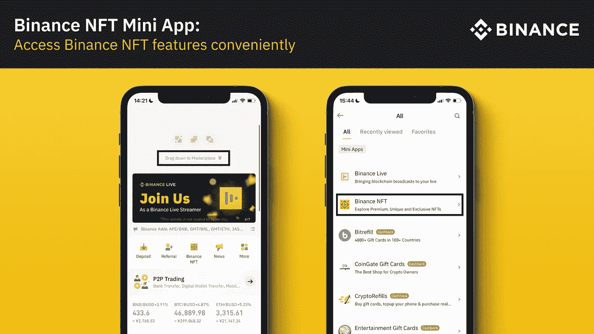
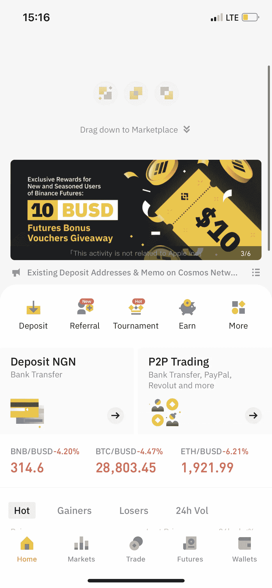
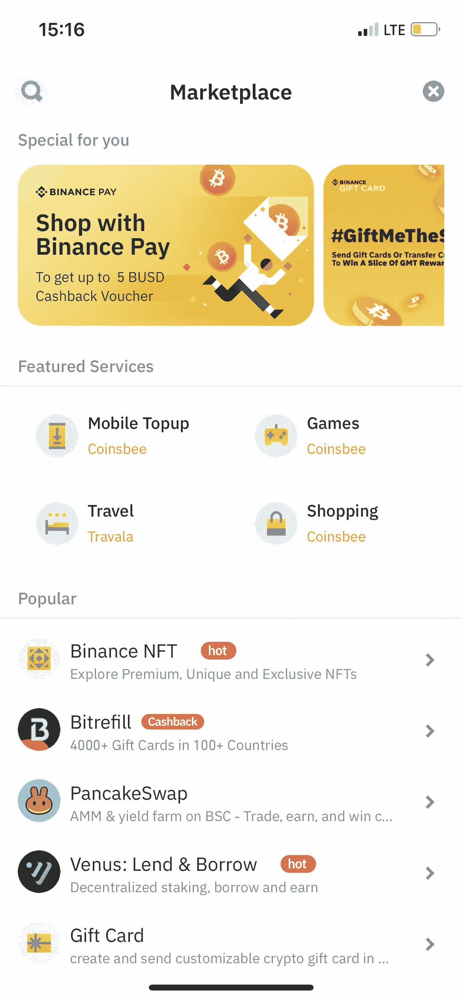
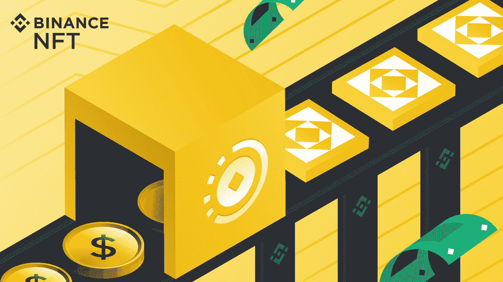

# 如何在币安 App 上访问币安 NFT 迷你 App？

> 原文：<https://medium.com/coinmonks/how-to-access-binance-nft-mini-app-on-binance-app-6d07757e0cb6?source=collection_archive---------22----------------------->

Photo: Binance

什么是币安 NFT 迷你应用程序？

NFT 让 Cryptoverse 最近有了数百万美元的交易。但是，[币安 NFT 迷你 App](https://www.binance.com/en/nft?ref=P10U1GSP) ( [公布【2022 年 4 月)里有什么给你的呢？请继续阅读，了解更多信息。](https://twitter.com/binance/status/1513759817697042432)

币安 NFT 是币安推出的一项激动人心的新功能，旨在增强用户的 NFT 平台体验。新增加的币安·NFT 小程序功能是币安·NFT 网站的一个以用户为中心和移动友好的变体。现在，通过币安应用程序本身就可以轻松访问最新的功能、产品和服务。最新的币安 NFT 小程序的精确直观的设计让您可以轻松地冲浪和访问 NFT 平台的内容。

**如何访问币安 NFT 迷你应用程序？**

您将首先下载并安装最新的[币安 App](https://www.binance.com/en/download?ref=P10U1GSP) 版本。然后登录您的币安帐户。

只需点击“更多”，然后访问“币安 NFT”的产品和服务。或者，通过从顶部向下拖动来访问应用程序主页上的“市场”。

Photo: Binance

“币安 NFT”选项将在迷你应用程序选项下访问。币安 NFT 现已在最新的币安应用版本(iOS v2.43.0 或以上，或 Android v2.43.0 或以上)上提供。使用币安应用程序可以简化访问币安 NFT 的功能。

了解如何在币安 App 上访问币安 NFT 迷你 App

另查: [**币安推出币安 NFT 迷你 App 功能**](https://www.binance.com/en/support/announcement/151c4872cabc4bd3b4946334c4bce029?ref=P10U1GSP)

**币安 NFT 迷你 App 的好处**

币安 NFT 迷你应用程序增强和丰富了币安 NFT 爱好者的 NFT 体验。币安对编织一次难忘的 NFT 体验的深切投入从币安·NFT 迷你应用程序中显而易见。币安 NFT 迷你应用程序有一个易于使用的，直观的设计，简化了导航和访问 NFT 功能，在币安应用程序的有效方式。

币安 NFT 迷你应用程序有什么新功能？

币安迷你应用程序的最新升级功能包括:

1.  通过属性进行 NFT 滤波。
2.  更好的搜索和过滤体验。
3.  向神秘盒子和非功能性食物发出(买方)报价。
4.  放置(卖家)回复(拒绝或接受)神秘盒子和 NFT 报价。
5.  新优化的 NFT 支付功能。

访问币安 NFT 迷你应用[常见问题](https://www.binance.com/en/support/faq/7157b1045a3b4fc9b3ef71b9dfcbe08f?ref=P10U1GSP)获得更多 [Q & A](https://www.binance.com/en-IN/support/faq/c-130) 支持。

下载[币安 App](https://www.binance.com/en/download?ref=P10U1GSP) 。新来币安吗？[现在就注册](https://accounts.binance.com/en/register?ref=P10U1GSP)！

> 加入 Coinmonks [电报频道](https://t.me/coincodecap)和 [Youtube 频道](https://www.youtube.com/c/coinmonks/videos)了解加密交易和投资

# 另外，阅读

*   [3 商业评论](/coinmonks/3commas-review-an-excellent-crypto-trading-bot-2020-1313a58bec92) | [Pionex 评论](https://coincodecap.com/pionex-review-exchange-with-crypto-trading-bot) | [Coinrule 评论](/coinmonks/coinrule-review-2021-a-beginner-friendly-crypto-trading-bot-daf0504848ba)
*   [莱杰 vs Ngrave](/coinmonks/ledger-vs-ngrave-zero-7e40f0c1d694) | [莱杰 nano s vs x](/coinmonks/ledger-nano-s-vs-x-battery-hardware-price-storage-59a6663fe3b0) | [币安评论](/coinmonks/binance-review-ee10d3bf3b6e)
*   [Bybit Exchange 审查](/coinmonks/bybit-exchange-review-dbd570019b71) | [Bityard 审查](https://coincodecap.com/bityard-reivew) | [Jet-Bot 审查](https://coincodecap.com/jet-bot-review)
*   [3 commas vs crypto hopper](/coinmonks/3commas-vs-pionex-vs-cryptohopper-best-crypto-bot-6a98d2baa203)|[赚取加密利息](/coinmonks/earn-crypto-interest-b10b810fdda3)
*   最好的比特币[硬件钱包](/coinmonks/hardware-wallets-dfa1211730c6) | [BitBox02 回顾](/coinmonks/bitbox02-review-your-swiss-bitcoin-hardware-wallet-c36c88fff29)
*   [BlockFi vs Celsius](/coinmonks/blockfi-vs-celsius-vs-hodlnaut-8a1cc8c26630)|[Hodlnaut 点评](/coinmonks/hodlnaut-review-best-way-to-hodl-is-to-earn-interest-on-your-bitcoin-6658a8c19edf) | [KuCoin 点评](https://coincodecap.com/kucoin-review)