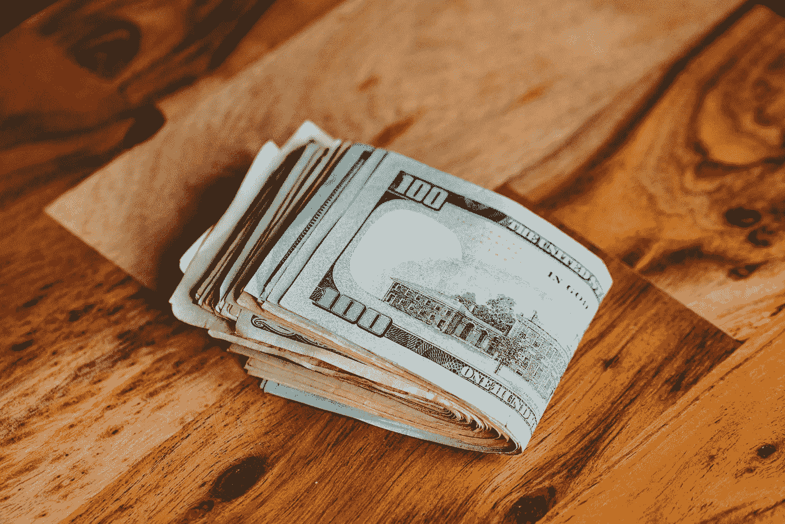

# 如何实现财务独立

> 原文：<https://medium.com/coinmonks/how-to-achive-financial-independence-9d89ac977941?source=collection_archive---------27----------------------->

Source photo Unsplash.com

# 通过一个简单的公式实现财务独立

尽管个人理财世界看起来陌生、复杂、令人生畏，但它可以用一句话来概括，你可以告诉你的朋友和家人:

## 花的比赚的少，把差额投入投资。