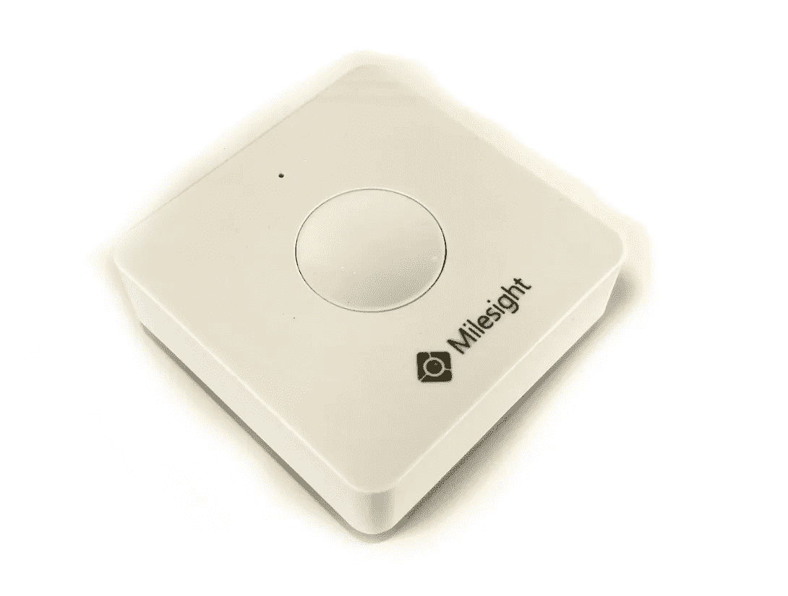
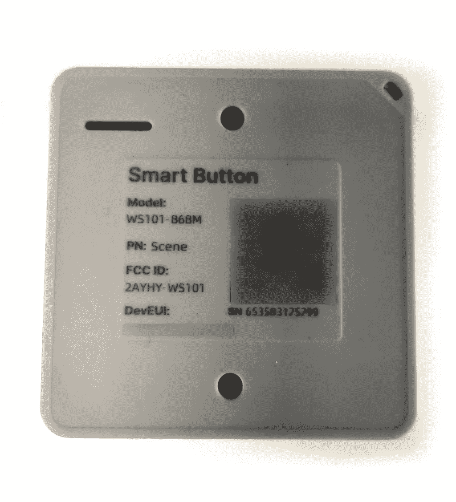
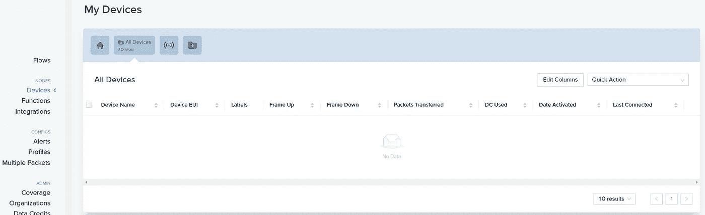
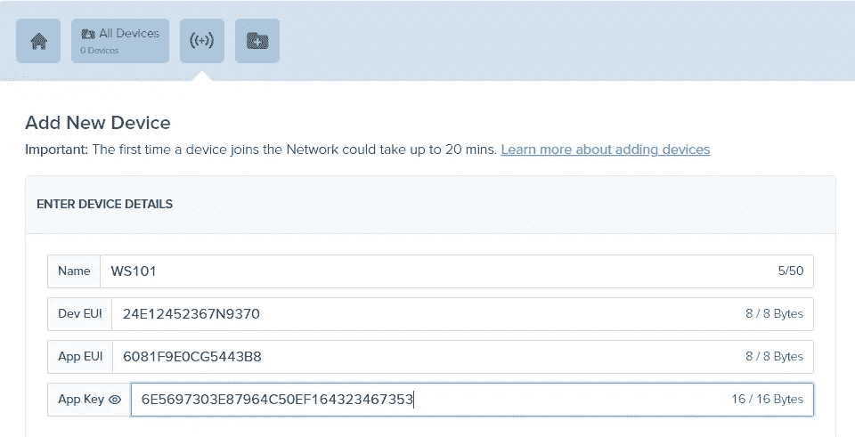
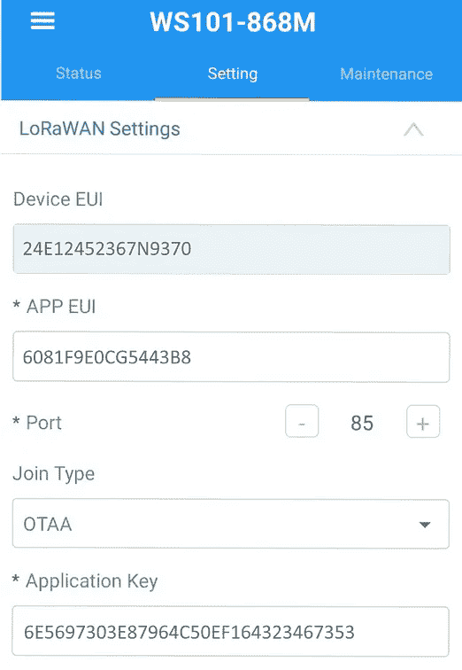
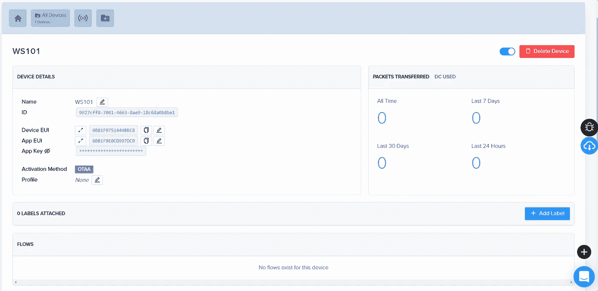

# 如何将 LoRaWan 设备添加到氦网络！(以及物联网按钮如何对您有用)

> 原文：<https://medium.com/coinmonks/how-to-add-lorawan-devices-to-the-helium-network-and-how-iot-buttons-might-be-useful-for-you-a4d386ec42e9?source=collection_archive---------8----------------------->

# 介绍

(**向下滚动查看教程**)我目前受雇于一家清洁服务初创公司，我们为公司搭建了一个平台，为员工安排清洁工作、管理资产、创建任务和通知。随着该平台的快速发展，我们不断寻求扩展我们的服务，并探索任何可能改善我们提供的服务和产品的机会。

我们目前正在研究的创新之一是物联网(IoT)设备的使用，它使我们能够通过按下按钮来创建某些任务/例程。支持 WiFi 的物联网设备的缺点是其有限的范围(仅在本地 WiFi 网络覆盖的地方)，在该位置设置的麻烦以及对网络变化的敏感性。LoRaWan 设备的覆盖范围非常广(在荷兰，我们已经在拥挤的地区实现了几乎 100%的覆盖),并且只需设置一次，就可以在任何地方工作！在这篇文章中，我将解释如何在氦控制台中设置你的 LoRaWan 设备并开始使用它们！

# 如何将您的 LoRaWan 设备添加到氦网络

我将使用 MileSight WS-101 按钮执行此演练。要获得密钥，我们需要 *MileSight 工具箱*应用程序和一个支持 NFC 的设备来读取按钮的设置。这个装置已经为我们提供了一个。

MileSight WS101 back sticker

1 .找到 **Dev EUC** 、 **App EUI** 和 **App Key。** 大多数 LoRaWan 设备都配有这些密钥，或者在设备背面的**标签上，或者在设备的**设置中。

Helium device console

2.**进入**[**console.helium.com**](http://console.helium.com)**登录或创建账户。**单击设备选项卡打开页面，并创建新设备。

Settings for the button

3.**在控制台中，我们要输入开发 EUI、应用 EUI 和应用键**。如果您的设备已经提供了所有这些密钥，您只需在这里填写它们。**注意:**如果您的设备只附带了一个 Dev EUI，您可以将自动生成的 App EUI 和 App Key 输入到设备中。这就是我们的 WS101 按钮的情况。

4.**点击保存设备，将设备保存到您的控制台。**

WS101 button added to the console.

5.**等待 20 分钟，您的设备将会添加到网络中。**

# 结论

通过 5 个简单的步骤，我们能够将我们的设备添加到氦网络，只要它与氦路由器之一有连接，它就应该能够在被按下时发出信号。我将在以后的文章中解释如何处理按钮调用，这将解释氦控制台中的流程。

我希望这篇文章对您有所帮助，如果您有任何问题或意见，请告诉我！

> 加入 Coinmonks [电报频道](https://t.me/coincodecap)和 [Youtube 频道](https://www.youtube.com/c/coinmonks/videos)了解加密交易和投资

# 另外，阅读

*   [如何在 Uniswap 上交换加密？](https://coincodecap.com/swap-crypto-on-uniswap) | [A-Ads 审核](https://coincodecap.com/a-ads-review)
*   [WazirX vs coin dcx vs bit bns](/coinmonks/wazirx-vs-coindcx-vs-bitbns-149f4f19a2f1)|[block fi vs coin loan vs Nexo](/coinmonks/blockfi-vs-coinloan-vs-nexo-cb624635230d)
*   [本地比特币审核](/coinmonks/localbitcoins-review-6cc001c6ed56) | [加密货币储蓄账户](https://coincodecap.com/cryptocurrency-savings-accounts)
*   [什么是保证金交易](https://coincodecap.com/margin-trading) | [美元成本平均法](https://coincodecap.com/dca)
*   [支持卡审核](https://coincodecap.com/uphold-card-review) | [信任钱包 vs MetaMask](https://coincodecap.com/trust-wallet-vs-metamask)