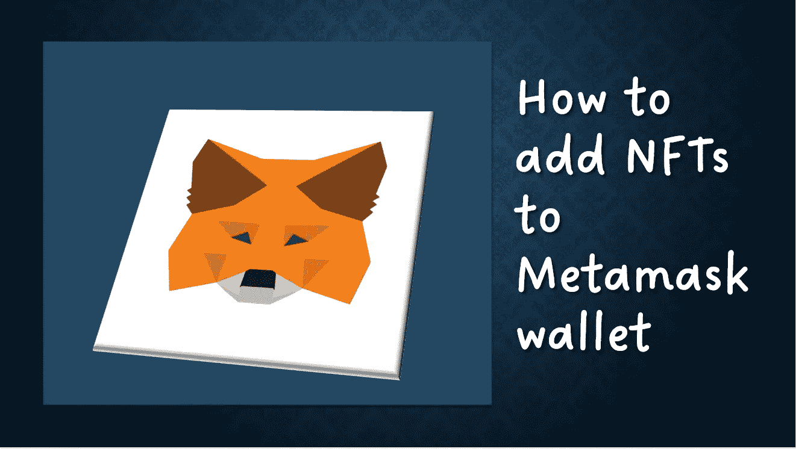
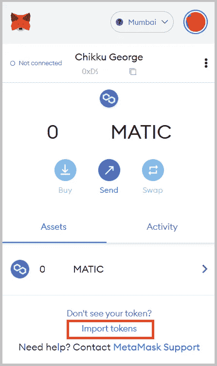
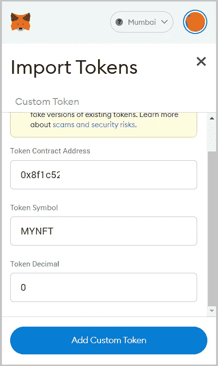
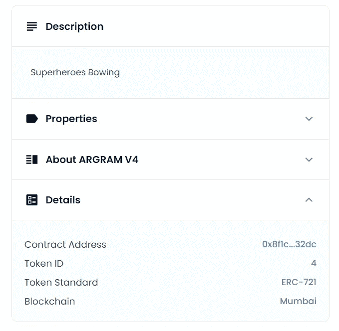
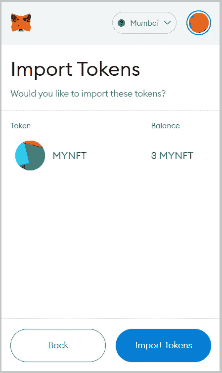
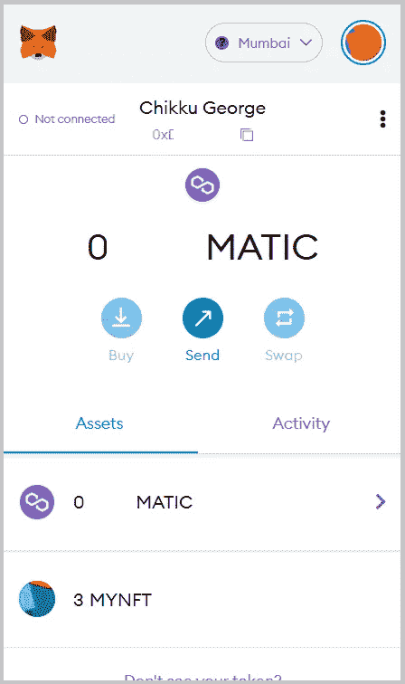

# 如何将 NFTs 添加到元掩码 wallet

> 原文：<https://medium.com/coinmonks/how-to-add-nfts-to-metamask-wallet-8989454b0ef6?source=collection_archive---------4----------------------->

## NFT 系列

## 关于如何将 NFT(标准 ERC-721 和 ERC-1155)添加到元掩码浏览器扩展的指南

## 添加 ERC-721 NFTs

## 步骤 1: *将令牌*导入您的元掩码钱包

Import Tokens

## 步骤 2:添加自定义令牌

Add Custom token

*您必须将令牌的十进制数指定为 0。令牌符号与 ERC-721 协定中指定的集合名称相同。这个令牌符号也可以编辑。令牌协定地址是部署协定的地址。在 OpenSea 中，我们可以在 NFT 细节部分查看合同地址。*

NFT Details on OpenSea

## 步骤 3:导入添加的令牌

Import added token

*现在，你的 NFT 将被添加到你的 metamask 钱包中，你可以跨钱包发送。*

View NFT tokens

## 添加 ERC-1155 NFTs

遵循如何添加 ERC-721 NFT 中提到的相同步骤。

Metamask mobile 和浏览器扩展支持 ERC-1155 令牌，可以接收和存储令牌。但是不能发送代币。事实上，令牌数和图像在移动应用程序上是可见的，但浏览器扩展尚不支持。

 [## 元掩码支持 ERC-1155 吗？

### ERC-1155 令牌由 MetaMask 移动和扩展支持，这意味着您的钱包可以接收和存储资产…

metamask.zendesk.com](https://metamask.zendesk.com/hc/en-us/articles/360058488651-Does-metamask-support-ERC-1155-) 

## 谢谢:)

> 加入 Coinmonks [电报频道](https://t.me/coincodecap)和 [Youtube 频道](https://www.youtube.com/c/coinmonks/videos)了解加密交易和投资

# 另外，阅读

*   [block fi vs Celsius](/coinmonks/blockfi-vs-celsius-vs-hodlnaut-8a1cc8c26630)|[Hodlnaut 审核](/coinmonks/hodlnaut-review-best-way-to-hodl-is-to-earn-interest-on-your-bitcoin-6658a8c19edf) | [KuCoin 审核](https://coincodecap.com/kucoin-review)
*   [Bitsgap 审查](/coinmonks/bitsgap-review-a-crypto-trading-bot-that-makes-easy-money-a5d88a336df2) | [Quadency 审查](/coinmonks/quadency-review-a-crypto-trading-automation-platform-3068eaa374e1) | [Bitbns 审查](/coinmonks/bitbns-review-38256a07e161)
*   [加密复制交易平台](/coinmonks/top-10-crypto-copy-trading-platforms-for-beginners-d0c37c7d698c) | [Coinmama 评论](/coinmonks/coinmama-review-ace5641bde6e)
*   [印度的加密交易所](/coinmonks/bitcoin-exchange-in-india-7f1fe79715c9) | [比特币储蓄账户](/coinmonks/bitcoin-savings-account-e65b13f92451)
*   [OKEx vs KuCoin](https://coincodecap.com/okex-kucoin) | [摄氏替代度](https://coincodecap.com/celsius-alternatives) | [如何购买 VeChain](https://coincodecap.com/buy-vechain)