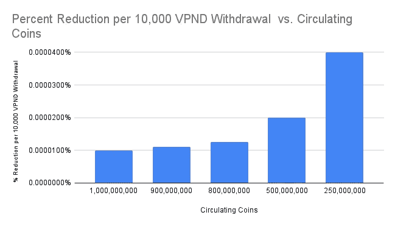
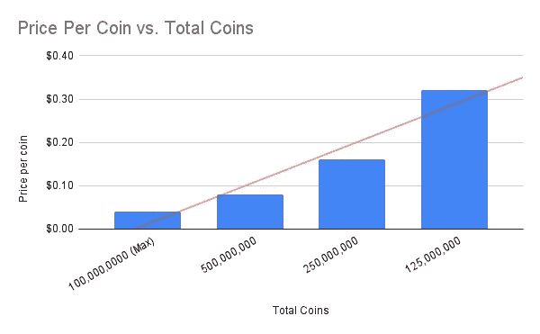
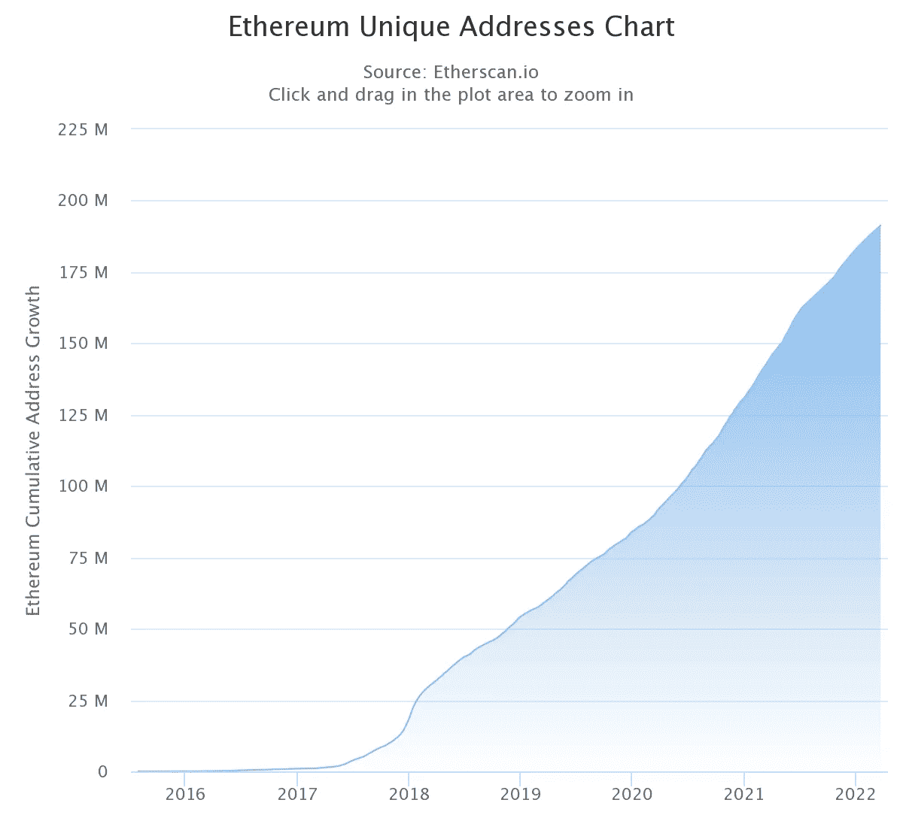
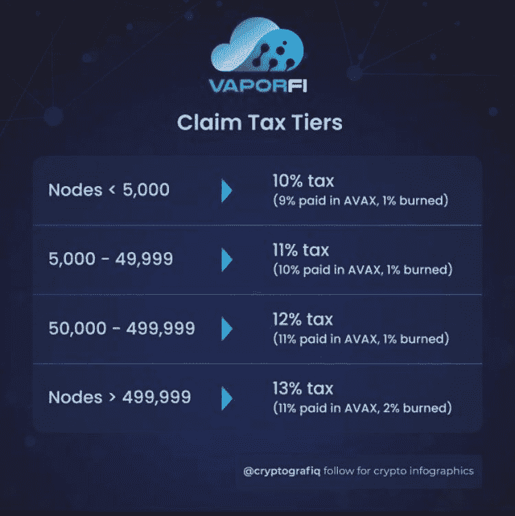
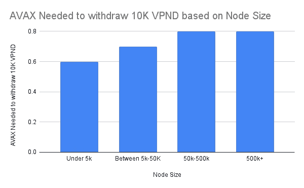
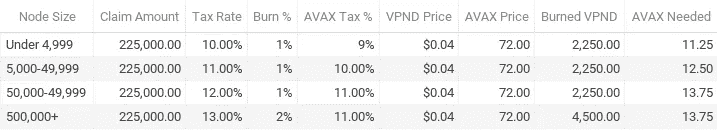

# 如何适应 Vaporfi AVAX 税收变化

> 原文：<https://medium.com/coinmonks/how-to-adjust-to-the-vaporfi-avax-tax-changes-32390137ebbf?source=collection_archive---------9----------------------->

在我第一篇关于 Vapor Finance 的博客中，有一条评论是，读者仍然不理解 AVAX 税背后的原因。所以我要深入探讨一下。

对于加密领域的小鱼来说，在 AVAX 中征收 9%-11%的税确实会使投资复杂化。

我将讨论索赔税现在如何工作，一旦实施 AVAX 索赔税，它将如何工作，AVAX 税如何提高项目的可持续性，以及如何使其更容易处理。

# 索赔税目前是如何运作的？

目前，索赔税占我们索赔的 VPND 的 10%,并执行以下操作:

1.  烧伤 1%
2.  向财政部上缴 9%
3.  偶尔出售 VPND 投资于其他项目，以增加国债持有量(这就是抛售压力的来源)

VaporFi 团队无法在没有某种改变的情况下停止执行第 3 步，因此他们提出了 AVAX 纳税申请，我们也批准了。

# AVAX 纳税将如何进行？

根据您的节点大小，AVAX 税款的支付方式会有所不同。我们将同时研究燃烧税和 AVAX 税。

# 烧伤是如何工作的？

如果您的节点添加了少于 500k 的 VPND，您仍然会有 1%的消耗

那些在一个节点中超过 500k 的将烧 2%声称的 VPND。

我将在本博客的其余部分使用 10，000 VPND 的示例来帮助量化这一变化。

对于大多数节点，我们将每 10，000 个声明消耗 100 个 VPND。对于超过 500，000 VPND 的节点，每 10，000 个声明的节点将有 200 个 VPND 烧毁。

## 这对价格有什么影响？

硬币最初的总供应量是 10 亿个硬币，其中 1.25 亿个 VPN 锁定了 420 天(即 12.5%)。

所以对于每一个 10，000 VPND 的索赔，你会有名义上的价格上涨压力，因为 VPND 的价格理论上应该等于

**国库价值/流通硬币**

下表显示了基于 100 个燃烧的硬币，10，000 个 VPND 的提取减少了多少 VPND 的供应。

同样，假设没有其他变化，理论上你应该看到硬币每减半价格就会翻倍。为简单起见，下表显示了基于 0.04 美元价格的理论定价。

## 烧伤对销售压力有什么作用？

烧钱实际上减轻了卖出压力，因为它给定价带来了上行压力。

供求规则表明，随着价格上涨，想卖的人越来越多，想买的人越来越少。但这忽略了 FOMO 的心理学，即随着价格的上涨，越来越多的人意识到一个项目，并希望进入。

我们将以比特币为例，说明 FOMO 的心理如何影响供求曲线。

随着比特币从 2 万美元上涨到最近的 68750 美元，钱包的数量从略高于 2500 万增加到 8000 万左右。

[https://www . statista . com/statistics/647374/world wide-区块链-钱包-用户/](https://www.statista.com/statistics/647374/worldwide-blockchain-wallet-users/)

自 2017 年发布以来，ETH 同样将钱包增加到了 1.75 亿以上。具有相对直的向上路径。

第一年增长较快，随后放缓，然后加速，最后 3 年。

根据上面的图表，我认为一个合理的假设是，价格每翻一番，需求就会翻一番(或者更多)。

# 现在我们来看看 AVAX 税。

AVAX 税根据您的节点大小进行分级。下图所示为 4 层。

基于 10，000 VPND 套现示例，下表显示了假设 72 美元的 AVAX 和 0.04 美元的 VPND 套现所需的 AVAX 金额。表中的 AVAX 值包括 0.1 美元的汽油费，这比我以前支付的要高。它也向上舍入到下一个. 1 AVAX。

在 500，000+节点上，还会有一次额外的刻录。

## 这对 VPND 的需求有何影响？

10，000 VPND 兑现为 9，800 或 9，900 VPND，然后您可以在市场上出售。那就是抛售压力。

AVAX 税使 VaporFi 能够在市场上购买 1080 至 1440 辆。将卖出压力降低到 8360-8860 之间。

与之前的 9,000 VPND 抛售压力相比，你的抛售压力减少了 1.56%-7.12%。

这对项目来说很好，但它给小鱼带来了负担。

我也不喜欢，但我无法说服他们做一个行项目否决。幸运的是，有几种方法可以处理它。

我们来看一些方式。

# 处理 AVAX 税的 5 个选项

作者注:由于对这些数字是如何计算的有些混乱，这一部分被编辑了。本节和以下各节已经过调整，以显示每个计算背后的数学原理以及每个节点层的值。使用了以下假设:

1.  在撰写本文时，AVAX 值为 72 美元。
2.  在撰写本报告时，VPND 值为 0.04 美元。
3.  这不是集中在 1%或 2%的 VPND 烧伤。之前讨论过。

得出这些数字的公式是:

1.  VPND 的数量*AVAX 税% = VPND 中的税
2.  VPND 税* $.04/VPND=美元税
3.  美元税/ $72/AVAX= AVAX 以兑现

## 选择 1:每次发工资都买 AVAX。

如果你每周购买 0.25 到 5 AVAX，你应该不会有任何问题，除非你兑现了大量现金。

即使是 225，000 VPND 套现最多也只需要 13.75 AVAX 加汽油费。

AVAX Needed for 225,000 VPND Cashout

## 方案二:先套现一个节点

使用此选项可以减少您必须购买的 AVAX 数量。

假设您有 5 个节点，每个节点有 225，000 个 VPND 可供使用。这意味着您需要 56.25-62.5 之间的 AVAX。那很贵。我们说的是 4050 美元到 4950 美元)(2022 年 3 月 28 日，最高级别节点的价格接近 6600 美元。

大多数人都没有那么多钱。

大多数人有足够的钱先撤回 1 个节点。不过，任何低于 1000 美元的收入都低于美国的中值收入。这只是意味着你必须使用你的全部支票来兑现第一个节点的 VPND 并将其交易为 AVAX，然后用收到的 AVAX 支付其他节点。

然后你会想把至少一部分 AVAX 送到 Crypto.com 这样的地方，在那里你可以用他们的卡回到菲亚特。

确保为下一次保留足够的 AVAX。

## 选择 3:从你的预算开始

每个人都有不同的收入和财务状况，所以你必须自己决定你能付多少税。

如果你每周只能支付 100 美元的税款，那么永远不要每周申报超过 1000 美元。这足以让你每年还有额外的 5 万美元。

## 选项 4:使用柜台选项

如果你想卖 20，000 美元以上，你可以使用柜台销售。你可以试着事先安排好，这样团队就可以在你退出之前收到 AVAX 的付款。

我没有试过这个，所以我不能保证它会工作。

## 选项 5:只是复合

据 AMA 的 Vapor Finance 团队称，他们正在创建自己的区块链，并将向节点空投代币。虽然细节还没有被分享，但我希望你在节点上的令牌越多，你的空投就越大。也许现在还不是套现的时候。等待更多信息。

在你赚取剩余收入的道路上，你还考虑过其他什么策略？

> *加入 Coinmonks* [*电报频道*](https://t.me/coincodecap) *和* [*Youtube 频道*](https://www.youtube.com/c/coinmonks/videos) *了解加密交易和投资*

# 另外，阅读

*   [有哪些交易信号？](https://coincodecap.com/trading-signal) | [Bitstamp vs 比特币基地](https://coincodecap.com/bitstamp-coinbase) | [买索拉纳](https://coincodecap.com/buy-solana)
*   [ProfitFarmers 点评](https://coincodecap.com/profitfarmers-review) | [如何使用 Cornix 交易机器人](https://coincodecap.com/cornix-trading-bot)
*   [十大最佳加密货币博客](https://coincodecap.com/best-cryptocurrency-blogs) | [YouHodler 评论](https://coincodecap.com/youhodler-review)
*   [MyConstant Review](https://coincodecap.com/myconstant-review) | [8 款最佳摇摆交易机器人](https://coincodecap.com/best-swing-trading-bots)
*   [MXC 交易所评论](/coinmonks/mxc-exchange-review-3af0ec1cba8c) | [Pionex vs 币安](https://coincodecap.com/pionex-vs-binance) | [Pionex 套利机器人](https://coincodecap.com/pionex-arbitrage-bot)
*   [我的加密副本交易经历](/coinmonks/my-experience-with-crypto-copy-trading-d6feb2ce3ac5) | [比特币基地评论](/coinmonks/coinbase-review-6ef4e0f56064)
*   [CoinFLEX 评论](https://coincodecap.com/coinflex-review) | [AEX 交易所评论](https://coincodecap.com/aex-exchange-review) | [UPbit 评论](https://coincodecap.com/upbit-review)