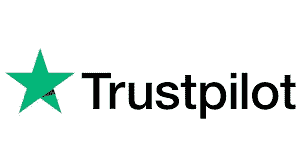
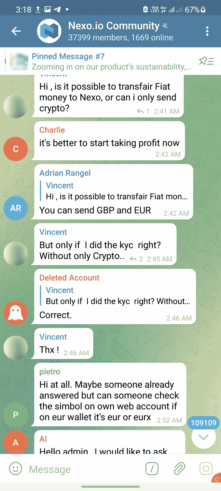
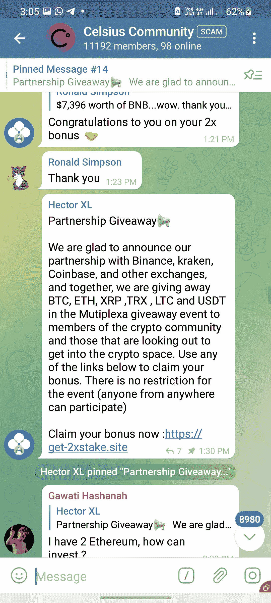

# 网络的阴暗面——需要警惕的加密货币骗局

> 原文：<https://medium.com/coinmonks/how-to-avoid-cryptocurrency-scams-from-my-pov-57aa57671ac2?source=collection_archive---------7----------------------->

加密货币市场提供了一个有利可图的赚钱机会，因为它与诈骗联系在一起。每天，我们都被大量诱人的提议和投资机会轰炸，这些提议和机会有时好得难以置信。作为一个已经投资了相当长一段时间的密码爱好者，我可以说我也遇到过陷阱，在各种骗局中损失了不少钱。今天我把我的经验收集在这里，希望你不要重蹈我的覆辙！我将引用我过去涉足的诈骗平台的例子，如 mineify、mygbit 和 darkmine。

# **#1。如果它好得令人难以置信，它很可能是真的。**

在那些日子里，mineify 是一个所谓的采矿网站，承诺，事实上，交付了一个非常好的投资回报率！Mineify 是一个真正令人信服的平台——它有一份精心起草的白皮书，其中包含法律信息，甚至还有公司注册号(据说有 ASIC)。他们向你展示了他们采矿农场的“实时”视频流，给了他们所谓的首席执行官尼古拉·普罗佐拉一个名字和一张脸，甚至还有一个非常庞大而活跃的 telegram 社区！一切似乎都很合法，除了这可能是一个太好的交易是真实的！

他们有非常有吸引力的负担得起的采矿计划，承诺难以置信的散列率。

他们承诺非常慷慨的免费注册奖金(在 mineify 的情况下，有吸引力的奖金 hashrates)。

最棒的是，取款是免费的，取款限额非常低。我记得从退出中获得快乐(免费！)隔天到我钱包里。

由于相信 mineify 是可信的，我花了大量的时间研究这个平台，并虔诚地将我的投资和回报列表如下

如你所见，回报相当可观；我从 2020 年 10 月开始投资，到 2021 年 12 月，我已经收回了 62.5%的资本。在这两个月的时间里，他们不断推出一个又一个看起来好得令人难以置信的优惠——最初是采矿计划的 50%折扣，然后是 60%，70%，80%，最后是的，你猜对了，90%折扣！

在那个阶段，我真的开始怀疑到底发生了什么。然而，我对短期回报的贪婪蒙蔽了我的判断，助长了随后的额外投资，以利用永无止境的大折扣，拒绝相信 mineify 将成为骗局这一不可避免的事实。的确，他们在 2020 年 12 月做到了。

这发生在一系列步骤中——最初停止挖掘，停止支付，telegram group 一个接一个地删除我们，然后完全消失，然后网站停止运营。我本应该预见到这一点——但话说回来，作为一个天真健忘的投资者，我看到了我想相信的东西，我选择忽略许多危险信号——好得不像真的报价、不切实际的挖掘散列率、网站设计中使用的普通图片、有缺陷的语法等等。这是一个痛苦但富有成效的错误。

在 darkmine 的案例中，他们也承诺了有吸引力的永久采矿合同——是的，你没听错，他们承诺采矿计划将永远继续下去！

Out of curiosity, I followed the instructions as above — only to be led to be a page requesting a deposit before the ‘free BTC’ can be released — again a stereotypical scam presentation.

# **#2 新企业**

在投资最近建立的平台(几周或几个月内)时要谨慎，尤其是如果它们承诺提供慷慨的产品。当然，他们最初可能会付款，但可能会在一段时间内变成骗局；只有时间能证明一切。然而，这并不是一个免除长期平台误入歧途的普遍规则；然而，这种情况发生的概率可能较低。一个很好的起点是在 trustpilot 等可验证的网站上查看评论。然而，话又说回来，小心虚假评论——对于公司来说，写大量虚假评论来提升某个网站的评级实在是太容易了。应该引起对评论合法性怀疑的一些线索包括刻板印象(一些虚假评论只是彼此的镜像或复制粘贴)或由过去从未编写过任何评论的未经验证的用户编写。

Review sites provide a good measure of the reliability and authenticity of a platform — but do bear in mind that it is easy to leave fake reviews that mislead in either direction.

Avail sites like scamadviser to assess a platform prior to investing. Do your own research thoroughly!

# **#3 不切实际的推荐奖金**

当然，我们确实喜欢偶尔发奖金；然而，过度热情的推荐项目应该敲响警钟。毕竟，上述公司需要从产生的收入中获利；除非这是一个 MLM/庞氏骗局，否则它能以推荐奖金的形式自由分配大笔资金的几率有多大？在 mineify 的例子中，高达 10%的推荐奖金给予了三代推荐人——这很快就相当慷慨地增加了。Mygbit 有一个双臂推荐计划，只有在双臂两侧的人都做出相同金额的投资时，推荐奖金才会被计入。

# **#4 糟糕的网站设计**

他们说，不要以貌取人。这在一定程度上是真的。然而，缺乏内容、粗劣的语言和从互联网上下载的普通图片应该会引起人们对平台可信度的怀疑。

# # 5 小心钓鱼网站

网络钓鱼是一种策略，攻击者通过发送欺诈性消息来欺骗受害者向攻击者透露敏感信息，或者在受害者的基础架构上部署恶意软件，如勒索软件。

在加密的情况下，这是通过为粗心的用户设计一个类似的网页来输入他或她的登录信息来实现的。

这曾经发生在我身上——我谷歌了一下 cakedefi，在列表的最上方出现了一个赞助搜索结果(谷歌广告),具体地址我不记得了，但与官方网站的地址相似，但有一个 blogspot 域名(类似于 cakedefi.blogspot.com)——这应该立即敲响了警钟。点击链接会将用户带入一个与原始页面没有区别的登录页面(如下所示)。我立即向谷歌报告了这则广告，随后它被迅速撤下。(之前我有机会拍摄了该页面的快照，以供本文参考。)

如果粗心的用户输入了他或她的登录信息，这些信息会立即提交给骗子，从而危及用户的 cakedefi 帐户。这种攻击可以在任何平台上发生，除了上面引用的例子外，还可以通过许多其他方式发生，例如故意拼错 URL(例如 goggle 而不是 google 贝南斯而不是币安，等等)。因此，始终确保登录信息输入到正确的网站；当然，不言而喻，永远不要向任何人透露你的 TAC/ OTP/ 2FA 代码，包括任何自称是客户服务代表的人，这就引出了我们的下一点。

# **#6 未经证实的垃圾邮件是骗局**

Telegram 是一种非常方便的连接公共群体中志同道合、兴趣相投的人的方式，加密货币也不例外。然而，这是骗子寻找猎物的潜伏地。有些人会伪装成某个组的支持人员，并且非常“乐于助人”，向某个用户发起对话，而该用户可能早些时候在公共组中提出了一个问题。以下是这样一条消息的截图。

# **#7 谨防假团**

看下面的截图，比较各组——你能看出区别吗？

这两个组有相同的组名，有相似的个人资料图片——事实上，这两个组没有任何明显的区别，除了成员的数量。左边的是一个诈骗集团——这可以很容易地通过特征发现，例如托管可疑的促销信息，流行平台的相对较小的受众，以及你被邀请加入的团体。

仔细检查后发现，原始组在组名旁边有一个勾号，表示其验证状态如下。

Look for a verified status for official groups.

# **# 8 没有双重奖励空投这种东西！**

我们经常会遇到某个组织举办的“促销活动”,该组织声称会向订阅它的用户承诺“空投”。其机制是这样的——用户应该向给定的地址发送一定数量(通常有下限)的加密货币，作为回报，用户应该会收到双倍的加密货币。这是一个古老的骗局，许多人仍然不幸上当。

此外，这类团体通过声称收到“空投”的虚假账户发布信息，虚假地向用户保证促销活动的真实性，这种情况并不少见。

虽然以下内容看似可信，但不一定是特定平台可靠性的指标；骗子会全力以赴地描绘出尽可能令人信服的平台画面，以欺骗不警惕和轻信的投资者。

*   公司注册号(Mineify 应该是在 ASIC 注册的，并且有注册号)
*   白皮书(可以很容易地从模板中提取)
*   庞大的电报社区(Mineify 有多个各种语言的电报组，每个组有超过 1 万名成员)
*   实体机构(Mygbit 在土耳其有一个实体办公室，可以在谷歌地图上查到，但时间会证明这是一个骗局)

Physical address of mygbit as viewed from Google street view: Üçevler Mah. 70.(220) Sk. No:1/22 İbrahim Yazıcı Plaza, D:1, 16270 Nilüfer/Bursa, Turkey

*   评论网站(包括 Trustpilot)上的良好评级——骗子很容易为自己的平台提供良好评级——注意危险信号，例如新注册且帖子数量有限的用户的评论。这种评论的语言通常具有重复的性质，并且它们可能在评论网站上积极地推广该平台。

A good rating doesn’t equate absolute reliability — always DYOR!

*   ICO tokens——Mygbit 在今年早些时候消失前不久推出了自己的代币销售，不幸的是，我利用了这一机会。

Practically anyone can create a token; beware!

*   交易平台——Mybit 还推出了“mygbitex ”,这是它自己的交易平台，据说前景光明。
*   移动应用——并非所有来自 google play 商店/苹果商店的应用都是合法的。
*   令人印象深刻的视频演示——MyGBIT 有一个令人印象深刻的演示，包括宣传视频材料，这些材料看起来非常真实，给人以真实的采矿设置、设施和公司人员。出于教育目的，我保存了以下视频的副本，向您展示骗子会在多大程度上说服您某个特定平台。

Disclaimer: This video presentation was uploaded for educational purposes only. MyGbit is a scam.

这样的例子不胜枚举。最终，在投资任何一个平台之前，做一个彻底的研究是非常重要的。

Cryptocurrency investment, as exciting as it may be, is not without its own caveats and pitfalls.

在加密货币之旅中，我经历了相当多的动荡，我珍惜所有经受住时间考验并证明值得提及和分享的投资平台，如下所示

[**Nexo**](https://nexo.io/ref/hce5cfdt5o?src=web-link)**——100 美元存款可获得 25 美元注册奖金**

[**Cake DeFi**](https://cakedefi.com/?ref=677920)**——50 美元存款可获得 50 美元注册奖金**

*如果你喜欢这篇文章，* [*关注&订阅*](/@cybery)

*如果你想看到更多这样的内容，你可以使用下面的一个或多个我的会员链接来支持我:*

[*蛋糕 DeFi*](https://cakedefi.com/?ref=677920) *用 50 美元存款获得 50 美元注册奖金* [*Nexo*](https://nexo.io/ref/hce5cfdt5o?src=web-link)*用 100 美元存款获得 25 美元注册奖金* [*Kucoin*](https://www.kucoin.com/land/register/r/rJH29LZ)*与大量交易机器人* [*火币*](https://www.huobi.com/en-us/topic/double-invite/register/?invite_code=5t5jb&name=Banshee&avatar=4)

***针对马来西亚投资者***[*Stashaway*](https://www.stashaway.my/referrals/kenleel9jx)*获得 6 个月免费投资！
报名申领 RM10 奖金时的推荐代码‘ken lie 1’* [*cap bay P2P*](https://capbay.com/invest/)*报名申领 RM100 奖金时的推荐代码‘8879 C6’*

***连接*** *与我在* [*上发表 0x*](https://www.publish0x.com/of-cakes-and-cryptocurrency)[*中*](https://cybery.medium.com/)

> 加入 Coinmonks [电报频道](https://t.me/coincodecap)和 [Youtube 频道](https://www.youtube.com/c/coinmonks/videos)了解加密交易和投资

# 另外，阅读

*   [3 商业评论](/coinmonks/3commas-review-an-excellent-crypto-trading-bot-2020-1313a58bec92) | [Pionex 评论](https://coincodecap.com/pionex-review-exchange-with-crypto-trading-bot) | [Coinrule 评论](/coinmonks/coinrule-review-2021-a-beginner-friendly-crypto-trading-bot-daf0504848ba)
*   [莱杰 vs n rave](/coinmonks/ledger-vs-ngrave-zero-7e40f0c1d694)|[莱杰 nano s vs x](/coinmonks/ledger-nano-s-vs-x-battery-hardware-price-storage-59a6663fe3b0) | [币安评论](/coinmonks/binance-review-ee10d3bf3b6e)
*   [Bybit Exchange 审查](/coinmonks/bybit-exchange-review-dbd570019b71) | [Bityard 审查](https://coincodecap.com/bityard-reivew) | [Jet-Bot 审查](https://coincodecap.com/jet-bot-review)
*   [3 commas vs crypto hopper](/coinmonks/3commas-vs-pionex-vs-cryptohopper-best-crypto-bot-6a98d2baa203)|[赚取加密利息](/coinmonks/earn-crypto-interest-b10b810fdda3)
*   最好的比特币[硬件钱包](/coinmonks/hardware-wallets-dfa1211730c6) | [BitBox02 回顾](/coinmonks/bitbox02-review-your-swiss-bitcoin-hardware-wallet-c36c88fff29)