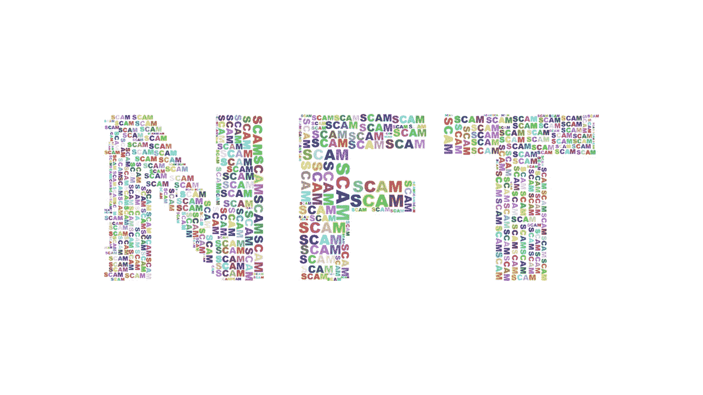

# NFT 骗局无处不在:以下是如何避免它们

> 原文：<https://medium.com/coinmonks/how-to-avoid-getting-fooled-by-an-nft-scam-d4459b09a01b?source=collection_archive---------48----------------------->

拉拽。抽水和倾倒。抄袭的 NFTs。如果你不知道这些是什么，或者你没有遇到过这些事情，那你应该觉得自己很幸运。NFT 骗局在加密领域越来越常见。有些人甚至赚了数百万美元，愚弄了很多人。在本文中，我们将分析一些最常见的 NFT 骗局，以及如何避免它们。这样，你就可以知道要注意什么，这样你就不会成为 NFT 骗局的下一个受害者。

# **地毯拉手**

一个 NFT 地毯拉本质上是一个 NFT 骗局，开始于开发商作出大量的声明，甚至可能在市场上发布看起来非常有前途的数字资产。随着越来越多的投资者卷入这场骗局，创始人只是带着资金跑路。承诺的项目从未实现。

## **如何避免这场 NFT 骗局**

投资前做足功课！调查项目背后的开发商的资质和声誉。此外，请注意以下事项:

*   较长的流动性锁定期。
*   项目白皮书。
*   少数投资者拥有 NFT 的大部分资产。
*   可疑的高额赌注奖励。
*   可疑的网站。

# **泵送和卸载**

令人失望的是，泵和转储方案现在在密码世界中司空见惯。现在他们是无良经营者的一个有利可图的 NFT 骗局。这种类型的 NFT 骗局运作时，一个集团购买了大量的 NFT，以人为抬高其价值，推动需求。在此之后，骗子会在知道价格处于峰值时抛售，给投资者留下一文不值的资产。

## **如何避免这个 NFT 骗局**

你需要检查历史和 NFT 项目的记录。 [OpenSea](https://opensea.io/) 可以让你找出 NFT 收藏的总交易量和买家数量。你要找的是很多投资人。这意味着良好的流动性。在脸书、Twitter、Discord 等网站上关注 NFT 项目。它是否有一个积极参与、真实可信的社区来确保其价值有机增长？

# **抄袭的 NFTs**

不幸的是，这个 NFT 骗局越来越受欢迎。越来越多的艺术家报告说，他们的作品被骗子窃取并转化为非功能性作品。然后，这些股票被出售给投资者，他们认为自己是在购买真实交易的所有权。将一件艺术品铸造成 NFT 是一个非常简单的过程。但这并不意味着这个人拥有知识产权。骗子正在窃取艺术家的知识产权，并创建假的 OpenSea 帐户来销售他们伪造的 NFT。

## **如何避开这个 NFT 骗局**

同样，在购买 NFT 之前做必要的背景调查是很重要的。艺术家是否有一个蓝色勾号来表示他们在 OpenSea 上的验证状态？你甚至可以通过 Twitter、Instagram、在线等方式“跟踪”这位艺术家。看看你能否证明这些艺术品是属于他们的。最后，你甚至可以直接联系他们，询问 NFT 的艺术品是否是他们的。

# 最后的想法

谁也不想被骗走自己的血汗钱。同时，谁也不想错过下一笔大投资。骗子们正在利用投资者在 NFT 市场一夜暴富的希望。这就是为什么做自己的研究很重要。只有当你 100%确定这是一个真正的机会时，才投资。哦，永远保护你的私人信息的安全。

 [## 你准备好迎接加密经济了吗？加密派

### 每次你打开新闻，阅读报纸，或者浏览你的推特，你很可能会看到一些故事…

www.thecryptopie.com](https://www.thecryptopie.com/) 

> 加入 Coinmonks [电报频道](https://t.me/coincodecap)和 [Youtube 频道](https://www.youtube.com/c/coinmonks/videos)了解加密交易和投资

# 另外，阅读

*   [AscendEx 保证金交易](https://coincodecap.com/ascendex-margin-trading) | [Bitfinex 赌注](https://coincodecap.com/bitfinex-staking) | [bitFlyer 审核](https://coincodecap.com/bitflyer-review)
*   [麻雀交换评论](https://coincodecap.com/sparrow-exchange-review) | [纳什交换评论](https://coincodecap.com/nash-exchange-review)
*   [维护卡审核](https://coincodecap.com/uphold-card-review) | [信任钱包 vs MetaMask](https://coincodecap.com/trust-wallet-vs-metamask)
*   [Exness 点评](https://coincodecap.com/exness-review)|[moon xbt Vs bit get Vs Bingbon](https://coincodecap.com/bingbon-vs-bitget-vs-moonxbt)
*   [如何开始通过加密贷款赚取被动收入](https://coincodecap.com/passive-income-crypto-lending)
*   [加密货币储蓄账户](/coinmonks/cryptocurrency-savings-accounts-be3bc0feffbf) | [加密交易机器人](https://coincodecap.com/best-crypto-trading-bots)
*   [BigONE 交易所评论](/coinmonks/bigone-exchange-review-64705d85a1d4) | [CEX。IO 审查](https://coincodecap.com/cex-io-review) | [交换区审查](/coinmonks/swapzone-review-crypto-exchange-data-aggregator-e0ad78e55ed7)