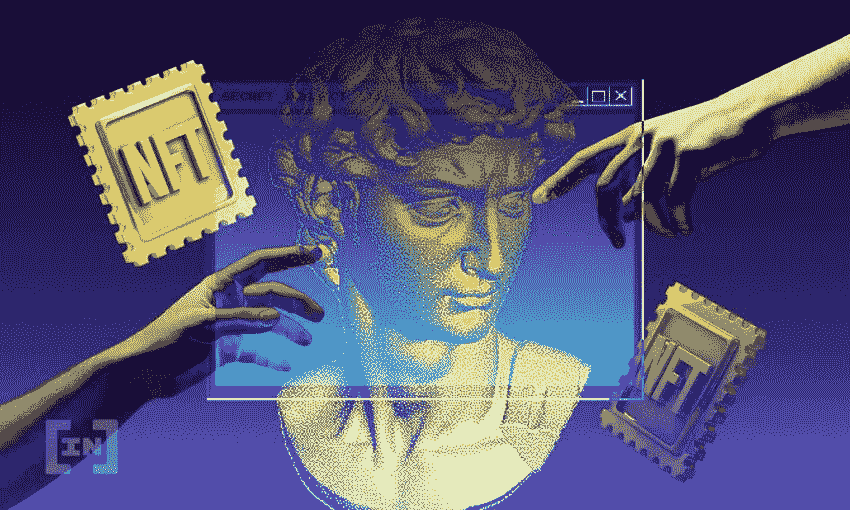

# 如何避免 NFT 骗局？

> 原文：<https://medium.com/coinmonks/how-to-avoid-nft-scams-bff88c803252?source=collection_archive---------29----------------------->

How To Avoid NFT Scams

NFT，数字世界最后的宠儿之一，现在是一个几乎人人都知道的概念。随着 NFT 在市场上的价值增加，用户对这个市场表现出极大的兴趣，恶意的人诈骗人的概率与日俱增。

让我们来看看什么是 NFT 及其特点。

## 非功能性测试的主要特点

不可伪造的代币不是区块链博彩业独有的。这些代币可以代表数字和现实世界的资产，如艺术品、房地产、收藏品，甚至个人身份。它们充当一种资本转移。因此，NFT 有着广泛的实际应用，涉及多个行业和用例，并且它们的采用正在加速。与大多数其他数字令牌不同，NFT 表现出三个明显的特征:

**不可替代性**:每一个 NFT 都是一个加密令牌，代表着某种独一无二或不可改变的东西。换句话说，它不能被另一个 NFT 所取代。每个 NFT 中的元数据作为永久且不可更改的记录驻留在区块链上。与真品证书类似，该记录描述了令牌所代表的内容，并描述了令牌的所有权历史和交易记录。相比之下，许多加密货币是可交换的，如比特币(BTC)、以太网(ETH)和其他服务令牌。在这种背景下，可以说 BTC 和 ETH 不能作为 NFT。

**稀有度**:每件 NFT 作品的稀有度是它们受欢迎的关键因素。例如，在 CryptoKitties 中，用户收集并繁殖数字猫，每只猫都由指定的 NFT 塑造。这些小猫咪中的一些被认为是稀有的收藏品，因此，在重视其明显稀有性的收藏家中，它们的价格会提高。例如，2018 年，一只名叫 Dragon 的 CryptoKitty 以 600 ETH 的价格出售，这在当时相当于 17 万美元。

**不可分割性**:鉴于比特币等加密货币的可兑换性和作为交易媒介的预期用途，它们可以被分解成更小的单位。相比之下，大多数 NFT 必须作为一个整体来购买、出售和储存，因此是不可分割的——就像你不能购买 10%的音乐会门票或 60%的机票一样。

## NFT 骗局的常见类型

NFT 骗局要么直接诈骗人们的钱，要么获取凭证来访问一个人的数字钱包或加密货币钱包。不幸的是，在骗局发生后，很难追回丢失的钱或被盗的数字钱包凭证。

以下是一些需要警惕的常见 NFT 骗局。

## 地毯拉手

骗子通过推销假的 NFT 作品或收藏品，并承诺赚钱来吸引买家。骗子在社交媒体上夸大 NFT。一旦购买了 NFTs，所有促销和未兑现的承诺都会消失。这导致该值显著下降。骗子也排除了出售这种 NFT 的可能性。

## 空投

骗子利用社交媒体推广 NFT 赠品。促销活动通常会提供一个免费的 NFT 来向朋友传播消息或注册他们的网站。当到了领奖的时候，骗子要求加密货币钱包信息来发送 NFT，但却获得了帐户的访问权限，并从这个人的钱包中取走了任何钱或 NFT。

## 不和谐的直接信息

不和谐对网络罪犯很有吸引力，并且有各种各样的方法来欺骗用户。这个平台被分成称为服务器的社区，人们可以在这里一起聊天、流媒体和玩游戏。

仅去年 12 月，由最近推出的游戏 NFT 市场 Fractal 运行的 Discord 服务器的 373 名成员看到他们的数字钱包认证受到威胁，损失了总价值 15 万美元的索拉纳。

在 Discord 上受骗的其他方法是发送直接消息(DMs ),让用户相信他们实际上正在联系一个品牌、艺术家或有影响力的人。本质上，不和谐网络越大，收到诈骗短信的几率就越高。你应该避免点击陌生人发送的链接或回复任何金钱请求。同样，不要让自己陷入新 NFT 的机会或项目中，而没有检查报价是否合法。

## 社交媒体上的虚假个人资料

社交媒体用户应该时刻警惕潜在的虚假个人资料，无论是在 Twitter 还是其他社交媒体平台上。这些通常是真实个人资料的副本，稍微注意一下细节就能区分它们——有时一封信就能把你举报给骗子。

与此同时，要求用户对消息做出反应的机器人或技术支持骗子正在使用社交媒体与用户互动，并请求可以让他们访问其加密钱包的信息。虽然坏演员并不总是成功的，但一小部分被骗的用户可能意味着巨大的胜利。

此外，网络犯罪分子可能试图通过发送假装聊天或寻求建议的消息来联系用户。一些危险信号可以帮助检测骗子，例如关注者的数量，推文和转发的数量，或者帐户是否缺少原创内容。

## 投标诈骗

当有人试图转售他们的 NFT 时，一个投标骗局就发生了。在收到最高出价后，骗子——最高出价者——将加密货币换成更低的价值。这可能看起来是最高的金额，但一些加密货币不如其他货币值钱。

## 投资者骗局

人们在买卖 NFT 时保持匿名，这就很容易制造投资骗局。在投资骗局中，威胁者创造了一个看似有价值的投资项目。收集硬币后，它们消失得无影无踪。

最近，邪恶 Ape 开发商的投资者骗局窃取了近 300 万美元的投资。邪恶猿起源于合法进化猿项目的一部分，但在筹集资金后消失了。

## 哄抬股价

当一个团体购买大量加密货币或其他货币以刺激需求时，就会发生泵转储骗局。在价格上涨之后，或者在开采之后，该集团然后出售或者放弃该资产，以兑现收益，而其他所有人都遭受损失。

## 假 NFT

骗子可以窃取或复制艺术品，然后在 OpenSea 等合法网站上列出这些虚假内容。NFT 没有价值，因为它是偷来的、复制的或伪造的。这个人在意识到它是假的之前就买了。

## 避免诈骗的小贴士

大多数 NFT 骗局试图窃取加密货币钱包信息或诱骗人们购买假 NFT。以下是一些避免这些骗局的方法:

- **保持密钥的秘密。**切勿与任何人分享加密钱包信息。这些密钥和恢复代码必须是私有的。没有人因为任何原因需要知道这些密码。

——**研究 NFT 小贩。**购买前，查看卖家的 NFT 市场账户，并勾选蓝色勾号验证标志。此外，研究卖家的社交媒体账户，查看卖家的其他列表，并搜索在线评论。

——**回顾 NFT 的交易历史。**警惕一日交易的非正规金融交易。

**-不要点击可疑的附件或链接。**即使链接看起来是指向真实的网站，它也可能是假的。最好是直接访问网站，不要点击任何链接。

- **交叉查询 NFT 价格。在购买 NFT 之前，去交易平台看看价格是否相似，比如 Axie Marketplace、Mintable 或 OpenSea。如果价格看起来比这些合法交易网站上的价格低或高，这很可能是一个骗局。**

- **看出价。**在接受任何报价之前，一定要仔细检查货币。不要接受任何低于预期的东西。

- **创建强密码。**确保为 NFT 账户和加密货币钱包创建强密码。双因素身份验证是保证 NFTs 安全的另一种方式。使用面部识别或指纹识别使某人更难窃取 ID。

- **使用声誉良好的 NFT 货币市场。不要相信听起来好得难以置信的提议。新的市场如雨后春笋般到处涌现，提供最低限度的安全性。坚持信誉良好的货币市场，如 OpenSea、Rarible、Mintable、Foundation、MakersPlace 和 Axie Marketplace。**

## NFT 安全提示

当进入 NFT 的世界时，小心是非常重要的。一点点怀疑会让你在未来免除头痛。

**这里有一些在使用 NFTs 时如何保持安全的快速提示**:

-不要与任何人分享您的种子短语或密码。

-始终检查您收到的 DM 是否合法。

-不要点击承诺免费或需要快速回复的链接。如果你想这样做，首先检查链接的来源。在不和谐上更是如此。

-将代币存储在冷存储硬件钱包中，而不是软件(也称为“热”)钱包中。

***我告诉你……***

Fitlich 应用程序提供的 Fitlanders NFT 系列，我已经关注了很长时间并撰写了相关文章，看起来它将凭借作品的原创性和项目的质量和完整性，成为 NFT 世界的坚实入口。

**参考文献**

1.  [https://bit.ly/3mN3F5d](https://bit.ly/3mN3F5d)
2.  [https://bit.ly/3QkVhY5](https://bit.ly/3QkVhY5)
3.  [https://bit.ly/3HothyC](https://bit.ly/3HothyC)
4.  [https://bit.ly/3NWlPgC](https://bit.ly/3NWlPgC)
5.  [https://bit.ly/3xOPuCX](https://bit.ly/3xOPuCX)

> 加入 Coinmonks [电报频道](https://t.me/coincodecap)和 [Youtube 频道](https://www.youtube.com/c/coinmonks/videos)了解加密交易和投资

# 另外，阅读

*   [氹欞侊贸易评论](https://coincodecap.com/anny-trade-review) | [霍比保证金交易](/coinmonks/huobi-margin-trading-b3b06cdc1519)
*   [分散交易所](https://coincodecap.com/what-are-decentralized-exchanges) | [比特 FIP](https://coincodecap.com/bitbns-fip) | [Pionex 评论](https://coincodecap.com/pionex-review-exchange-with-crypto-trading-bot)
*   [用信用卡购买密码的 10 个最佳地点](https://coincodecap.com/buy-crypto-with-credit-card)
*   [最好的卡达诺钱包](https://coincodecap.com/best-cardano-wallets) | [Bingbon 副本交易](https://coincodecap.com/bingbon-copy-trading)
*   [印度最佳 P2P 加密交易所](https://coincodecap.com/p2p-crypto-exchanges-in-india) | [柴犬钱包](https://coincodecap.com/baby-shiba-inu-wallets)
*   [八大加密附属计划](https://coincodecap.com/crypto-affiliate-programs) | [eToro vs 比特币基地](https://coincodecap.com/etoro-vs-coinbase)