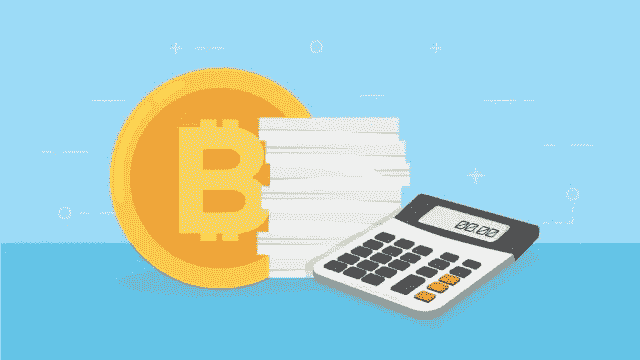

# 如何避免在印度缴纳加密收入税

> 原文：<https://medium.com/coinmonks/how-to-avoid-paying-tax-on-income-from-crypto-in-india-vo-thebloggerinfo-3fe0a5651256?source=collection_archive---------2----------------------->

数百万印度人已经将他们的鸡蛋放在了加密货币上。这归功于比特币价值的快速增长。

在新冠肺炎疫情期间，数百万印度人对加密货币表现出兴趣，以实现他们的金融梦想。他们的收入成倍增加。

这引起了 ***中央政府、*** 印度储备银行、**印度所得税部门**的注意。政府出台了税收政策来监管加密货币。

已经征收了各种税。整个印度**加密货币**社区正忙于寻找漏洞，以缓解这场对他们收益的严重金融打击。

您必须了解下面解释的一些重要概念:

# 什么秘密事件使你的秘密收入在印度要纳税？

crypto taxable

*   密码的买卖。
*   涉及加密货币的交易。
*   加密货币的收益。
*   作为礼物收到的加密货币。
*   支出或津贴。
*   你从 VDA(虚拟分散资产)转让中获得的收入。
*   加密货币的转移。

> **也多读:**[**2022 年投资加密货币前先学会这 9 个术语**](https://theblogger.info/learn-9-terms-before-investing-in-cryptocurrency-in-2022/)

# 了解印度适用于加密货币的税种？

印度中央政府征收很多税。所有这些税都适用于上面列出的加密交易。

好好看看我们国家对加密货币征税的清单。

*   营业税
*   1% TDS(扣除加密税)。
*   赠与税
*   28%的商品及服务税。
*   30%的资本收益税

# 如何避免在印度支付加密税？

Photo by [Pierre Borthiry](https://unsplash.com/@peiobty?utm_source=medium&utm_medium=referral) on [Unsplash](https://unsplash.com?utm_source=medium&utm_medium=referral)

印度所有的密码爱好者都想了解它。他们不断地向谷歌和其他搜索引擎询问这方面的问题。

印度财政部长 Nirmala Sitharaman 对出售虚拟分散资产的所有收益征收统一的 30% T21 税。这也包括加密货币。她在 2022 年的联邦预算会议上宣布了这一消息。

部长还宣布对所有加密货币交易征收 1%的 TDS(在源头扣除的税)。

**印度加密货币社区**已经注意到法案中的一些漏洞。像 PanCakeSwap 和 Uniswap 这样的 DEX(去中心化交易所)和 P2P(点对点)交易可以帮助避免印度的加密税。

这行得通吗？这些方法没有风险吗？这些是价值 200 万美元的问题。

DEX 代表分散式交易所。分散式密码交换不需要 KYC。

这些去中心化工具和交易的根源中的复杂因素很难破解。全部风险仅由投资者承担。

只有你对一切负责。

# 如果你试图把你的加密收益转换成菲亚特？

Photo by [Jeremy Bezanger](https://unsplash.com/@unarchive?utm_source=medium&utm_medium=referral) on [Unsplash](https://unsplash.com?utm_source=medium&utm_medium=referral)

你还是要付你那份税。印度所得税部门已经知道这些伎俩的可能性。

这种伎俩可能在一段时间内对交易员和投资者有利。然而，印度政府迟早会搞定这个把戏。

从金融角度来看，这可能是一个冒险的把戏。从长远来看，使用 DEX 可能不起作用，因为尽管引入了相关的税收计划，但加密不是合法货币。

> **还可阅读更多:** [**加密货币是好的投资吗？我们来解码一下**](https://theblogger.info/is-cryptocurrency-a-good-investment-lets-decode-it/)

# 如何在印度申报加密税？

您可以使用下面提到的方法之一来申报 crypto 的税收收入:

为此，您需要以下文件:

*   收入证明。
*   表格 26AS。
*   表格 16A。
*   泛卡。
*   阿德哈尔卡。
*   资本收益表。
*   银行账户详情。

不要忘记报告你的损失和免税。印度政府似乎没有心情让你在加密方面遭受损失。你可能无法弥补你的损失。

# 如果你在印度不付加密税会怎么样？

不要犯这个错误。做一个明智的人，并在你的政府和印度税务部门的好书。

没有提交 ITR 和申报在印度的任何收入会有一系列后果。该列表包括以下内容:

*   巨额罚款。
*   对你的法律诉讼。
*   1%百分比月息。
*   逾期申请费。
*   你可能没有资格结转或抵消某些损失。
*   监禁两个月到两年。

我们建议你明智一点，报告你的加密收入，因为加密还不是法定货币。

> 加入 Coinmonks [Telegram group](https://t.me/joinchat/Trz8jaxd6xEsBI4p) 学习加密交易和投资

# 放弃

从任何角度来看，本内容中给出的信息都不应被视为法律、财务或税务相关的建议。

我们建议您与熟悉税务实践和加密货币的经验丰富的税务规划师交谈，以帮助您做出正确的选择和决定，朝着正确的方向前进。

*最初发布于 2022 年 6 月 3 日*[*https://the blogger . info*](https://theblogger.info/how-to-avoid-paying-tax-on-income-from-crypto-in-india/)*。*