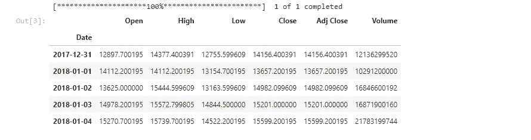
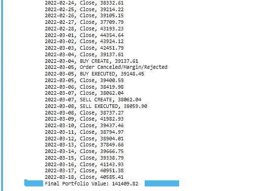
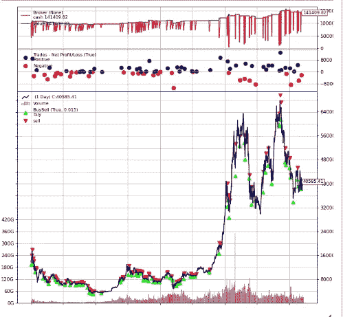

# 如何用 BackTrader 对交易机器人进行回溯测试？

> 原文：<https://medium.com/coinmonks/how-to-backtest-a-trading-bot-with-backtrader-b5486277c7dc?source=collection_archive---------1----------------------->

## 用 backtrader 测试你的交易策略表现。

你好，欢迎来到另一篇文章，今天我将进入算法交易中最重要的话题之一，即回溯测试。

**回溯测试**是根据历史数据测试你的策略的过程，以获得该策略将如何执行以及在实时交易中将如何执行的清晰愿景。

此外，回溯测试并不保证策略或[**交易机器人**](/p/5daeeda29451) 会像对历史数据那样执行，原因有很多…

但回溯测试仍然是每个算法交易者和交易者普遍需要的宝贵工具，因为它可以通过操纵和测试新策略来改变业绩。

在本文中，我们将开发一个简单的策略，并使用 **backtrader** 库对其进行回溯测试，我将使用 **jupyter notebook** 。

# 让我们开始吧。

导入 backtrader 库。

```
**import backtrader as bt**
```

从雅虎财经下载比特币数据

从 2018 年开始，我们将获得每日时间框架

```
**import yfinance as yf****data = yf.download("BTC-USD",start='2018-01-01')****data.head()**
```



BTC dataframe head

# 现在是时候考虑策略了。

我将制定一个买入下跌策略，即:

如果价格连续三天下跌，我们买入

**2 天后出售。**

创建 dipStrategy 类并传递**策略(【backtrader 中的内置对象。)**

```
**class dipStrategy(bt.Strategy):** **def log(self, txt, dt=None):

        dt = dt or self.datas[0].datetime.date(0)
        print('%s, %s' % (dt.isoformat(), txt))**
```

*backtrader log 函数*** datas[0]是当前数据行。*

```
**def __init__(self):** **self.dataclose = self.datas[0].close** **self.order = None**
```

*保存对* ***数据系列中数据[0]中“关闭”行的引用关闭***

*将订单设置为无，因为还没有订单。*

```
**def notify_order(self, order):** **if order.status in [order.Submitted, order.Accepted]:
            return** **if order.status in [order.Completed]:** **if order.isbuy():
                self.log('BUY EXECUTED,%.2f' % order.executed.price)** **elif order.issell():
                self.log('SELL EXECUTED,%.2f' %order.executed.price)

            self.bar_executed = len(self)**  **elif order.status in [order.Canceled,** **order.Margin,order.Rejected]:** **self.log('Order Canceled/Margin/Rejected')** **self.order = None**
```

*检查订单状态是否为已提交或已接受，然后返回。***尚未完成，但已被经纪人接受。*

**len(self)** 将返回天数

**例如**:如果我们在第 200 天买入，我们应该记录这个数字，因为我们将在两天后的第 202 天卖出
我们将订单日期保存在**栏 _executed**

*检查订单是否已经完成*

*如果买入订单完成则记录价格***** * is buy()****内置在 backtrader* 中的函数

*如果订单处于取消状态…记录此*

*如果卖单完成，记录价格*

将订单设置为无，因为没有待定订单

```
**def next(self):

        self.log('Close, %.2f' % self.dataclose[0])** **if self.order:
            return

        if not self.position :

            if self.dataclose[0] < self.dataclose[-1]:

                if self.dataclose[-1] < self.dataclose[-2]:

                    if self.dataclose[-2] < self.dataclose[-3]:** **self.log('BUY CREATE, %.2f' %** **self.dataclose[0])** **self.buy()

                        self.order = self.buy()

        else:

            if len(self) >= self.bar_executed + 2 :
                self.log('SELL CREATE, %.2f' % self.dataclose[0])
                self.order = self.sell()**
```

只需记录参考系列的收盘价

检查是否有挂单，如果有，**返回**

检查我们在市场上是否有位置。

我们将检查价格是否连续三天下降

如果今天收盘比昨天少，直到前三天

*** [-1]是前一天的索引，依此类推，直到[-3]

现在是购买的时候了，因为我们的条件符合原价

设置购买订单

将订单设置为购买订单，以跟踪**并避免发送第二个订单**

**** self.buy()退货购买订单对象**

## 销售条件

两天后，我们卖掉我们的头寸
,我们通过 bar_executed 变量来跟踪

我们已经完成了战略编码

现在是表演时间，让我们开始吧。

# 回溯测试

```
**cerebro = bt.Cerebro()** **cerebro.broker.setcash(100000.0)** **cerebro.addsizer(bt.sizers.SizerFix, stake=2)****df = bt.feeds.PandasData(dataname=data)** **cerebro.adddata(df)** **cerebro.addstrategy(dipStrategy)** **print('Starting Portfolio Value: %.2f' % cerebro.broker.getvalue())** **cerebro.run()** **print('Final Portfolio Value: %.2f' % cerebro.broker.getvalue())**
```

cerebro 是 backtrader 引擎，我们将创建一个实例

设置你的账户里有多少现金，设置为 100k

设置你的订单大小**你会买多少我设置为 2 股(比特币)

在我们的例子中，我们有熊猫数据帧

使用 **adddata()** 方法将数据传送到大脑

用 addstrategy()方法将我们的策略添加到 cerebro 中

开始打印帐户现金

运行发动机起动贸易

在末尾打印现金

# 结果

我们得到了所有被处决交易者的名单。



# 我们从 100k 开始，到最后我们有 141k🔥 👌那还不错，不是吗…😁

**注意:***当然，这种策略* ***表现不如市场*** *但目标是想出你的策略，优化和操纵，直到你有了一个可以通过持续监控、优化和产生想法来跑赢市场的策略。*

# 可视化我们的交易怎么样

```
**cerebro.plot()**
```



Backtrader plot with matplotlib

## 下一步是什么

我认为 backtrader 是交易者测试和操纵策略的好工具

在我之前的文章中，我们开发了一个加密交易机器人，但是没有后台部分，今天我们做到了。

***这篇文章就到这里了，希望大家喜欢。***

> 加入 Coinmonks [电报频道](https://t.me/coincodecap)和 [Youtube 频道](https://www.youtube.com/c/coinmonks/videos)了解加密交易和投资

# 另外，阅读

*   [CBET 评论](https://coincodecap.com/cbet-casino-review) | [库科恩 vs 比特币基地](https://coincodecap.com/kucoin-vs-coinbase) | [拜比特 vs 比特币基地](https://coincodecap.com/bybit-vs-coinbase)
*   [折叠 App 回顾](https://coincodecap.com/fold-app-review) | [本地比特币回顾](/coinmonks/localbitcoins-review-6cc001c6ed56) | [Bybit vs 币安](https://coincodecap.com/bybit-binance-moonxbt)
*   [加密保证金交易交易所](/coinmonks/crypto-margin-trading-exchanges-428b1f7ad108) | [赚取比特币](/coinmonks/earn-bitcoin-6e8bd3c592d9) | [Mudrex 投资](https://coincodecap.com/mudrex-invest-review-the-best-way-to-invest-in-crypto)
*   [WazirX vs coin dcx vs bit bns](/coinmonks/wazirx-vs-coindcx-vs-bitbns-149f4f19a2f1)|[block fi vs coin loan vs Nexo](/coinmonks/blockfi-vs-coinloan-vs-nexo-cb624635230d)
*   [比斯勒评论](https://coincodecap.com/bitsler-review)|[WazirX vs coin switch vs coin dcx](https://coincodecap.com/wazirx-vs-coinswitch-vs-coindcx)