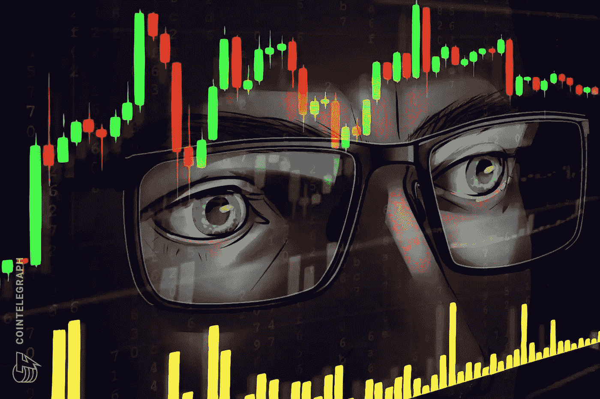
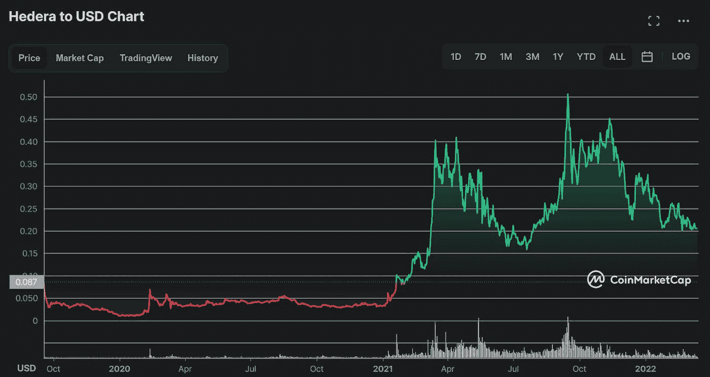
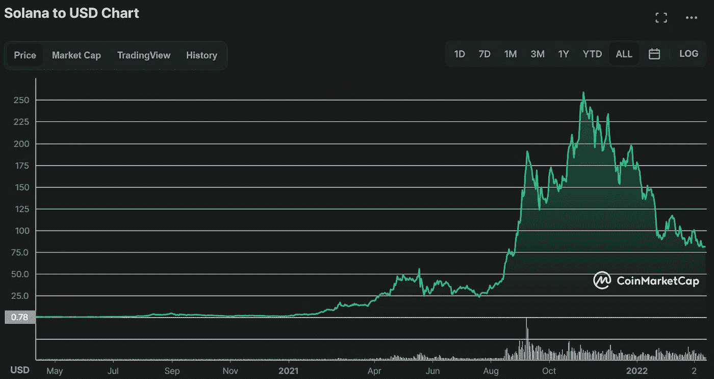

# 如何在加密领域取得成功——跳过新手阶段，成为更好的投资者

> 原文：<https://medium.com/coinmonks/how-to-be-successful-in-crypto-skip-the-newbie-phase-and-become-a-better-investor-4e6da5b6ac7c?source=collection_archive---------30----------------------->

Image borrowed from CoinTelegraph ([https://cointelegraph.com/news/record-first-quarter-for-institutional-crypto-investment-products-coinshares](https://cointelegraph.com/news/record-first-quarter-for-institutional-crypto-investment-products-coinshares))

超过 95%的人在他们的加密投资中赔钱。信不信由你，这是现实，但这里的问题是，一些人如何能赚到数百万，有时甚至数十亿美元？他们可以通过适当的策略和坚定的心态做到这一点。我想通过这篇文章的内容让你成为那 5%的成功加密者。但是要注意，这里写的都不是理财建议。

**一些先决条件**

如果你是 100%的密码空间新手，这篇文章可能会遗漏一些与区块链交互时的重要方面。我建议所有读者熟悉集中交易所(如币安)、软件/硬件钱包，并阅读和理解 [coingecko](https://www.coingecko.com/) 和/或 [coinmarketcap](https://coinmarketcap.com/) 上的图表。还强烈建议您了解并知道如何获取每种加密货币的以下参数信息:

1.  市值
2.  完全稀释的市值
3.  卷
4.  最大供应量和总供应量(小心有区别！)
5.  白皮书

我还建议你看看 reddit 上这篇关于常用加密术语、首字母缩写词和缩略语的文章。链接:[https://www . Reddit . com/r/crypto currency/comments/JCE 0 YC/ultimate _ glossary _ of _ crypto _ currency _ terms/](https://www.reddit.com/r/CryptoCurrency/comments/jce0yc/ultimate_glossary_of_crypto_currency_terms/)

**地基**

本课程将分为以下几章。由于我们的大脑在第一次阅读时没有 100%的记忆率，我建议重温需要刷新的主题。

*   **心态**
*   **安全**
*   **寻找硬币/利基专长**
*   **投资**
*   **进入/退出策略**
*   **长期持有**
*   **最后的话**

**心态**

我相信，在投资方面，拥有一个正确的心态是最重要的。它使你能够根据数据进行逻辑思考和决策，而不是屈服于炒作和盲目的希望。它提醒你投资的目标是什么，并保护你不破坏你的投资。此外，通过控制你的情绪，你可以制定计划并真正坚持下去。到目前为止，你所读到的可能会给你一种“哦，是的，我能做到”的感觉。是的，你当然可以。我坚信任何人都可以学到这一点。但是请相信我，当我告诉你这比看起来要难的多，因此我正在做这个指南。目标是让你完全跳过新手阶段，在这个过程中赚更多的钱。

现在谈谈投资时你应该注意的细节:

1.  了解你投资的每个项目的来龙去脉，只要它达到你设定的目标，就坚持下去。
2.  加密是一种不稳定的资产。当项目下跌时，你可以买进或卖出。这在很大程度上取决于价格最初下跌的原因(以及下跌的幅度)。如果是因为 BTC/ETH 价格下跌，我不会建议出售。然而，如果价格下跌是因为特定加密货币背后的团队/公司做了一些让你质疑他们的动机和能力的事情，那么出售就成了一种选择。请记住，每个事件都必须单独评估，对于何时买入/卖出没有明确的指导。你需要对此做出判断。
3.  除了对每个项目进行深入研究之外，确保根据当前的市场条件、类似项目的 ROI(投资回报)以及它能够(现实地)实现的市值来计算每个投资候选的价格潜力。稍后我会给你一个实际的例子来说明如何实现这一步。
4.  设定你的卖价，当它到达时坚持它。是的，在你出售后，价格可能会飙升得更多，但也可能会大幅下跌，这意味着你需要通过出售一部分或整个袋子来降低投资风险(取决于项目和利基)。
5.  我强烈建议你首先专注于一个单一的加密利基:定义，第一层解决方案，游戏，人工智能和数据等..通过专注于一个单一的利基市场，你基本上正在慢慢成为一个专家，这使你能够发现新的项目，并对它们进行更精确的评估，而不是试图成为每个加密类别的专家。此外，通过专注于一个单一的利基市场，你更有可能做出更好的投资选择。如果你不确定该选择哪个领域，你可以把它们都看看，然后决定什么对你最有意义。尽量发挥你的优势。如果你没玩过游戏，就不要投资游戏项目！
6.  创建一个 Twitter 帐户，关注@ZssBecker @JRNYcrypto 和@ elliotrades。这些有影响力的人不断给出好的建议和市场更新。他们提供的免费信息会给你极大的帮助！我和他们没有关系，所以我的推荐是基于真心喜欢他们。

**安全**

加密的安全性也非常重要。你需要意识到，由于缺乏监管，密码是骗子猖獗的地方。据估计，加密诈骗是一个数十亿美元的市场，这就是为什么我专门为保护您的数字资产的整个类别。

先看这个[视频](https://www.youtube.com/watch?v=n6tPtNfa9K8)然后继续看…

正如视频很好地解释的那样，软件和硬件钱包都有其优缺点。我的建议是两者都用。但也许更重要的是你用的是什么电脑和 WiFi/以太网。这很重要，你做加密相关工作的电脑是:

1.  你的，因为没有人能接触到它。
2.  已经安装好了杀毒。我的建议是尝试 Eset NOD32，但你也可以在这里做自己的研究。请避免 100%免费使用的抗病毒药物。如果您使用的是 macOs，那么这一步可能没有必要。
3.  拥有最新的操作系统和安全更新
4.  确保您没有下载 NSFW 内容或任何可能危及计算机安全的内容。
5.  你用的 WiFi 应该在你的。不要用公共/工作/朋友 WiFi 网络！

**寻找硬币/利基专长**

正如我之前提到的，利基专业化是你应该很快开始你的秘密之旅的东西。但在此之前，你可以先浏览一下 [coinmarketcap 类别](https://coinmarketcap.com/cryptocurrency-category/)，从中挑选几个你感兴趣的。之后，花 5-7 天的时间研究每个类别，你可以对该类别的一些密码进行详细的研究。在你熟悉了几个类别之后，问问你自己，哪一个是你最感兴趣的？无论你首先想到什么，那就是你的答案。

恭喜你！你即将成为利基专家。但是对于每一项技能来说，在你意识到哪些项目有潜力，哪些没有之前，你需要时间。我不能给你一个蓝图，告诉你到底要找什么，因为每个利基都是不同的，但我可以给你一些基本的指导方针:

1.  访问项目的主要网站，寻找语法错误。如果存在，尽快离开项目。玩笑归玩笑，如果有很多语法错误，我建议你避开这个项目。
2.  获取官方白皮书，从头到尾阅读一遍。
3.  关注他们的官方 Twitter 页面，Discord 并加入该项目的 Telegram 组。我强烈建议您开始询问阅读白皮书后出现的问题。分析支持团队如何与你和其他成员互动。他们很专业吗？他们在回避合理的问题吗？
4.  为了评估项目的主要目标，也就是他们试图实现的目标，你也需要问自己一些问题。他们试图做的事情有市场吗？他们到底想解决什么，这样做有意义吗？他们试图做的事情在目前的技术下可行吗？我意识到提出好的问题非常困难，但你需要学会这样做，因为这是进行一般投资(不仅仅是加密)时的一项重要技能。
5.  也强烈建议加入私人不和谐小组和阿尔法聊天，那里有很多有用的信息。这些类型的小组有时可以为你节省几天/几周的研究时间。此外，与他人谈论和讨论与加密相关的东西、分享想法和结成联盟也非常有趣。有些群组要求您单独购买一个 NFT 才能加入聊天，但有些群组也是免费的。需要 NFT 的通常质量更高。

希望我已经给了你一个可靠的模板，你可以跟随并随着时间的推移而改进。请记住，它并不完美。这是您进行构建和升级的基础。

**投资**

在这一部分，我将解释如何以及何时投资。

> “市场中的时间胜过市场时机”

也许你已经在某处读到过了。我做到了，我以为我明白了，但事实证明我没有。我在最初的投资中没有设定一个现实的退出策略，并一直持有到价格大幅下跌。幸运的是，我仍然赚了钱，后来我退出了，但我当时就吸取了教训。请从我的错误中吸取教训，一路获利，即使你相信你的长期投资。请不要乘坐炒作列车，而没有确保至少部分投资稳定的硬币。

我也建议你不要把所有的积蓄都用来投资。也非常不鼓励贷款或借钱。只投资你知道可以承受损失的金额。如果你对只投资 100 美元感到极度焦虑，那么我个人认为加密空间不适合你。我宁愿投资于 T2 和 T4 的标普 500 指数，这是一个更安全可靠的赌注。

最常见的投资策略是 DCA 或美元成本平均法，这很容易执行。例如，如果你想在一年内投资 12，000 美元，最好是每月购买 1000 美元的硬币(12x1000 美元= 12，000 美元)。这种策略背后的理由是，考虑到价格波动，如果你每月投资一次，可能会比一年投资一次多得多。更详细的解释可以在[这里](https://www.investopedia.com/terms/d/dollarcostaveraging.asp#:~:text=Dollar%2Dcost%20averaging%20(DCA)%20is%20an%20investment%20strategy%20in,price%20and%20at%20regular%20intervals.)找到。你也可以从每月工资中拿出一部分来购买你最喜欢的加密硬币。

我们还需要讨论投资组合多样化的话题。本质上，这意味着你*不再只投资单一的加密硬币，而是将你的投资分散到多种硬币上。有人说，开始时少于 10 个硬币是好的，但我真诚地认为，你应该是决定你希望你的投资组合有多多样化的人。*

**进入/退出策略**

让我们首先关注*进入策略*。与前一个类别一样，我强烈建议您执行 DCA，这意味着您可以每月/每季度购买您最喜欢的密码。预测所需硬币的底部真的很难，也是我不建议做的事情。话虽如此，如果你有更多的存款，你也可以做一些事情。举例来说，你可以有 10，000 美元的稳定硬币，仅用于主要下跌(30–50%)。然而，这种策略要求你在中央交易所设置限价单，因为这种价格下跌通常会迅速反弹。如果你是一个完全的初学者，我建议你先做 DCA 至少 6 个月，然后再用这种更先进的方法潜水。

现在进入更难的部分，即*退出策略*。这是我最近才掌握的，我迫不及待地想和你分享。退出策略是你应该在买你的硬币之前**想好的。通俗地说，你需要**知道**你将出售一部分或整袋特定硬币的价格。最重要的是，无论你的直觉或占星报告说什么，你都需要坚持计划并执行它。这个简单的提示会让你成为一个了不起的密码交易员！**

但是奈杰尔，什么时候卖我的包？我应该以什么价格出售？

亲爱的读者，这是一个奇妙的问题！是时候举个例子了。让我们说，我已经选择了第一层加密硬币的利基，我发现$HBAR 被严重低估和/或有很大的价格飙升的潜力。这是图表:

Hedera $HBAR chart view

正如你最近看到的，价格一直在 0.20-0.25 美元左右，市值约为 43 亿美元。因此，如果我预期 10 倍的价格波动，市值也必须在 10 倍左右(注意，这种关系不一定是线性的，但出于教育目的，我们可以近似)。这意味着大约 430 亿美元的市值意味着 2.0-2.5 美元的价格。现在，我们需要问自己的下一个问题是…

这可能吗？

为了检查我们对$HBAR 的潜在投资是否有意义，我们需要检查第一层竞争对手的表现。我选择了 Solana 或$SOL 作为比较。如果你研究一下 coinmarketcap 上的 T2 图表，你会发现价格从 34 美元左右飙升到 235 美元左右。但是等一下！如果你在 2021 年初购买，价格实际上已经超过 10 倍。因此，从技术上讲，$SOL 是一个不错的短期投资，我们的结论是，$HBAR 有潜力模仿索拉纳的成功。

Solana $SOL chart view

这个[网站](https://www.marketcapof.com/)也是一个非常有用的工具，在这里你可以看到一枚硬币的价格可以升值多少，因为其他价值更高的硬币的市值也是如此。作为投资者，你将以什么价位出售，是 5 倍、10 倍还是 100 倍，取决于你。话虽如此，我还是强烈建议你从 5 倍开始获利。我个人的策略是以 5 倍的价格拿走我包里的 50%，然后以 10 倍的价格拿走剩下的。但即使它没有涨到 10 倍，我仍然获利了，因此我可以心安理得地留下剩下的钱(或者卖出，这取决于市场条件和/或关于特定硬币的消息)。

家庭作业:

尝试找到与$SOL 类似的硬币，并广泛研究图表。也试着找出 2021 年 11 月初$SOL 的市值是多少。即使你对第一层利基市场不感兴趣，我也强烈推荐你做这个练习。

**长期持有**

也许我们也需要讨论一下长期搁置的问题。一些硬币实际上值得持有更长时间，而不仅仅是 5 倍或 10 倍。基本上，我们期望我们的投资从 50 倍增加到 100 倍，有时甚至更多。

*但是我如何找到具有这种潜力的加密货币呢？我怎么能确定？*

简而言之，你永远不可能百分百确定。很难预测哪些项目将在未来 5-10 年内持续存在，因此，拿着袋子 5-10 年不拿任何利润也是有风险的。然而，如果你计划持有一种特定的加密货币超过 2 年，我会建议当硬币的价格达到 5 倍时，出售足够支付初始投资的硬币。这样，如果项目由于某种原因未能交付并被遗忘，你仍将拥有最初的美元/欧元/你的国家使用的任何货币。当然，你也可以形成自己的策略，当谈到长期投资获利时。

**遗言**

你已经走到尽头了！现在去喝一杯，放松一下。让你的脑细胞通过做 20-30 分钟的其他事情来加强新形成的联系，然后尝试思考你刚刚学到的东西，以及它对你是否有意义。请记住，我不是大师，我仍然是一个秘密市场的学生，就像你一样。但希望你能够跳过最初的失望阶段，做一些了不起的投资。

感谢您阅读本文。如果您有任何疑问或问题，请在下面发表评论，如果您觉得这些信息有用，请告诉我。也可以通过 Twitter @barpunks 联系我。

**资源**

这些资源中的大部分只是 Twitter 个人资料或 Youtube 频道，但没有具体的视频或推文。这是因为我收集的信息来自几个月来阅读推文、观看不同的视频和研究市场。谢谢你的理解。

1.  【https://twitter.com/ZssBecker 
2.  [https://twitter.com/JRNYcrypto](https://twitter.com/JRNYcrypto)
3.  [https://twitter.com/elliotrades](https://twitter.com/elliotrades)
4.  [https://www.youtube.com/c/TheRubiconShow](https://www.youtube.com/c/TheRubiconShow)
5.  [https://www.youtube.com/c/CryptoMason](https://www.youtube.com/c/CryptoMason)
6.  [https://www.youtube.com/c/AymanMufleh](https://www.youtube.com/c/AymanMufleh)
7.  [https://www.youtube.com/c/TechLead](https://www.youtube.com/c/TechLead)
8.  [https://www.marketcapof.com/](https://www.marketcapof.com/)

[9。https://www . investopedia . com/terms/d/dollarcostaveraging . ASP #:~:text = Dollar % 2d cost % 20 averaging % 20(DCA)% 20 is % 20 an % 20 investment % 20 strategy % 20 in，price % 20 at % 20 regular % 20 intervals](https://www.investopedia.com/terms/d/dollarcostaveraging.asp#:~:text=Dollar%2Dcost%20averaging%20(DCA)%20is%20an%20investment%20strategy%20in,price%20and%20at%20regular%20intervals)

> 加入 Coinmonks [电报频道](https://t.me/coincodecap)和 [Youtube 频道](https://www.youtube.com/c/coinmonks/videos)了解加密交易和投资

# 另外，阅读

*   [如何在 FTX 交易所交易期货](https://coincodecap.com/ftx-futures-trading) | [OKEx vs 币安](https://coincodecap.com/okex-vs-binance)
*   [OKEx vs KuCoin](https://coincodecap.com/okex-kucoin) | [摄氏替代品](https://coincodecap.com/celsius-alternatives) | [如何购买 VeChain](https://coincodecap.com/buy-vechain)
*   [ProfitFarmers 点评](https://coincodecap.com/profitfarmers-review) | [如何使用 Cornix Trading Bot](https://coincodecap.com/cornix-trading-bot)
*   [如何匿名购买比特币](https://coincodecap.com/buy-bitcoin-anonymously) | [比特币现金钱包](https://coincodecap.com/bitcoin-cash-wallets)
*   [瓦济里克斯 NFT 评论](https://coincodecap.com/wazirx-nft-review)|[Bitsgap vs Pionex](https://coincodecap.com/bitsgap-vs-pionex)|[Tangem 评论](https://coincodecap.com/tangem-wallet-review)
*   [如何使用 Solidity 在以太坊上创建 DApp？](https://coincodecap.com/create-a-dapp-on-ethereum-using-solidity)