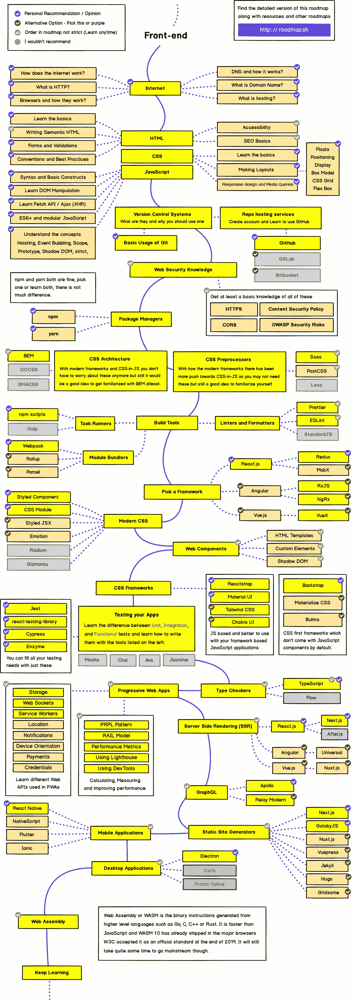

# 如何成为区块链开发者

> 原文：<https://medium.com/coinmonks/how-to-become-a-blockchain-developer-7784cb8d357d?source=collection_archive---------0----------------------->

## 这是一个简短的路线图

你首先要明白的是，你不会在一夜之间学会它。

如果你想进入这个领域，你可能需要考虑几件事:金钱和网上工作的机会。因为这是一个新的领域，所以还没有成为 web3 开发者的明确信息。我为你准备了一些有用的资源，这样你就能成为一名区块链开发者。

# 软件工程基础

区块链开发者永远是优秀的软件工程师。有几种方法可以让你成为软件开发人员。

首先，你必须学习 html/css/js 的基础知识

[**https://www . udemy . com/course/the-complete-web-development-boot camp/**](https://www.udemy.com/course/the-complete-web-development-bootcamp/)

【https://www.udemy.com/course/the-web-developer-bootcamp/】T5[T6](https://www.udemy.com/course/the-web-developer-bootcamp/)

**注意:-它不是一个附属链接。我不会在这篇文章中使用任何附属链接。**

买不买是你的选择。这是我旅程的一部分，所以我在这里提到它。

课程导师的名字是安吉拉·于，她总是鼓励我按照自己的进度学习网页开发。

多亏了她。

我以前看这个课程，每天 2 个小时，因为我喜欢它。那时，我不像你们中的许多人那样在我的笔记本电脑上练习。

# 区块链基础知识

在您学习了软件工程基础知识之后，下一步是学习什么是区块链。如果你不知道什么是区块链，你将永远无法成为一名优秀的区块链开发者。

这里有一个简短的 Udemy 课程，深入探讨了区块链的基本原理:

[https://www . udemy . com/course/区块链-和-比特币-基本面/](https://www.udemy.com/course/blockchain-and-bitcoin-fundamentals/)

# 分散应用

Dapps 建在区块链的顶部

以下是 web3 开发者使用的主要技术:

1.  前端:JavaScript 框架，如 React、Vue、Angular
2.  后端:Rust 和 Solana 或 Solidity 和 Ethereum

# 以太坊基础

以太坊是 2022 年最受欢迎的创建智能合约的区块链。可靠性是用来开发智能合同的语言。这是一份官方文件

 [## 以太坊开发文档| ethereum.org

### 介绍 ethereum.org 开发者文档。

ethereum.org](https://ethereum.org/en/developers/docs/) 

# 智能合同开发

仅仅理解智能合同的概念是不够的，你还应该能够开发它们。这就是可靠的来源。Solidity 是一种面向对象的高级编程语言，专门用于轻松构建智能合约。

这里有一些你可以用来学习智能合同开发的资源

 [## 建筑空间

### Buildspace 加速了你进入 web3 的构建之旅。无论你是刚开始，一个经验丰富的兽医过渡…

buildspace.so](https://buildspace.so/)  [## 学习网络 3 道

### LearnWeb3:帮助开发人员进入 Web3

www.learnweb3.io](https://www.learnweb3.io/)  [## #1 Solidity 教程&以太坊区块链编程课程| CryptoZombies

### CryptoZombies 是最受欢迎的交互式 Solidity 教程，它将帮助您学习区块链编程…

cryptozombies.io](https://cryptozombies.io/) 

# 将您的智能合同与您的前端连接

既然你已经知道如何开发智能合同，你需要实际使用它们。有两个主要的库可以做到这一点——web3 . js 或 ethers.js。让我们看看为什么 ethers.js 比 web 3 更好:

1.  小得多的尺寸
2.  更少的错误
3.  更好的文档
4.  更受欢迎
5.  对初学者来说更容易
6.  额外功能

这里有一个关于 ethers.js 的很棒的教程:

我建议也学习 web3.js，因为有些代码库可能会用到它。web3.js 上有一个速成班:

> *退房本回购了解更多—*【https://github.com/adrianmcli/web3-vs-ethers】

> *加入 Coinmonks [Telegram group](https://t.me/joinchat/Trz8jaxd6xEsBI4p) 学习加密交易和投资*